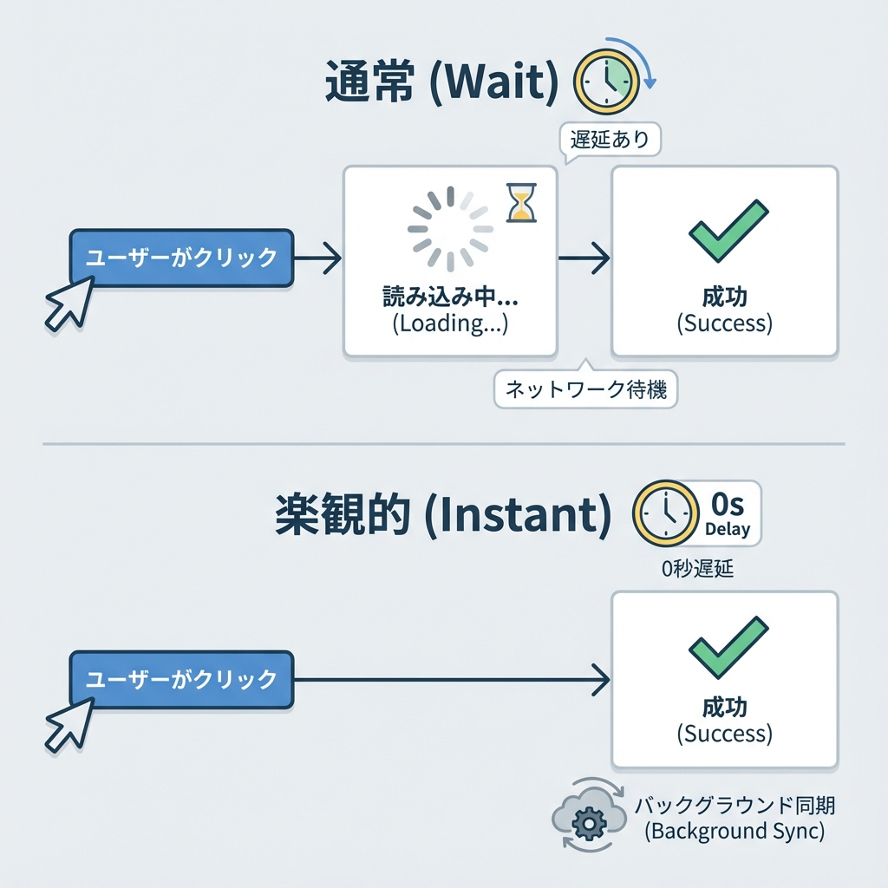
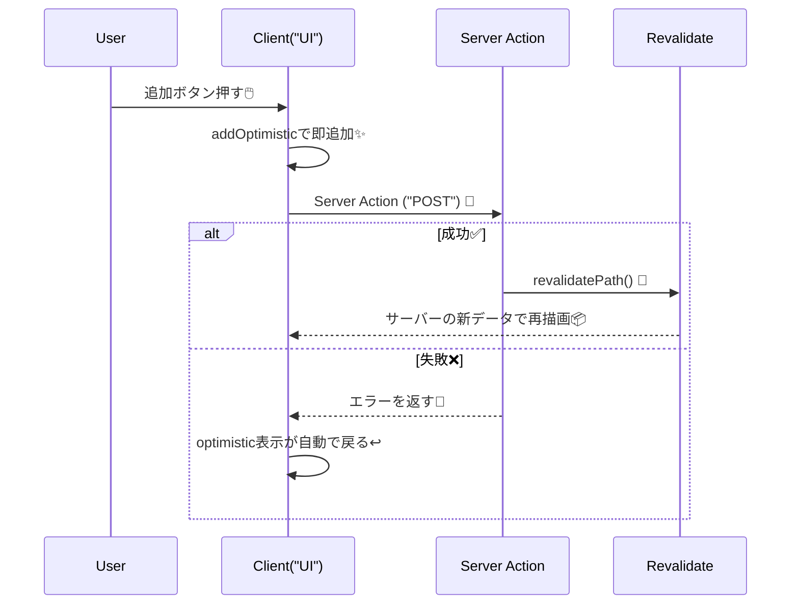
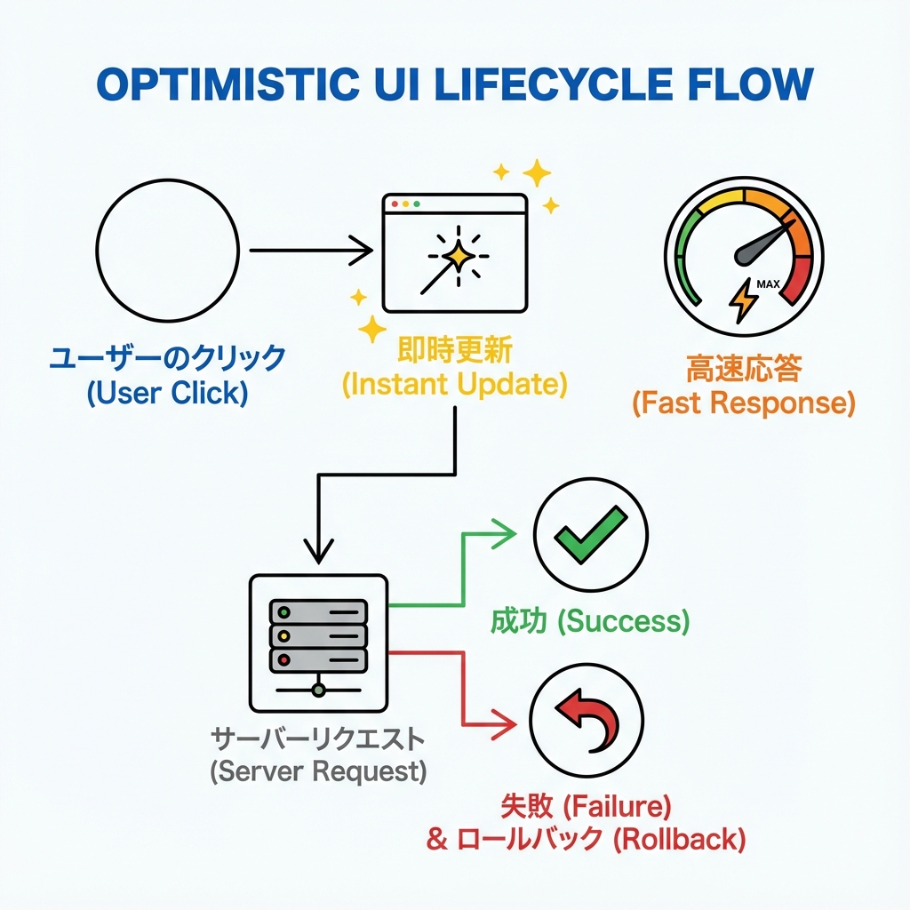

# 第261章：Optimistic UI の深掘り（useOptimistic 実践）✨

この章では、**「送信した瞬間にもう画面が変わってる」**みたいな気持ちいい体験（Optimistic UI）を、`useOptimistic` で作れるようになります🫶✨ ([React][1])

---

## Optimistic UI ってなに？🌸




たとえば TODO を追加するとき…

* ふつう：サーバーの返事が来るまで待つ → ちょいモッサリ😵‍💫
* Optimistic：**先に画面に追加しちゃう** → 体感めちゃ速い😍⚡

ポイントはこれ👇
**「成功するはず！」って楽観的に表示して、失敗したら元に戻す**（ロールバック）🧯

---

## `useOptimistic` の役割（超大事）🧠✨

`useOptimistic(state, updateFn)` はこういうHookだよ👇 ([React][1])

* `state`：本物の状態（サーバーから来たデータとか）
* `updateFn`：**今の状態 + 追加したい“楽観データ”** を合体して、表示用の状態を作る関数（※純粋関数じゃないとダメ🙅） ([React][1])
* 返り値：`[optimisticState, addOptimistic]` ([React][1])

そしてNext.jsのServer Actionsは、`<form action={...}>` などで呼ぶと **自動で transition 扱い**になって、UI更新がうまく噛み合うよ〜って話🧩✨ ([Next.js][2])

---

## 図でつかむ：成功✅と失敗❌の流れ（Mermaid）🧁





---

## ハンズオン：Optimistic TODO を作ろう✍️✨

URL はこうするよ👇
`http://localhost:3000/ch261-optimistic`

### 1) フォルダ作成📁

`app/ch261-optimistic/` を作って、以下の5ファイルを置くよ〜😊

---

### 2) `types.ts`（型）🧷

```tsx
export type Todo = {
  id: string
  text: string
  optimistic?: boolean // 送信中表示用（サーバーには保存しない想定）
}
```

---

### 3) `todoStore.ts`（デモ用の簡易ストア）🗃️

※これは学習用！本番はDB（Prisma等）に置き換える前提だよ🙏

```ts
import { randomUUID } from 'crypto'
import type { Todo } from './types'

let todos: Todo[] = [
  { id: '1', text: '提出用レポート書く📝' },
  { id: '2', text: 'ゼミの資料まとめる📚' },
]

export async function listTodos(): Promise<Todo[]> {
  // 事故防止にコピーで返す
  return [...todos]
}

export async function addTodo(text: string): Promise<Todo> {
  const todo: Todo = { id: randomUUID(), text }
  todos = [todo, ...todos]
  return todo
}
```

---

### 4) `actions.ts`（Server Action）🚀

ここで成功したら `revalidatePath` して、サーバー側の一覧を最新化するよ🔁 ([Next.js][2])

```ts
'use server'

import { revalidatePath } from 'next/cache'
import { addTodo } from './todoStore'

type ActionState = { error?: string }

export async function addTodoAction(
  prevState: ActionState,
  formData: FormData
): Promise<ActionState> {
  const text = String(formData.get('text') ?? '').trim()
  if (!text) return { error: 'テキストが空だよ〜🥲' }

  // ちょい遅延（体験しやすくする）
  await new Promise((r) => setTimeout(r, 700))

  // わざと失敗させる仕掛け（"fail" を入れると失敗）
  if (text.toLowerCase().includes('fail')) {
    return { error: 'わざと失敗させたよ！ "fail" を外してね😇' }
  }

  await addTodo(text)

  // 一覧ページを最新化
  revalidatePath('/ch261-optimistic')
  return {}
}
```

---

### 5) `todo-client.tsx`（Client Component：useOptimistic本体）✨

`useActionState` の `pending` で連打防止もできるよ🖱️🚫 ([Next.js][3])

```tsx
'use client'

import { useActionState, useOptimistic } from 'react'
import type { Todo } from './types'
import { addTodoAction } from './actions'

type ActionState = { error?: string }
const initialActionState: ActionState = {}

export default function TodoClient({ initialTodos }: { initialTodos: Todo[] }) {
  const [optimisticTodos, addOptimisticTodo] = useOptimistic<Todo[], Todo>(
    initialTodos,
    (current, newTodo) => [newTodo, ...current]
  )

  const [state, formAction, pending] = useActionState(
    addTodoAction,
    initialActionState
  )

  return (
    <section style={{ maxWidth: 520 }}>
      <form
        action={formAction}
        onSubmit={(e) => {
          const form = e.currentTarget
          const fd = new FormData(form)
          const text = String(fd.get('text') ?? '').trim()
          if (!text) return

          // 先に足す（楽観的✨）
          addOptimisticTodo({
            id: `temp-${Date.now()}`,
            text,
            optimistic: true,
          })

          // 入力欄だけクリア（見た目の体験UP✨）
          form.reset()
        }}
        style={{ display: 'flex', gap: 8, margin: '12px 0' }}
      >
        <input
          name="text"
          placeholder="例：発表スライド作る✨"
          style={{ flex: 1, padding: 10 }}
        />
        <button type="submit" disabled={pending} style={{ padding: '10px 14px' }}>
          {pending ? '追加中…⏳' : '追加➕'}
        </button>
      </form>

      {state.error && (
        <p role="alert" style={{ marginTop: 8 }}>
          🧯 {state.error}
        </p>
      )}

      <ul style={{ paddingLeft: 18, marginTop: 12 }}>
        {optimisticTodos.map((t) => (
          <li key={t.id} style={{ opacity: t.optimistic ? 0.6 : 1, marginBottom: 6 }}>
            {t.text}{' '}
            {t.optimistic && <span>（送信中…⏳）</span>}
          </li>
        ))}
      </ul>

      <p style={{ marginTop: 16, opacity: 0.8 }}>
        💡 試してみて：「fail」を含めて送信すると失敗して、追加が戻るよ😇
      </p>
    </section>
  )
}
```

---

### 6) `page.tsx`（Server Component：初期データを渡す）🏠

```tsx
import TodoClient from './todo-client'
import { listTodos } from './todoStore'

export default async function Page() {
  const todos = await listTodos()

  return (
    <main style={{ padding: 24, fontFamily: 'system-ui, sans-serif' }}>
      <h1 style={{ fontSize: 22, marginBottom: 6 }}>第261章：Optimistic TODO ✨</h1>
      <p style={{ opacity: 0.8 }}>
        追加ボタンを押した瞬間に増えるよ〜😍（失敗したら戻る！）
      </p>

      <TodoClient initialTodos={todos} />
    </main>
  )
}
```

---

## 動かし方🎮✨

ターミナルで👇

```bash
npm run dev
```

ブラウザで👇
`http://localhost:3000/ch261-optimistic`

---

## ここが「深掘りポイント」だよ🧠🔍

### ✅ 1) `updateFn` は“絶対に”純粋関数にする

`push` とかで配列を直接いじるのはNG🙅（バグりやすい…）
**必ず新しい配列を返す**のが正解だよ〜！ ([React][1])

### ✅ 2) 「本物のデータ」はサーバー、optimisticは“上にかぶせる膜”

* 本物：Server Component が取ってきた `initialTodos`
* 仮の膜：`useOptimistic` が作る `optimisticTodos`

成功したら `revalidatePath` で本物が更新されて、膜が自然に消える感じ🫧✨ ([Next.js][2])

### ✅ 3) 連打対策は `pending` がいちばんラク

`useActionState` が `pending` をくれるから、そのまま `disabled` にしちゃお🖱️🚫 ([Next.js][3])

---

## よくあるハマり集😵‍💫🪤

* **キーが不安定**（`key` が毎回変わる）
  → 一時IDでもいいから `temp-...` みたいにちゃんと固定してね🧷
* **“成功したのに二重で増えた”**
  → optimisticで1回、サーバー反映でまた1回…みたいなパターン。
  → 今回は `revalidatePath` で「本物の一覧に収束」するから二重になりにくい設計だよ🔁
* **失敗時のメッセージがない**
  → 画面から消えて「えっ？」ってなるので、`state.error` は出してあげるのおすすめ🫶

---

## ミニ練習（10〜20分）🧩✨

1. **削除もOptimisticにする**🗑️

   * `addOptimistic` で先にリストから消す
   * Server Action が失敗したら戻る

2. **“いいね❤️”をOptimisticにする**

   * 先に +1 して表示
   * 失敗したら元に戻す

3. 送信中の項目だけ、文字を薄くする以外に
   **「🫧送信中バッジ」**とか付けて可愛くしてみて🥰✨

---

次の章（第262章）は、**複数コンポーネント間の連携**に入るから、今回の「optimisticをどこに置くか」感覚がめっちゃ効いてくるよ〜🧵😊

[1]: https://react.dev/reference/react/useOptimistic "useOptimistic – React"
[2]: https://nextjs.org/docs/app/getting-started/updating-data "Getting Started: Updating Data | Next.js"
[3]: https://nextjs.org/docs/app/guides/forms "Guides: Forms | Next.js"
