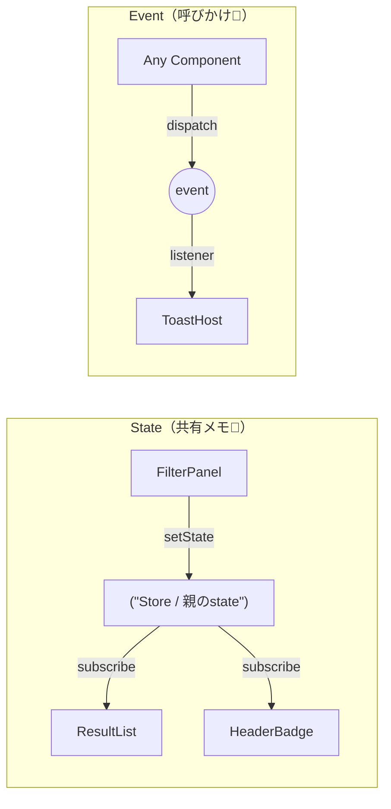
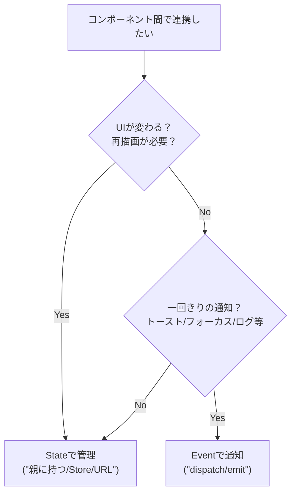

# 第262章：複数コンポーネント間の連携パターン（Event vs State）🧵

この章のゴールはこれ👇
**「複数のコンポーネントが関わる動き」を、迷わず設計できるようになること**だよ〜😊🎯

* ✅ State（状態）でつなぐ：**画面の表示が変わる系**に強い
* ✅ Event（イベント）でつなぐ：**一回きりの通知・合図系**に強い

---

## 1) まずは結論：StateとEventの使い分け🧠✨

* **Stateが向いてる**👉「値が変わったらUIも変わる」
  例：検索条件、選択中タブ、ログイン状態、カート件数…🛒

* **Eventが向いてる**👉「その瞬間だけ起きる（合図）」
  例：トースト出す🔔、モーダル開く🪟、スクロールする📜、ログ送信📈

---

## 2) イメージ図：Stateは“共有メモ”、Eventは“呼びかけ”📣📝




---

## 3) 迷ったらこれ：超シンプル判断フロー💡



---

## 4) Stateでつなぐ：王道3パターン👑🧩

### パターンA：親にStateを持たせてPropsで渡す（まずこれ！）🏠

* いちばん追いやすい✨
* 近い距離のコンポーネント同士ならこれが最強🫶

**構造イメージ**

* 親：state持つ
* 子：表示と操作（onChangeで親へ）

---

### パターンB：Context（アプリの広い範囲で共有）🌍

* 例：テーマ、言語、ログインユーザー表示など👤
* ただし、**更新頻度が高いもの**を入れると、関係ないところまで再レンダリングしがち😵‍💫
  → そういう時はStoreへ🏃‍♀️💨

---

### パターンC：Store（Zustandなど）で共有🐻✨

* 離れた場所でも同じStateを読める📌
* 「ヘッダー」「サイドバー」「メイン」みたいに離れてる時に強い💪

---

## 5) Eventでつなぐ：こんな時に便利✨📣

Eventは「状態」じゃなくて「合図」だよ🎺
**“値を持ち続けない”のがポイント**！

* 🔔 トースト通知（成功しました！など）
* 🎯 ある操作のタイミングでフォーカスを移す
* 📈 analytics/log を投げる
* 🪟 “開いて！” “閉じて！” みたいな命令だけ出す（ただし乱用注意）

---

## 6) 実践：Eventでトーストを出す（どこからでも呼べる）🔔✨

### 6-1) Toastイベントを飛ばす関数（どこでも使う）

`src/lib/toast.ts`

```ts
export type ToastDetail = { message: string };

export function showToast(message: string) {
  // windowはブラウザにしかないので、念のためガード
  if (typeof window === "undefined") return;

  window.dispatchEvent(
    new CustomEvent<ToastDetail>("app:toast", { detail: { message } })
  );
}
```

### 6-2) ToastHost（イベントを受け取って表示する）🍞✨

`src/components/ToastHost.tsx`

```tsx
"use client";

import { useEffect, useState } from "react";
import type { ToastDetail } from "@/lib/toast";

type ToastItem = { id: string; message: string };

export function ToastHost() {
  const [toasts, setToasts] = useState<ToastItem[]>([]);

  useEffect(() => {
    const handler = (e: Event) => {
      const ce = e as CustomEvent<ToastDetail>;
      const id = crypto.randomUUID();
      const message = ce.detail?.message ?? "通知だよ😊";

      setToasts((prev) => [...prev, { id, message }]);

      // 2.5秒後に消す（簡易）
      setTimeout(() => {
        setToasts((prev) => prev.filter((t) => t.id !== id));
      }, 2500);
    };

    window.addEventListener("app:toast", handler);
    return () => window.removeEventListener("app:toast", handler);
  }, []);

  return (
    <div style={{ position: "fixed", right: 16, bottom: 16, display: "grid", gap: 8 }}>
      {toasts.map((t) => (
        <div
          key={t.id}
          style={{
            padding: "10px 12px",
            border: "1px solid #ddd",
            borderRadius: 12,
            background: "white",
            boxShadow: "0 6px 18px rgba(0,0,0,0.08)",
            maxWidth: 320,
          }}
        >
          🔔 {t.message}
        </div>
      ))}
    </div>
  );
}
```

### 6-3) どこからでもトーストを鳴らすボタン🔔🎉

`src/components/ToastButton.tsx`

```tsx
"use client";

import { showToast } from "@/lib/toast";

export function ToastButton() {
  return (
    <button
      onClick={() => showToast("保存できたよ〜！🎉")}
      style={{ padding: "10px 12px", borderRadius: 12, border: "1px solid #ddd" }}
    >
      トースト出す🔔
    </button>
  );
}
```

### 6-4) 画面に置く（App Router）🧩

`src/app/page.tsx`

```tsx
import { ToastHost } from "@/components/ToastHost";
import { ToastButton } from "@/components/ToastButton";

export default function Page() {
  return (
    <main style={{ padding: 24 }}>
      <h1>Event vs State 🧵✨</h1>
      <p>Eventで「通知🔔」を飛ばす例だよ😊</p>

      <ToastButton />

      {/* どこに置いてもOK（だいたいルートに置くのが多い） */}
      <ToastHost />
    </main>
  );
}
```

---

## 7) じゃあStateでやるべきだったケースは？🤔🧊

例えば「通知のON/OFF設定」を作りたいなら、これは**State**💡
なぜなら「今ONかOFFか」を**持ち続ける必要がある**から！

* ✅ 設定：State（保持する）
* ✅ その瞬間の通知：Event（合図）

この“分け方”ができると超強いよ〜💪✨

---

## 8) ありがちな事故😇（ここだけ注意！）

### Eventの事故💥

* どこから飛んできたか追いづらい🌀
* リスナー解除しないとメモリリーク😱（`useEffect`のreturnで必ず外す！）

### Stateの事故💥

* 同じ情報を別々のStateに重複させる（ズレる）😵‍💫
  👉「真の値は1つ」にするのがコツ🧠✨

---

## 9) ミニ練習（10分）⏱️💞

1. `ToastButton`を2個に増やす（別の場所に置く）
2. 片方は「保存🎉」、もう片方は「削除🗑️」トーストを出す
3. `ToastHost`は1個だけで両方の通知が出るのを確認✨

できたら大勝利〜！🎊🥳

---

## まとめ🎀

* **UIが変わる・値を持つ** 👉 **State** 🧊
* **一回きりの合図** 👉 **Event** 📣
* Eventは便利だけど、乱用すると追いづらいので「通知・合図」に絞るのがおすすめ🔔✨

次の章（第263章）では、さらに踏み込んで
**「サーバーで持つべき状態 vs クライアントで持つべき状態」**をきれいに切り分けていくよ〜⚖️😊
