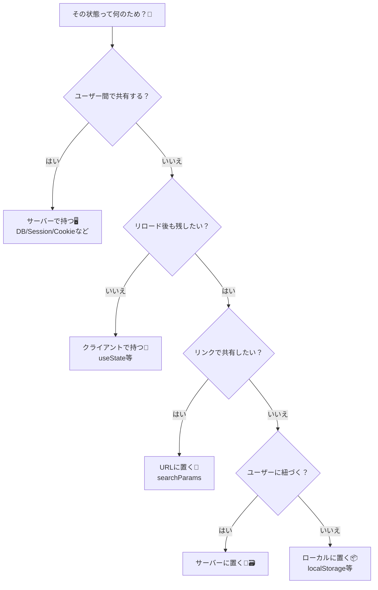
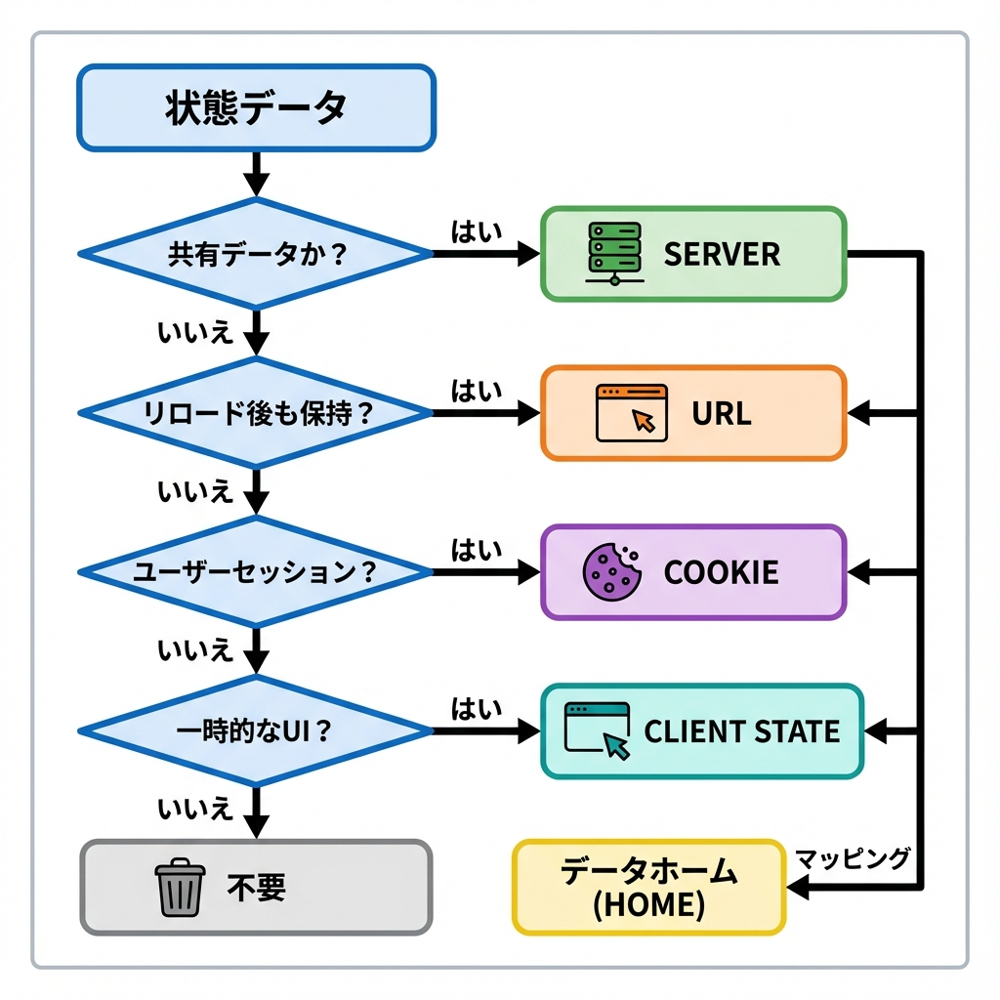
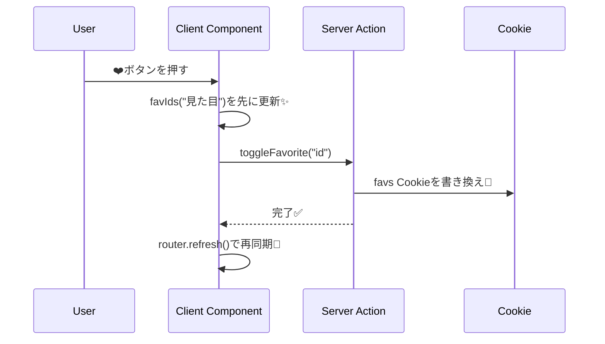

# 第263章：サーバーで持つべき状態 vs クライアントで持つべき状態⚖️

今日は「状態（State）」を **どこに置くのが正解か？** をスッキリさせる回だよ〜😊✨
ここが整理できると、Next.jsの設計が一気にラクになるよ🪽

---

## 今日のゴール🎯

* 「これはサーバー？クライアント？」を迷わず決められるようになる🧠⚖️
* **“真実（Source of Truth）”** をどこに置くか考えられるようになる💎
* よくある事故（ログイン情報をクライアントだけで持つ等）を回避できる🛡️

---

## まず前提：App Routerは“サーバーが基本”🧊

Next.js（App Router）は **コンポーネントがデフォルトでServer Component** で、必要なときだけ `"use client"` を付けてClient Componentにするよ👀✨ ([Next.js][1])

---

## 状態って、ざっくり2種類💡

### 🖥️ サーバーで持つべき状態（Server State）

**「正しいデータ」「守るべきデータ」「みんなと共有されるデータ」** はサーバー側が本体🧱

例👇

* ログイン状態 / セッション / 権限🔑👑
* DBにあるTODO・記事・在庫・価格📦💰
* “いいね”や“お気に入り”など、保存されるべきもの❤️
* だれが見ても同じ結果になるべきもの（共有の事実）📣

### 📱 クライアントで持つべき状態（Client State）

**「その人の画面だけ」「操作の途中」「一瞬のUI」** はクライアントが向いてるよ🎮

例👇

* モーダル開いてる？閉じてる？🪟
* タブの選択、アコーディオンの開閉📑
* 入力中のフォーム（まだ送ってない）✍️
* 検索欄の文字（未確定）🔎
* 画面のちょいアニメ・ホバー状態✨

---

## ちょい重要：第3の置き場所（中間）もあるよ🔗🍪

「サーバー or クライアント」だけじゃなくて、**“共有したい度合い”** でここも使えるよ👇

* **URL（検索パラメータ）**：リンクで共有したい状態（検索条件など）🔗
* **Cookie / Session**：ログインユーザーに紐づいて残したい状態🍪

  * Next.jsの `cookies()` は **Server Componentsで読み取り**、**Server ActionsやRoute Handlersで読み書き**できるよ🍪🧊 ([Next.js][2])

---

## 判断フロー（これで迷子にならない）🧭✨





---

## 超大事な考え方：「真実は1つ」💎

状態は増やすと壊れやすい💥
だから基本はこれ👇

* **サーバー状態＝真実（正）**
* クライアント状態は **表示を気持ちよくするための“写し（キャッシュ）”** はOK👌✨
  （あとで `router.refresh()` などで同期すると強い）

---

## ミニ実践：お気に入り❤️はサーバー、検索🔎はクライアント

「お気に入り」って **保存されるべき** だからサーバー寄り❤️
「検索欄の入力」は **操作中のUI** だからクライアント寄り🔎

ここではDBの代わりに **Cookieにお気に入りIDを保存**してみるよ🍪（学習用の最小構成！）

### フォルダ構成📁

```text
app/
  products/
    page.tsx          (Server)
    ProductList.tsx   (Client)
    actions.ts        (Server Actions)
```

---

### 1) `app/products/page.tsx`（Server：Cookieを読んで渡す🍪）

```tsx
import { cookies } from "next/headers";
import ProductList from "./ProductList";

type Product = { id: string; name: string; price: number };

const PRODUCTS: Product[] = [
  { id: "p1", name: "いちごラテ", price: 480 },
  { id: "p2", name: "抹茶クッキー", price: 320 },
  { id: "p3", name: "チョコマフィン", price: 360 },
];

function parseFavIds(raw: string | undefined): string[] {
  if (!raw) return [];
  try {
    const v = JSON.parse(raw);
    return Array.isArray(v) ? v.filter((x) => typeof x === "string") : [];
  } catch {
    return [];
  }
}

export default async function Page() {
  const store = await cookies();
  const favIds = parseFavIds(store.get("favs")?.value);

  return (
    <main style={{ padding: 16 }}>
      <h1>商品一覧🛍️</h1>
      <p>お気に入りはCookieに保存するよ🍪❤️</p>
      <确定 style={{ marginTop: 12 }} />
      <ProductList products={PRODUCTS} initialFavIds={favIds} />
    </main>
  );
}
```

---

### 2) `app/products/actions.ts`（Server Actions：お気に入りを保存/削除❤️🍪）

Server Actionsは `"use server"` で作れて、**引数や戻り値はシリアライズ可能（プレーンな値）**が基本だよ🧩 ([Next.js][3])

```ts
"use server";

import { cookies } from "next/headers";

export async function toggleFavorite(productId: string) {
  const store = await cookies();

  const raw = store.get("favs")?.value ?? "[]";
  let favs: string[] = [];
  try {
    const v = JSON.parse(raw);
    favs = Array.isArray(v) ? v : [];
  } catch {
    favs = [];
  }

  const set = new Set(favs);
  if (set.has(productId)) set.delete(productId);
  else set.add(productId);

  store.set("favs", JSON.stringify([...set]), {
    path: "/",
    httpOnly: true,
    sameSite: "lax",
  });
}
```

---

### 3) `app/products/ProductList.tsx`（Client：検索はuseState、保存はServerへ🔎➡️🍪）

`useTransition` で「保存中…⏳」みたいな体験を作れるよ😊
Reactの `useTransition` は “重く感じる更新をブロックしない” ためのHookだよ🫧 ([react.dev][4])

```tsx
"use client";

import { useMemo, useState, useTransition } from "react";
import { useRouter } from "next/navigation";
import { toggleFavorite } from "./actions";

type Product = { id: string; name: string; price: number };

export default function ProductList({
  products,
  initialFavIds,
}: {
  products: Product[];
  initialFavIds: string[];
}) {
  const router = useRouter();

  // ✅ クライアント状態：入力中の検索文字（UI）
  const [q, setQ] = useState("");

  // ✅ クライアント状態：見た目をすぐ反映するための“写し”
  // 💎 ただし真実はサーバー（Cookie）側だよ！
  const [favIds, setFavIds] = useState<string[]>(initialFavIds);

  const [isPending, startTransition] = useTransition();

  const filtered = useMemo(() => {
    const keyword = q.trim().toLowerCase();
    if (!keyword) return products;
    return products.filter((p) => p.name.toLowerCase().includes(keyword));
  }, [products, q]);

  const onToggle = (id: string) => {
    // ① まず見た目だけ先に切り替え✨（UIが気持ちいい）
    setFavIds((prev) =>
      prev.includes(id) ? prev.filter((x) => x !== id) : [...prev, id]
    );

    // ② サーバー側の真実（Cookie）を更新🍪
    startTransition(async () => {
      await toggleFavorite(id);

      // ③ Server Componentsを取り直して同期🔄
      router.refresh();
    });
  };

  return (
    <section style={{ marginTop: 12 }}>
      <label style={{ display: "block", marginBottom: 12 }}>
        🔎 検索：
        <input
          value={q}
          onChange={(e) => setQ(e.target.value)}
          placeholder="例：いちご"
          style={{ marginLeft: 8, padding: 6 }}
        />
      </label>

      <ul style={{ listStyle: "none", padding: 0, display: "grid", gap: 10 }}>
        {filtered.map((p) => {
          const fav = favIds.includes(p.id);
          return (
            <li
              key={p.id}
              style={{
                border: "1px solid #ddd",
                borderRadius: 10,
                padding: 12,
                display: "flex",
                justifyContent: "space-between",
                alignItems: "center",
              }}
            >
              <span>
                {p.name} / ¥{p.price.toLocaleString()}
              </span>

              <button onClick={() => onToggle(p.id)} disabled={isPending}>
                {fav ? "❤️ お気に入り" : "🤍 お気に入り"}
              </button>
            </li>
          );
        })}
      </ul>

      {isPending && <p style={{ marginTop: 12 }}>保存中…⏳</p>}
    </section>
  );
}
```

---

## この例でわかること✨

* 検索入力 `q` は、**その人の画面だけ**なのでクライアントが自然📱🔎
* お気に入りは、**リロードしても残したい**のでサーバー（Cookie）へ🍪❤️
* クライアントにお気に入りを写すのはOK。でも **真実はサーバー**💎
  → `router.refresh()` で最後にちゃんと同期🔄

---

## クリックしたときの流れ（図解）🧠



---

## よくある落とし穴⚠️（ここだけは避けて！）

* ❌ ログイン・権限を「クライアント状態だけ」で信じる
  → UIは騙せても、サーバーで守らないと意味ないよ🛡️
* ❌ DBの事実（在庫/価格）をクライアントだけで持って更新する
  → タブ違い・端末違いでズレる😵‍💫
* ❌ UIの開閉（モーダル等）をサーバーに保存して重くする
  → それ、だいたいクライアントで十分😂

---

## ミニチェック問題🎓（3問）

1. 「モーダルが開いてるか」→ サーバー？クライアント？🪟
2. 「ユーザーの権限（admin）」→ サーバー？クライアント？👑
3. 「検索条件を友だちにURLで共有したい」→ どこに置く？🔗

**答え👇**

1. クライアント📱　2) サーバー🖥️　3) URL（searchParams）🔗

---

次の第264章は、まさにこの延長で「検索フィルターが増えたとき、状態がぐちゃぐちゃにならない設計🔍🧵」をやるよ〜！😊✨

[1]: https://nextjs.org/docs/app/getting-started/server-and-client-components?utm_source=chatgpt.com "Getting Started: Server and Client Components"
[2]: https://nextjs.org/docs/app/api-reference/functions/cookies?utm_source=chatgpt.com "Functions: cookies"
[3]: https://nextjs.org/docs/13/app/api-reference/functions/server-actions?utm_source=chatgpt.com "Functions: Server Actions"
[4]: https://react.dev/reference/react/useTransition?utm_source=chatgpt.com "useTransition"
