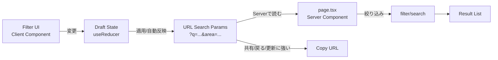
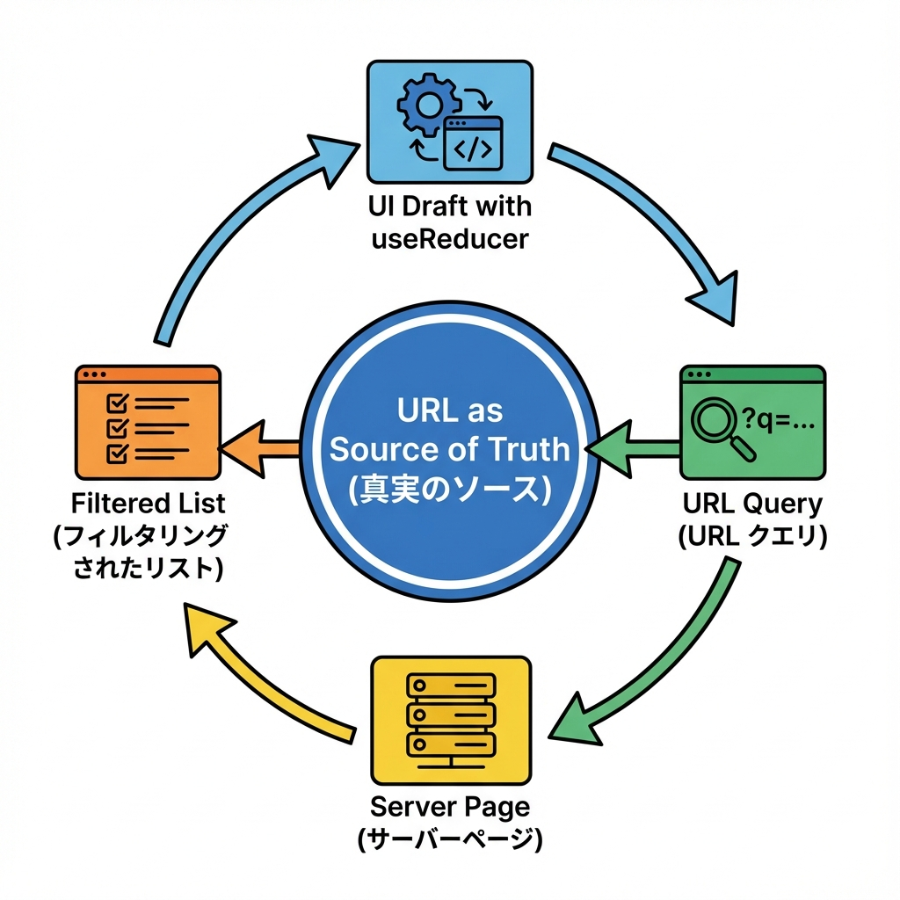
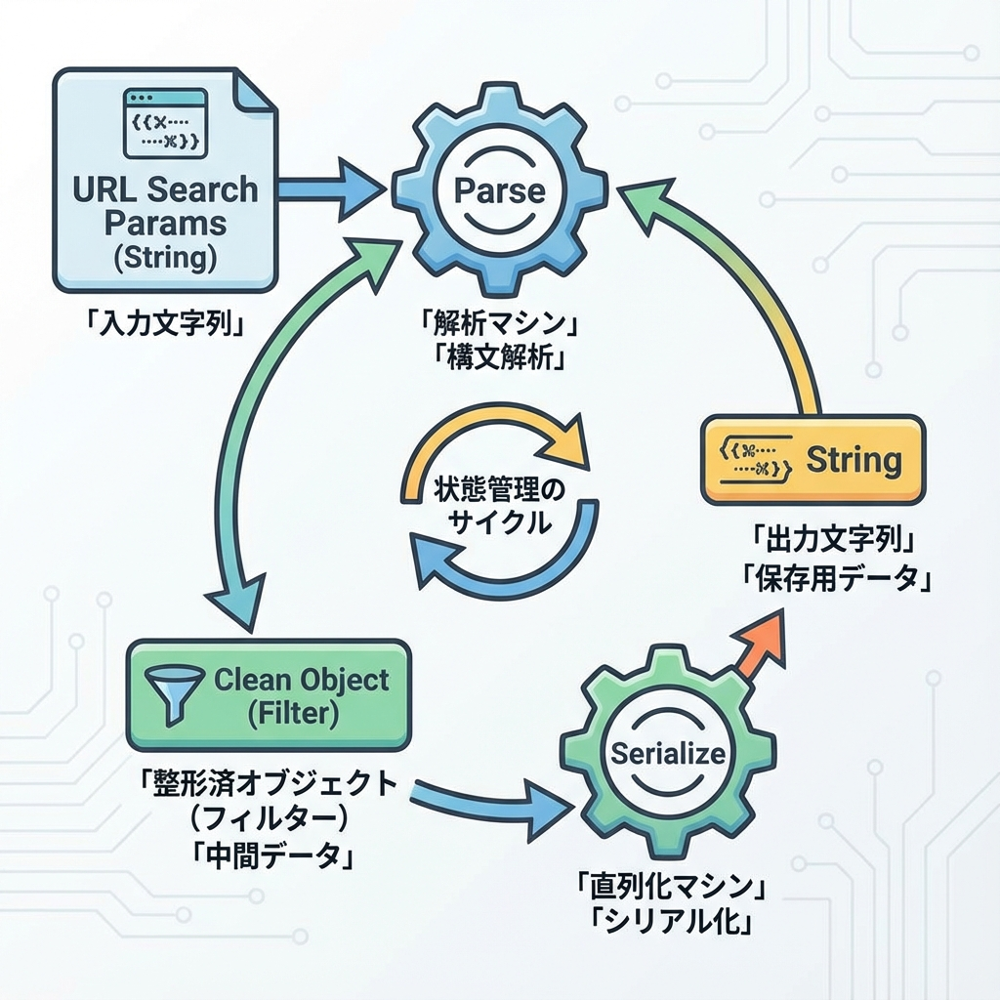
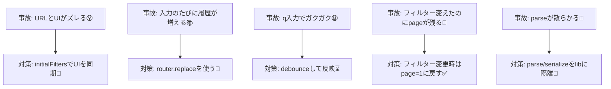

# 第264章：ミニ課題：複雑な検索フィルターの状態管理🔍

この章では、**「カフェ検索」ページ**を作りながら、ちょっと複雑なフィルター（キーワード・エリア・価格帯・Wi-Fi・タグ・並び替え・ページング）を **迷子にならずに状態管理**する練習をするよ〜☕️🧁💕

ポイントはこれ👇

* **URL（クエリ）を“正”にする** → 共有できる・リロードしても保持できる🔗✨
* UIは **「下書き（入力中）」** と **「確定（URL反映）」** を分けると気持ちいい✍️➡️✅
* `parse(読む)` と `serialize(書く)` を **関数にまとめる**と一生ラク🧠🧼

---

## 1) 完成イメージ（状態の流れ）🧠➡️🔗➡️🖥️





---

## 2) まずは作るもの（今回のフィルター）🧋🌸

* `q`：キーワード（入力）🔤
* `area`：エリア（select）🗺️
* `minPrice` / `maxPrice`：価格帯（数値）💰
* `wifi`：Wi-Fiあり（checkbox）📶
* `tags`：タグ複数（ボタンでON/OFF）🏷️
* `sort`：並び替え（評価 / 価格）↕️
* `page`：ページング（1,2,3…）📄

URLは例えばこんな感じ👇
`/cafes?q=latte&area=shibuya&wifi=1&tags=quiet&tags=sweets&sort=rating&page=1` ✨

---

## 3) フォルダ構成（最小）📁✨

```
app/
  cafes/
    page.tsx
    CafesPage.module.css
    FilterPanel.tsx
lib/
  cafes.ts
  filter.ts
```

---

## 4) ダミーデータ＆検索関数を用意する☕️📦

### `lib/cafes.ts`

```
export type Cafe = {
  id: string;
  name: string;
  area: "shibuya" | "shinjuku" | "kichijoji";
  price: number; // だいたいの平均予算
  rating: number; // 1〜5
  wifi: boolean;
  tags: Array<"quiet" | "sweets" | "study" | "date">;
};

export const CAFES: Cafe[] = [
  {
    id: "c1",
    name: "Latte Garden",
    area: "shibuya",
    price: 1200,
    rating: 4.6,
    wifi: true,
    tags: ["quiet", "study"],
  },
  {
    id: "c2",
    name: "Sweets & Bloom",
    area: "kichijoji",
    price: 1500,
    rating: 4.4,
    wifi: false,
    tags: ["sweets", "date"],
  },
  {
    id: "c3",
    name: "Night Roastery",
    area: "shinjuku",
    price: 1000,
    rating: 4.1,
    wifi: true,
    tags: ["date"],
  },
  // 好きに増やしてOK🎉
];
```

---

## 5) “読む/書く”を一箇所にまとめる（超重要）🧠🧼




ここが今回のメイン技✨
**searchParams を直接いじるコードを散らかさない**のが勝ち🏆

### `lib/filter.ts`

```
export type Area = "all" | "shibuya" | "shinjuku" | "kichijoji";
export type Tag = "quiet" | "sweets" | "study" | "date";
export type Sort = "rating" | "price";

export type Filters = {
  q: string;
  area: Area;
  minPrice: number;
  maxPrice: number;
  wifi: boolean;
  tags: Tag[];
  sort: Sort;
  page: number;
};

export type SearchParamsLike = { [key: string]: string | string[] | undefined };

const clamp = (n: number, min: number, max: number) => Math.min(max, Math.max(min, n));

const toNumber = (v: string | undefined, fallback: number) => {
  if (!v) return fallback;
  const n = Number(v);
  return Number.isFinite(n) ? n : fallback;
};

const toBool = (v: string | undefined) => v === "1" || v === "true";

const toArray = (v: string | string[] | undefined) => {
  if (!v) return [];
  if (Array.isArray(v)) return v;
  // tags=a,b も tags=a&tags=b も両対応にしとくと便利✨
  return v.split(",").map((s) => s.trim()).filter(Boolean);
};

export const DEFAULT_FILTERS: Filters = {
  q: "",
  area: "all",
  minPrice: 0,
  maxPrice: 5000,
  wifi: false,
  tags: [],
  sort: "rating",
  page: 1,
};

export const parseFilters = (sp: SearchParamsLike): Filters => {
  const q = (sp.q as string | undefined) ?? DEFAULT_FILTERS.q;

  const areaRaw = (sp.area as string | undefined) ?? DEFAULT_FILTERS.area;
  const area: Filters["area"] =
    areaRaw === "shibuya" || areaRaw === "shinjuku" || areaRaw === "kichijoji" ? areaRaw : "all";

  const minPrice = clamp(toNumber(sp.minPrice as string | undefined, DEFAULT_FILTERS.minPrice), 0, 5000);
  const maxPrice = clamp(toNumber(sp.maxPrice as string | undefined, DEFAULT_FILTERS.maxPrice), 0, 5000);

  const wifi = toBool(sp.wifi as string | undefined);

  const tagsRaw = toArray(sp.tags);
  const tags = tagsRaw
    .filter((t): t is any => t === "quiet" || t === "sweets" || t === "study" || t === "date");

  const sortRaw = (sp.sort as string | undefined) ?? DEFAULT_FILTERS.sort;
  const sort: Filters["sort"] = sortRaw === "price" ? "price" : "rating";

  const page = clamp(toNumber(sp.page as string | undefined, DEFAULT_FILTERS.page), 1, 999);

  return { q, area, minPrice, maxPrice, wifi, tags, sort, page };
};

export const toSearchParams = (f: Filters): URLSearchParams => {
  const p = new URLSearchParams();

  if (f.q.trim()) p.set("q", f.q.trim());
  if (f.area !== "all") p.set("area", f.area);

  if (f.minPrice !== DEFAULT_FILTERS.minPrice) p.set("minPrice", String(f.minPrice));
  if (f.maxPrice !== DEFAULT_FILTERS.maxPrice) p.set("maxPrice", String(f.maxPrice));

  if (f.wifi) p.set("wifi", "1");

  for (const t of f.tags) p.append("tags", t);

  if (f.sort !== DEFAULT_FILTERS.sort) p.set("sort", f.sort);

  if (f.page !== DEFAULT_FILTERS.page) p.set("page", String(f.page));

  return p;
};
```

---

## 6) Server側（page.tsx）でURLからフィルターを作る🧊📄

### `app/cafes/page.tsx`

```
import styles from "./CafesPage.module.css";
import { CAFES } from "@/lib/cafes";
import { parseFilters } from "@/lib/filter";
import FilterPanel from "./FilterPanel";

type SearchParamsLike = { [key: string]: string | string[] | undefined };

type PageProps = {
  searchParams: Promise<SearchParamsLike> | SearchParamsLike; // Next.jsのバージョン差を吸収したい時の保険✨
};

const matches = (name: string, q: string) => name.toLowerCase().includes(q.toLowerCase());

export default async function CafesPage(props: PageProps) {
  const sp = await props.searchParams;
  const filters = parseFilters(sp);

  // 本当はDB検索の場所。今回は配列を絞るだけ☺️
  const filtered = CAFES
    .filter((c) => (filters.q ? matches(c.name, filters.q) : true))
    .filter((c) => (filters.area === "all" ? true : c.area === filters.area))
    .filter((c) => c.price >= filters.minPrice && c.price <= filters.maxPrice)
    .filter((c) => (filters.wifi ? c.wifi : true))
    .filter((c) => (filters.tags.length ? filters.tags.every((t) => c.tags.includes(t)) : true))
    .sort((a, b) => (filters.sort === "rating" ? b.rating - a.rating : a.price - b.price));

  const pageSize = 2; // デモ用に小さめ📄
  const totalPages = Math.max(1, Math.ceil(filtered.length / pageSize));
  const page = Math.min(filters.page, totalPages);

  const start = (page - 1) * pageSize;
  const items = filtered.slice(start, start + pageSize);

  return (
    <div className={styles.wrap}>
      <h1 className={styles.title}>カフェ検索 ☕️🔍</h1>

      <FilterPanel initialFilters={{ ...filters, page }} totalPages={totalPages} />

      <div className={styles.meta}>
        <span>ヒット数：{filtered.length}件 ✨</span>
        <span>ページ：{page}/{totalPages} 📄</span>
      </div>

      <ul className={styles.list}>
        {items.map((c) => (
          <li key={c.id} className={styles.card}>
            <div className={styles.cardTop}>
              <strong>{c.name}</strong>
              <span>⭐ {c.rating.toFixed(1)}</span>
            </div>
            <div className={styles.cardMid}>
              <span>エリア：{c.area}</span>
              <span>予算：{c.price}円</span>
              <span>{c.wifi ? "Wi-Fiあり📶" : "Wi-Fiなし🙅‍♀️"}</span>
            </div>
            <div className={styles.tags}>
              {c.tags.map((t) => (
                <span key={t} className={styles.tag}>#{t}</span>
              ))}
            </div>
          </li>
        ))}
      </ul>
    </div>
  );
}
```

---

## 7) Client側（FilterPanel）で “下書き→URL反映” を作る✍️➡️🔗

ここが状態管理の山場🏔️💕

* 画面の入力は `useReducer` でまとめる🧠
* URL反映は `router.replace()` でやる（履歴が増えすぎない）🔁
* キーワード入力は **ちょい遅延（debounce）** で快適に⌨️💨

### `app/cafes/FilterPanel.tsx`

```
"use client";

import { useEffect, useMemo, useReducer, useTransition } from "react";
import { usePathname, useRouter, useSearchParams } from "next/navigation";
import { DEFAULT_FILTERS, Filters, Tag, toSearchParams } from "@/lib/filter";

type Props = {
  initialFilters: Filters;
  totalPages: number;
};

type Action =
  | { type: "setQ"; q: string }
  | { type: "setArea"; area: Filters["area"] }
  | { type: "setMinPrice"; minPrice: number }
  | { type: "setMaxPrice"; maxPrice: number }
  | { type: "toggleWifi" }
  | { type: "toggleTag"; tag: Tag }
  | { type: "setSort"; sort: Filters["sort"] }
  | { type: "setPage"; page: number }
  | { type: "reset" }
  | { type: "syncFromServer"; next: Filters };

const reducer = (state: Filters, action: Action): Filters => {
  switch (action.type) {
    case "setQ":
      return { ...state, q: action.q, page: 1 };
    case "setArea":
      return { ...state, area: action.area, page: 1 };
    case "setMinPrice":
      return { ...state, minPrice: action.minPrice, page: 1 };
    case "setMaxPrice":
      return { ...state, maxPrice: action.maxPrice, page: 1 };
    case "toggleWifi":
      return { ...state, wifi: !state.wifi, page: 1 };
    case "toggleTag": {
      const has = state.tags.includes(action.tag);
      const tags = has ? state.tags.filter((t) => t !== action.tag) : [...state.tags, action.tag];
      return { ...state, tags, page: 1 };
    }
    case "setSort":
      return { ...state, sort: action.sort, page: 1 };
    case "setPage":
      return { ...state, page: action.page };
    case "reset":
      return { ...DEFAULT_FILTERS };
    case "syncFromServer":
      return { ...action.next };
    default:
      return state;
  }
};

const useDebouncedValue = <T,>(value: T, ms: number) => {
  const [v, setV] = useReducer((_: T, next: T) => next, value);
  useEffect(() => {
    const id = window.setTimeout(() => setV(value), ms);
    return () => window.clearTimeout(id);
  }, [value, ms]);
  return v;
};

export default function FilterPanel({ initialFilters, totalPages }: Props) {
  const [state, dispatch] = useReducer(reducer, initialFilters);
  const router = useRouter();
  const pathname = usePathname();
  const sp = useSearchParams();
  const [isPending, startTransition] = useTransition();

  // ✅ サーバーから来た初期値（＝URL由来）が変わったら、UIも同期する（戻るボタン対策）🔁
  useEffect(() => {
    dispatch({ type: "syncFromServer", next: initialFilters });
  }, [initialFilters]);

  // ✨ キーワードは入力中に毎回URL反映すると疲れるので、ちょい遅延
  const debouncedQ = useDebouncedValue(state.q, 350);

  const urlFilters = useMemo(() => ({ ...state, q: debouncedQ }), [state, debouncedQ]);

  // ✅ 「URLへ反映する」関数は1つにまとめる🧠
  const applyToUrl = (next: Filters) => {
    const params = toSearchParams(next);
    const qs = params.toString();
    startTransition(() => {
      router.replace(qs ? `${pathname}?${qs}` : pathname);
    });
  };

  // キーワードだけは debounce 後に自動反映💖
  useEffect(() => {
    applyToUrl(urlFilters);
    // eslint-disable-next-line react-hooks/exhaustive-deps
  }, [debouncedQ]);

  const toggleTag = (tag: Tag) => {
    const has = state.tags.includes(tag);
    const tags = has ? state.tags.filter((t) => t !== tag) : [...state.tags, tag];
    const next = { ...state, tags, page: 1 };
    dispatch({ type: "toggleTag", tag });
    applyToUrl(next);
  };

  const setAndApply = (action: Action, next: Filters) => {
    dispatch(action);
    applyToUrl(next);
  };

  return (
    <section style={{ border: "1px solid #ddd", padding: 12, borderRadius: 12 }}>
      <div style={{ display: "flex", gap: 8, flexWrap: "wrap", alignItems: "center" }}>
        <label style={{ display: "grid", gap: 4 }}>
          <span>キーワード🔤</span>
          <input
            value={state.q}
            onChange={(e) => dispatch({ type: "setQ", q: e.target.value })}
            placeholder="例）latte"
            style={{ padding: 8, borderRadius: 10, border: "1px solid #ccc" }}
          />
        </label>

        <label style={{ display: "grid", gap: 4 }}>
          <span>エリア🗺️</span>
          <select
            value={state.area}
            onChange={(e) => {
              const area = e.target.value as Filters["area"];
              setAndApply({ type: "setArea", area }, { ...state, area, page: 1 });
            }}
            style={{ padding: 8, borderRadius: 10, border: "1px solid #ccc" }}
          >
            <option value="all">全部</option>
            <option value="shibuya">渋谷</option>
            <option value="shinjuku">新宿</option>
            <option value="kichijoji">吉祥寺</option>
          </select>
        </label>

        <label style={{ display: "grid", gap: 4 }}>
          <span>最小価格💰</span>
          <input
            type="number"
            value={state.minPrice}
            onChange={(e) => {
              const minPrice = Number(e.target.value);
              setAndApply({ type: "setMinPrice", minPrice }, { ...state, minPrice, page: 1 });
            }}
            style={{ padding: 8, borderRadius: 10, border: "1px solid #ccc", width: 120 }}
          />
        </label>

        <label style={{ display: "grid", gap: 4 }}>
          <span>最大価格💰</span>
          <input
            type="number"
            value={state.maxPrice}
            onChange={(e) => {
              const maxPrice = Number(e.target.value);
              setAndApply({ type: "setMaxPrice", maxPrice }, { ...state, maxPrice, page: 1 });
            }}
            style={{ padding: 8, borderRadius: 10, border: "1px solid #ccc", width: 120 }}
          />
        </label>

        <label style={{ display: "flex", gap: 8, alignItems: "center", marginTop: 18 }}>
          <input
            type="checkbox"
            checked={state.wifi}
            onChange={() => setAndApply({ type: "toggleWifi" }, { ...state, wifi: !state.wifi, page: 1 })}
          />
          <span>Wi-Fi📶</span>
        </label>

        <label style={{ display: "grid", gap: 4 }}>
          <span>並び替え↕️</span>
          <select
            value={state.sort}
            onChange={(e) => {
              const sort = e.target.value as Filters["sort"];
              setAndApply({ type: "setSort", sort }, { ...state, sort, page: 1 });
            }}
            style={{ padding: 8, borderRadius: 10, border: "1px solid #ccc" }}
          >
            <option value="rating">評価が高い順⭐</option>
            <option value="price">価格が安い順💰</option>
          </select>
        </label>

        <button
          type="button"
          onClick={() => {
            dispatch({ type: "reset" });
            applyToUrl(DEFAULT_FILTERS);
          }}
          style={{ padding: "10px 12px", borderRadius: 12, border: "1px solid #ccc", marginTop: 18 }}
        >
          リセット🧼
        </button>

        <span style={{ marginTop: 18 }}>
          {isPending ? "検索中…⏳" : "OK✅"}
        </span>
      </div>

      <div style={{ marginTop: 12, display: "flex", gap: 8, flexWrap: "wrap" }}>
        <span>タグ🏷️：</span>
        {(["quiet", "sweets", "study", "date"] as Tag[]).map((t) => {
          const on = state.tags.includes(t);
          return (
            <button
              key={t}
              type="button"
              onClick={() => toggleTag(t)}
              style={{
                padding: "8px 10px",
                borderRadius: 999,
                border: "1px solid #ccc",
                background: on ? "#111" : "white",
                color: on ? "white" : "#111",
              }}
            >
              #{t} {on ? "✅" : "➕"}
            </button>
          );
        })}
      </div>

      <div style={{ marginTop: 12, display: "flex", gap: 8, alignItems: "center" }}>
        <span>ページ📄：</span>
        <button
          type="button"
          disabled={state.page <= 1}
          onClick={() => {
            const page = Math.max(1, state.page - 1);
            setAndApply({ type: "setPage", page }, { ...state, page });
          }}
          style={{ padding: "8px 10px", borderRadius: 12, border: "1px solid #ccc" }}
        >
          ◀
        </button>

        <span>{state.page} / {totalPages}</span>

        <button
          type="button"
          disabled={state.page >= totalPages}
          onClick={() => {
            const page = Math.min(totalPages, state.page + 1);
            setAndApply({ type: "setPage", page }, { ...state, page });
          }}
          style={{ padding: "8px 10px", borderRadius: 12, border: "1px solid #ccc" }}
        >
          ▶
        </button>
      </div>
    </section>
  );
}
```

---

## 8) ちょい見た目を整える（CSS Modules）🎀✨

### `app/cafes/CafesPage.module.css`

```
.wrap {
  max-width: 920px;
  margin: 24px auto;
  padding: 0 16px;
}

.title {
  font-size: 28px;
  margin-bottom: 12px;
}

.meta {
  display: flex;
  gap: 16px;
  margin: 12px 0;
  opacity: 0.8;
}

.list {
  list-style: none;
  padding: 0;
  display: grid;
  gap: 12px;
}

.card {
  border: 1px solid #ddd;
  border-radius: 14px;
  padding: 12px;
}

.cardTop {
  display: flex;
  justify-content: space-between;
  align-items: center;
}

.cardMid {
  display: flex;
  gap: 12px;
  flex-wrap: wrap;
  margin-top: 6px;
  opacity: 0.9;
}

.tags {
  display: flex;
  gap: 8px;
  flex-wrap: wrap;
  margin-top: 10px;
}

.tag {
  border: 1px solid #ddd;
  border-radius: 999px;
  padding: 4px 10px;
  font-size: 12px;
}
```

---

## 9) 状態管理で「事故りやすいポイント」まとめ🚧💡



---

## 10) 動作チェック項目（クリアできたら勝ち🎉）✅✅

* URLをコピペして別タブで開いても **同じ検索結果**になる🔗✨
* ブラウザの戻る/進むで **フィルターUIも追従**する🔁😊
* キーワード入力が **重くない**（遅延反映が効いてる）⌨️💨
* フィルター変更でページが **1に戻る**📄➡️1
* リセットで **初期状態に戻る**🧼✨

---

## おまけ：この章の「型」だけ覚えると一生使える🧁🫶

* **URL = 永続化できる状態の置き場**
* **UI = 入力しやすさのための下書き**
* **parse/serialize = 状態管理の背骨**

---

次にやるなら…💭✨

* `loading.tsx` を置いて、検索中をもっとかわいくする⏳💗
* タグを「AND」じゃなく「OR」検索にしてみる（設計の練習）🧠
* ページングを「もっと見る」ボタンにしてみる📌✨

必要なら、このミニ課題を **「商品検索（色/サイズ/在庫/並び替え）」版**にアレンジした教材も作れるよ〜🛍️💖
