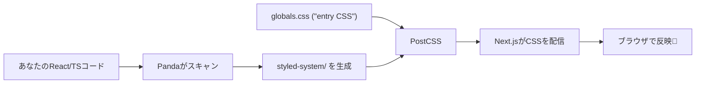
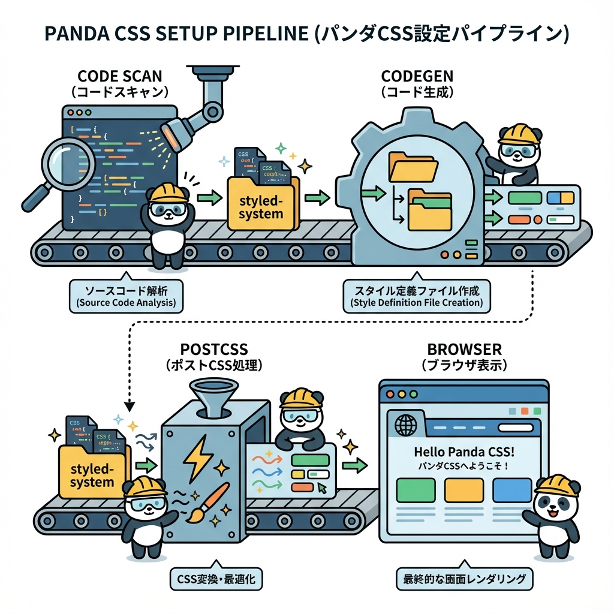

# 第266章：インストールとセットアップ（Next.js設定）🧱

この章は「Panda CSS を Next.js に入れて、ちゃんと動く状態にする」回だよ〜！🥳
最後に **“スタイルが反映されるか”** まで確認しよっ ✅💕

---

## 今日のゴール🎯✨

* Panda CSS をインストールして 🐼📦
* `panda.config.ts` / `postcss.config.cjs` を用意して 🧩
* `styled-system/` が生成されて ✨
* Next.jsでCSSが反映される状態にする 🎉

---

## まず全体の流れを図でイメージ👀🗺️





---

## 1) Next.jsプロジェクトを用意する🧰✨

すでにあるならスキップOKだよ🙆‍♀️

```bash
npx create-next-app@latest panda-next
cd panda-next
```

---

## 2) Panda CSS をインストールする🐼📦

Pandaを **PostCSSプラグインとして入れる** のが推奨だよ〜！✨ ([panda-css.com][1])

```bash
npm install -D @pandacss/dev postcss
```

---

## 3) 初期化（設定ファイルを自動生成）🪄

`panda.config.ts` と、必要なら `postcss.config.cjs` などを作ってくれるよ！ ([panda-css.com][1])

```bash
npx panda init -p
```

> `-p` は PostCSS 用のセットアップも含む初期化だよ（ドキュメントの手順そのまま） ([panda-css.com][1])

---

## 4) `postcss.config.cjs` を確認する👀✅

だいたいこうなってればOK！ ([panda-css.com][1])

```js
module.exports = {
  plugins: {
    "@pandacss/dev/postcss": {},
  },
}
```

---

## 5) `panda.config.ts` を Next.js 向けに整える🧩✨

最低限ここが大事👇

* `include` に **コンポーネントが置いてある場所** を入れる
* `outdir` は `styled-system` がよく使われる ([panda-css.com][1])

例（`src/` を使う構成にも、使わない構成にも寄せた無難版）👇

```ts
import { defineConfig } from "@pandacss/dev"

export default defineConfig({
  preflight: true,
  include: [
    "./app/**/*.{js,jsx,ts,tsx}",
    "./src/app/**/*.{js,jsx,ts,tsx}",
    "./components/**/*.{js,jsx,ts,tsx}",
    "./src/components/**/*.{js,jsx,ts,tsx}",
  ],
  exclude: [],
  outdir: "styled-system",
})
```

---

## 6) `package.json` に `prepare` を追加する🧷✨

これで **依存関係を入れたときに自動で codegen** が走るよ！ ([panda-css.com][1])

```json
{
  "scripts": {
    "prepare": "panda codegen",
    "dev": "next dev",
    "build": "next build",
    "start": "next start",
    "lint": "next lint"
  }
}
```

---

## 7) いったん codegen を実行してみる🏃‍♀️💨

`styled-system/` ができたら勝ち！🎉

```bash
npm run prepare
```

---

## 8) エントリーCSSに「layer宣言」を入れる🎀

Pandaはレイヤー前提でCSSを合成するので、**入口になるCSS**（だいたい `app/globals.css`）にこれを入れるよ！ ([panda-css.com][1])

`app/globals.css`（または `src/app/globals.css`）の先頭あたりに👇

```css
@layer reset, base, tokens, recipes, utilities;
```

---

## 9) `globals.css` が読み込まれてるか確認🔍

App Routerだと、通常 `app/layout.tsx` で `globals.css` を import してるはずだよ🙆‍♀️
もし無かったらこんな感じ👇

```tsx
import "./globals.css"

export default function RootLayout({ children }: { children: React.ReactNode }) {
  return (
    <html lang="ja">
      <body>{children}</body>
    </html>
  )
}
```

---

## 10) 動作チェック（超かんたん）✅✨

`app/page.tsx` で Panda の `css()` を試すよ〜！
（パスはプロジェクト構成で変わるから、まずはこの形でOK）

```tsx
import { css } from "../styled-system/css"

export default function Page() {
  return (
    <main
      className={css({
        p: "6",
        bg: "gray.50",
      })}
    >
      <h1
        className={css({
          fontSize: "2xl",
          fontWeight: "bold",
        })}
      >
        Panda CSS セットアップできたかも🐼✨
      </h1>
    </main>
  )
}
```

起動！🚀

```bash
npm run dev
```

---

## よくある詰まりポイント（ここ見れば助かるやつ）🧯💡

### 1) スタイルが反映されない😵‍💫

Next.js が PostCSS 生成物をキャッシュしてることがあるので、`.next` を消して再起動すると直ることがあるよ！ ([panda-css.com][2])

Windowsなら（npm scripts上で動きやすい）👇

```bash
rmdir /s /q .next
npm run dev
```

> それでもダメなら、`include` の範囲が狭くてスキャンされてないことが多いよ〜！👀（`panda.config.ts`見直し）

---

### 2) VSCodeで import の補完が出ない🌀

`tsconfig.json` の `include` に `styled-system` を足すと改善することがあるよ！ ([panda-css.com][1])

```json
{
  "include": ["next-env.d.ts", "**/*.ts", "**/*.tsx", "styled-system"]
}
```

---

### 3) codegen が「es5 がどうこう」って怒る💥

TSの `target` を `es6` 以上にすると直ることがあるよ！ ([panda-css.com][2])

```json
{
  "compilerOptions": {
    "target": "es6"
  }
}
```

---

## 章末ミニチェックリスト✅💖

* [ ] `@pandacss/dev` を入れた🐼
* [ ] `npx panda init -p` を実行した🪄
* [ ] `postcss.config.cjs` に `@pandacss/dev/postcss` がいる🧩 ([panda-css.com][1])
* [ ] `package.json` に `"prepare": "panda codegen"` を追加した🧷 ([panda-css.com][1])
* [ ] `globals.css` に `@layer ...;` を入れた🎀 ([panda-css.com][1])
* [ ] `styled-system/` が生成されて、画面でスタイルが反映された🎉

---

次の第267章では、いよいよ **`css()` 関数で “ちゃんとスタイリングを書く”** をやるよ〜！🎨🐼✨

[1]: https://panda-css.com/docs/installation/postcss "Using PostCSS | Panda CSS - Panda CSS"
[2]: https://panda-css.com/docs/installation/nextjs "Using Next.js | Panda CSS - Panda CSS"
