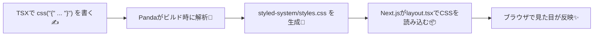

# 第267章：基本のスタイリング（`css()` 関数）🎨

今日は **Panda CSS のいちばん基本**、`css()` でスタイルを書く方法をやっていくよ〜！😊💖
`css()` は **「スタイルオブジェクト → className文字列」** にしてくれる関数だよ 🪄（戻り値はただの文字列！）([panda-css.com][1])

---

## 0) まずは“動く状態”チェックだけ ✅👀

Panda は生成したCSSを読み込まないと見た目が変わらないよ〜！
だいたい **`styled-system/styles.css`** を **ルート（`app/layout.tsx`）で import** してるはず 👍([panda-css.com][2])

例：`src/app/layout.tsx` の場合（`styled-system` がプロジェクト直下にある想定）

```tsx
// src/app/layout.tsx
import "../../styled-system/styles.css"

export default function RootLayout({ children }: { children: React.ReactNode }) {
  return (
    <html lang="ja">
      <body>{children}</body>
    </html>
  )
}
```

※ `src/` を使ってない構成なら、`../styled-system/styles.css` みたいに `..` の数が変わるよ〜（フォルダの位置だけ合わせてね）🙂

---

## 1) `css()` の基本：className を作るだけ 🌸

`css({ ... })` に「書きたい見た目」を入れると、**クラス名文字列**が返ってくるよ！([panda-css.com][1])

```tsx
import { css } from "../../styled-system/css"

const titleClass = css({
  fontSize: "2xl",
  fontWeight: "bold",
  color: "gray.800",
})

export function Title() {
  return <h1 className={titleClass}>こんにちは🐼✨</h1>
}
```

ポイント👇

* **`className={css({...})}` でOK**（めっちゃ素直）
* 書き方は **CSSっぽいけど、トークンや便利ショートカットが使える**感じだよ〜🐣

---

## 図解：`css()` が効くまでの流れ 🧠➡️🎉




---

## 2) よく使うスタイル（まずはこれだけで勝てる🏆）🧁

まずは「カードっぽい見た目」を作る鉄板セットを覚えよ〜！💕

```tsx
import { css } from "../../styled-system/css"

export const cardClass = css({
  bg: "white",
  borderWidth: "1px",
  borderColor: "gray.200",
  borderRadius: "xl",
  padding: "4",
  boxShadow: "sm",
})
```

よく出るプロパティ例👇（覚えなくてOK、見ながらで大丈夫😊）

* `padding` / `margin`
* `bg`（背景）
* `color`（文字色）
* `borderWidth` / `borderColor` / `borderRadius`
* `boxShadow`

---

## 3) ホバー・フォーカスも超かんたん 🫶✨

Panda は `_hover` みたいに書けるよ〜！

```tsx
import { css } from "../../styled-system/css"

export const buttonClass = css({
  bg: "gray.900",
  color: "white",
  paddingX: "4",
  paddingY: "3",
  borderRadius: "lg",
  transition: "all 0.2s",

  _hover: {
    bg: "gray.700",
    transform: "translateY(-1px)",
  },

  _focusVisible: {
    outline: "2px solid",
    outlineColor: "blue.400",
    outlineOffset: "2px",
  },
})
```

---

## 4) レスポンシブ対応（スマホ→PC）📱➡️💻

Panda は **配列でブレイクポイントごと**に指定できるよ！([panda-css.com][3])

```tsx
import { css } from "../../styled-system/css"

export const wrapClass = css({
  padding: ["4", "6", "8"],      // 小→中→大 みたいな感じ
  fontSize: ["md", "lg", "xl"],
})
```

「真ん中のサイズは変えない」なら `undefined` でスキップもできるよ〜([panda-css.com][3])

---

## 5) className を合体したいとき（`cx`）🧷✨

「ベースのスタイル + 追加のスタイル」をくっつけたいときは `cx` が便利！([panda-css.com][1])

```tsx
import { css, cx } from "../../styled-system/css"

const base = css({ borderRadius: "xl", padding: "4" })
const danger = css({ bg: "red.50", borderColor: "red.200", borderWidth: "1px" })

export function Notice({ isDanger }: { isDanger: boolean }) {
  return <div className={cx(base, isDanger && danger)}>お知らせだよ📢</div>
}
```

---

## 6) ミニ実装：大学イベントカードを作ろう 🎓🌸

### 6-1) `src/components/CampusEventCard.tsx` を作成 🧩

```tsx
// src/components/CampusEventCard.tsx
import { css } from "../../styled-system/css"

type Props = {
  title: string
  dateText: string
  place: string
  badge?: "募集中" | "満員"
}

const card = css({
  bg: "white",
  borderWidth: "1px",
  borderColor: "gray.200",
  borderRadius: "2xl",
  padding: ["4", "5", "6"],
  boxShadow: "sm",
  transition: "all 0.2s",

  _hover: {
    boxShadow: "md",
    transform: "translateY(-2px)",
  },
})

const titleCls = css({
  fontSize: ["lg", "xl"],
  fontWeight: "bold",
  color: "gray.900",
})

const metaCls = css({
  marginTop: "2",
  color: "gray.600",
  fontSize: "sm",
  display: "flex",
  flexDirection: "column",
  gap: "1",
})

const badgeBase = css({
  display: "inline-flex",
  alignItems: "center",
  paddingX: "3",
  paddingY: "1",
  borderRadius: "full",
  fontSize: "xs",
  fontWeight: "bold",
  borderWidth: "1px",
})

const badgeOpen = css({
  bg: "green.50",
  color: "green.700",
  borderColor: "green.200",
})

const badgeFull = css({
  bg: "gray.100",
  color: "gray.700",
  borderColor: "gray.200",
})

export function CampusEventCard({ title, dateText, place, badge }: Props) {
  const badgeCls =
    badge === "募集中" ? css(badgeBase, badgeOpen)
    : badge === "満員" ? css(badgeBase, badgeFull)
    : ""

  return (
    <article className={card}>
      <div className={css({ display: "flex", justifyContent: "space-between", gap: "3" })}>
        <h3 className={titleCls}>{title}</h3>
        {badge && <span className={badgeCls}>{badge}</span>}
      </div>

      <div className={metaCls}>
        <span>📅 {dateText}</span>
        <span>📍 {place}</span>
      </div>
    </article>
  )
}
```

### 6-2) `src/app/page.tsx` で表示 🏠✨

```tsx
// src/app/page.tsx
import { css } from "../../styled-system/css"
import { CampusEventCard } from "../components/CampusEventCard"

export default function Page() {
  return (
    <main
      className={css({
        minHeight: "100vh",
        bg: "gray.50",
        padding: ["5", "8"],
      })}
    >
      <h1
        className={css({
          fontSize: ["2xl", "3xl"],
          fontWeight: "bold",
          marginBottom: "6",
        })}
      >
        学内イベント🌸✨
      </h1>

      <div
        className={css({
          display: "grid",
          gridTemplateColumns: ["1fr", "repeat(2, 1fr)"],
          gap: "4",
        })}
      >
        <CampusEventCard title="スイーツ研究会🍰" dateText="1/10(土) 14:00" place="2号館 301" badge="募集中" />
        <CampusEventCard title="写真さんぽ📸" dateText="1/12(月) 10:00" place="正門集合" badge="満員" />
      </div>
    </main>
  )
}
```

できたら `npm run dev` で見て、**ホバーでふわっと浮く**のを確認してね〜🥰✨

---

## 7) よくあるハマり 🪤（ここだけ助かるやつ）

* **見た目が変わらない**
  → `styled-system/styles.css` の import を再確認！([panda-css.com][2])
  → Next.js のキャッシュで詰まることもあるので、`.next` を消して再起動が効くことがあるよ（公式のトラブルシュートにもある）([panda-css.com][4])

  * PowerShellなら例：`Remove-Item -Recurse -Force .next`

* **「動的な値」を入れたら効かない/生成されない**
  → Panda は “ビルド時に解析してCSS生成” する前提なので、何でも自由に動的にできるわけじゃないよ〜！必要なら `staticCss` で事前生成する考え方があるよ([panda-css.com][5])

---

## 今日のまとめ 🎀🐼

* `css()` は **スタイルを書いて className を返す**だけ！([panda-css.com][1])
* `_hover` とか配列レスポンシブで **可愛いUIがすぐ作れる**([panda-css.com][3])
* className 合体は `cx` が便利！([panda-css.com][1])

次の章（第268章）では、**Recipes で “ボタンのバリエーション量産”** に入っていくよ〜！🧂✨

[1]: https://panda-css.com/docs/concepts/writing-styles?utm_source=chatgpt.com "Writing Styles"
[2]: https://panda-css.com/docs/installation/cli?utm_source=chatgpt.com "Panda CLI"
[3]: https://panda-css.com/docs/concepts/responsive-design?utm_source=chatgpt.com "Responsive Design"
[4]: https://panda-css.com/docs/installation/nextjs "Using Next.js | Panda CSS - Panda CSS"
[5]: https://panda-css.com/docs/guides/dynamic-styling?utm_source=chatgpt.com "Dynamic styling"
