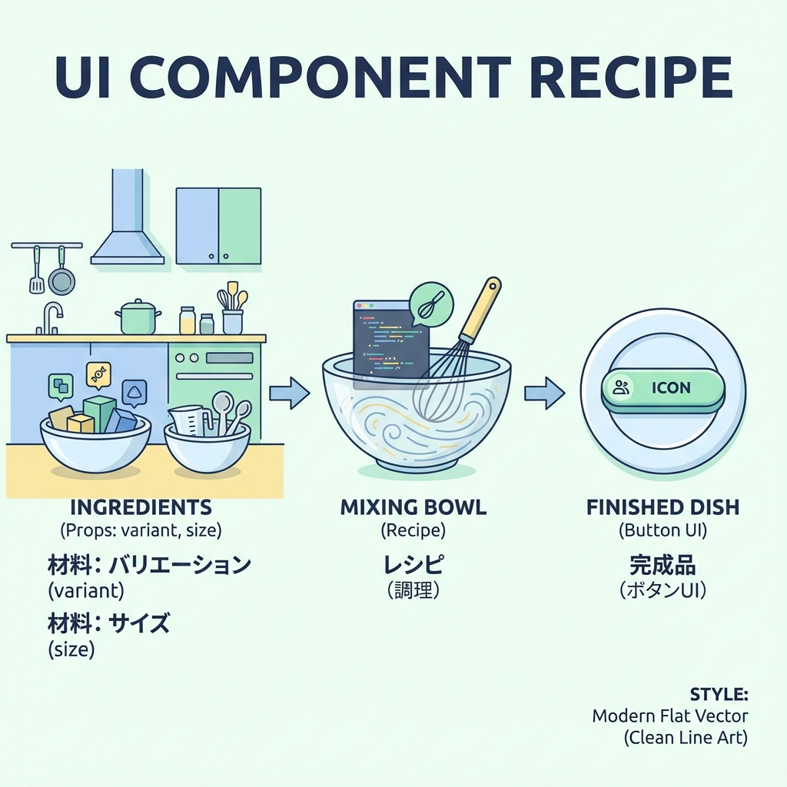
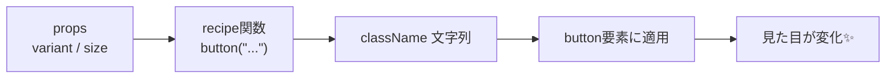

# 第268章：Recipes でバリエーションを作る（Button等）🧂

ボタンって、**「サイズ」「見た目（塗り/枠線）」「色」「角丸」**みたいにオプションが増えがちだよね…🥹
そこで登場するのが **Panda CSS の Recipes**！🍳✨
「オプションを選ぶだけで、いい感じのclassNameが出る」仕組みだよ〜！😆

Recipesは、`base / variants / compoundVariants / defaultVariants` で構成されるよ。 ([panda-css.com][1])

---

## 今日のゴール 🎯✨

* Buttonの見た目を **variant（solid/outline/ghost）** と **size（sm/md/lg）** で切り替えられるようにする🎛️
* できあがったら、こう書けるようになる👇😍

```tsx
<Button variant="solid" size="md">保存</Button>
<Button variant="outline" size="sm">戻る</Button>
<Button variant="ghost" size="lg">あとで</Button>
```

---

## Recipesのイメージ図 🧠➡️🎨

「props → recipe関数 → className → 見た目が変わる」って流れだよ〜！🪄






---

## まず知っておく：Recipesは2種類あるよ 🐼✌️

PandaのRecipesには大きく2つあるよ〜👇

* **Atomic Recipe（cva）**：コード内で作る。使った/使ってないに関係なく、基本「全部」生成されがち。 ([panda-css.com][1])
* **Config Recipe（defineRecipe）**：設定に登録する。**使った分だけ生成**されやすい（デザインシステム向き）✨ ([panda-css.com][1])

この章は **Config Recipe（defineRecipe）** で「Buttonの型」を作るよ〜！🧁

---

## 手順①：ButtonのRecipeを作る 🧁🧂

たとえばこんな場所にファイルを作る（場所は好みでOK）👇

* `src/theme/recipes/button.recipe.ts`

中身はこれ👇（まずはコピペでOK！😆）

```ts
import { defineRecipe } from "@pandacss/dev"

export const buttonRecipe = defineRecipe({
  className: "button",
  description: "App button styles",

  base: {
    display: "inline-flex",
    alignItems: "center",
    justifyContent: "center",
    fontWeight: "600",
    borderRadius: "md",
    userSelect: "none",
    transitionProperty: "background, border-color, color, transform",
    transitionDuration: "fast",
    cursor: "pointer",

    _focusVisible: {
      outline: "2px solid",
      outlineColor: "blue.400",
      outlineOffset: "2px",
    },

    _disabled: {
      opacity: 0.5,
      cursor: "not-allowed",
    },
  },

  variants: {
    variant: {
      solid: {
        bg: "blue.600",
        color: "white",
        _hover: { bg: "blue.700" },
        _active: { transform: "translateY(1px)" },
      },
      outline: {
        bg: "transparent",
        color: "blue.700",
        borderWidth: "1px",
        borderColor: "blue.300",
        _hover: { bg: "blue.50" },
        _active: { transform: "translateY(1px)" },
      },
      ghost: {
        bg: "transparent",
        color: "blue.700",
        _hover: { bg: "blue.50" },
        _active: { transform: "translateY(1px)" },
      },
    },

    size: {
      sm: {
        height: "8",
        px: "3",
        fontSize: "sm",
        gap: "1.5",
      },
      md: {
        height: "10",
        px: "4",
        fontSize: "md",
        gap: "2",
      },
      lg: {
        height: "12",
        px: "5",
        fontSize: "lg",
        gap: "2.5",
      },
    },
  },

  defaultVariants: {
    variant: "solid",
    size: "md",
  },

  // 例：outline + lg の時だけちょい強調したい！みたいな時に便利✨
  compoundVariants: [
    {
      variant: "outline",
      size: "lg",
      css: {
        borderWidth: "2px",
      },
    },
  ],
})
```

Recipesは `base / variants / compoundVariants / defaultVariants` で組み立てるよ〜って部分、ここで全部使ってるよ！ ([panda-css.com][1])

---

## 手順②：panda.config.ts に登録する 🧱🐼

`panda.config.ts` の `theme.extend.recipes` に追加するよ！

```ts
import { defineConfig } from "@pandacss/dev"
import { buttonRecipe } from "./src/theme/recipes/button.recipe"

export default defineConfig({
  // ...（既存の設定はそのまま）
  theme: {
    extend: {
      recipes: {
        button: buttonRecipe,
      },
    },
  },
})
```

Config Recipeは「設定に置くと、使った分だけ生成される」系のやつだよ〜🫶 ([panda-css.com][1])

---

## 手順③：コード生成（panda codegen）する ⚙️✨

Recipeを追加したら、生成を走らせるよ〜！

```bash
npx panda codegen
```

もし自動生成されない時は `panda codegen` を実行してね、って公式の流れもこんな感じだよ。 ([panda-css.com][2])

成功すると、だいたい `styled-system/recipes`（outdirによる）に `button` が生えるよ🌱
そして「使ったvariantだけCSSが生成される」方向に寄せられるのが嬉しいポイント！✨ ([panda-css.com][1])

---

## 手順④：Buttonコンポーネントを作る 🧸✨

例：`src/components/ui/Button.tsx`

※ クリック（onClick）で使いたいことが多いので、ここは `use client` で作っちゃうのがラクだよ〜🫶

```tsx
"use client"

import React from "react"
import { button } from "@/styled-system/recipes"
import type { ButtonVariants } from "@/styled-system/recipes"

type Props = React.ButtonHTMLAttributes<HTMLButtonElement> &
  ButtonVariants & {
    children: React.ReactNode
  }

export function Button(props: Props) {
  const { variant, size, className, children, ...rest } = props

  const cls = [button({ variant, size }), className].filter(Boolean).join(" ")

  return (
    <button className={cls} {...rest}>
      {children}
    </button>
  )
}
```

Recipeの型（ButtonVariants）を `styled-system/recipes` からimportできるよ〜ってのも公式で紹介されてるよ！ ([panda-css.com][1])

> もし `@/styled-system/...` で解決できなかったら、プロジェクトのoutdirに合わせて
> `../styled-system/recipes` みたいに相対パスにしてOKだよ👌

---

## 手順⑤：動作確認ページを作る 🧪🌸

例：`src/app/panda-demo/page.tsx`

```tsx
import { Button } from "@/components/ui/Button"

export default function Page() {
  return (
    <main style={{ padding: 24, display: "grid", gap: 12 }}>
      <h1 style={{ fontSize: 24, fontWeight: 700 }}>Panda CSS Recipes Demo 🐼✨</h1>

      <div style={{ display: "flex", gap: 12, flexWrap: "wrap" }}>
        <Button>Default（solid/md）</Button>
        <Button variant="solid" size="sm">solid sm</Button>
        <Button variant="solid" size="lg">solid lg</Button>
      </div>

      <div style={{ display: "flex", gap: 12, flexWrap: "wrap" }}>
        <Button variant="outline" size="sm">outline sm</Button>
        <Button variant="outline" size="md">outline md</Button>
        <Button variant="outline" size="lg">outline lg（compoundが効く）</Button>
      </div>

      <div style={{ display: "flex", gap: 12, flexWrap: "wrap" }}>
        <Button variant="ghost" size="sm">ghost sm</Button>
        <Button variant="ghost" size="md">ghost md</Button>
        <Button variant="ghost" size="lg" disabled>ghost lg disabled</Button>
      </div>
    </main>
  )
}
```

これで、バリエーションが切り替わったら勝ち〜！🎉😆

---

## よくあるハマりどころ 🪤🥹（すぐ治るよ）

* **button が import できない**

  * → `npx panda codegen` を忘れてる率高め！⚙️ ([panda-css.com][2])
* **CSSが当たらない**

  * → `styled-system/styles.css`（生成CSS）を `app/layout.tsx` などで読み込んでるかチェック👀（※セットアップ章のところ）
* **変更が反映されない**

  * → devサーバー再起動、または codegen をもう一回✨

---

## ミニ課題 🎓💞（5分）

1. `variant` に **danger** を追加してみよう❤️‍🔥（solid/outline/ghost のどれかでOK）
2. `compoundVariants` で「danger + outline のときだけ borderColor を赤く」してみよう🧪

できたら、次の章で **Slot Recipes（CardやDialogみたいな複合UI）** に進むと「うわ〜それ欲しかったやつ！」ってなるはず😍🍱

[1]: https://panda-css.com/docs/concepts/recipes "Recipes | Panda CSS - Panda CSS"
[2]: https://panda-css.com/docs/concepts/slot-recipes "Slot Recipes | Panda CSS - Panda CSS"
