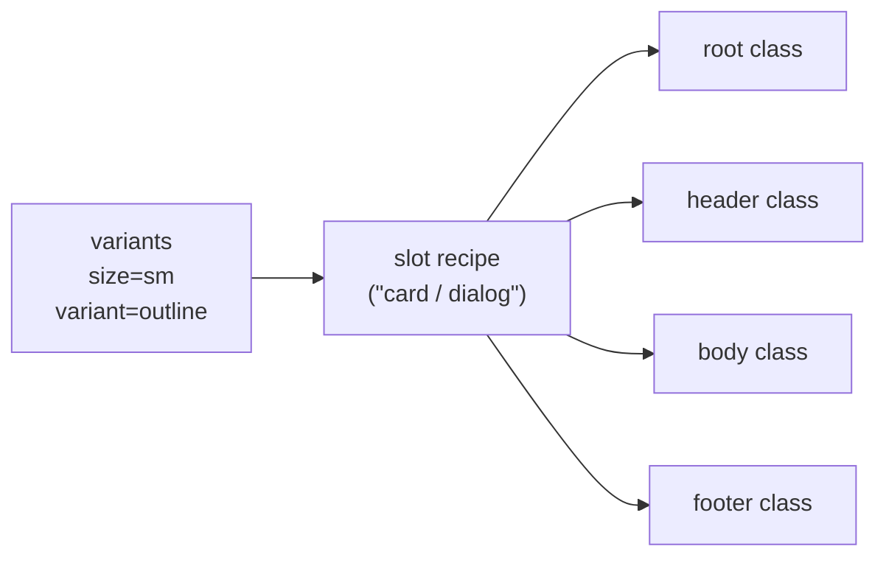
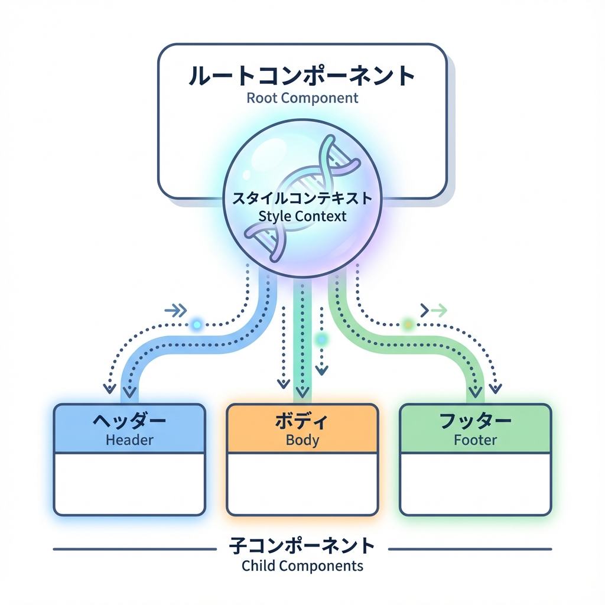
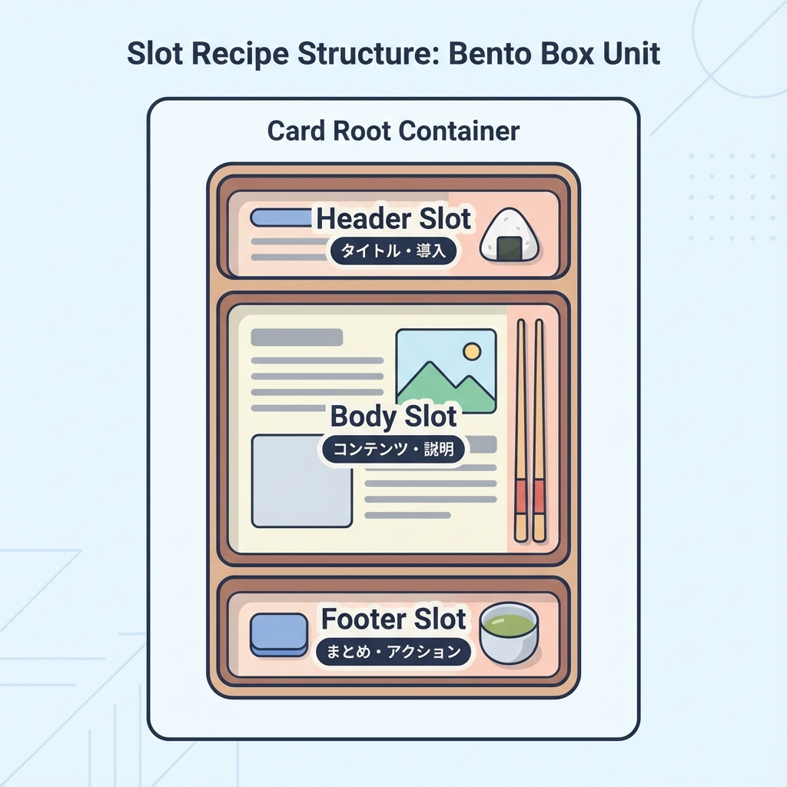
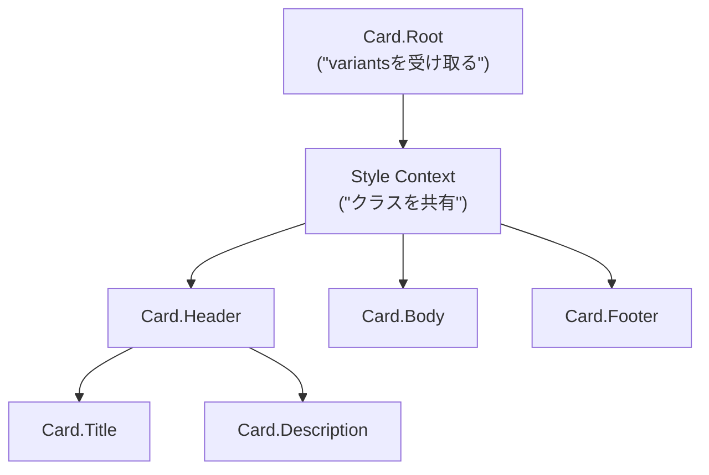

# 第269章：Slot Recipes で複合コンポーネントを作る（Card, Dialog）🍱

この章は「パーツが複数あるUI（CardとかDialogとか）を、**ひとつの“設計図”でまとめてスタイリング**できるようになる」回だよ〜！😊🧁

---

## 1) Slot Recipe ってなに？🧩

**Slot Recipe**は、1つのコンポーネントの中にある複数パーツ（= slots）を、まとめてスタイル定義する仕組みだよ🍱
`slots / base / variants / defaultVariants / compoundVariants` を持てるのが特徴！ ([panda-css.com][1])

さらに `sva()` は「Atomic版のSlot Recipe」を作るショートカット。 ([panda-css.com][1])
しかも、Slot Recipeを作るとPandaが **バリアント組み合わせのCSSを事前生成**してくれる（速さに効く✨） ([panda-css.com][1])

### 図：バリアント → 各slotのclassが一気に出る🪄



---

## 2) ハンズオン①：Card を Slot Recipe + Compound Pattern で作る🃏✨

### 2-1. Slot Recipe を定義する（Config Slot Recipe）🧾

プロジェクト直下に `panda/slot-recipes/` を作って、ここに置く想定でいくね😊

**`panda/slot-recipes/card.ts`**

```ts
import { defineSlotRecipe } from '@pandacss/dev'

export const cardRecipe = defineSlotRecipe({
  className: 'card',
  slots: ['root', 'header', 'body', 'footer', 'title', 'description'],
  base: {
    root: {
      borderWidth: '1px',
      borderColor: 'gray.200',
      borderRadius: 'xl',
      bg: 'white',
      overflow: 'hidden',
    },
    header: { px: '4', pt: '4', pb: '2' },
    body: { px: '4', pb: '4' },
    footer: {
      px: '4',
      py: '3',
      borderTopWidth: '1px',
      borderColor: 'gray.100',
      display: 'flex',
      justifyContent: 'flex-end',
      gap: '2',
    },
    title: { fontWeight: 'semibold', fontSize: 'lg' },
    description: { color: 'gray.600', fontSize: 'sm', mt: '1' },
  },
  variants: {
    variant: {
      solid: { root: { boxShadow: 'sm' } },
      outline: { root: { bg: 'transparent' } },
    },
    size: {
      sm: {
        header: { px: '3', pt: '3', pb: '2' },
        body: { px: '3', pb: '3' },
        footer: { px: '3', py: '2' },
        title: { fontSize: 'md' },
      },
      md: {},
    },
    interactive: {
      true: {
        root: {
          cursor: 'pointer',
          transition: 'box-shadow 0.2s, transform 0.2s',
          _hover: { boxShadow: 'md', transform: 'translateY(-1px)' },
          _active: { transform: 'translateY(0)' },
        },
      },
    },
  },
  defaultVariants: {
    variant: 'solid',
    size: 'md',
  },
})
```

### 2-2. `panda.config.ts` に登録する🧩

Slot Recipeは `theme.extend.slotRecipes` に追加するよ〜！ ([panda-css.com][1])

**`panda.config.ts`（差分イメージ）**

```ts
import { defineConfig } from '@pandacss/dev'
import { cardRecipe } from './panda/slot-recipes/card'

export default defineConfig({
  // ...（既存の設定）
  jsxFramework: 'react',
  theme: {
    extend: {
      slotRecipes: {
        card: cardRecipe,
      },
    },
  },
})
```

### 2-3. codegen する（忘れやすい！）⚙️💦

Config Slot Recipe は、生成物が必要だから `panda codegen` を回すよ〜！ ([panda-css.com][1])

PowerShellで：

```powershell
npx panda codegen
```

---

## 3) Card を “Compound Components” にする（ここが本番💎）




「Rootだけがvariantsを受け取って、子パーツは勝手に同じスタイル文脈を使う」感じにするよ✨


PandaのSlot Recipeページでも、**createStyleContextでCompound Componentsを作る**流れが紹介されてるよ〜！ ([panda-css.com][1])

### 図：Rootがスタイルを配り、子はそれを受け取る📦



### 3-1. Card コンポーネントを作る🧁

**`components/ui/card.tsx`**

```tsx
'use client'

import { createStyleContext } from '@/styled-system/jsx'
import { card, type CardVariants } from '@/styled-system/recipes'

const { withProvider, withContext } = createStyleContext(card)

export type CardProps = CardVariants

export const Card = {
  Root: withProvider('section', 'root'),
  Header: withContext('header', 'header'),
  Body: withContext('div', 'body'),
  Footer: withContext('footer', 'footer'),
  Title: withContext('h3', 'title'),
  Description: withContext('p', 'description'),
}
```

※ `createStyleContext` を `styled-system/jsx` から使う形は、Panda系の実装例でもよく出てくるよ（Park UIの例とか） ([Park UI][2])

### 3-2. 使ってみる（ページ）🎉

**`app/panda/card/page.tsx`**

```tsx
import { css } from '@/styled-system/css'
import { Card } from '@/components/ui/card'

export default function Page() {
  return (
    <main className={css({ p: '6', display: 'grid', gap: '6' })}>
      <Card.Root variant="solid" size="md" interactive>
        <Card.Header>
          <Card.Title>Cardできた〜！🥳</Card.Title>
          <Card.Description>Rootだけでvariantsを管理できるよ✨</Card.Description>
        </Card.Header>

        <Card.Body>
          <ul className={css({ pl: '5', listStyle: 'disc', display: 'grid', gap: '1' })}>
            <li>slotごとにスタイル定義できる🍱</li>
            <li>Header/Body/Footerが勝手に揃う🪄</li>
          </ul>
        </Card.Body>

        <Card.Footer>
          <button
            className={css({
              px: '3',
              py: '2',
              borderRadius: 'md',
              bg: 'gray.900',
              color: 'white',
              _hover: { bg: 'gray.800' },
            })}
          >
            了解👍
          </button>
        </Card.Footer>
      </Card.Root>
    </main>
  )
}
```

---

## 4) ハンズオン②：Dialog（モーダル）も Slot Recipe で整える🪟✨

Dialogは「開閉・フォーカス管理・Escで閉じる」みたいなアクセシビリティが難しめ💦
なので **ロジックはArk UIに任せて、見た目はPandaで作る**のがめちゃ楽だよ😊
Ark UIは“unstyledでアクセシブルな部品”を提供してくれるやつ！ ([GitHub][3])

### 4-1. Ark UI を入れる📦

```powershell
npm install @ark-ui/react
```

（Ark UI公式のインストール案内にあるよ） ([GitHub][3])

---

## 5) Dialog の Slot Recipe を作る🧾✨

Park UIのDialog例だと、`dialogAnatomy` でslot一覧を作って、さらに `header/body/footer` を足してるよ（このやり方が超便利！） ([Park UI][2])

**`panda/slot-recipes/dialog.ts`**

```ts
import { defineSlotRecipe } from '@pandacss/dev'
import { dialogAnatomy } from '@ark-ui/react/anatomy'

export const dialogRecipe = defineSlotRecipe({
  className: 'dialog',
  slots: dialogAnatomy.extendWith('header', 'body', 'footer').keys(),
  base: {
    backdrop: {
      background: 'black.a7',
      position: 'fixed',
      inset: 0,
    },
    positioner: {
      position: 'fixed',
      inset: 0,
      display: 'flex',
      alignItems: 'center',
      justifyContent: 'center',
      p: '6',
    },
    content: {
      bg: 'white',
      borderRadius: 'xl',
      boxShadow: 'xl',
      width: '100%',
      maxW: 'md',
      position: 'relative',
      overflow: 'hidden',
    },
    header: { px: '5', pt: '5', pb: '3', display: 'grid', gap: '1' },
    body: { px: '5', pb: '5' },
    footer: {
      px: '5',
      py: '4',
      borderTopWidth: '1px',
      borderColor: 'gray.100',
      display: 'flex',
      justifyContent: 'flex-end',
      gap: '2',
    },
    title: { fontWeight: 'semibold', fontSize: 'lg' },
    description: { color: 'gray.600', fontSize: 'sm' },
    closeTrigger: {
      position: 'absolute',
      top: '3',
      insetEnd: '3',
      borderRadius: 'md',
      px: '2',
      py: '1',
      _hover: { bg: 'gray.100' },
    },
    trigger: {
      borderRadius: 'md',
      px: '3',
      py: '2',
      bg: 'gray.900',
      color: 'white',
      _hover: { bg: 'gray.800' },
    },
  },
  variants: {
    size: {
      sm: { content: { maxW: 'sm' } },
      md: { content: { maxW: 'md' } },
      lg: { content: { maxW: 'lg' } },
    },
    placement: {
      center: { positioner: { alignItems: 'center' } },
      top: { positioner: { alignItems: 'flex-start', pt: '12' } },
    },
  },
  defaultVariants: {
    size: 'md',
    placement: 'center',
  },
})
```

`panda.config.ts` に追加（Cardと同じ要領）：

```ts
import { dialogRecipe } from './panda/slot-recipes/dialog'

export default defineConfig({
  // ...
  theme: {
    extend: {
      slotRecipes: {
        card: cardRecipe,
        dialog: dialogRecipe,
      },
    },
  },
})
```

そして：

```powershell
npx panda codegen
```

---

## 6) Dialog コンポーネントを作る（Ark UI × createStyleContext）🪄

Park UIのDialog例みたいに、`createStyleContext(dialog)` から `withRootProvider / withContext` を作ってつなぐよ！ ([Park UI][2])

**`components/ui/dialog.tsx`**

```tsx
'use client'

import { Dialog as ArkDialog } from '@ark-ui/react/dialog'
import { Portal } from '@ark-ui/react/portal'
import { ark } from '@ark-ui/react/factory'
import { createStyleContext } from '@/styled-system/jsx'
import { dialog } from '@/styled-system/recipes'

const { withRootProvider, withContext } = createStyleContext(dialog)

export const Dialog = {
  Root: withRootProvider(ArkDialog.Root, {
    defaultProps: { unmountOnExit: true, lazyMount: true },
  }),
  Trigger: withContext(ArkDialog.Trigger, 'trigger'),
  Backdrop: withContext(ArkDialog.Backdrop, 'backdrop'),
  Positioner: withContext(ArkDialog.Positioner, 'positioner'),
  Content: withContext(ArkDialog.Content, 'content'),
  Title: withContext(ArkDialog.Title, 'title'),
  Description: withContext(ArkDialog.Description, 'description'),
  CloseTrigger: withContext(ArkDialog.CloseTrigger, 'closeTrigger'),

  Header: withContext(ark.div, 'header'),
  Body: withContext(ark.div, 'body'),
  Footer: withContext(ark.div, 'footer'),

  Portal,
}
```

---

## 7) Dialog を使ってみる（デモ）🎬✨

**`app/panda/dialog/DialogDemo.tsx`**

```tsx
'use client'

import { Dialog } from '@/components/ui/dialog'

export function DialogDemo() {
  return (
    <Dialog.Root size="md" placement="center">
      <Dialog.Trigger>開くよ〜🪟</Dialog.Trigger>

      <Dialog.Portal>
        <Dialog.Backdrop />
        <Dialog.Positioner>
          <Dialog.Content>
            <Dialog.Header>
              <Dialog.Title>確認だよ🫶</Dialog.Title>
              <Dialog.Description>Slot Recipeで見た目が揃うよ✨</Dialog.Description>
            </Dialog.Header>

            <Dialog.Body>
              <p>ここに説明文やフォームが入るイメージだよ😊</p>
            </Dialog.Body>

            <Dialog.Footer>
              <Dialog.CloseTrigger>閉じる🙆‍♀️</Dialog.CloseTrigger>
            </Dialog.Footer>
          </Dialog.Content>
        </Dialog.Positioner>
      </Dialog.Portal>
    </Dialog.Root>
  )
}
```

**`app/panda/dialog/page.tsx`**

```tsx
import { css } from '@/styled-system/css'
import { DialogDemo } from './DialogDemo'

export default function Page() {
  return <main className={css({ p: '6' })}><DialogDemo /></main>
}
```

Ark UIのDialogはこういう構造（Root/Trigger/Backdrop/Positioner/Content…）で組むよ、ってGitHubの例にもあるよ〜！ ([GitHub][3])

---

## 8) よくあるハマりどころ🧯😵‍💫

* `npx panda codegen` 忘れた → `styled-system/recipes` に `card` / `dialog` が出てこない💦 ([panda-css.com][1])
* slot名のタイポ → そのパーツだけスタイル当たらない😵‍💫
* Dialogが後ろに隠れる → `Portal` を使ってレイヤーを分離すると安心🙆‍♀️（Park UI例でもPortal構成が出てくるよ） ([Park UI][2])

---

## 9) ミニ課題🎓✨（5〜10分）

1. **Card**に `tone: "normal" | "accent"` を追加して、`accent` だけ枠色を変えてみよ〜🎨
2. **Dialog**に `size="sm" / "lg"` を渡して、幅が変わるのを確認してみよ〜📐

---

次の章（第270章）は **Patterns（Stack/Grid）でレイアウトを“組み立てやすくする”**回だよ〜！📐✨

[1]: https://panda-css.com/docs/concepts/slot-recipes "Slot Recipes | Panda CSS - Panda CSS"
[2]: https://park-ui.com/docs/components/dialog "Dialog | Park UI"
[3]: https://github.com/chakra-ui/ark "GitHub - chakra-ui/ark: Build scalable design systems with React, Vue, Solid, and Svelte."
