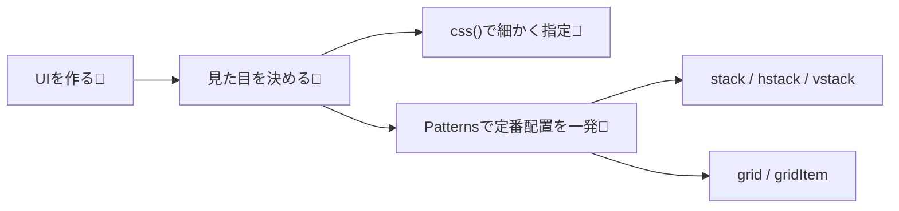
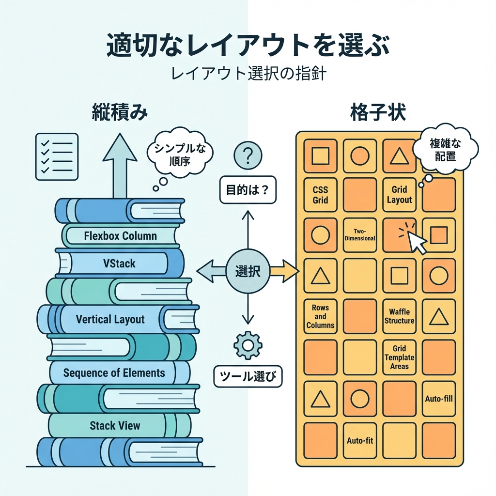
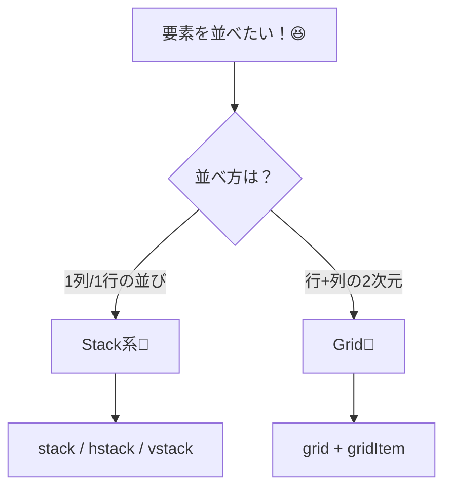

# 第270章：Patterns でレイアウトを組む（Stack, Grid）📐

この章は「**よくあるレイアウト**を、Panda CSS の **Patterns** でサクッと組めるようになる回」だよ〜🥳
Stack と Grid が使えると、ページの見た目づくりが一気にラクになるよ💖

---

## 今日のゴール🎯✨

* `stack / hstack / vstack` で「縦・横に並べる」を秒速でできる😆
* `grid / gridItem` で「カード一覧」みたいなレイアウトを綺麗に作れる🧁
* ついでに **レスポンシブ**（スマホ→PC）もそれっぽくできる📱➡️💻

---

## Patternsってなに？（超ざっくり）🧠✨

Patterns は、**レイアウトの定番セット**を関数（or JSX）で呼べる仕組みだよ〜📦
例えば `stack()` は「flexで縦並び＋gap」みたいな “いつものやつ” をまとめてくれる感じ！
（Panda には `stack / hstack / vstack / grid` などの Patterns が最初から入ってるよ） ([panda-css.com][1])



---

## 1) Stack系：縦・横に並べる最短ルート🚀💕

### Stackで覚える4つだけ🫶

`stack()` は主にこの4つが超重要だよ👇

* `direction`：縦か横か（デフォルトは縦）
* `gap`：スキマ
* `align`：縦横どっちに揃える？（`align-items`）
* `justify`：余ったスペースをどう使う？（`justify-content`） ([panda-css.com][1])

---

### ✅ 例1：カードを縦に並べる（stack）🧁✨

`app/ch270/page.tsx` を作って、まずは表示してみよ〜！😍

```tsx
import { css } from 'styled-system/css'
import { container, stack } from 'styled-system/patterns'

const card = css({
  p: '4',
  borderWidth: '1px',
  rounded: 'lg',
})

export default function Page() {
  return (
    <main className={container({ py: '10' })}>
      <h1 className={css({ fontSize: '2xl', fontWeight: 'bold', mb: '6' })}>
        Chapter 270 🎀 Patternsでレイアウト！
      </h1>

      <section className={stack({ gap: '4' })}>
        <div className={card}>カード1 🐣</div>
        <div className={card}>カード2 ✨</div>
        <div className={card}>カード3 🌸</div>
      </section>
    </main>
  )
}
```

ポイント💡

* `stack({ gap: '4' })` だけで「縦に並ぶ＋スキマ」完成🎉
* `stack()` は **patternの指定 + いつものスタイル指定**を一緒に渡せるよ（例：`padding` とか） ([panda-css.com][1])

---

### ✅ 例2：横並び（hstack）＋ “スマホは縦” にする📱➡️💻✨

`hstack()` は「横並び」専用のラッパーだよ〜！ ([panda-css.com][1])
さらにレスポンシブは `base / md` みたいに書ける（モバイルファースト）📱 ([panda-css.com][2])

```tsx
import { css } from 'styled-system/css'
import { stack } from 'styled-system/patterns'

const btn = css({
  px: '4',
  py: '2',
  borderWidth: '1px',
  rounded: 'md',
})

export function ButtonRow() {
  return (
    <div
      className={stack({
        direction: { base: 'column', md: 'row' }, // 👈スマホ縦、md以上で横
        gap: '3',
        align: 'center',
      })}
    >
      <button className={btn}>保存する💾</button>
      <button className={btn}>下書き📝</button>
      <button className={btn}>キャンセル🙅‍♀️</button>
    </div>
  )
}
```

---

## 2) Grid：カード一覧みたいな“面”を作る🧇✨

Grid は「行と列（2次元）」のレイアウトに強いよ〜！
`grid()` は主にこのへんを使うよ👇

* `columns`：列数
* `gap / columnGap / rowGap`：スキマ
* `minChildWidth`：子要素の最小幅（これ以下なら折り返す）※`columns` と一緒に使わない ([panda-css.com][1])

---

### ✅ 例3：カード一覧（grid + minChildWidth）🃏✨

「画面が広いほど横に増える」感じが、超それっぽい🥰

```tsx
import { css } from 'styled-system/css'
import { container, grid } from 'styled-system/patterns'

const card = css({
  p: '4',
  borderWidth: '1px',
  rounded: 'lg',
})

export default function Page() {
  return (
    <main className={container({ py: '10' })}>
      <h2 className={css({ fontSize: 'xl', fontWeight: 'bold', mb: '4' })}>
        サークル一覧🎾🎻📚
      </h2>

      <section className={grid({ minChildWidth: '220px', gap: '4' })}>
        <div className={card}>テニス🎾</div>
        <div className={card}>軽音🎸</div>
        <div className={card}>写真📷</div>
        <div className={card}>ボランティア🫶</div>
        <div className={card}>映画🎬</div>
        <div className={card}>プログラミング💻</div>
      </section>
    </main>
  )
}
```

---

### ✅ 例4：おすすめだけ大きく（gridItem）👑✨

`gridItem({ colSpan: 2 })` みたいに「何列ぶん使う？」ができるよ！ ([panda-css.com][1])

```tsx
import { css } from 'styled-system/css'
import { container, grid, gridItem } from 'styled-system/patterns'

const card = css({
  p: '4',
  borderWidth: '1px',
  rounded: 'lg',
})

export default function Page() {
  return (
    <main className={container({ py: '10' })}>
      <h2 className={css({ fontSize: 'xl', fontWeight: 'bold', mb: '4' })}>
        今日のおすすめ✨
      </h2>

      <section className={grid({ columns: 3, gap: '4' })}>
        <div className={gridItem({ colSpan: 2 })}>
          <div className={card}>🌟注目：学園祭実行委員（でっかく表示）</div>
        </div>

        <div className={card}>バスケ🏀</div>
        <div className={card}>茶道🍵</div>
        <div className={card}>ダンス💃</div>
      </section>
    </main>
  )
}
```

---

## StackとGrid、どっち使う？🤔💭






---

## おまけ：JSXで使いたい人へ（サラッと）🧸✨

Patterns は **JSXコンポーネント**としても使えるよ（`Stack` や `Grid`）
その場合は設定で `jsxFramework` を使う、って話があるよ〜！ ([panda-css.com][1])

---

## よくある「あれ？効かない…」対処💡😵‍💫

* **スタイルが反映されない**：Next.js のキャッシュ都合で `.next` を消すと直ることがあるよ（公式のトラブルシューティングにもある） ([panda-css.com][3])
* **importの補完が弱い**：`tsconfig.json` の `include` に `styled-system` を入れると改善することがあるよ ([panda-css.com][3])

---

## 練習問題（ミニ課題）📝✨

「学科紹介ページ」を作ってみてね🌸

1. `stack()` で、タイトル・説明・ボタンを縦に並べる
2. 下に `grid({ minChildWidth: '240px' })` で「授業カード」を一覧表示
3. `gridItem({ colSpan: 2 })` で「人気授業」だけ目立たせる👑

できたらスクショ撮ってニヤニヤしよ〜😎📸✨

---

## まとめ🎉💖

* **Stack**：縦/横の並びはこれ！`gap` と `direction` が命🧁
* **Grid**：カード一覧や“面レイアウト”はこれ！`minChildWidth` が便利🧇
* Patternsは「定番レイアウトの省エネ装置」だから、使うほど気持ちよくなるよ〜🥳🐼

次の章（Design Tokens & Theming）に進む準備、バッチリだね🎨✨

[1]: https://panda-css.com/docs/concepts/patterns "Patterns | Panda CSS - Panda CSS"
[2]: https://panda-css.com/docs/concepts/responsive-design "Responsive Design | Panda CSS - Panda CSS"
[3]: https://panda-css.com/docs/installation/nextjs "Using Next.js | Panda CSS - Panda CSS"
