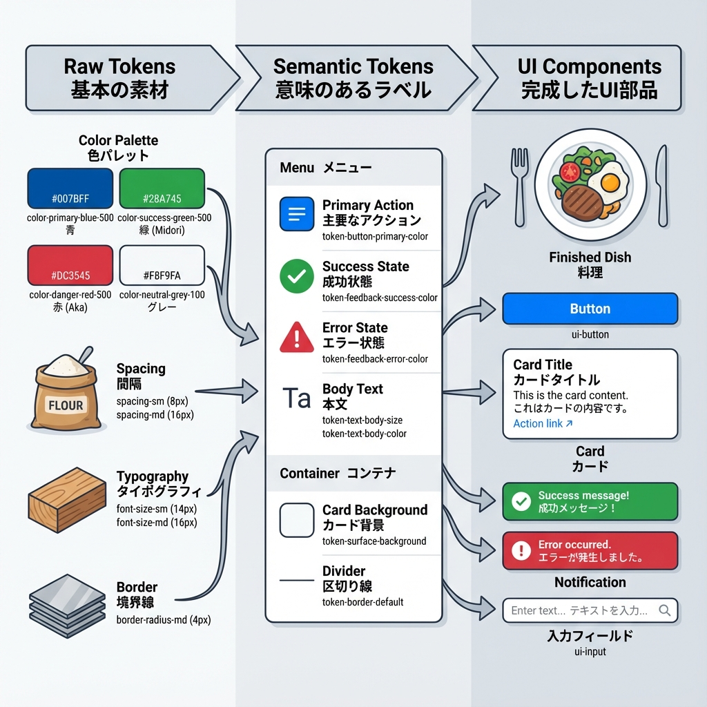
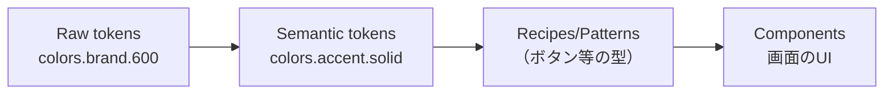
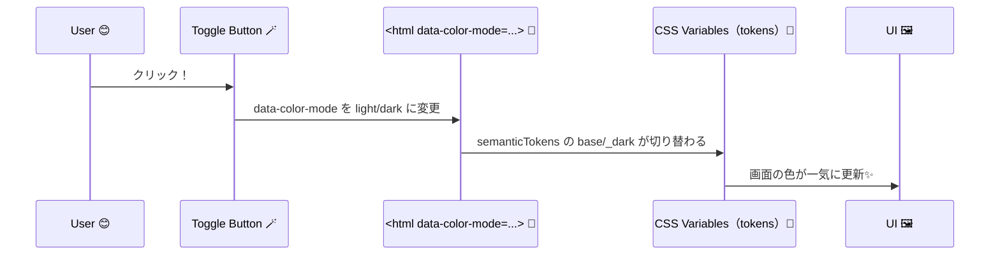

# 第271章：Design Tokens と Theming（色はこう管理する）🎨

今日は **「色を“センス”じゃなく“ルール”で管理する方法」** をやるよ〜！😊
Panda CSS の **tokens / semanticTokens** を使うと、あとからテーマ変更しても地獄になりません🫶✨ ([panda-css.com][1])

---

## 1) まずは超イメージ：色を“2段階”で考える🎨➡️🏷️

* **Raw tokens（生のトークン）**：色パレットそのもの（例：`colors.brand.600`）
* **Semantic tokens（意味トークン）**：用途の名前（例：`colors.accent.solid` / `colors.bg.canvas`）

「ボタンの色＝brand.600」みたいに直書きすると後で変更が大変…🥲
「ボタンの色＝accent.solid」って意味で書くと、裏で色を差し替えるだけで済むよ〜✨ ([panda-css.com][1])




### 図でみる（トークンの重なり）🧁



---

## 2) 重要ルール：`value` を忘れないでね⚠️

Panda のトークンは **必ず `value` キーの中に入れる** ルールがあるよ！🫡 ([panda-css.com][1])

---

## 3) 実装：`panda.config.ts` に「色パレット」と「意味トークン」を作る🛠️🎨

### ✅ 例：brand パレット（Raw tokens）＋ bg/fg/accent（Semantic tokens）

* Semantic token の参照は `{}` で書くよ（例：`{colors.brand.600}`）✨ ([panda-css.com][1])
* さらに `base` / `_dark` で **ダーク時の値**を分けられるよ🌙 ([panda-css.com][1])
* `_dark` を使うために、`conditions.dark` を用意しておくのがコツ！🧩 ([panda-css.com][2])

```ts
// panda.config.ts
import { defineConfig } from '@pandacss/dev'

export default defineConfig({
  preflight: true,
  include: ['./app/**/*.{ts,tsx,js,jsx}', './src/**/*.{ts,tsx,js,jsx}'],
  exclude: [],
  outdir: 'styled-system',

  // 🌙☀️ カラーモード（自分で切り替える用）
  conditions: {
    light: '[data-color-mode=light] &',
    dark: '[data-color-mode=dark] &',
  },

  theme: {
    extend: {
      // ① Raw tokens（色パレット）
      tokens: {
        colors: {
          brand: {
            50: { value: '#eff6ff' },
            100: { value: '#dbeafe' },
            200: { value: '#bfdbfe' },
            300: { value: '#93c5fd' },
            400: { value: '#60a5fa' },
            500: { value: '#3b82f6' },
            600: { value: '#2563eb' },
            700: { value: '#1d4ed8' },
            800: { value: '#1e40af' },
            900: { value: '#1e3a8a' },
          },
        },
      },

      // ② Semantic tokens（意味で使う色）
      semanticTokens: {
        colors: {
          bg: {
            canvas: {
              value: { base: '{colors.white}', _dark: '{colors.gray.900}' },
            },
            subtle: {
              value: { base: '{colors.gray.50}', _dark: '{colors.gray.800}' },
            },
          },

          fg: {
            default: {
              value: { base: '{colors.gray.900}', _dark: '{colors.gray.50}' },
            },
            muted: {
              value: { base: '{colors.gray.600}', _dark: '{colors.gray.400}' },
            },
          },

          accent: {
            solid: {
              value: { base: '{colors.brand.600}', _dark: '{colors.brand.400}' },
            },
            subtle: {
              value: { base: '{colors.brand.50}', _dark: '{colors.brand.900}' },
            },
          },

          border: {
            value: { base: '{colors.gray.200}', _dark: '{colors.gray.700}' },
          },
        },
      },
    },
  },
})
```

---

## 4) Next.js 側：`data-color-mode` を切り替えられるようにする🌙☀️

### 4-1) ちらつき防止の“小さいスクリプト”を head に置く🧠✨

```tsx
// app/theme/color-mode-script.tsx
export function ColorModeScript() {
  const code = `
(() => {
  try {
    const key = 'color-mode';
    const saved = localStorage.getItem(key);
    const mode = saved === 'dark' ? 'dark' : 'light';
    document.documentElement.dataset.colorMode = mode; // -> data-color-mode
  } catch (e) {}
})();`
  return <script dangerouslySetInnerHTML={{ __html: code }} />
}
```

```tsx
// app/layout.tsx
import './globals.css'
import { ColorModeScript } from './theme/color-mode-script'

export default function RootLayout({ children }: { children: React.ReactNode }) {
  return (
    <html lang="ja" suppressHydrationWarning>
      <head>
        <ColorModeScript />
      </head>
      <body>{children}</body>
    </html>
  )
}
```

---

### 4-2) トグルボタン（Client Component）を作る🪄

```tsx
// app/components/ColorModeToggle.tsx
'use client'

import { useEffect, useState } from 'react'
import { css } from '../../styled-system/css'

type Mode = 'light' | 'dark'

export function ColorModeToggle() {
  const [mode, setMode] = useState<Mode>('light')

  useEffect(() => {
    const current = (document.documentElement.dataset.colorMode as Mode | undefined) ?? 'light'
    setMode(current)
  }, [])

  const toggle = () => {
    const next: Mode = mode === 'dark' ? 'light' : 'dark'
    document.documentElement.dataset.colorMode = next
    localStorage.setItem('color-mode', next)
    setMode(next)
  }

  return (
    <button
      onClick={toggle}
      className={css({
        paddingX: '4',
        paddingY: '2',
        borderRadius: 'md',
        bg: 'accent.subtle',
        color: 'fg.default',
        borderWidth: '1px',
        borderColor: 'border',
        _hover: { bg: 'accent.solid', color: 'bg.canvas' },
      })}
    >
      {mode === 'dark' ? '🌙 ダーク' : '☀️ ライト'}
    </button>
  )
}
```

---

## 5) 使ってみる：semanticTokens だけで画面を塗る🎨✨

```tsx
// app/page.tsx
import { css } from '../styled-system/css'
import { ColorModeToggle } from './components/ColorModeToggle'

export default function Page() {
  return (
    <main
      className={css({
        minHeight: '100vh',
        bg: 'bg.canvas',
        color: 'fg.default',
        padding: '8',
      })}
    >
      <div className={css({ display: 'flex', justifyContent: 'flex-end' })}>
        <ColorModeToggle />
      </div>

      <h1 className={css({ fontSize: '2xl', fontWeight: 'bold', marginTop: '8' })}>
        Panda Tokens 🎨🐼
      </h1>
      <p className={css({ color: 'fg.muted', marginTop: '2' })}>
        色の変更は「トークンの定義」だけでOKだよ〜😊✨
      </p>

      <section
        className={css({
          marginTop: '6',
          padding: '6',
          bg: 'bg.subtle',
          borderWidth: '1px',
          borderColor: 'border',
          borderRadius: 'xl',
        })}
      >
        <h2 className={css({ fontSize: 'xl', fontWeight: 'semibold' })}>カードだよ📦</h2>

        <button
          className={css({
            marginTop: '4',
            paddingX: '4',
            paddingY: '2',
            borderRadius: 'md',
            bg: 'accent.solid',
            color: 'bg.canvas',
            _hover: { opacity: 0.9 },
          })}
        >
          いい感じボタン✨
        </button>
      </section>
    </main>
  )
}
```

---

## 6) 最後のひと押し：反映されない時のチェック✅🔁

### ✅ コード生成（Panda）を走らせる

`package.json` に `prepare: "panda codegen"` を入れるのが定番だよ〜（入ってる前提でもOK！） ([panda-css.com][3])

* 依存追加・トークン変更後：`npm run prepare`
* 監視で回したい：`npx panda --watch`（CLI運用の場合） ([panda-css.com][4])

```bash
npm run prepare
```

### ✅ `globals.css` の先頭にこれある？

Panda を PostCSS 経由で使う場合、ルートCSSに layers が必要だよ〜🧁 ([panda-css.com][3])

```css
@layer reset, base, tokens, recipes, utilities;
```

---

## 7) 図で納得：なぜ“切り替わる”の？🔁🎨



---

## 8) ミニ練習（5分）⏳✨

1. `semanticTokens.colors.accent.solid` を **別の brand 値**に変えてみる（例：`brand.700`）🎨
2. `bg.subtle` をもう少し濃く/薄くしてみる☁️
3. ボタンをもう1個作って、`accent.subtle` で“ふわっ”とした見た目にしてみる🫧

---

### 今日のまとめ🎯💖

* **Raw tokens**：色パレット（素材）
* **Semantic tokens**：意味（用途）で使う（実戦向き）
* テーマ変更は **semanticTokens を差し替えるだけ**にすると勝ち🏆✨ ([panda-css.com][1])

次の章（第272章）では、Panda の **JSX Style Props（`<Box p={4} />` 的なやつ）** を「使う？使わない？」まで含めて整理するよ〜🤔🧩

[1]: https://panda-css.com/docs/theming/tokens "Tokens | Panda CSS - Panda CSS"
[2]: https://panda-css.com/docs/guides/multiple-themes "Multi-Theme Tokens | Panda CSS - Panda CSS"
[3]: https://panda-css.com/docs/installation/postcss "Using PostCSS | Panda CSS - Panda CSS"
[4]: https://panda-css.com/docs/installation/cli "Panda CLI | Panda CSS - Panda CSS"
