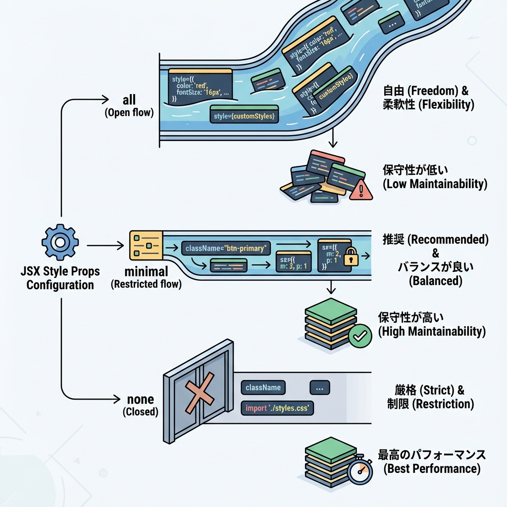
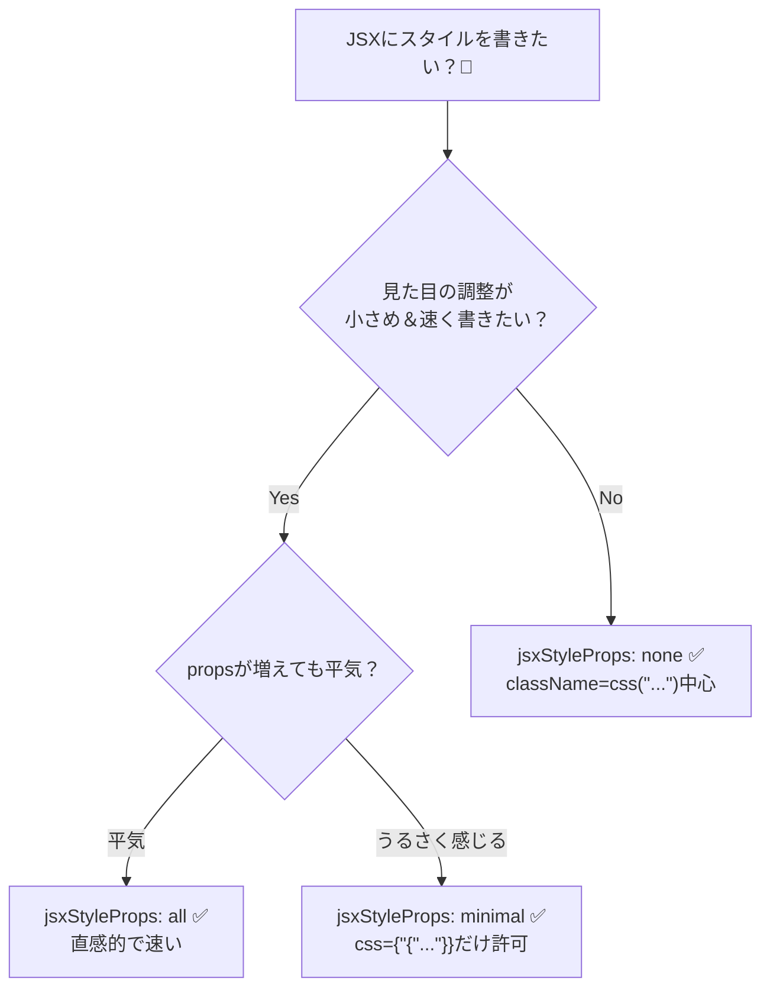

# 第272章：JSX Style Props の是非と設定（`<Box p={4} />`）🤔

この章では「JSXにスタイルを“props”として書けるやつ（JSX Style Props）」を、**使う？使わない？**をちゃんと判断できるようにして、**設定まで終わらせる**よ〜！🫶💫
（Panda CSS の話だよ🐼）

---

### 今日のゴール🎯✨

* JSX Style Props が何か、ふんわりじゃなく理解する🧠
* 「便利だけど、どこが危ない？」を知る⚠️
* `jsxStyleProps` を **all / minimal / none** で切り替えられるようになる🔧
* `<Box p="4" />`（みたいな）書き方を動かす🏃‍♀️💨

---

## 1) JSX Style Propsってなに？🧩✨

ざっくり言うと、こういうやつ👇

* className で書くスタイル（いつもの）
* **props で書くスタイル（今回）**

Panda は JSX を静的解析して、**ビルド時にCSSを生成**してくれるんだよ〜🐼🧵
ただし、**JSX Style Props はデフォルトOFF**で、使うなら `jsxFramework` の設定が必要だよ⚙️✨ ([panda-css.com][1])

---

## 2) 使う？使わない？ざっくり判断チャート🧭💖






---

## 3) `jsxStyleProps` って何が変わるの？🎛️🐼

`jsxStyleProps` は「生成されたJSXコンポーネントで、どれだけスタイルpropsを許すか」を決める設定だよ✨
`all / minimal / none` の3つがあるよ〜！ ([panda-css.com][2])

### ✅ all（いっぱい書ける！楽しい！）

```tsx
import { Box } from "../styled-system/jsx";

export default function Page() {
  return <Box p="4" bg="blue.100" rounded="lg">Hello 🐼</Box>;
}
```

### ✅ minimal（propsごちゃごちゃ対策！`css` だけ許可）

```tsx
import { Box } from "../styled-system/jsx";

export default function Page() {
  return (
    <Box css={{ padding: "4", backgroundColor: "blue.100", borderRadius: "lg" }}>
      Hello 🐼
    </Box>
  );
}
```

### ✅ none（JSX Style Props を封印！className派）

`none` だと、`<styled.div />` や `styled("div")` みたいな “JSXスタイルprops前提” の使い方ができなくなるよ〜（レシピはOK） ([panda-css.com][2])

```tsx
import { css } from "../styled-system/css";

export default function Page() {
  return <div className={css({ p: "4", bg: "blue.100", rounded: "lg" })}>Hello 🐼</div>;
}
```

---

## 4) じゃあ設定しよっか！⚙️✨（Next.js）

### 手順①：`panda.config.ts` に `jsxFramework` を入れる✅

JSX Style Props を抽出してほしいなら、これが必須だよ〜！ ([panda-css.com][1])

```ts
import { defineConfig } from "@pandacss/dev";

export default defineConfig({
  // ...（他の設定は省略OK）
  jsxFramework: "react",

  // 第272章の主役👇
  // 好みで all / minimal / none を選ぼう✨
  jsxStyleProps: "all",
});
```

### 手順②：codegen を走らせる🏃‍♀️💨

`jsxFramework` を設定したら、JSX用のランタイム生成が必要だよ〜！ ([panda-css.com][1])

```bash
npm panda codegen --clean
```

### 手順③：もし「スタイル当たらない😭」ってなったら…

Next.js 側のキャッシュで「PostCSSで作ったCSSが反映されない」ことがあるので、`.next` を消して再起動してね🧹✨ ([panda-css.com][3])

PowerShell なら👇

```powershell
Remove-Item -Recurse -Force .next
npm run dev
```

---

## 5) `<Box p="4" />` の正体を知ろう🪄📦

`Box` は「追加スタイルなしの基本箱」で、**JSXでスタイルpropsを書けるようにするための存在**って感じ！
Panda の Patterns の一つとして用意されてるよ🐼📦 ([panda-css.com][4])

```tsx
import { Box } from "../styled-system/jsx";

export default function Page() {
  return (
    <Box p="4" bg="gray.50" rounded="xl">
      箱だよ〜📦✨
    </Box>
  );
}
```

> ちなみに `p` は `padding` のショートハンドだよ🧁（他にも `bg`, `rounded` とかいっぱい） ([panda-css.com][5])
> 値は例では `"4"` みたいに文字列で書くのが基本だよ〜🧷 ([panda-css.com][6])

---

## 6) よくある「詰まり」ポイント集😵‍💫➡️😆

### ❌ 1) `jsxFramework` 入れてない

→ JSXから style props を抽出しないよ！って明確に書かれてるやつ⚠️ ([panda-css.com][1])

### ❌ 2) “実行時に作った値” をstyle propsに入れすぎ

Panda は静的解析だから、「ぱっと見で分からない値」は苦手💦（動的すぎるとCSS生成できないことがある） ([panda-css.com][7])

### ❌ 3) props名を勝手に付け替える（地味に罠）

「`size` を `circleSize` に変えて中で渡す」みたいなの、Pandaは追えないよ〜って注意があるよ⚠️ ([panda-css.com][1])

---

## 7) 章末ミニ課題🎓✨（5分でOK！）

1. `jsxStyleProps` を **all → minimal** に変える🔁
2. さっきの `Box` を、**style props直書き → `css={{...}}`** に書き換える✍️
3. 「propsの行数が減ってスッキリした？」を体感する👀💕

---

## まとめ🎀🐼

* JSX Style Props は便利だけど、**propsが増えやすい**のが弱点🤏
* `jsxStyleProps` はチームの好みで決めてOK✨（all / minimal / none）([panda-css.com][2])
* `<Box />` は「JSXでスタイルpropsを気持ちよく書くための箱」📦 ([panda-css.com][4])
* まず迷ったら：**allで始めて→育ってきたらminimal** が気持ちいいこと多いよ〜🌱➡️🌳💖

[1]: https://panda-css.com/docs/concepts/style-props "Style props | Panda CSS - Panda CSS"
[2]: https://panda-css.com/docs/references/config "Configuring Panda | Panda CSS - Panda CSS"
[3]: https://panda-css.com/docs/installation/nextjs "Using Next.js | Panda CSS - Panda CSS"
[4]: https://panda-css.com/docs/concepts/patterns "Patterns | Panda CSS - Panda CSS"
[5]: https://panda-css.com/docs/concepts/writing-styles?utm_source=chatgpt.com "Writing Styles"
[6]: https://panda-css.com/docs/utilities/spacing?utm_source=chatgpt.com "Spacing"
[7]: https://panda-css.com/docs/guides/dynamic-styling?utm_source=chatgpt.com "Dynamic styling"
