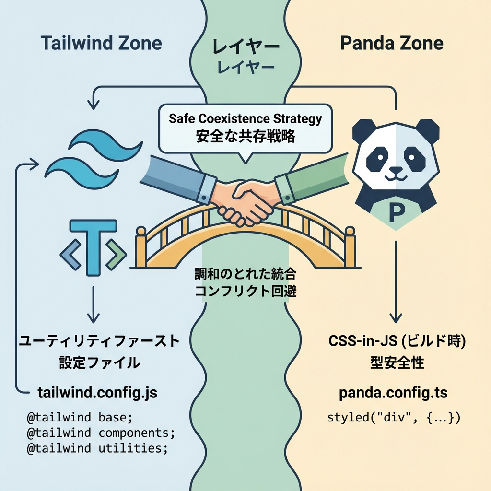
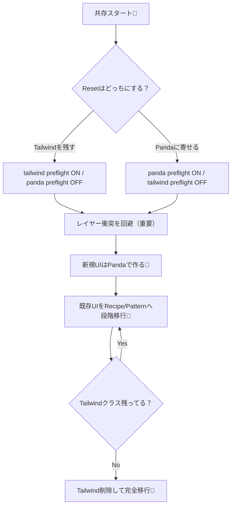

# 第273章：Tailwind からの移行/共存戦略⚔️

この章は「**Tailwind を捨てずに（いったん）Panda CSS を入れて、ケンカせず共存させる**」→「**じわじわ移行して最終的に整理する**」の作戦会議だよ〜！😊✨

---

## 1) 今日のゴール🎯💡

* Tailwind と Panda を **同じプロジェクトで共存**できるようにする🤝
* **CSSの衝突（上書き事故）**を避ける設定を入れる🧯
* 移行の進め方（段階プラン）を作る🗺️

---

## 2) まず結論：共存の「3原則」✅✨

1. **CSS Layers（@layer）の名前がぶつからないようにする**
   Tailwind と Panda はどっちもレイヤーを使うので、名前が被ると上書きが予測不能になりがちだよ〜⚠️ ([Medium][1])

2. **Preflight（Reset CSS）は “どっちか片方” にする**
   2つのリセットが混ざると「え、なんでボーダー色変わった？」みたいな事故が起きやすい🥲 ([GitHub][2])

3. **移行中は“逃げ道”を用意する**
   Pandaで作ったコンポーネントに `className` を足せるようにして、Tailwindで微調整できると安心😌（あとで消せる）

---

## 3) 移行の全体像（図解）🗺️✨






---

## 4) 共存の実装：ここが最重要⚙️🔥

### 4-1) PostCSS の設定（Tailwind + Panda を同居）🧪

Next.js は PostCSS を使うので、**Tailwind → Panda → Autoprefixer** の順に並べるのが定番ルートだよ🧩 ([Medium][1])

```js
// postcss.config.cjs
module.exports = {
  plugins: [
    require("tailwindcss"),
    require("@pandacss/dev/postcss"),
    require("autoprefixer"),
  ],
};
```

---

### 4-2) 「レイヤー名の衝突」を回避する（超重要）💥

Panda は `@layer reset, base, tokens, recipes, utilities;` みたいにレイヤー宣言を使うよね🐼 ([Panda CSS][3])
でも Tailwind も `base / components / utilities` を使うから、**utilities や base がぶつかりやすい**の🥺 ([Medium][1])

なので、Panda 側のレイヤー名を **別名にする**のが安全策✨（Pandaはレイヤー名をリネーム可能） ([GitHub][2])

```ts
// panda.config.ts（例：レイヤー名をTailwindと被らないように）
import { defineConfig } from "@pandacss/dev";

export default defineConfig({
  // ほかの設定は既存のままでOK
  layers: {
    reset: "reset-panda",
    base: "base-panda",
    tokens: "tokens-panda",
    recipes: "recipes-panda",
    utilities: "utilities-panda",
  },
});
```

そして、`app/globals.css`（またはルートCSS）にこう書く👇

```css
/* app/globals.css */

/* Tailwind */
@tailwind base;
@tailwind components;
@tailwind utilities;

/* Panda（レイヤー順の宣言） */
@layer reset-panda, base-panda, tokens-panda, recipes-panda, utilities-panda;
```

これで「同じ layer 名に混ざって上書き事故」が起きにくくなるよ〜🧯✨ ([Medium][1])

---

### 4-3) Reset（Preflight）は片方だけにする🧼⚠️

どっちを残すかは好みだけど、迷ったらこう👇

* **Tailwindをまだ大量に使ってる** → Tailwind preflight を残す（PandaをOFF）
* **Pandaに寄せていく方針** → Panda preflight を残す（TailwindをOFF）

Panda側をOFFにする例（超シンプル）：

```ts
// panda.config.ts
import { defineConfig } from "@pandacss/dev";

export default defineConfig({
  preflight: false,
});
```

「2つのpreflightはいらないよね」っていう話も、メンテナさんが言及してるよ🫶 ([GitHub][2])

---

## 5) “共存しながら移行” のやり方（おすすめ順）🪜✨

### ステップA：新規コンポーネントだけ Panda にする🐼

既存は Tailwind のままでもOK。まず増えるのは Panda のほう、って感じ。

### ステップB：Button / Card / Input みたいな「部品」を Recipe 化🧩

Tailwindの塊（長いclassName）を **レシピ（variants）** にすると一気に読みやすくなる✨

### ステップC：ページ全体のレイアウトは Pattern に寄せる📐

Stack / Grid みたいな **“箱の組み立て”** はパターンにすると強い！

### ステップD：Tailwind を削除（最後に）🧹

VSCode検索で `className="` を追いかけて、残りをゼロにしたら卒業🎓🎉

---

## 6) ハンズオン：TailwindのButtonを「Panda＋逃げ道」へ🛠️💕

### 6-1) いままで（Tailwind）🌪️

```tsx
export function Button() {
  return (
    <button className="px-4 py-2 rounded-md bg-blue-600 text-white hover:bg-blue-700">
      送信する
    </button>
  );
}
```

### 6-2) 移行中（Pandaが本体、Tailwindは“追加できる”）🐼✨

`cx` は Panda の公式ユーティリティで、className を安全に結合できるよ〜🧩 ([Panda CSS][4])

```tsx
import { css, cx } from "styled-system/css";

type Props = {
  children: React.ReactNode;
  className?: string; // ← 逃げ道✨（移行中だけ使うイメージ）
};

const baseButton = css({
  px: "4",
  py: "2",
  borderRadius: "md",
  fontWeight: "600",
  backgroundColor: "rgb(37 99 235)", // いったん固定値でもOK（あとでtokensへ）
  color: "white",
  _hover: { backgroundColor: "rgb(29 78 216)" },
});

export function Button({ children, className }: Props) {
  return <button className={cx(baseButton, className)}>{children}</button>;
}
```

使う側はこう👇（移行中の救命ボート🚤）

```tsx
<Button className="shadow-md">送信する</Button>
```

この「**Pandaが基本・Tailwindは補助**」にしておくと、移行がめっちゃ楽になるよ〜😆✨

---

## 7) よくある詰まりポイント🧯💦

* **「スタイル反映されない…」**
  Next.js が PostCSS 生成物をキャッシュすることがあるので、`.next` を消して再起動すると直ることがあるよ🌀 ([Panda CSS][5])

* **「Tailwindの見た目が急に変」or「Pandaが負ける」**
  レイヤー衝突 or reset二重が原因になりがち！
  → この章の **レイヤー名リネーム** と **preflight片方化** を確認してね⚔️ ([GitHub][2])

* **「`styled-system` の補完が出ない」**
  `tsconfig.json` に `styled-system` を含めると改善することがあるよ🧠 ([Panda CSS][5])

---

## 8) まとめ📌💖

* 共存で一番大事なのは **レイヤー衝突を避ける**こと⚔️
* **Resetは片方だけ**にして事故を減らす🧼
* 移行中は `className` で **逃げ道**を作って、段階的にPandaへ🐼✨

次の第274章（コンポーネントカタログ）では、いま作った部品たちを増やして「見本帳」みたいに並べていくよ📖🎀

[1]: https://medium.com/%40masoudit/resolving-tailwindcss-and-pandacss-layer-conflicts-20c5053231d2 "Resolving TailwindCSS and PandaCSS Layer Conflicts | by MasoudIt | Medium"
[2]: https://github.com/chakra-ui/panda/discussions/1411 "How are you guys using panda css and tailwind css together? · chakra-ui panda · Discussion #1411 · GitHub"
[3]: https://panda-css.com/docs/installation/postcss "Using PostCSS | Panda CSS - Panda CSS"
[4]: https://panda-css.com/docs/concepts/writing-styles?utm_source=chatgpt.com "Writing Styles"
[5]: https://panda-css.com/docs/installation/nextjs "Using Next.js | Panda CSS - Panda CSS"
