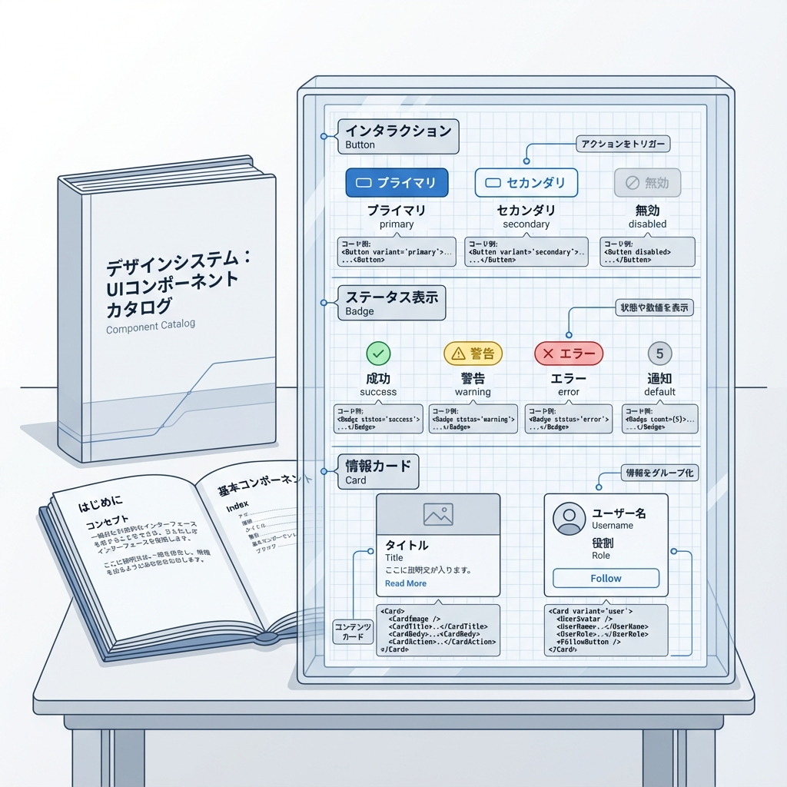
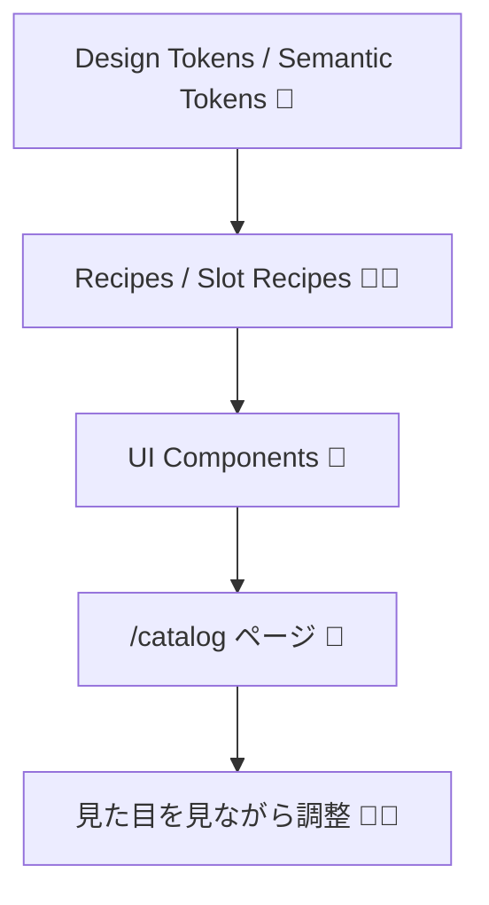
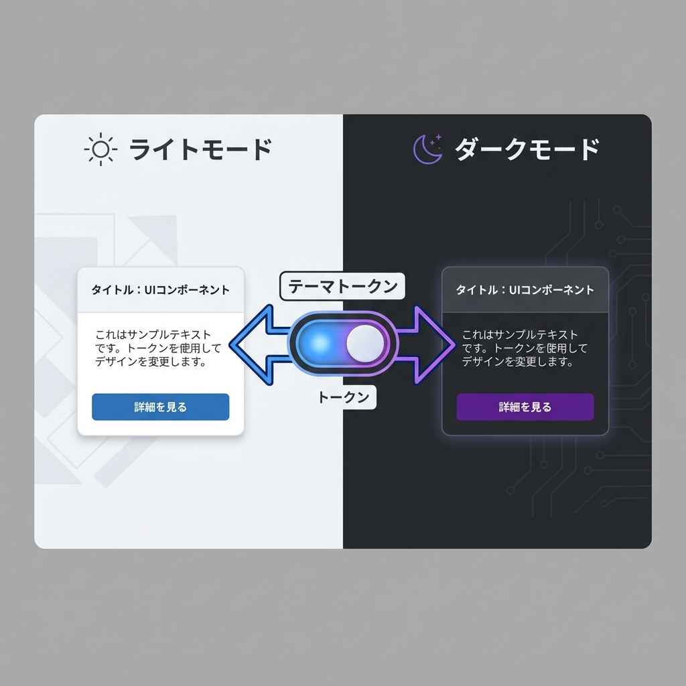
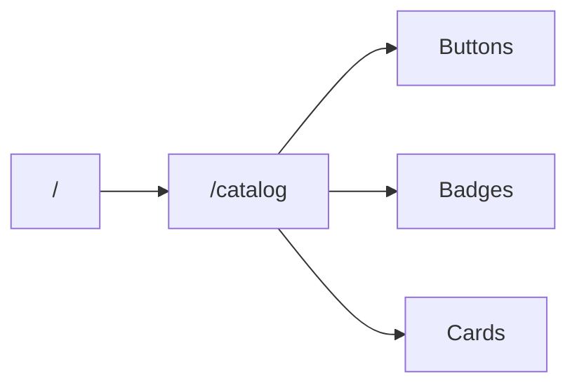

# 第274章：ミニ課題：Panda CSS でコンポーネントカタログを作る📖

今日は「自分だけの小さなUI図鑑」を作るよ〜！🥳
ボタン・バッジ・カードを **Panda CSS の Recipes / Slot Recipes / Tokens** で作って、`/catalog` に並べます📚✨

---

## ゴール🎯（できたら勝ち！）

* `/catalog` に **Button / Badge / Card** の見本が並ぶ👀✨
* **バリアント（色/サイズ）**を切り替えて見れる🎛️
* **ライト/ダーク**を切り替える（Tokenで色が変わる）🌞🌙

---

## 全体のつながり（ここが理解できると強い💪）






---

## 0) 下準備チェック✅（Pandaが動く状態？）

### ✅ `package.json` に `prepare` がある？

Panda公式の推奨は、依存インストール後に `panda codegen` を走らせる形だよ🧸
（`styled-system` を毎回生成してくれるやつ） ([panda-css.com][1])

```json
{
  "scripts": {
    "prepare": "panda codegen",
    "dev": "next dev"
  }
}
```

### ✅ 入口CSSにレイヤー宣言ある？

Pandaのレイヤー順を固定するやつ！ ([panda-css.com][1])

`app/globals.css`（または `src/app/globals.css`）に👇

```css
@layer reset, base, tokens, recipes, utilities;
```

---

## 1) Next.js + PostCSSの注意（超大事⚠️）

PandaはPostCSSプラグインで入れるのが推奨だよ🐼 ([panda-css.com][1])
ただし Next.js は `postcss.config.*` を置くと **デフォルトのPostCSS設定が無効化**されるので、必要なプラグインは自分で入れる必要があるよ⚠️ ([Next.js][2])

### `postcss.config.cjs`（おすすめ例）

（Panda + Next.jsのデフォルト相当を一緒に入れる）

```js
module.exports = {
  plugins: {
    // Panda（公式例）
    "@pandacss/dev/postcss": {}, // :contentReference[oaicite:4]{index=4}

    // Next.js デフォルト相当（Next公式が例示してる構成）
    "postcss-flexbugs-fixes": {},
    "postcss-preset-env": {
      autoprefixer: { flexbox: "no-2009" },
      stage: 3,
      features: { "custom-properties": false },
    },
  },
};
```

> もし `postcss-flexbugs-fixes` / `postcss-preset-env` が入ってなければ、Next公式の警告どおり自分でinstallしてね🧷 ([Next.js][2])

---

## 2) テーマ（ライト/ダーク）を Token で作る🌞🌙




Pandaの **Semantic Tokens** は `{colors.xxx}` みたいに参照できて、さらに `base / _dark` で切り替えもできるよ✨ ([panda-css.com][3])
ライト/ダークの判定は、`data-color-mode` を使うのがわかりやすい！ ([panda-css.com][4])

### `panda.config.ts`（テーマ部分だけ例）

※ `include` のパスは自分の構成（`src/` ありなし）に合わせてOK！

```ts
import { defineConfig } from "@pandacss/dev";

import { buttonRecipe } from "./styles/recipes/button.recipe";
import { badgeRecipe } from "./styles/recipes/badge.recipe";
import { cardRecipe } from "./styles/recipes/card.slot-recipe";

export default defineConfig({
  preflight: true,
  jsxFramework: "react",
  include: ["./app/**/*.{ts,tsx}", "./components/**/*.{ts,tsx}", "./src/**/*.{ts,tsx}"],
  exclude: [],
  outdir: "styled-system",

  // data-color-mode で light/dark を切り替える（公式ガイドの形） :contentReference[oaicite:8]{index=8}
  conditions: {
    light: "[data-color-mode=light] &",
    dark: "[data-color-mode=dark] &",
  },

  theme: {
    extend: {
      semanticTokens: {
        colors: {
          bg: { value: { base: "{colors.white}", _dark: "{colors.gray.900}" } },
          fg: { value: { base: "{colors.gray.900}", _dark: "{colors.gray.100}" } },
          muted: { value: { base: "{colors.gray.50}", _dark: "{colors.gray.800}" } },
          border: { value: { base: "{colors.gray.200}", _dark: "{colors.gray.700}" } },

          brand: { value: { base: "{colors.blue.600}", _dark: "{colors.blue.400}" } },
          brandFg: { value: { base: "{colors.white}", _dark: "{colors.gray.900}" } },
        },
      },

      recipes: {
        button: buttonRecipe, // defineRecipe を recipes に追加する流れ :contentReference[oaicite:9]{index=9}
        badge: badgeRecipe,
      },
      slotRecipes: {
        card: cardRecipe,
      },
    },
  },
});
```

---

## 3) Recipes を作る（Button / Badge）🧂✨

Pandaの **Config Recipe** は `defineRecipe` で作って、`theme.recipes` に登録するよ！ ([panda-css.com][5])
状態（hoverとか）は `_hover` が使えるよ〜🫶 ([panda-css.com][6])

### `styles/recipes/button.recipe.ts`

```ts
import { defineRecipe } from "@pandacss/dev";

export const buttonRecipe = defineRecipe({
  className: "btn",
  description: "Button styles",

  base: {
    display: "inline-flex",
    alignItems: "center",
    justifyContent: "center",
    gap: "2",
    fontWeight: "600",
    borderRadius: "md",
    borderWidth: "1px",
    transitionProperty: "background, border-color, color, transform",
    transitionDuration: "150ms",
    _active: { transform: "translateY(1px)" }, // :contentReference[oaicite:12]{index=12}
    _disabled: { opacity: "0.5", cursor: "not-allowed" }, // :contentReference[oaicite:13]{index=13}
  },

  variants: {
    tone: {
      solid: {
        bg: "brand",
        color: "brandFg",
        borderColor: "brand",
        _hover: { bg: "{colors.blue.700}" }, // :contentReference[oaicite:14]{index=14}
      },
      outline: {
        bg: "transparent",
        color: "brand",
        borderColor: "brand",
        _hover: { bg: "muted" },
      },
      ghost: {
        bg: "transparent",
        color: "fg",
        borderColor: "transparent",
        _hover: { bg: "muted" },
      },
    },

    size: {
      sm: { px: "3", py: "2", fontSize: "sm" },
      md: { px: "4", py: "2.5", fontSize: "md" },
      lg: { px: "5", py: "3", fontSize: "lg" },
    },
  },

  defaultVariants: {
    tone: "solid",
    size: "md",
  },
});
```

### `styles/recipes/badge.recipe.ts`

```ts
import { defineRecipe } from "@pandacss/dev";

export const badgeRecipe = defineRecipe({
  className: "badge",
  description: "Badge styles",
  base: {
    display: "inline-flex",
    alignItems: "center",
    borderRadius: "full",
    fontWeight: "600",
    borderWidth: "1px",
  },
  variants: {
    tone: {
      brand: { bg: "brand", color: "brandFg", borderColor: "brand" },
      neutral: { bg: "muted", color: "fg", borderColor: "border" },
      outline: { bg: "transparent", color: "fg", borderColor: "border" },
    },
    size: {
      sm: { px: "2", py: "0.5", fontSize: "xs" },
      md: { px: "2.5", py: "1", fontSize: "sm" },
    },
  },
  defaultVariants: { tone: "neutral", size: "md" },
});
```

---

## 4) Slot Recipe で Card を作る🍱✨（複数パーツに最強）

Slot Recipe は「root/header/body/footer…」みたいな **複数パーツ**をまとめてスタイリングできる仕組みだよ📦 ([panda-css.com][7])

### `styles/recipes/card.slot-recipe.ts`

```ts
import { defineSlotRecipe } from "@pandacss/dev";

export const cardRecipe = defineSlotRecipe({
  className: "card",
  slots: ["root", "title", "desc", "body", "footer"],

  base: {
    root: {
      borderWidth: "1px",
      borderColor: "border",
      borderRadius: "lg",
      bg: "bg",
      color: "fg",
      overflow: "hidden",
    },
    title: { fontWeight: "700", fontSize: "lg" },
    desc: { color: "{colors.gray.500}", _dark: { color: "{colors.gray.400}" } },
    body: { p: "4" },
    footer: { p: "4", pt: "0", display: "flex", gap: "2", justifyContent: "flex-end" },
  },

  variants: {
    variant: {
      flat: {
        root: { boxShadow: "none" },
      },
      elevated: {
        root: { boxShadow: "sm" },
      },
    },
  },

  defaultVariants: { variant: "elevated" },
});
```

---

## 5) UIコンポーネント化（Button / Badge / Card）🧩✨

> `styled-system` の場所が `projectRoot/styled-system` なら、相対importは自分の階層に合わせて調整してね🙏
> （`src/` ありだと `../../styled-system/...` になりがち）

### `components/ui/Button.tsx`

```tsx
import * as React from "react";
import { cx } from "../../styled-system/css";
import { button } from "../../styled-system/recipes";

type Props = React.ComponentPropsWithoutRef<"button"> & {
  tone?: "solid" | "outline" | "ghost";
  size?: "sm" | "md" | "lg";
};

export function Button({ tone, size, className, ...props }: Props) {
  return <button className={cx(button({ tone, size }), className)} {...props} />;
}
```

### `components/ui/Badge.tsx`

```tsx
import * as React from "react";
import { cx } from "../../styled-system/css";
import { badge } from "../../styled-system/recipes";

type Props = React.ComponentPropsWithoutRef<"span"> & {
  tone?: "brand" | "neutral" | "outline";
  size?: "sm" | "md";
};

export function Badge({ tone, size, className, ...props }: Props) {
  return <span className={cx(badge({ tone, size }), className)} {...props} />;
}
```

### `components/ui/Card.tsx`

```tsx
import * as React from "react";
import { cx } from "../../styled-system/css";
import { card } from "../../styled-system/recipes";

type Props = {
  title: string;
  desc?: string;
  footer?: React.ReactNode;
  children: React.ReactNode;
  variant?: "flat" | "elevated";
  className?: string;
};

export function Card({ title, desc, footer, children, variant, className }: Props) {
  const s = card({ variant });

  return (
    <section className={cx(s.root, className)}>
      <div className={s.body}>
        <div className={s.title}>{title}</div>
        {desc ? <div className={s.desc}>{desc}</div> : null}
        <div style={{ height: 12 }} />
        <div>{children}</div>
      </div>
      {footer ? <div className={s.footer}>{footer}</div> : null}
    </section>
  );
}
```

---

## 6) `/catalog` ページを作る📖✨（見本を並べよう！）

### ルート構成イメージ🗺️



### `app/catalog/page.tsx`

（テーマ切り替えやバリアント切り替えはクライアントでやるので、別ファイルに分けるよ🧸）

```tsx
import { css } from "../../styled-system/css";
import { CatalogClient } from "./CatalogClient";

export default function CatalogPage() {
  return (
    <main
      className={css({
        minH: "100vh",
        bg: "bg",
        color: "fg",
        p: { base: "4", md: "8" },
      })}
    >
      <div className={css({ maxW: "960px", mx: "auto" })}>
        <h1 className={css({ fontSize: "3xl", fontWeight: "800" })}>
          Component Catalog 📖🐼
        </h1>
        <p className={css({ mt: "2", color: "{colors.gray.600}", _dark: { color: "{colors.gray.300}" } })}>
          ボタン・バッジ・カードを眺めて育てるページだよ✨
        </p>

        <div className={css({ mt: "6" })}>
          <CatalogClient />
        </div>
      </div>
    </main>
  );
}
```

### `app/catalog/CatalogClient.tsx`

```tsx
"use client";

import { useEffect, useMemo, useState } from "react";
import { css } from "../../styled-system/css";
import { Button } from "../../components/ui/Button";
import { Badge } from "../../components/ui/Badge";
import { Card } from "../../components/ui/Card";

export function CatalogClient() {
  const [mode, setMode] = useState<"light" | "dark">("light");
  const [tone, setTone] = useState<"solid" | "outline" | "ghost">("solid");
  const [size, setSize] = useState<"sm" | "md" | "lg">("md");

  // data-color-mode を html に反映（Multi-Themeの考え方そのまま） :contentReference[oaicite:16]{index=16}
  useEffect(() => {
    document.documentElement.setAttribute("data-color-mode", mode);
  }, [mode]);

  const code = useMemo(() => {
    return `<Button tone="${tone}" size="${size}">Hello</Button>`;
  }, [tone, size]);

  return (
    <div className={css({ display: "grid", gap: "6" })}>
      {/* Theme Switch */}
      <section className={css({ display: "flex", gap: "2", alignItems: "center", flexWrap: "wrap" })}>
        <Badge tone="outline">Theme</Badge>
        <Button tone={mode === "light" ? "solid" : "outline"} size="sm" onClick={() => setMode("light")}>
          🌞 Light
        </Button>
        <Button tone={mode === "dark" ? "solid" : "outline"} size="sm" onClick={() => setMode("dark")}>
          🌙 Dark
        </Button>
      </section>

      {/* Buttons */}
      <Card
        title="Buttons"
        desc="tone/size を切り替えて、見た目を確認しよう🎛️"
        footer={
          <>
            <Button tone="ghost" size="sm" onClick={() => setTone("ghost")}>👻 ghost</Button>
            <Button tone="outline" size="sm" onClick={() => setTone("outline")}>🫧 outline</Button>
            <Button tone="solid" size="sm" onClick={() => setTone("solid")}>🔥 solid</Button>
          </>
        }
      >
        <div className={css({ display: "flex", gap: "2", alignItems: "center", flexWrap: "wrap" })}>
          <Badge tone="neutral">size</Badge>
          <Button tone="outline" size="sm" onClick={() => setSize("sm")}>sm</Button>
          <Button tone="outline" size="sm" onClick={() => setSize("md")}>md</Button>
          <Button tone="outline" size="sm" onClick={() => setSize("lg")}>lg</Button>
        </div>

        <div className={css({ mt: "4", display: "flex", gap: "2", flexWrap: "wrap", alignItems: "center" })}>
          <Button tone={tone} size={size}>こんにちは🐼✨</Button>
          <Button tone={tone} size={size} disabled>disabled🥺</Button>
        </div>

        <pre
          className={css({
            mt: "4",
            p: "3",
            bg: "muted",
            borderWidth: "1px",
            borderColor: "border",
            borderRadius: "md",
            fontSize: "sm",
            overflowX: "auto",
          })}
        >
{code}
        </pre>
      </Card>

      {/* Badges */}
      <Card title="Badges" desc="ラベル系はバッジがあると一気にそれっぽい😳✨">
        <div className={css({ display: "flex", gap: "2", flexWrap: "wrap" })}>
          <Badge tone="brand">NEW✨</Badge>
          <Badge tone="neutral">Draft📝</Badge>
          <Badge tone="outline">Infoℹ️</Badge>
          <Badge tone="brand" size="sm">sm</Badge>
          <Badge tone="neutral" size="sm">sm</Badge>
        </div>
      </Card>

      {/* Cards */}
      <Card title="Cards" desc="Slot Recipe の威力：title/desc/body/footer をまとめて管理🍱✨">
        <div className={css({ display: "grid", gap: "3" })}>
          <Card
            title="Elevated"
            desc="影あり"
            footer={<Button tone="solid" size="sm">OK👌</Button>}
          >
            ここが本文だよ〜🌸
          </Card>

          <Card
            title="Flat"
            desc="影なし"
            variant="flat"
            footer={<Button tone="outline" size="sm">Details🔍</Button>}
          >
            こっちはフラット版！🧁
          </Card>
        </div>
      </Card>
    </div>
  );
}
```

---

## 7) codegen を回して起動しよう🚀

* まだなら：`npx panda codegen`（設定/Recipeを変えたら基本これ）
* Next開発：`npm run dev`

---

## 8) ありがちハマり（助けるよ🥹）

### ❌ 「スタイルが当たらない！」

Next.js が PostCSS 生成物をキャッシュして、`.next` を消す必要があることがあるよ〜！ ([panda-css.com][8])

**Windows（PowerShell）例：**

```powershell
Remove-Item -Recurse -Force .next
npm run dev
```

（Panda公式だと `dev` スクリプトで `.next` を消してから起動する例が載ってるよ🧹 ([panda-css.com][8])）

---

## 9) ミニ課題（提出物）🎓✨

### ✅ 必須（ここまでやれば第274章クリア！）

* `/catalog` を作る
* Button/Badge/Card が並ぶ
* ライト/ダークで色が変わる（Tokenで）

### 🌟 追加チャレンジ（余裕があれば！）

* `Button` に `loading` 見た目を追加（くるくる🌀）
* `Card` に `tone`（brand/neutral）を追加して、背景色を変える🎨
* `/catalog` の各セクションに “使いどころ” コメントを書く💬✨

---

必要なら、今のプロジェクトのフォルダ構成（`src/` あり/なし）に合わせて、importパスを「あなたの形」にピッタリ揃えた版も作るよ〜🐼🧡

[1]: https://panda-css.com/docs/installation/postcss "Using PostCSS | Panda CSS - Panda CSS"
[2]: https://nextjs.org/docs/pages/guides/post-css "Guides: PostCSS | Next.js"
[3]: https://panda-css.com/docs/theming/tokens "Tokens | Panda CSS - Panda CSS"
[4]: https://panda-css.com/docs/guides/multiple-themes "Multi-Theme Tokens | Panda CSS - Panda CSS"
[5]: https://panda-css.com/docs/concepts/recipes "Recipes | Panda CSS - Panda CSS"
[6]: https://panda-css.com/docs/concepts/conditional-styles "Conditional Styles | Panda CSS - Panda CSS"
[7]: https://panda-css.com/docs/concepts/slot-recipes "Slot Recipes | Panda CSS - Panda CSS"
[8]: https://panda-css.com/docs/installation/nextjs "Using Next.js | Panda CSS - Panda CSS"
