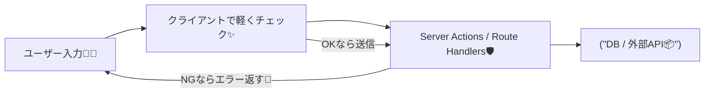
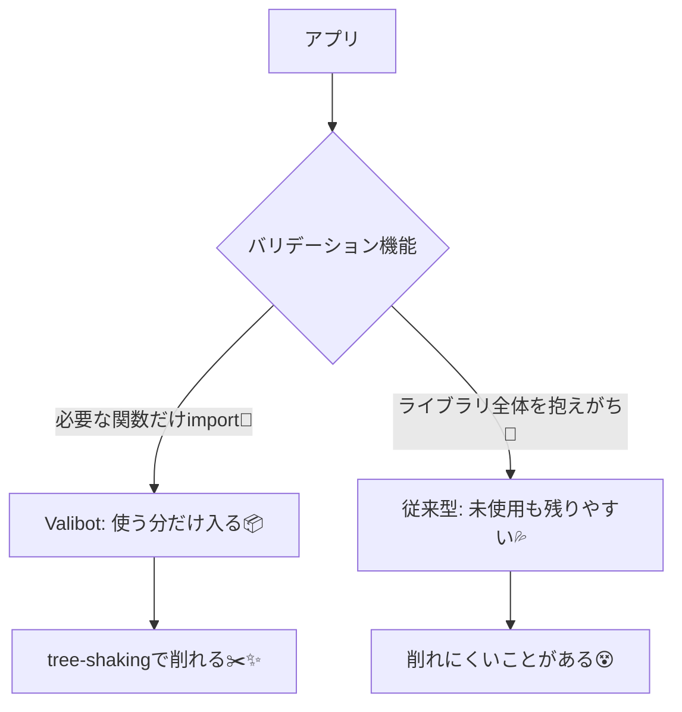

# 第275章：なぜValibotか？（Bundle Size & Modular）🤖

## この章のゴール🎯

* 「バリデーション（入力チェック）」が **なぜ必要か** を感覚でつかむ🧠✨
* Valibot が **なぜ人気になってきたのか**（特に **軽さ** と **モジュール設計**）を理解する🪶📦
* 次章（safeParse）に入るための「前提」をつくる🚪💨

---

## そもそもバリデーションって何？🧪📝

バリデーションは一言でいうと、

**「来たデータが“期待してる形・ルール”になってるかチェックすること」**だよ〜✅😊

たとえば…

* メールアドレスが `xxx@yyy` っぽい？📧
* 名前が空じゃない？👤
* 年齢が数字で、0以上？🔢

これをやらないと、あとで
「変なデータがDBに入る😇」
「画面でクラッシュする💥」
「APIが変な値で壊れる🫠」
みたいな事故が起きやすいの…！

---

## Next.jsだと、どこでチェックするの？🧭

Next.js（App Router）だと、チェックの場所がいくつかあるよ👇

* **フォーム送信前（クライアント）**：ユーザー体験を良くする💄✨
* **Server Actions（サーバー）**：最重要！ここで守る🛡️🔥
* **Route Handlers（API）**：外部から叩かれる前提で守る🧱🔒

図にするとこんな感じ📮➡️🛡️



---

## じゃあ、なぜ Valibot？🤖✨

Valibot は「TypeScript向けのスキーマ（＝入力ルール）ライブラリ」で、特に **軽さ（バンドルサイズ）** と **モジュール設計** を強く意識して作られてるよ📦🪶
公式も「bundle size / type safety / DX」を重視してるって明言してるよ。([valibot.dev][1])


### ① とにかく“軽い” 🪶📦

Valibot は **“1kB級の代替”**として紹介されていて、フォームなどの検証に向いてる、って位置づけだよ。([valibot.dev][2])

さらに「Zodと比べて、条件によってはかなり小さくなる」系の比較も色々出てる（tree-shakingが効くから）📉✨
例えば bundle size 比較の実測例（minified/gzipped）だと、文字列検証・オブジェクト検証で **桁が違う**レベルの差が出てるケースがあるよ。([GitHub][3])

> ざっくりイメージ：
> **“必要な分だけ持っていく”**（Valibot）👜✨
> vs
> **“使わない道具も全部入り”**（一部の重めライブラリになりがち）🧳💦

---

### ② “モジュール式”だから、使う機能だけ読み込める🧩✨

Valibot は機能が細かく分かれていて、**使うものを import した分だけ**使う感じ🧩
この設計が **tree-shaking（未使用コードの削除）**と相性がよくて、結果的に軽くなりやすいんだって📦✂️✨([builder.io][4])

図にするとこう👇（雰囲気つかめればOK！）



---

### ③ TypeScriptと相性がいい（型安全）🧷✨

Valibot は「Type safe schema library」として打ち出されていて、**入力チェックと型の整合**を一緒に考えやすいよ🧠🧷([valibot.dev][1])

つまり…
「このデータはこういう形のはず！」をコードで宣言しやすくなる📘✨
（次章以降でガッツリ触るよ〜！）

---

## Valibotの“嬉しさ”が刺さる場面🎯✨

* フォームが多い（お問い合わせ、ログイン、住所入力…）📮📧
* クライアントとサーバーで **同じルールを使いたい** 🤝
* できるだけ **軽くしたい**（特にフロント）🪶📦
* 「必要なものだけ使う」設計が好き🧩💕

ちなみに Valibot はいろんな環境（Node/ブラウザ等）で使える前提の配布もされてるよ。([JSR][5])

---

## 小さなプレビュー（雰囲気だけ）👀✨

この章では“なぜ”がテーマなので、雰囲気だけチラ見せ😌💕

```ts
// 使うものだけ import する感じ（モジュール式🧩）
import { string, minLength, safeParse } from "valibot";
```

「必要な関数だけ選ぶ」→「軽くしやすい」って感覚を持てたらOKだよ🙆‍♀️✨

---

## まとめ🌸✨

* バリデーションは「事故を未然に防ぐ」大事な守り🛡️
* Valibotは **軽さ（bundle size）** と **モジュール設計** が強み🪶📦
* “使う分だけimport”できる設計が、tree-shakingと相性よくて小さくなりやすい✂️✨([builder.io][4])

次の第276章で、いよいよ **スキーマ定義** と **safeParse** を使って「実際にチェックする」側に入っていくよ〜！🧪🚀💕

[1]: https://valibot.dev/?utm_source=chatgpt.com "Valibot: The modular and type safe schema library"
[2]: https://valibot.dev/blog/valibot-v1-the-1-kb-schema-library/?utm_source=chatgpt.com "Valibot v1 - The 1 kB schema library"
[3]: https://github.com/anatoo/zod-vs-valibot?utm_source=chatgpt.com "anatoo/zod-vs-valibot - bundle size comparison"
[4]: https://www.builder.io/blog/valibot-bundle-size?utm_source=chatgpt.com "This technique makes Valibot's bundle size 10x smaller ..."
[5]: https://jsr.io/%40valibot/valibot?utm_source=chatgpt.com "Valibot - JSR"
