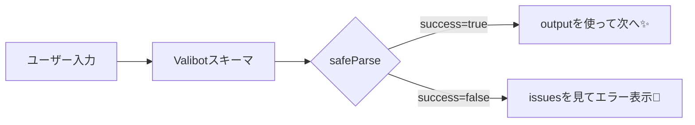

# 第276章：基本のスキーマ定義と検証（`safeParse`）🧪

この章では **Valibotで「入力チェックのルール（スキーマ）」を作って、`safeParse` で安全に検証する** ところまでやるよ〜🙌💞
`safeParse` は **失敗しても例外を投げず**、`success / output / issues` を返してくれるのがポイントです✨ ([valibot.dev][1])

---

## 今日のゴール🎯

* ✅ スキーマ（チェックルール）を作れるようになる📘
* ✅ `safeParse` の戻り値を読めるようになる👀
* ✅ 失敗した時にエラーメッセージを画面に出せるようになる🧾

---

## 図解：`safeParse` の流れ🧠➡️🧪




`safeParse` は **成功なら `result.success === true` & `result.output`**、
失敗なら **`result.success === false` & `result.issues`** だよ〜📌 ([valibot.dev][1])

---

## 1) インストール（Windows）🪟📦

プロジェクトのルートで実行するよ👇（Valibotは `valibot` パッケージです） ([npm][2])

```bash
npm i valibot
```

---

## 2) 体験：お問い合わせフォーム（仮）を `safeParse` でチェック📮✨

### 作るファイル

* `app/ch276/page.tsx`

### コード（コピペOK）🧡

```tsx
'use client';

import { useState } from 'react';
import type { ChangeEvent, FormEvent } from 'react';
import * as v from 'valibot';

const ContactSchema = v.object({
  name: v.pipe(
    v.string('お名前は文字で入れてね🙂'),
    v.trim(),
    v.nonEmpty('お名前を入れてね🙏'),
    v.minLength(2, 'お名前は2文字以上でお願い💡')
  ),
  email: v.pipe(
    v.string('メールは文字で入れてね🙂'),
    v.trim(),
    v.nonEmpty('メールアドレスを入れてね📮'),
    v.email('メールアドレスの形がちょっと変かも…😅')
  ),
  message: v.pipe(
    v.string('メッセージは文字で入れてね🙂'),
    v.trim(),
    v.nonEmpty('メッセージを入れてね📝'),
    v.minLength(10, 'メッセージは10文字以上だとうれしいな💬')
  ),
});

type FormState = {
  name: string;
  email: string;
  message: string;
};

export default function Page() {
  const [form, setForm] = useState<FormState>({ name: '', email: '', message: '' });
  const [errors, setErrors] = useState<string[]>([]);
  const [ok, setOk] = useState(false);

  const onChange =
    (key: keyof FormState) =>
    (e: ChangeEvent<HTMLInputElement | HTMLTextAreaElement>) => {
      setForm((prev) => ({ ...prev, [key]: e.target.value }));
    };

  const onSubmit = (e: FormEvent) => {
    e.preventDefault();
    setOk(false);

    // ✅ 例外を投げずに結果オブジェクトが返るのが safeParse ✨
    const result = v.safeParse(ContactSchema, form);

    if (result.success) {
      setErrors([]);
      setOk(true);

      // output は trim() などの変換も反映された「完成データ」✨
      console.log('OK!', result.output);
      return;
    }

    // 今回はまず “読める形” で表示するだけ（もっと整えるのは後の章で✨）
    const msgs =
      result.issues?.map((issue) => {
        const path = issue.path?.map((p) => String(p.key)).join('.') ?? '';
        return path ? `${path}: ${issue.message}` : String(issue.message);
      }) ?? [];

    setErrors(msgs);
  };

  return (
    <main style={{ maxWidth: 560, margin: '40px auto', padding: 16 }}>
      <h1 style={{ fontSize: 24, fontWeight: 700 }}>第276章：safeParseで入力チェック🧪✨</h1>

      <p style={{ marginTop: 8 }}>
        「送信（仮）」の前に入力チェックして、やさしくエラーを出してみよう〜📮💞
      </p>

      <form onSubmit={onSubmit} style={{ marginTop: 16, display: 'grid', gap: 12 }}>
        <label style={{ display: 'grid', gap: 4 }}>
          <span>お名前</span>
          <input
            value={form.name}
            onChange={onChange('name')}
            style={{ padding: 10, border: '1px solid #ccc', borderRadius: 8 }}
          />
        </label>

        <label style={{ display: 'grid', gap: 4 }}>
          <span>メール</span>
          <input
            value={form.email}
            onChange={onChange('email')}
            style={{ padding: 10, border: '1px solid #ccc', borderRadius: 8 }}
          />
        </label>

        <label style={{ display: 'grid', gap: 4 }}>
          <span>メッセージ</span>
          <textarea
            value={form.message}
            onChange={onChange('message')}
            rows={4}
            style={{ padding: 10, border: '1px solid #ccc', borderRadius: 8 }}
          />
        </label>

        <button
          type="submit"
          style={{
            padding: 12,
            borderRadius: 10,
            border: '1px solid #333',
            background: 'white',
            cursor: 'pointer',
          }}
        >
          チェックして送信（仮）🚀
        </button>
      </form>

      {ok && (
        <p style={{ marginTop: 16, padding: 12, borderRadius: 10, border: '1px solid #8bc34a' }}>
          OK〜！入力ぜんぶ良さそう🙌✨（ここから本当の送信処理につなげられるよ）
        </p>
      )}

      {errors.length > 0 && (
        <div style={{ marginTop: 16, padding: 12, borderRadius: 10, border: '1px solid #f44336' }}>
          <p style={{ fontWeight: 700 }}>ちょっとだけ確認してね🙏</p>
          <ul style={{ marginTop: 8, paddingLeft: 18 }}>
            {errors.map((m) => (
              <li key={m}>{m}</li>
            ))}
          </ul>
        </div>
      )}
    </main>
  );
}
```

この例で使ってる `pipe / trim / nonEmpty / minLength / email / safeParse` は、公式ドキュメントの流れそのままだよ✅ ([valibot.dev][3])

---

## 3) 動かす🧑‍💻🌈

```bash
npm run dev
```

ブラウザで

* `http://localhost:3000/ch276`
  を開いてね😊✨

---

## 4) 動作チェック（ここやってみて！）✅

* お名前空欄 → 「お名前を入れてね🙏」が出る🙂
* メールに `aaa` → 「メールアドレスの形が…😅」が出る📮
* メッセージが短い → 「10文字以上…💬」が出る📝
* ぜんぶOK → 緑のOKメッセージ🙌✨（コンソールに `result.output` も出るよ）

---

## よくあるハマりどころ🪤

* **`safeParse` の結果を見ずに `output` を触る**
  → まず `result.success` をチェック！これ大事💡 ([valibot.dev][1])
* **スペースだけ入力**
  → `trim()` + `nonEmpty()` のコンボで防げるよ✂️✨ ([valibot.dev][4])

---

## ミニ練習🎮✨（1分）

メールを「大学ドメインだけOK」にしてみよ〜🏫📮
`email` のパイプの最後にこれ足してみて👇（例：`@example.ac.jp` だけ許可）

```ts
v.endsWith('@example.ac.jp', '大学メール（@example.ac.jp）で入力してね🏫')
```

（`endsWith` は文字列チェックの追加ルールだよ〜） ([valibot.dev][5])

---

## 次の章予告📚✨

次は **型ごとのバリデーション（String / Number / Date）** をもうちょい広げていくよ〜🔢📅（第277章）

[1]: https://valibot.dev/guides/parse-data/?utm_source=chatgpt.com "Parse data"
[2]: https://www.npmjs.com/package/valibot?utm_source=chatgpt.com "valibot"
[3]: https://valibot.dev/guides/mental-model/?utm_source=chatgpt.com "Mental model"
[4]: https://valibot.dev/api/trim/?utm_source=chatgpt.com "trim"
[5]: https://valibot.dev/api/endsWith/?utm_source=chatgpt.com "endsWith"
