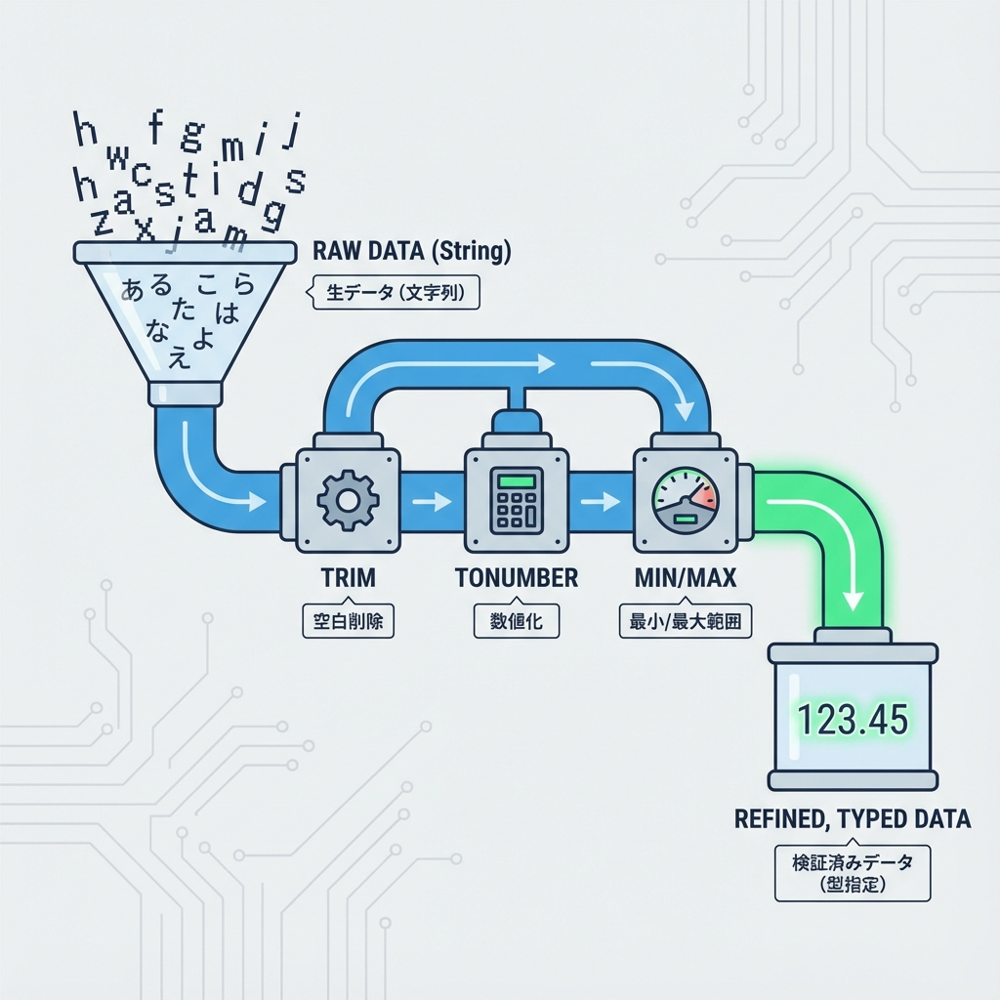
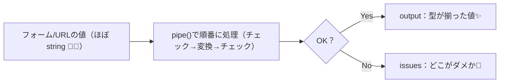

# 第277章：データ型ごとのバリデーション（String/Number/Date）🔢

今日は **「文字・数字・日付」それぞれのチェックの書き方**を、Valibotでスッキリまとめるよ〜☺️🧡
ポイントはこれ👇

* 入力はだいたい **stringで来る**（フォーム・URLなど）😵‍💫
* Valibotの `pipe()` で **「チェック → 変換 → 追加チェック」**って順番に積める✨
* `toNumber()` / `toDate()` で **型変換してから**、範囲チェックすると強い💪✨ ([valibot.dev][1])

---

### 図解：だいたいこの流れで勝てる💡✨






`safeParse()` は **成功なら `output`、失敗なら `issues`** が取れるよ〜！ ([valibot.dev][2])

---

## 1) String（文字）のバリデーション 🧵✨

文字はまずこれが鉄板だよ👇

* `trim()`（前後の空白消す）
* `nonEmpty()`（空文字禁止）
* `minLength()` / `maxLength()`（文字数） ([valibot.dev][3])
* `email()`（メール形式）など ✉️ ([valibot.dev][4])

例：ユーザー名（英数字と `_` だけ）＋メールアドレス

```ts
// lib/validators.ts
import * as v from 'valibot';

export const UserNameSchema = v.pipe(
  v.string('文字で入力してね🙂'),
  v.trim(),
  v.nonEmpty('ユーザー名は必須だよ🥺'),
  v.minLength(2, '2文字以上にしてね🙏'),
  v.maxLength(20, '20文字までだよ〜😌'),
  v.regex(/^[a-zA-Z0-9_]+$/, '英数字と _ だけ使えるよ✨')
);

export const EmailSchema = v.pipe(
  v.string('文字で入力してね🙂'),
  v.trim(),
  v.nonEmpty('メールは必須だよ🥺'),
  v.email('メールの形がちょっと違うかも✉️'),
  v.maxLength(100, 'メール長すぎ！100文字までね🙂')
);
```

---

## 2) Number（数字）のバリデーション 🔢✨

### ✅ 重要：フォームやURLの数字って「文字」できがち 😭

だからこうするのがめちゃ多い👇

* まず `v.string()`
* `toNumber()` で **数値に変換** ([valibot.dev][1])
* `integer()` で整数縛り（ページ番号とか） ([valibot.dev][5])
* `minValue()` / `maxValue()` で範囲チェック ([valibot.dev][6])

例：ページ番号（1〜100）

```ts
// lib/validators.ts
import * as v from 'valibot';

export const PageSchema = v.pipe(
  v.string('ページは文字で来る想定🙂'),
  v.toNumber('ページは数字にしてね🔢'),   // 変換できないとここでNG
  v.integer('小数はダメだよ〜🙂'),
  v.minValue(1, '1以上にしてね🙏'),
  v.maxValue(100, '100までにしてね🙏')
);
```

### おまけ：小数の文字チェック（"12.34"みたいな）🧁

「数に変換する前に、文字として形式だけチェックしたい」なら `decimal()` が便利だよ〜！
`decimal` は小数や負数OK、`digits` は0-9だけOK、って違いがあるよ📝 ([valibot.dev][7])

---

## 3) Date（日付）のバリデーション 📅✨

日付もだいたい **string** で来るので、よくある勝ちパターン👇

* `isoDate()` で `"yyyy-mm-dd"` 形式チェック ([valibot.dev][8])
* `toDate()` で **Dateに変換** ([valibot.dev][9])
* `minValue()` / `maxValue()` で期間チェック ([valibot.dev][6])

例：イベント日付（今日以降）

```ts
// lib/validators.ts
import * as v from 'valibot';

const startOfToday = () => {
  const d = new Date();
  d.setHours(0, 0, 0, 0);
  return d;
};

export const EventDateSchema = v.pipe(
  v.string('日付は文字で来る想定🙂'),
  v.isoDate('YYYY-MM-DD で入力してね📅'), // 形式チェック
  v.toDate('日付に変換できなかったよ🥺'),  // Dateへ変換
  v.minValue(startOfToday(), '今日以降にしてね🙏')
);
```

⚠️ ちょい注意：`isoDate()` は「形式チェック用の正規表現」なので、例として `"2023-06-31"` みたいな“存在しない日付”を弾けない場合があるよ（形式は合ってるから）😵‍💫 ([valibot.dev][8])
なので **`toDate()` まで通して**安全側に倒すのがおすすめ〜！✨ ([valibot.dev][9])

---

## ミニ実践：3つの型をまとめて「イベント登録」の入力チェック🎪✨

```ts
// lib/eventSchema.ts
import * as v from 'valibot';
import { EmailSchema, UserNameSchema, EventDateSchema } from './validators';

export const TicketCountSchema = v.pipe(
  v.string(),
  v.toNumber('枚数は数字でお願い🙏'),
  v.integer('枚数は整数だよ🙂'),
  v.minValue(1, '1枚以上ね🎫'),
  v.maxValue(10, '10枚までだよ🎫')
);

export const EventRegisterSchema = v.object({
  userName: UserNameSchema,
  email: EmailSchema,
  eventDate: EventDateSchema,
  ticketCount: TicketCountSchema,
});
```

### Next.jsでサクッと動作確認（Server ComponentでOK）🧪✨

```tsx
// app/valibot-lab/page.tsx
import * as v from 'valibot';
import { EventRegisterSchema } from '@/lib/eventSchema';

export default function ValibotLabPage() {
  const input = {
    userName: '  hana_01  ',
    email: 'hana@example.com',
    eventDate: '2025-12-31',
    ticketCount: '2',
  };

  const result = v.safeParse(EventRegisterSchema, input);

  return (
    <main style={{ padding: 24 }}>
      <h1>Valibot Lab 🧪✨</h1>
      <p>success: {String(result.success)}</p>

      <h2>result</h2>
      <pre>{JSON.stringify(result, null, 2)}</pre>
    </main>
  );
}
```

`safeParse()` はこんな感じで `success / output / issues` を返してくれるよ〜！ ([valibot.dev][2])

---

## 小テスト（ゆるめ）📝💖

1. フォームの `ticketCount` が `"2"` で来た！まず何にする？🔢
2. 日付が `"2025-12-31"` で来た！形式チェック→型変換の順番は？📅
3. `minValue()` は String / Number / Date のどれに使える？（全部…？👀） ([valibot.dev][6])

---

## まとめ🎀✨

* **String**：`trim` → `nonEmpty` → `minLength/maxLength` が鉄板🧵
* **Number**：だいたい `string → toNumber → integer → min/max` 🔢 ([valibot.dev][1])
* **Date**：`isoDate → toDate → min/max` が強い📅 ([valibot.dev][8])
* **safeParse** で「失敗しても投げない」チェックができる🧪 ([valibot.dev][2])

次の **第278章** では、これを **Server Actionsの入力検証**にそのまま接続して「フォーム送信＝安全」まで持っていくよ〜！🚀🔒

[1]: https://valibot.dev/api/toNumber/ "toNumber | Valibot"
[2]: https://valibot.dev/api/safeParse/?utm_source=chatgpt.com "safeParse"
[3]: https://valibot.dev/api/minLength/?utm_source=chatgpt.com "minLength"
[4]: https://valibot.dev/api/message/?utm_source=chatgpt.com "message"
[5]: https://valibot.dev/api/integer/?utm_source=chatgpt.com "integer"
[6]: https://valibot.dev/guides/pipelines/?utm_source=chatgpt.com "Pipelines"
[7]: https://valibot.dev/api/decimal/ "decimal | Valibot"
[8]: https://valibot.dev/api/isoDate/?utm_source=chatgpt.com "isoDate"
[9]: https://valibot.dev/api/toDate/ "toDate | Valibot"
