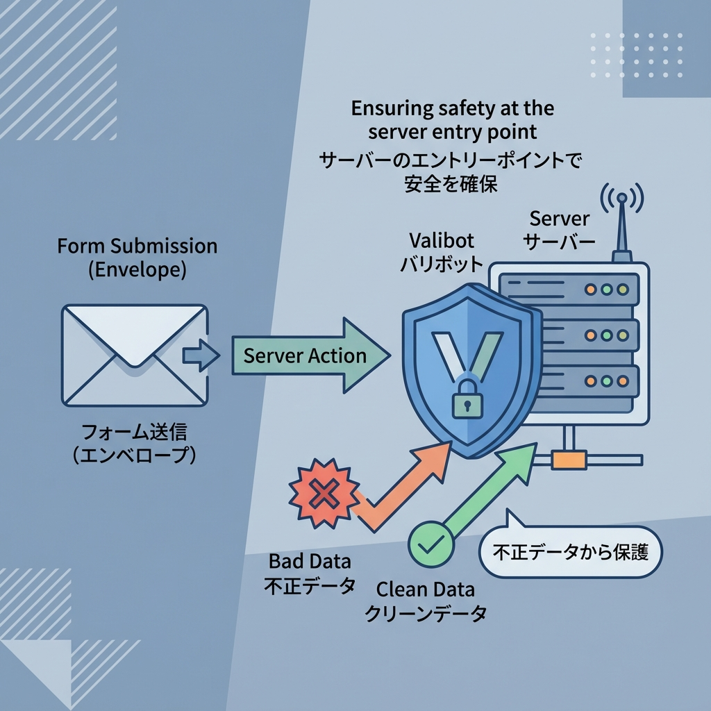
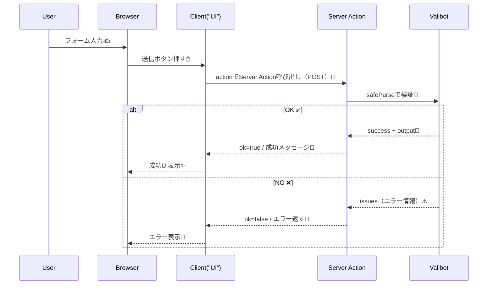

# 第278章：Server Actions での入力検証🛡️

この章では「フォーム送信 → Server Action → Valibotで検証 → エラーを画面に表示」を1セットで作るよ〜💌😊
Server Actions はサーバーで動く関数だから、**最終防衛ラインとしてここで必ず検証**するのが超大事だよ🧱🔥 ([Next.js][1])

---

## 今日つくるもの🎯

お問い合わせフォーム（名前・メール・メッセージ）📮
入力ミスがあったら、**その場で優しくエラー表示**してあげるやつ🥰

---

## 図解：フォーム送信の流れ📨➡️🛡️➡️🖥️






Server Actions は **POSTで呼ばれる**のが基本だよ〜📮 ([Next.js][1])

---

## 1) Valibot を入れる🐼📦

PowerShell（またはVSCodeのターミナル）で👇

```bash
npm i valibot
```

---

## 2) Server Action（サーバー側）を書く🧑‍🍳🛡️

### `app/actions/contact.ts` を作成✨

ポイントはこれ👇

* ファイル先頭に `"use server"`（このファイルのexportがサーバー関数になるよ） ([Next.js][1])
* Valibot の `safeParse(schema, input)` で **落とさずに**結果を受け取る ([Valibot][2])
* エラーは返して、UIで表示する🫶

```ts
'use server'

import * as v from 'valibot'

const ContactSchema = v.object({
  name: v.pipe(
    v.string(),
    v.trim(),
    v.minLength(1, 'お名前を入力してね😊'),
    v.maxLength(30, 'お名前は30文字までだよ✍️')
  ),
  email: v.pipe(
    v.string(),
    v.trim(),
    v.nonEmpty('メールアドレスが空っぽだよ📮'),
    v.email('メールの形がちょっと変かも…🤔'),
    v.maxLength(100, 'メール長すぎるかも💦')
  ),
  message: v.pipe(
    v.string(),
    v.trim(),
    v.minLength(10, 'メッセージは10文字以上でお願い🙏'),
    v.maxLength(300, 'メッセージは300文字までだよ📝')
  ),
})

export type ContactState = {
  ok: boolean
  message: string
  fieldErrors?: {
    name?: string[]
    email?: string[]
    message?: string[]
    _root?: string[]
  }
}

export async function sendContact(
  prevState: ContactState,
  formData: FormData
): Promise<ContactState> {
  // FormDataは null や File の可能性もあるから、まず文字列に寄せるよ🧼
  const raw = {
    name: String(formData.get('name') ?? ''),
    email: String(formData.get('email') ?? ''),
    message: String(formData.get('message') ?? ''),
  }

  const result = v.safeParse(ContactSchema, raw)

  if (!result.success) {
    // 画面表示しやすい形にする（詳しくは後の章で深掘りするよ😉）
    const flat = v.flatten<typeof ContactSchema>(result.issues)

    return {
      ok: false,
      message: '入力をもう一回チェックしてね🙏',
      fieldErrors: {
        name: flat.nested?.name,
        email: flat.nested?.email,
        message: flat.nested?.message,
        _root: flat.root,
      },
    }
  }

  // 検証OKなら、result.output が「型安全なデータ」✨
  const data = result.output

  // ここでDB保存やメール送信などをする想定📦✉️
  console.log('contact:', data)

  return {
    ok: true,
    message: '送信できたよ〜！ありがとう💌',
  }
}
```

* `pipe`, `trim`, `email` みたいに “つなげて検証”できるのが Valibot の気持ちよさだよ🐼✨ ([Valibot][3])
* `flatten` は issues を “表示向け” に平坦化してくれるよ🧾 ([Valibot][4])

---

## 3) フォームUI（クライアント側）を書く🧸🖥️

エラー表示したいから、フォーム側は Client Component にするよ〜🎮
`useActionState` を使うと、**state（結果）**と**pending（送信中）**を一緒に扱えて便利✨ ([Next.js][5])

### `app/contact/page.tsx`

```tsx
'use client'

import { useActionState } from 'react'
import { sendContact, type ContactState } from '@/app/actions/contact'

const initialState: ContactState = {
  ok: false,
  message: '',
}

export default function ContactPage() {
  const [state, formAction, pending] = useActionState(sendContact, initialState)

  return (
    <main style={{ maxWidth: 560, margin: '40px auto', padding: 16 }}>
      <h1 style={{ fontSize: 24, fontWeight: 700 }}>お問い合わせ📮</h1>
      <p style={{ marginTop: 8, opacity: 0.8 }}>気軽に送ってね〜😊</p>

      <form action={formAction} style={{ marginTop: 20, display: 'grid', gap: 12 }}>
        <div>
          <label>お名前</label>
          <input name="name" type="text" style={inputStyle} />
          {state.fieldErrors?.name?.map((msg, i) => (
            <p key={i} style={errorStyle}>⚠️ {msg}</p>
          ))}
        </div>

        <div>
          <label>メール</label>
          <input name="email" type="text" style={inputStyle} />
          {state.fieldErrors?.email?.map((msg, i) => (
            <p key={i} style={errorStyle}>⚠️ {msg}</p>
          ))}
        </div>

        <div>
          <label>メッセージ</label>
          <textarea name="message" rows={5} style={inputStyle} />
          {state.fieldErrors?.message?.map((msg, i) => (
            <p key={i} style={errorStyle}>⚠️ {msg}</p>
          ))}
        </div>

        {state.message && (
          <p aria-live="polite" style={{ marginTop: 4 }}>
            {state.ok ? '✅ ' : '⚠️ '}
            {state.message}
          </p>
        )}

        <button disabled={pending} type="submit" style={buttonStyle}>
          {pending ? '送信中…⏳' : '送信する💌'}
        </button>
      </form>
    </main>
  )
}

const inputStyle: React.CSSProperties = {
  width: '100%',
  padding: '10px 12px',
  borderRadius: 10,
  border: '1px solid #ccc',
  marginTop: 6,
}

const errorStyle: React.CSSProperties = {
  marginTop: 6,
  fontSize: 13,
}

const buttonStyle: React.CSSProperties = {
  marginTop: 8,
  padding: '10px 12px',
  borderRadius: 12,
  border: 'none',
  cursor: 'pointer',
}
```

`useActionState` の `pending` で「送信中はボタン無効化」できるよ〜🫶 ([Next.js][5])

---

## 4) 動かして確認しよ〜🚀

```bash
npm run dev
```

* `http://localhost:3000/contact` にアクセス🌈
* わざと空で送って、エラーが出るか確認👀⚠️
* 正しく入れて送って、成功メッセージも確認🎉

---

## よくあるハマりどころ🪤（ここだけ押さえたら勝ち✌️）

* **Server Action 側に `"use server"` がない** → ただの関数になっちゃう🥲 ([Next.js][1])
* **エラー表示したいのにフォームがServer Componentのまま** → `useActionState` が使えないので `use client` にする🎮 ([Next.js][5])
* `Object.fromEntries(formData)` を使うと楽だけど、`$ACTION_` で始まる余計なキーが混ざることがあるよ（複数フィールドだと注意）🧠 ([Next.js][5])

---

## ミニ練習🎀（5分でOK）

フォームに「件名 subject」を足してみてね💡

* 1文字以上
* 50文字以内
* エラー表示も追加✨

（できたら次章で、エラーメッセージ整形をもっと気持ちよくするよ〜😉）

[1]: https://nextjs.org/docs/app/getting-started/updating-data "Getting Started: Updating Data | Next.js"
[2]: https://valibot.dev/api/safeParse/ "safeParse | Valibot"
[3]: https://valibot.dev/guides/pipelines/?utm_source=chatgpt.com "Pipelines"
[4]: https://valibot.dev/api/flatten/ "flatten | Valibot"
[5]: https://nextjs.org/docs/app/guides/forms "Guides: Forms | Next.js"
