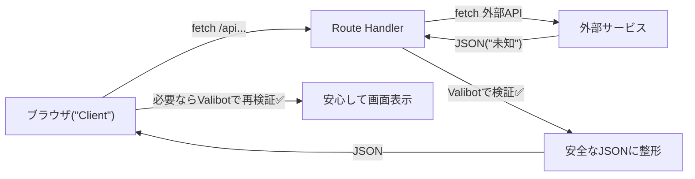

# 第279章：APIレスポンスの型安全と検証📦

APIって「自分のコードの外」からデータが飛んでくる場所だよね👀
だから **TypeScriptの型だけだと守りきれない**（実行時に型は存在しない…！）ので、**Valibotで“受け取ったJSON”を検証してから使う**のが超大事だよ〜🛡️✨
（`safeParse` は `success / output / issues` を返してくれるよ📦）([valibot.dev][1])

---

## 今日のゴール🎯✨

* ✅ APIレスポンスの「形」を **スキーマで固定**する
* ✅ 外部APIのJSONを **Route Handlerで検証**してから返す
* ✅ フロント側でも（必要なら） **レスポンスを検証して安全に表示**する

---

## どこで検証するのが正解？🧠✨（図で理解）




ポイントはこれ👇😊

* **外部API → 自分のサーバー**：ここは絶対に検証したい🔥
* **自分のAPI → 画面**：チーム開発・将来の変更が怖いなら、ここも検証すると安心🫶

---

## 1) まず「APIレスポンスの形」を決めよう📐📦

今回は例として `/api/todo/1` を叩くと、こう返すことにするよ👇

* 成功：`{ ok: true, data: Todo }`
* 失敗：`{ ok: false, error: { message: string } }`

この「成功/失敗の2パターン」を **union** で表現できるよ〜✨([valibot.dev][2])

### `lib/schemas/todo.ts`（スキーマ置き場📁）

（`src/`がある人は `src/lib/...` でもOKだよ😊）

```ts
import * as v from "valibot";

// 外部APIから返ってくる想定の Todo
export const TodoSchema = v.object({
  userId: v.number(),
  id: v.number(),
  title: v.string(),
  completed: v.boolean(),
});

// 自分のAPIが返す「成功レスポンス」
export const TodoOkResponseSchema = v.object({
  ok: v.literal(true),
  data: TodoSchema,
});

// 自分のAPIが返す「失敗レスポンス」
export const TodoNgResponseSchema = v.object({
  ok: v.literal(false),
  error: v.object({
    message: v.string(),
  }),
});

// 成功か失敗のどっちか
export const TodoResponseSchema = v.union([
  TodoOkResponseSchema,
  TodoNgResponseSchema,
]);

// TypeScriptの型もスキーマから作れる✨（出力型）
export type Todo = v.InferOutput<typeof TodoSchema>;
export type TodoResponse = v.InferOutput<typeof TodoResponseSchema>;
```

`InferOutput` で「最終的に使える型（output）」を取り出せるよ✨([valibot.dev][3])

---

## 2) Route Handlerで「外部APIのJSON」を検証してから返す🛣️✅

Next.jsのRoute Handlerは **Web標準のRequest/Response** で書けるよ〜！
`return Response.json(...)` みたいに返せるのも便利✨([Next.js][4])

### `app/api/todo/[id]/route.ts`

```ts
import * as v from "valibot";
import { TodoSchema, type TodoResponse } from "@/lib/schemas/todo";

export async function GET(
  _req: Request,
  ctx: { params: Promise<{ id: string }> }
) {
  const { id } = await ctx.params;
  const idNum = Number(id);
  if (!Number.isFinite(idNum)) {
    const body: TodoResponse = {
      ok: false,
      error: { message: "idが数字じゃないよ🥲" },
    };
    return Response.json(body, { status: 400 });
  }

  // 例：外部API（JSONPlaceholder）を叩く
  const res = await fetch(`https://jsonplaceholder.typicode.com/todos/${id}`);
  if (!res.ok) {
    const body: TodoResponse = {
      ok: false,
      error: { message: "外部APIが失敗しちゃった😭" },
    };
    return Response.json(body, { status: 502 });
  }

  const json: unknown = await res.json();

  // ここが主役✨：外部から来たJSONをValibotで検証✅
  const parsed = v.safeParse(TodoSchema, json);
  if (!parsed.success) {
    const body: TodoResponse = {
      ok: false,
      error: { message: "外部APIの形が想定と違ったよ🧨" },
    };
    return Response.json(body, { status: 502 });
  }

  // parsed.output は Todo として安全に扱える✅
  const body: TodoResponse = {
    ok: true,
    data: parsed.output,
  };

  return Response.json(body);
}
```

---

## 3) フロント側でレスポンスを検証して安全に表示📱✨

### `app/todo-demo/page.tsx`

```tsx
"use client";

import { useEffect, useState } from "react";
import * as v from "valibot";
import { TodoResponseSchema, type TodoResponse } from "@/lib/schemas/todo";

export default function TodoDemoPage() {
  const [text, setText] = useState("読み込み中…⏳");

  useEffect(() => {
    const run = async () => {
      const res = await fetch("/api/todo/1");
      const json: unknown = await res.json();

      // ✅ 受け取ったレスポンス全体を検証
      const result = v.safeParse(TodoResponseSchema, json);

      if (!result.success) {
        setText("レスポンスが壊れてたかも…🥲（検証NG）");
        return;
      }

      // ✅ ここから先は型安全✨
      const data: TodoResponse = result.output;

      if (!data.ok) {
        setText(`エラーだよ😭：${data.error.message}`);
        return;
      }

      setText(`TODO✨：${data.data.title}（完了？ ${data.data.completed ? "✅" : "⬜"}）`);
    };

    run();
  }, []);

  return (
    <main style={{ padding: 24 }}>
      <h1>Todo Demo 🧪✨</h1>
      <p>{text}</p>
    </main>
  );
}
```

---

## よくあるハマり⚠️：`safeParse` は分割代入しない方が安全かも🙅‍♀️

`safeParse` は `success` を見てから `output` を使うと型が絞れるんだけど、**分割代入すると絞り込みが効かないことがある**よ〜🥺
（`const result = ...` のまま扱うのが安心！）([GitHub][5])

---

## ミニ課題🎒✨（5〜10分）

1. `/api/todo/2` を叩くボタンを作って、表示を切り替えてみよ〜🖱️✨
2. `TodoSchema` にわざと `title: v.number()` みたいに間違いを入れて、**検証で止まる**のを体験してみてね😆🧨

---

## まとめ🌸

* APIのJSONは **unknown扱い**からスタートが基本🧊
* **境界（外部→自分のサーバー）**でValibot検証するだけで事故が激減🛡️✨
* 成功/失敗レスポンスを **unionで固定**すると、UI側の分岐も超キレイになるよ📦💕

次の章（第280章）で、`issues` を **日本語メッセージに整形して表示**するのをやるよ〜🇯🇵✨

[1]: https://valibot.dev/guides/parse-data/?utm_source=chatgpt.com "Parse data"
[2]: https://valibot.dev/api/union/?utm_source=chatgpt.com "union"
[3]: https://valibot.dev/api/InferOutput/?utm_source=chatgpt.com "InferOutput"
[4]: https://nextjs.org/docs/app/getting-started/route-handlers "Getting Started: Route Handlers | Next.js"
[5]: https://github.com/fabian-hiller/valibot/discussions/698?utm_source=chatgpt.com "Using safeParse has unknown output compared to parse ..."
