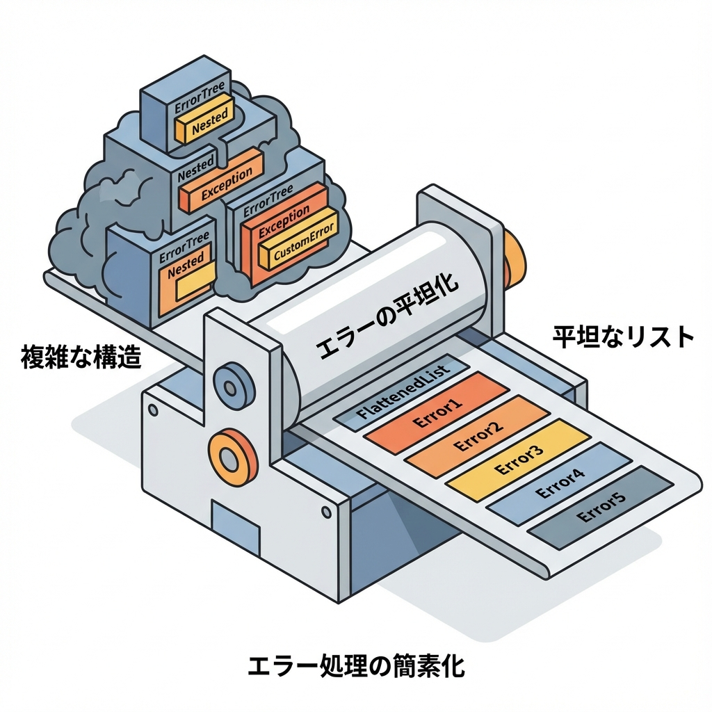
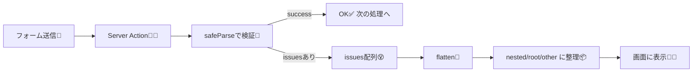

# 第280章：エラーメッセージの日本語化と平坦化（`flatten`）🇯🇵

この章は「フォームのエラー表示が一気にラクになる」回だよ〜！😊💡
ポイントは2つ👇

* **エラーメッセージを日本語にする** 🇯🇵
* **`issues`（配列）を `flatten` で“フォーム向けの形”に整える** 🧼🧺

---

## 1) まず結論：`flatten` すると「表示しやすい形」になるよ🧹✨

Valibotの `safeParse()` が失敗すると、`issues` っていう“詳細なエラー情報の配列”が返ってくるんだけど…
フォームで使うにはちょっとゴチャゴチャしがち😵‍💫

そこで `flatten(issues)` を使うと👇みたいに分かれるよ！

* **`root`**：フォーム全体のエラー（pathが無いもの）
* **`nested`**：`"profile.email"` みたいに **ドットパスでキー化**されたフィールド別エラー
* **`other`**：ドットパスにできない特殊なもの（たまに出る）

これは公式の説明そのままの挙動だよ🧠✨。 ([Valibot][1])

---

## 2) 図でイメージするとこう📮➡️🧪➡️🧹➡️👀






---

## 3) 日本語化：公式 i18n を読み込んで `lang: "ja"` を指定する🇯🇵✨

Valibotは公式で i18n（翻訳）パッケージを用意してて、**翻訳は副作用 import で読み込まれる**感じだよ〜！ ([Valibot][2])

今回の基本方針👇

* `import '@valibot/i18n/ja'` で日本語翻訳をロード
* `safeParse(..., { lang: 'ja' })` で日本語を選ぶ ([Valibot][2])

---

## 4) 実装してみよう：サークル入部フォーム🌸（Server Actions + flatten）

### ✅ 作るもの

* `profile.nickname`, `profile.email`, `message` のフォーム
* サーバーで検証して、**`flatten` したエラーをそのまま返す**
* クライアントは **フィールド名でエラーを引くだけ** 😍

---

### 4-1) `app/join/actions.ts`（Server Action側）🧑‍🍳🔥

```ts
'use server';

import * as v from 'valibot';
import '@valibot/i18n/ja'; // 🇯🇵翻訳をロード（副作用import）

type ActionState = {
  ok: boolean;
  message?: string;
  fieldErrors?: Record<string, string[]>;
  formErrors?: string[];
};

// 入力データ用スキーマ（ネストしておくと flatten の dot path が分かりやすい✨）
const JoinSchema = v.object({
  profile: v.object({
    nickname: v.pipe(v.string(), v.trim(), v.minLength(2)),
    email: v.pipe(v.string(), v.trim(), v.email()),
  }),
  message: v.pipe(v.string(), v.trim(), v.maxLength(200)),
});

// input name="profile.email" みたいなドットキーをネストオブジェクトに戻すミニ関数🧩
function formDataToObject(fd: FormData) {
  const obj: any = {};
  for (const [key, value] of fd.entries()) {
    const str = String(value);
    const keys = key.split('.');
    let cur = obj;
    for (let i = 0; i < keys.length - 1; i++) {
      const k = keys[i]!;
      cur[k] ??= {};
      cur = cur[k];
    }
    cur[keys[keys.length - 1]!] = str;
  }
  return obj;
}

export async function submitJoin(
  _prev: ActionState,
  formData: FormData
): Promise<ActionState> {
  const input = formDataToObject(formData);

  // 🇯🇵 lang: 'ja' で日本語メッセージを選ぶ
  const result = v.safeParse(JoinSchema, input, { lang: 'ja' });

  if (!result.success) {
    // 🧹 issues配列 → 表示しやすい形へ
    const flat = v.flatten<typeof JoinSchema>(result.issues);

    return {
      ok: false,
      message: '入力を確認してね🙏',
      fieldErrors: flat.nested ?? {},
      formErrors: flat.root ?? [],
    };
  }

  return { ok: true, message: '送信できたよ！ありがとう😊🌸' };
}
```

`flatten` の `root/nested/other` の意味は公式の説明どおりだよ〜！ ([Valibot][1])

---

### 4-2) `app/join/page.tsx`（画面側）👀✨

```tsx
'use client';

import { useActionState } from 'react';
import { submitJoin } from './actions';

const initialState = { ok: false as const };

export default function Page() {
  const [state, action, isPending] = useActionState(submitJoin, initialState);

  const fe = state.fieldErrors ?? {};
  const first = (key: string) => fe[key]?.[0];

  return (
    <main style={{ padding: 24, maxWidth: 560 }}>
      <h1>サークル入部フォーム🌸</h1>

      {state.message && (
        <p style={{ marginTop: 12 }}>{state.message}</p>
      )}

      {/* フォーム全体エラー（root） */}
      {!!state.formErrors?.length && (
        <ul style={{ marginTop: 12 }}>
          {state.formErrors.map((e, i) => (
            <li key={i}>⚠️ {e}</li>
          ))}
        </ul>
      )}

      <form action={action} style={{ marginTop: 16, display: 'grid', gap: 12 }}>
        <label style={{ display: 'grid', gap: 6 }}>
          ニックネーム✨
          <input name="profile.nickname" />
          {first('profile.nickname') && (
            <p style={{ margin: 0 }}>💬 {first('profile.nickname')}</p>
          )}
        </label>

        <label style={{ display: 'grid', gap: 6 }}>
          メール📧
          <input name="profile.email" />
          {first('profile.email') && (
            <p style={{ margin: 0 }}>💬 {first('profile.email')}</p>
          )}
        </label>

        <label style={{ display: 'grid', gap: 6 }}>
          ひとこと📝（200文字まで）
          <textarea name="message" rows={4} />
          {first('message') && (
            <p style={{ margin: 0 }}>💬 {first('message')}</p>
          )}
        </label>

        <button type="submit" disabled={isPending}>
          {isPending ? '送信中…⏳' : '送信する🚀'}
        </button>
      </form>
    </main>
  );
}
```

これで、**「どの入力欄にどのエラーを出すか」問題がほぼ消える**よ！最高〜！🎉🧡

---

## 5) もっと“かわいい日本語”にしたいとき（言い回しカスタム）💬✨

公式翻訳だけでも十分だけど、
「この項目だけは、もっと優しく言いたい🥺」って時あるよね！

Valibotは **スキーマの `message` を上書き**できるよ👇

* `v.config(..., { message: '...' })` で設定 ([Valibot][3])
* パイプ全体にまとめて同じ文言なら `v.message(...)` が便利 ([Valibot][4])

例（メール全体を同じ文言にしちゃう）👇

```ts
const EmailSchema = v.message(
  v.pipe(v.string(), v.trim(), v.email(), v.maxLength(100)),
  'メールアドレスを正しい形で入れてね📧✨'
);
```

---

## 6) ミニ練習🎯（5分でOK！）

* `profile.nickname` を **3文字以上**にしてみよう🧸
* `message` を空でもOKにしたいなら、空文字を許す設計にしてみよう（今のままでも空は通るけど、`trim()` との組み合わせを見直すのもアリ）🧠✨
* エラー表示を「最初の1件だけ」じゃなくて「全部表示」にしてみよう📚💬

---

次の第281章は `check` で「独自ルール（例：パスワード一致）」みたいな“追加条件”を作って、`root` エラーも気持ちよく使えるようになるよ〜！🔧✨

[1]: https://valibot.dev/api/flatten/ "flatten | Valibot"
[2]: https://valibot.dev/guides/internationalization/ "Internationalization | Valibot"
[3]: https://valibot.dev/api/config/?utm_source=chatgpt.com "config"
[4]: https://valibot.dev/api/message/?utm_source=chatgpt.com "message"
