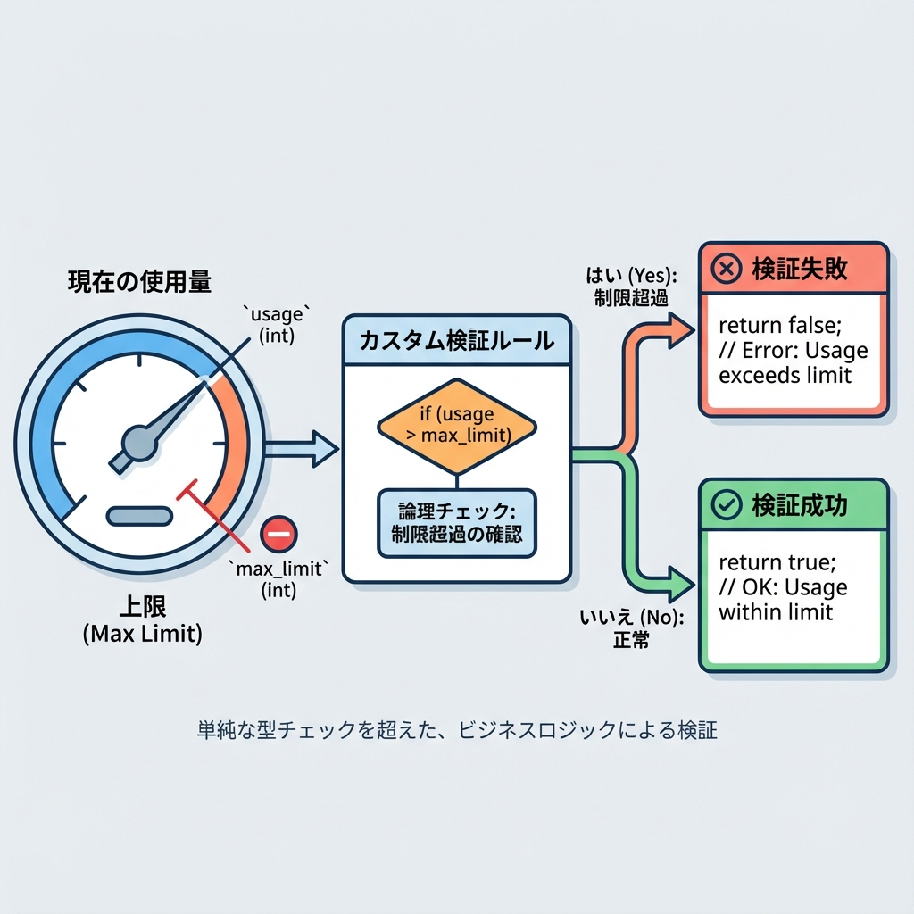
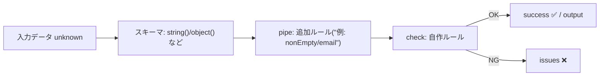
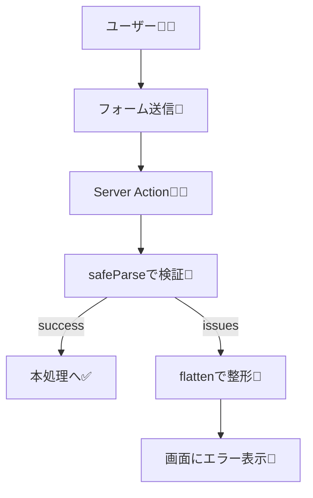

# 第281章：カスタムバリデーションを作る（`check`）🔧

今日は **「既存のスキーマに、あなた独自のルールを追加する」** 回だよ〜！🥳
Valibot の `check` を使うと、**「この条件も満たしてね！」** を自由に書けます。 ([valibot.dev][1])

---

## 今日のゴール 🎯💖

* `check((input) => boolean, "メッセージ")` の形を覚える🧠✨ ([valibot.dev][1])
* 文字列やオブジェクトに「独自ルール」を足せるようになる🧩
* Next.js の Server Actions で `safeParse` → `flatten` してエラー表示できるようになる📮💬 ([valibot.dev][2])

---

## `check`ってなに？🌸

`check` は **「バリデーション用のアクション」** で、`pipe` の中に入れて使うよ〜！🧪✨
「入力がOKなら `true`、ダメなら `false`」を返すだけのシンプル設計！ ([valibot.dev][1])

* ✅ OK：`true`
* ❌ NG：`false` → 指定したメッセージでエラーにできる ([valibot.dev][1])

---

## 図解：`pipe`の流れに `check` を差し込む🪄






---

## まずは最小形を暗記しよっ💡🧸

```ts
import * as v from "valibot";

const Schema = v.pipe(
  v.string(),
  v.check((input) => input.length % 2 === 0, "文字数は偶数にしてね😺")
);
```

これが基本形だよ〜！`check(条件, メッセージ)` だけ覚えたら勝ち✌️ ([valibot.dev][1])

---

## 例①：大学メールだけOKにする📮🎓（文字列 + check）

「`@uni.ac.jp` で終わるメールだけ許可したい！」みたいな時に便利✨

```ts
import * as v from "valibot";

export const UniversityEmailSchema = v.pipe(
  v.string("メールを文字で入れてね📮"),
  v.nonEmpty("メールは必須だよ〜🥺"),
  v.email("メールの形がちょっと変かも😵"),
  v.check(
    (email) => email.toLowerCase().endsWith("@uni.ac.jp"),
    "大学メール（@uni.ac.jp）で入れてね🎓✨"
  )
);
```

`email()` みたいな「既製品ルール」に、`check` で「うちのルール」を足す感じだよ🧁✨ ([valibot.dev][1])

---

## 例②：オブジェクトの中身同士をチェックする🔐💞（パスワード一致）

`check` は **オブジェクト全体**にも使えるよ！
公式の例でも「配列の長さが一致してるか」みたいなチェックをしてる感じ🧠✨ ([valibot.dev][1])

```ts
import * as v from "valibot";

export const RegisterSchema = v.pipe(
  v.object({
    email: v.pipe(
      v.string("メールを入れてね📮"),
      v.nonEmpty("メールは必須だよ🥺"),
      v.email("メール形式が違うかも😵")
    ),
    password: v.pipe(
      v.string("パスワードを入れてね🔐"),
      v.minLength(8, "8文字以上にしてね🔐✨")
    ),
    confirm: v.string("確認用パスワードも入れてね🔁"),
  }),
  v.check(
    (input) => input.password === input.confirm,
    "パスワードが一致しないよ〜😿"
  )
);
```

⚠️ このままだと「一致しない」エラーは **フォーム全体のエラー（root）**になりやすいよ。
「confirm欄の下に出したい！」って場合は、次の「おまけ」が便利🧁

---

## おまけ：エラーを特定フィールドに飛ばしたい時🎯✨（`forward`）

「一致しない」エラーを `confirm` に紐づけたいなら、`forward` が使えるよ〜！
（公式の “Register schema” 例がまさにこれ！） ([valibot.dev][3])

> ※ここは発展。今日は `check` が主役なので、さらっと眺めればOK🙂

```ts
import * as v from "valibot";

export const RegisterSchema2 = v.pipe(
  v.object({
    password1: v.pipe(v.string(), v.minLength(8, "8文字以上ね🔐")),
    password2: v.string(),
  }),
  v.forward(
    v.partialCheck(
      [["password1"], ["password2"]],
      (input) => input.password1 === input.password2,
      "2つのパスワードが一致しないよ〜😿"
    ),
    ["password2"]
  )
);
```

---

## Next.jsで使う：Server Actionで検証して、エラー表示する🧾✨

### 1) もし入ってなければインストール（npm）

Valibot は npm ならこれでOK！ ([valibot.dev][4])

```bash
npm install valibot
```

---

### 2) `lib/validation.ts` を作る🗂️

```ts
// src/lib/validation.ts
import * as v from "valibot";

export const RegisterSchema = v.pipe(
  v.object({
    email: v.pipe(
      v.string("メールを入れてね📮"),
      v.nonEmpty("メールは必須だよ🥺"),
      v.email("メール形式が違うかも😵"),
      v.check(
        (email) => email.toLowerCase().endsWith("@uni.ac.jp"),
        "大学メール（@uni.ac.jp）で入れてね🎓✨"
      )
    ),
    password: v.pipe(
      v.string("パスワードを入れてね🔐"),
      v.minLength(8, "8文字以上にしてね🔐✨")
    ),
    confirm: v.string("確認用も入れてね🔁"),
  }),
  v.check((input) => input.password === input.confirm, "パスワードが一致しないよ〜😿")
);

export type RegisterInput = v.InferInput<typeof RegisterSchema>;
```

---

### 3) Server Action 側：`safeParse` → `flatten` で整形🧠🧹

`safeParse` は「成功したら typed な output」「失敗したら issues」が取れるよ〜！ ([valibot.dev][2])
`flatten` は issues を「画面で使いやすい形」にしてくれるよ〜！ ([valibot.dev][5])

```ts
// app/register/actions.ts
"use server";

import * as v from "valibot";
import { RegisterSchema } from "@/lib/validation";

type State = {
  ok: boolean;
  message?: string;
  errors?: v.FlatErrors<typeof RegisterSchema>;
};

const initialState: State = { ok: false };

export async function registerAction(_prev: State, formData: FormData): Promise<State> {
  const input = {
    email: formData.get("email"),
    password: formData.get("password"),
    confirm: formData.get("confirm"),
  };

  const result = v.safeParse(RegisterSchema, input);

  if (!result.success) {
    return {
      ok: false,
      errors: v.flatten<typeof RegisterSchema>(result.issues),
    };
  }

  // ここに「保存」など本処理を書いてね✨
  return { ok: true, message: "登録できたよ〜🎉" };
}

export { initialState };
```

---

### 4) 画面側：`useActionState` でエラーを表示🪄💬

```tsx
// app/register/page.tsx
"use client";

import { useActionState } from "react";
import { initialState, registerAction } from "./actions";

export default function RegisterPage() {
  const [state, formAction, isPending] = useActionState(registerAction, initialState);

  const emailErrors = state.errors?.nested?.email ?? [];
  const passwordErrors = state.errors?.nested?.password ?? [];
  const confirmErrors = state.errors?.nested?.confirm ?? [];
  const rootErrors = state.errors?.root ?? [];

  return (
    <main style={{ padding: 24, maxWidth: 520 }}>
      <h1>登録フォーム✨</h1>

      <form action={formAction} style={{ display: "grid", gap: 12 }}>
        <label>
          メール📮
          <input name="email" type="email" />
        </label>
        {emailErrors.map((m, i) => (
          <p key={i} style={{ color: "crimson", margin: 0 }}>
            {m}
          </p>
        ))}

        <label>
          パスワード🔐
          <input name="password" type="password" />
        </label>
        {passwordErrors.map((m, i) => (
          <p key={i} style={{ color: "crimson", margin: 0 }}>
            {m}
          </p>
        ))}

        <label>
          確認🔁
          <input name="confirm" type="password" />
        </label>
        {confirmErrors.map((m, i) => (
          <p key={i} style={{ color: "crimson", margin: 0 }}>
            {m}
          </p>
        ))}

        {rootErrors.map((m, i) => (
          <p key={i} style={{ color: "crimson", margin: 0 }}>
            {m}
          </p>
        ))}

        <button disabled={isPending}>{isPending ? "送信中…⏳" : "登録する🎉"}</button>

        {state.ok && <p style={{ margin: 0 }}>{state.message}</p>}
      </form>
    </main>
  );
}
```

---

## 図解：フォーム送信〜エラー表示の流れ🧭✨



---

## `check`のコツ集🍯✨

* `check` は **「既存スキーマで型が整った後に、追加条件をかける」** のが得意だよ🧠✨ ([valibot.dev][1])
* DB照会みたいな **非同期チェック** をしたいなら `checkAsync`＋`safeParseAsync` に切り替えるのが正解だよ〜！ ([valibot.dev][6])
* 「そもそもこの型か分からない…」みたいなところから独自判定したいなら `custom` の出番だよ🧸 ([valibot.dev][7])

---

## ミニ練習📝🌟（5〜10分）

1. `check` を使って「ユーザー名に `admin` を含んだらNG🙅」を作ってみよ！
2. `check` を使って「パスワードに数字を1つ以上含める🔢」を作ってみよ！
3. 余裕があれば `checkAsync` にして「ユーザー名が既に使われてたらNG（ダミー関数でOK）」もイメージしてみよ〜！ ([valibot.dev][6])

---

次の章（第282章）は、スキーマを合成して「使い回せる最強ルールセット」を作っていく感じになるよ〜🧩✨

[1]: https://valibot.dev/api/check/ "check | Valibot"
[2]: https://valibot.dev/api/safeParse/?utm_source=chatgpt.com "safeParse"
[3]: https://valibot.dev/api/forward/ "forward | Valibot"
[4]: https://valibot.dev/guides/installation/ "Installation | Valibot"
[5]: https://valibot.dev/api/flatten/?utm_source=chatgpt.com "flatten"
[6]: https://valibot.dev/guides/async-validation/ "Async validation | Valibot"
[7]: https://valibot.dev/api/custom/ "custom | Valibot"
