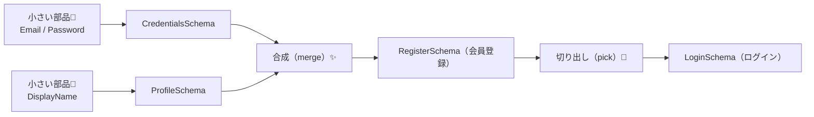

# 第282章：スキーマの合成と再利用（`merge`, `pick`）🧩

今日は「**スキーマをレゴみたいに組み立てて、何回も使い回す**」回だよ〜☺️💡
同じバリデーションをコピペしなくて済むから、後から仕様が変わっても修正がラクになるよ🧹✨

---

## 今日のゴール🎯

* ✅ 小さいスキーマ（部品）を作る🧩
* ✅ **合成（merge）**して大きいスキーマを作る✨
* ✅ **切り出し（pick）**で「必要な項目だけ」のスキーマを作る🍰

---

## 図でイメージ掴も〜🖼️✨（Mermaid）




---

## 1) merge（合成）ってなに？✨

「**別々に作った object スキーマ同士を合体**」することだよ💪

いまの Valibot だと、昔みたいな `merge()` 関数は基本使わずに、**`.entries` をスプレッドして `object()` を作り直す**のが王道だよ〜🧩✨（object が公式に “Merge several objects” 例も出してるよ）([valibot.dev][1])

ポイント：

* `v.object({ ...A.entries, ...B.entries })` で合体できる ([valibot.dev][1])
* 同じキーが被ったら、**後ろに書いたほうが勝つ**（JS のスプレッドのルールだよ）🙂
* `object` / `strictObject` / `looseObject` など種類があるので、「どれで合体後のスキーマを作るか」は自分で選ぶ感じになるよ🧠（その事情で `merge()` は提供されにくい、という説明があるよ）([valibot.dev][2])

---

## 2) pick（切り出し）ってなに？🍰

「**大きい object スキーマから、必要なキーだけ取り出す**」やつだよ💡
ログインって、会員登録より項目少ないよね？まさにそれ👏

* `v.pick(schema, ['email', 'password'])` みたいに書くよ ([valibot.dev][3])
* **注意⚠️**：`pick` は **`pipe()` 済みのスキーマに直接かけちゃダメ**（ランタイムエラーの原因になるかも、って公式が注意してる！）
  👉 **pick → pipe の順**にするのが安全だよ🫶 ([valibot.dev][3])

---

## 3) ハンズオン：会員登録＋ログインで「再利用」を体験しよ🧪✨

### 3-1. まずはスキーマを “部品化” して作る🧩

`src/lib/validation/authSchemas.ts` を作る想定だよ📁💕

```ts
// src/lib/validation/authSchemas.ts
import * as v from "valibot";

// ① 小さい部品（単体で使えるやつ）🧩
export const EmailSchema = v.pipe(
  v.string("メールは文字で入れてね✉️"),
  v.trim(),
  v.nonEmpty("メールが空だよ〜😵"),
  v.email("メールの形がちょっと変かも…🤔")
);

export const PasswordSchema = v.pipe(
  v.string("パスワードは文字で入れてね🔐"),
  v.nonEmpty("パスワードが空だよ〜😵"),
  v.minLength(8, "パスワードは8文字以上にしてね🔐")
);

export const DisplayNameSchema = v.pipe(
  v.string("表示名は文字で入れてね🧸"),
  v.trim(),
  v.nonEmpty("表示名が空だよ〜😵"),
  v.maxLength(20, "表示名は20文字までだよ✂️")
);

// ② “かたまり” を作る（まだ小さめ）🧱
export const CredentialsSchema = v.object({
  email: EmailSchema,
  password: PasswordSchema,
});

export const ProfileSchema = v.object({
  displayName: DisplayNameSchema,
});

// ③ merge（合成）✨
// ✅ いまのValibot流：entries をスプレッドして object を作る
export const RegisterSchema = v.object({
  ...CredentialsSchema.entries,
  ...ProfileSchema.entries,

  // ついでに規約チェックも追加（checkboxは checked だと "on" が来るよ✅）
  agree: v.literal("on", "規約にチェックしてね✅"),
});

// ④ pick（切り出し）🍰
export const LoginSchema = v.pick(RegisterSchema, ["email", "password"]);

// 型もついでに作れちゃう（便利！）✨
export type RegisterData = v.InferOutput<typeof RegisterSchema>;
export type LoginData = v.InferOutput<typeof LoginSchema>;
```

* `object()` は `.entries` を持ってて、それを使って合体できるよ ([valibot.dev][1])
* `pick()` は「必要キーだけ」スキーマを作るよ ([valibot.dev][3])
* `InferOutput` で型が取れるよ（変換が入ってもちゃんと出力型になる）([valibot.dev][4])

---

### 3-2. Server Action 側で使う（例）📨✨

登録用：`app/register/actions.ts`

```ts
// app/register/actions.ts
"use server";

import * as v from "valibot";
import { RegisterSchema } from "@/lib/validation/authSchemas";

export type RegisterState = {
  ok: boolean;
  fieldErrors: Record<string, string[]>;
};

const initial: RegisterState = { ok: false, fieldErrors: {} };

export async function registerAction(
  _prev: RegisterState,
  formData: FormData
): Promise<RegisterState> {
  const raw = Object.fromEntries(formData);

  const result = v.safeParse(RegisterSchema, raw);
  if (!result.success) {
    const flat = v.flatten<typeof RegisterSchema>(result.issues);
    return { ok: false, fieldErrors: flat.nested ?? {} };
  }

  // result.output は trim などが反映された “きれいな値” ✨
  // ここでDB保存とかする想定だよ🗃️
  return { ok: true, fieldErrors: {} };
}

export { initial as registerInitialState };
```

`flatten()` は「フォーム表示向け」にエラーを整形できるよ🧁 ([valibot.dev][5])

---

### 3-3. 画面（例）🖥️💕

`app/register/page.tsx`（エラー表示つき）

```tsx
// app/register/page.tsx
"use client";

import { useActionState } from "react";
import {
  registerAction,
  registerInitialState,
  type RegisterState,
} from "./actions";

export default function RegisterPage() {
  const [state, formAction] = useActionState<RegisterState, FormData>(
    registerAction,
    registerInitialState
  );

  return (
    <main style={{ maxWidth: 420, margin: "40px auto", padding: 16 }}>
      <h1>会員登録 ✨</h1>

      <form action={formAction} style={{ display: "grid", gap: 12 }}>
        <label>
          メール✉️
          <input name="email" type="email" style={{ width: "100%" }} />
          {state.fieldErrors.email?.[0] && (
            <p style={{ margin: 0 }}>⚠️ {state.fieldErrors.email[0]}</p>
          )}
        </label>

        <label>
          パスワード🔐
          <input name="password" type="password" style={{ width: "100%" }} />
          {state.fieldErrors.password?.[0] && (
            <p style={{ margin: 0 }}>⚠️ {state.fieldErrors.password[0]}</p>
          )}
        </label>

        <label>
          表示名🧸
          <input name="displayName" style={{ width: "100%" }} />
          {state.fieldErrors.displayName?.[0] && (
            <p style={{ margin: 0 }}>⚠️ {state.fieldErrors.displayName[0]}</p>
          )}
        </label>

        <label style={{ display: "flex", gap: 8, alignItems: "center" }}>
          <input name="agree" type="checkbox" />
          規約に同意する✅
        </label>
        {state.fieldErrors.agree?.[0] && (
          <p style={{ margin: 0 }}>⚠️ {state.fieldErrors.agree[0]}</p>
        )}

        <button type="submit">登録する🎉</button>

        {state.ok && <p>登録できたよ〜！🎊</p>}
      </form>
    </main>
  );
}
```

ログイン画面はもっと簡単で、**`LoginSchema` を使うだけ**になるよ🍰✨
（RegisterSchema の一部を `pick` して作ったから、バリデーションも自然に揃う！）

---

## 4) よくあるハマりポイント集⚠️（ここ大事！）

### ✅ merge で同じキーが被った

* 例：`email` が両方にある
  👉 **後ろに書いた方が上書き**されるよ（意図して上書きならOK👍）

### ✅ pick と pipe の順番ミス

* ❌ `v.pick(v.pipe(...), [...])` みたいにすると危ない
* ✅ **pick してから pipe** にしてね
  公式も「pipe 済み schema を pick に渡すのはダメ」って言ってるよ([valibot.dev][3])

---

## 5) ミニ練習✍️✨

次の3つを作ってみてね🥳

1. `AccountSchema`（email/password/displayName を全部持つ）🧱
2. `RegisterSchema` を **merge** で組み立てる✨
3. `LoginSchema` を **pick** で作る🍰（email/password だけ）

できたら、「displayName の最大文字数」を 20 → 30 に変えてみて？
会員登録もログインも **同じ部品が効いてる**のが実感できるはず☺️🫶

---

## まとめ🧡

* **merge（合成）**：`v.object({ ...A.entries, ...B.entries })` で “合体” ✨ ([valibot.dev][1])
* **pick（切り出し）**：`v.pick(schema, ['key'])` で “必要分だけ” 🍰 ([valibot.dev][3])
* スキーマは「部品化」すると、修正が一瞬になって気持ちいい😆✨

次の章（第283章）はフォームライブラリ連携だね📋💕
この章の merge/pick ができてると、連携がめちゃラクになるよ〜！🚀

[1]: https://valibot.dev/api/object/ "object | Valibot"
[2]: https://valibot.dev/guides/migrate-to-v0.31.0/ "Migrate to v0.31.0 | Valibot"
[3]: https://valibot.dev/api/pick/ "pick | Valibot"
[4]: https://valibot.dev/api/InferOutput/?utm_source=chatgpt.com "InferOutput"
[5]: https://valibot.dev/api/flatten/?utm_source=chatgpt.com "flatten"
