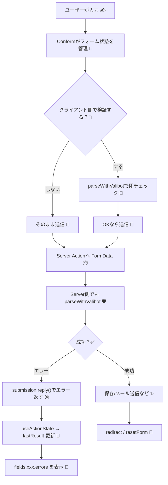

# 第283章：フォームライブラリ（Conform等）との連携概要📋

この章は「フォームを気持ちよく作る」ための全体像だよ〜☺️🫶
Next.js（App Router）で **Server Actions** を使うなら、フォーム周りは **Conform** みたいな“フォーム専用ライブラリ”と相性が良いです✨ ([ja.conform.guide][1])

---

## 1) フォームライブラリって何してくれるの？🤔💡

フォームって、放っておくとこうなりがち👇😵‍💫

* 入力値の管理が増える（stateだらけ）🌀
* エラー表示が散らかる（どこに出すの？）😢
* サーバー側のバリデーション結果を、画面に戻すのが面倒💦
* a11y（aria-〜）を毎回書くのつらい🥹

**Conform** は、これを「HTMLフォームのまま」きれいに整理してくれる感じ🌸
`useForm()` でフォーム全体と各フィールドの“メタ情報”を持って、`getFormProps / getInputProps` で必要な属性（a11y含む）も付けやすいです✨ ([ja.conform.guide][1])

---

## 2) Valibot と組むと何が嬉しいの？🤖🛡️

**Valibotのスキーマを1個作る** → それを

* クライアント側の事前チェック（任意）🧪
* サーバー側の最終チェック（必須）🛡️

に **同じスキーマで再利用**できるのが強い💪✨
Conform には `parseWithValibot` / `getValibotConstraint` が用意されてるよ〜！ ([ja.conform.guide][2])

---

## 3) 全体の流れ（ざっくり図解）🧭✨




`useActionState` は、React 19 / Next.js で Server Actions の結果（成功・失敗）を受け取る定番になってるよ〜✨ ([React][3])

---

# 4) ミニ実装：お問い合わせフォームをConform + Valibotで作る📮💖

ここでは `/contact` に **名前・メール・本文** のフォームを作るよ〜😊

## 4-1) インストール（PowerShell）📦✨

```bash
npm i @conform-to/react @conform-to/valibot valibot
```

（Conform本体 + Valibot連携パッケージ + Valibot）だね🙌 ([ja.conform.guide][2])

---

## 4-2) スキーマを作る（Valibot）🧩🤖

**`app/contact/schema.ts`**

```ts
import * as v from 'valibot';

export const contactSchema = v.object({
  name: v.pipe(
    v.string(),
    v.nonEmpty('お名前を入力してね🙂')
  ),
  email: v.pipe(
    v.string(),
    v.nonEmpty('メールアドレスを入力してね📧'),
    v.email('メールの形がちょっと変かも…🥺')
  ),
  message: v.pipe(
    v.string(),
    v.nonEmpty('本文が空っぽだよ〜📝'),
    v.minLength(10, '本文は10文字以上でお願い🙏')
  ),
});

export type ContactInput = v.InferInput<typeof contactSchema>;
```

Valibot は `pipe()` で「小さい検証を積み上げる」スタイルが基本だよ〜✨ ([Valibot][4])

---

## 4-3) Server Action（サーバー側の最終バリデーション）🛡️🔥

**`app/contact/actions.ts`**

```ts
'use server';

import { parseWithValibot } from '@conform-to/valibot';
import { contactSchema } from './schema';

export async function submitContact(
  _prevState: unknown,
  formData: FormData
) {
  const submission = parseWithValibot(formData, {
    schema: contactSchema,
  });

  // ❌ 失敗：エラーと入力値を返す（Conformが表示に使う）
  if (submission.status !== 'success') {
    return submission.reply();
  }

  // ✅ 成功：本当はここでDB保存やメール送信など✨
  // await saveContact(submission.value);

  // 送信後にフォームを空にしたいなら resetForm: true
  return submission.reply({ resetForm: true });
}
```

`parseWithValibot()` は FormData をスキーマで解析して、結果（成功/失敗や値）をまとめて返してくれるよ〜🧪✨ ([ja.conform.guide][2])
`submission.reply({ resetForm: true })` で送信後リセットもできるよ〜🧼✨ ([GitHub][5])

---

## 4-4) フォームUI（Conform + useActionState）💞🧾

**`app/contact/ContactForm.tsx`**

```tsx
'use client';

import { useActionState } from 'react';
import {
  getFormProps,
  getInputProps,
  getTextareaProps,
  useForm,
} from '@conform-to/react';
import {
  getValibotConstraint,
  parseWithValibot,
} from '@conform-to/valibot';

import { contactSchema } from './schema';
import { submitContact } from './actions';

export function ContactForm() {
  const [lastResult, formAction, pending] = useActionState(submitContact, undefined);

  const [form, fields] = useForm({
    lastResult,

    // スキーマから required / minLength などを推測して付与できる✨
    constraint: getValibotConstraint(contactSchema),

    // クライアント側の検証（任意）
    onValidate({ formData }) {
      return parseWithValibot(formData, { schema: contactSchema });
    },

    // 触ったら検証 → 入力で再検証、が体験よくておすすめ😊
    shouldValidate: 'onBlur',
    shouldRevalidate: 'onInput',
  });

  return (
    <form {...getFormProps(form)} action={formAction} noValidate>
      <h1>お問い合わせ📮</h1>

      {/* フォーム全体のエラー（必要なら） */}
      {form.errors && (
        <p id={form.errorId} style={{ marginTop: 8 }}>
          {form.errors}
        </p>
      )}

      <div style={{ marginTop: 12 }}>
        <label htmlFor={fields.name.id}>お名前</label><br />
        <input {...getInputProps(fields.name, { type: 'text' })} />
        {fields.name.errors && (
          <div id={fields.name.errorId}>
            {fields.name.errors}
          </div>
        )}
      </div>

      <div style={{ marginTop: 12 }}>
        <label htmlFor={fields.email.id}>メール</label><br />
        <input {...getInputProps(fields.email, { type: 'email' })} />
        {fields.email.errors && (
          <div id={fields.email.errorId}>
            {fields.email.errors}
          </div>
        )}
      </div>

      <div style={{ marginTop: 12 }}>
        <label htmlFor={fields.message.id}>本文</label><br />
        <textarea {...getTextareaProps(fields.message)} rows={5} />
        {fields.message.errors && (
          <div id={fields.message.errorId}>
            {fields.message.errors}
          </div>
        )}
      </div>

      <button type="submit" disabled={pending} style={{ marginTop: 16 }}>
        {pending ? '送信中…⏳' : '送信する🚀'}
      </button>
    </form>
  );
}
```

* `useActionState` は「Server Actionの結果」と「送信中かどうか」を扱えるよ〜⏳✨ ([React][3])
* `useForm({ lastResult })` に渡すと、サーバーから返ってきたエラーをフォームに反映できるよ🧯 ([conform.guide][6])
* `getFormProps / getInputProps` は、a11y含むpropsをいい感じに付けるためのヘルパーだよ😊 ([ja.conform.guide][7])
* `getValibotConstraint` は、Valibotスキーマから入力制約（required/minLengthなど）を推測してくれる✨ ([ja.conform.guide][8])

---

## 4-5) ページで表示する🏠✨

**`app/contact/page.tsx`**

```tsx
import { ContactForm } from './ContactForm';

export default function ContactPage() {
  return <ContactForm />;
}
```

---

# 5) 「Conform等」の“等”って？他の選択肢も軽く👀✨

* **Conform**：Server Actions + HTMLフォームの流れにピッタリ、Progressive Enhancement（JSなくても成立しやすい）寄り🌱 ([ja.conform.guide][1])
* **React Hook Form**：クライアントでリッチに制御したいフォームに強い🎮（ただしServer Actions中心の設計だと“つなぎ方”を工夫することもある）

この教材の流れ（Server Actions多め）だと、まず Conform を軸にできると気持ちいいよ〜😊💖

---

# 6) よくあるつまづき 🪤😵‍💫

* **`name` 属性（＝フィールド名）を崩す** → サーバーが受け取れない😭
  → Conformの `getInputProps(fields.xxx, …)` を使うと安全✨ ([ja.conform.guide][9])
* **サーバー側バリデーションを省く** → セキュリティ的にNG🙅‍♀️（最終チェックは必須だよ🛡️）
* **`useFormState` と `useActionState` を混ぜて迷子**
  → React 19 / Next.js 15 では `useActionState` 推しだよ〜✨ ([Next.js][10])

---

# 7) ミニ練習（5〜10分）💪🌸

1. `message` を「20文字以上」にしてみよ〜✍️✨
2. 送信成功したら、`return submission.reply({ resetForm: true })` のまま「成功メッセージ」を表示してみよ〜🎉

   * ヒント：`form.status` や `lastResult` を見て分岐する感じ（Conformのメタデータにあるよ） ([conform.guide][6])

---

次の章（第284章）は、この流れを使って **堅牢な入力フォーム + API通信** に育てていくよ〜🔒🚀

[1]: https://ja.conform.guide/?utm_source=chatgpt.com "Conform / 概要"
[2]: https://ja.conform.guide/api/valibot/parseWithValibot "Conform / parseWithValibot"
[3]: https://react.dev/reference/react/useActionState?utm_source=chatgpt.com "useActionState"
[4]: https://valibot.dev/guides/pipelines/?utm_source=chatgpt.com "Pipelines"
[5]: https://github.com/edmundhung/conform/discussions/606?utm_source=chatgpt.com "How to avoid reseting the form after succesfull submission"
[6]: https://conform.guide/api/react/useForm "Conform / useForm"
[7]: https://ja.conform.guide/api/react/getFormProps?utm_source=chatgpt.com "getFormProps"
[8]: https://ja.conform.guide/api/valibot/getValibotConstraint "Conform / getValibotConstraint"
[9]: https://ja.conform.guide/api/react/getInputProps?utm_source=chatgpt.com "getInputProps"
[10]: https://nextjs.org/docs/app/guides/upgrading/version-15?utm_source=chatgpt.com "Upgrading: Version 15"
