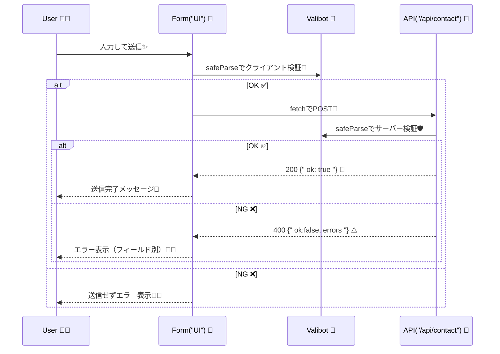
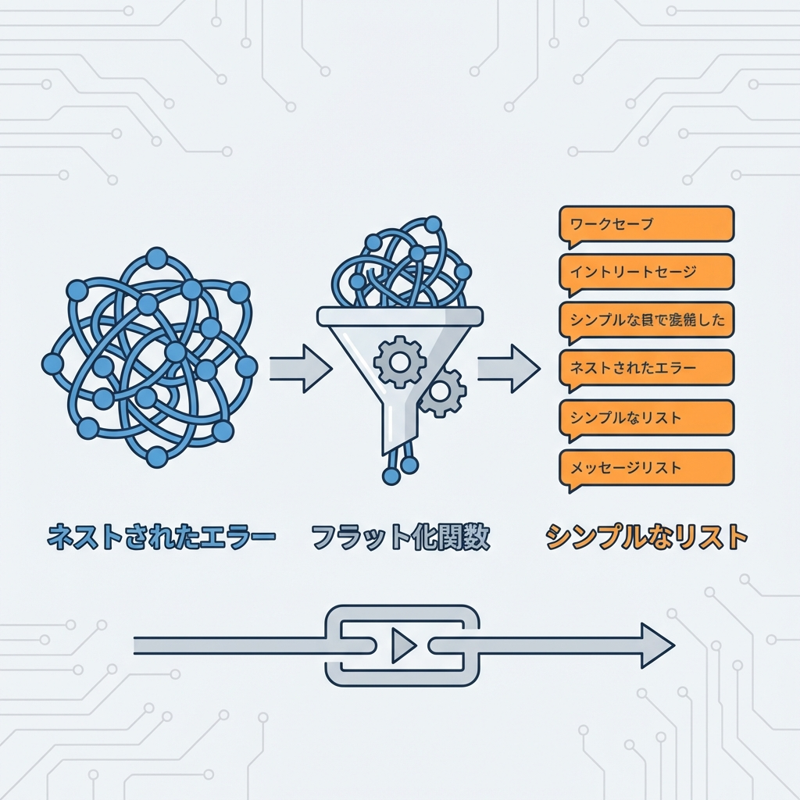

# 第284章：ミニ課題：堅牢な入力フォームとAPI通信🔒

今回は「お問い合わせフォーム」を作りながら、**入力チェック（Valibot）→ API通信 → エラー表示**までを “ちゃんと堅牢に” 仕上げるよ〜！🥰🌸
（クライアントでチェックしても、**サーバーでも必ずもう一回チェック**するのが大事だよ🛡️）

Valibot の safeParse / flatten を使って、失敗時のエラーを扱いやすくするよ〜！ ([Valibot][1])
API は App Router の Route Handlers（app/api/.../route.ts）で作るよ〜！ ([Next.js][2])

---

## 今日のゴール🏁✨

* フォーム（/contact）で入力📝
* **クライアント側で Valibot 検証**（送信前に止める）🔎
* **API（/api/contact）に POST**📡
* **サーバー側でも Valibot 検証**（信用しない）🛡️
* エラーは **flatten** して、**フィールド別に表示**😵‍💫→😌

---

## 全体の流れ（図解）🗺️✨




---

## 作るファイルたち📁✨

（src/ がある構成でも同じ！なければそのままルートに作ってOKだよ🙆‍♀️）

```txt
lib/
  contactSchema.ts
app/
  contact/
    page.tsx
  api/
    contact/
      route.ts
components/
  ContactForm.tsx
  ContactForm.module.css
```

---

## 1) Valibot を入れる📦✨（PowerShellでOK）

```bash
npm i valibot
```

---

## 2) スキーマを作る（共通の“ルールブック”）📘✨

ファイル：lib/contactSchema.ts

```ts
import * as v from 'valibot';

export const ContactSchema = v.object({
  name: v.pipe(
    v.string('お名前は必須だよ📝'),
    v.trim(),
    v.minLength(2, 'お名前は2文字以上にしてね✨'),
    v.maxLength(30, 'お名前は30文字までだよ🙆‍♀️')
  ),
  email: v.pipe(
    v.string('メールアドレスは必須だよ📮'),
    v.trim(),
    v.email('メールアドレスの形がちょっと変かも…😳')
  ),
  message: v.pipe(
    v.string('メッセージは必須だよ💬'),
    v.trim(),
    v.minLength(10, 'メッセージは10文字以上でお願い🙏'),
    v.maxLength(500, 'メッセージは500文字までだよ🧹')
  ),
});

export type ContactInput = v.InferInput<typeof ContactSchema>;
export type ContactOutput = v.InferOutput<typeof ContactSchema>;
```

ポイント💡

* v.pipe と v.trim を組み合わせて「前後の空白」を自然に削れるよ〜！ ([Valibot][3])
* 型もスキーマから推論できてラクちん✨ ([Valibot][4])

---

## 3) API を作る（サーバーで“最後の砦”🛡️）📡✨



ファイル：app/api/contact/route.ts

```ts
import * as v from 'valibot';
import { NextResponse } from 'next/server';
import { ContactSchema } from '@/lib/contactSchema';

type FlatErrors = {
  root?: string[];
  nested?: Record<string, string[]>;
  other?: string[];
};

export async function POST(request: Request) {
  let body: unknown;

  try {
    body = await request.json();
  } catch {
    const errors: FlatErrors = { root: ['リクエストの形式が変かも…（JSONが読めない）😵‍💫'] };
    return NextResponse.json({ ok: false, errors }, { status: 400 });
  }

  const result = v.safeParse(ContactSchema, body);

  if (!result.success) {
    const flat = v.flatten(result.issues); // root / nested / other に分けてくれる✨
    return NextResponse.json({ ok: false, errors: flat }, { status: 400 });
  }

  // ここでDB保存やメール送信…の代わりに「ちょい待ち」だけ入れて雰囲気を出すよ⏳
  await new Promise((r) => setTimeout(r, 400));

  return NextResponse.json({ ok: true }, { status: 200 });
}
```

メモ📝

* Route Handlers は app ディレクトリ内で使う API の作り方だよ〜 ([Next.js][2])
* NextResponse.json で JSON をスパッと返せるよ✨ ([Next.js][5])
* flatten は issues を「表示しやすい形」にしてくれるよ（root / nested / other） ([Valibot][6])

---

## 4) フォームUIを作る（送信前チェック→API）📝📨✨

ファイル：components/ContactForm.tsx

```tsx
'use client';

import { useState } from 'react';
import * as v from 'valibot';
import { ContactSchema, type ContactInput } from '@/lib/contactSchema';
import styles from './ContactForm.module.css';

type FlatErrors = {
  root?: string[];
  nested?: Record<string, string[]>;
  other?: string[];
};

export function ContactForm() {
  const [values, setValues] = useState<ContactInput>({
    name: '',
    email: '',
    message: '',
  });

  const [fieldErrors, setFieldErrors] = useState<Record<string, string[]>>({});
  const [formErrors, setFormErrors] = useState<string[]>([]);
  const [done, setDone] = useState(false);
  const [submitting, setSubmitting] = useState(false);

  const setField = (key: keyof ContactInput, value: string) => {
    setValues((prev) => ({ ...prev, [key]: value }));
  };

  const firstError = (key: string) => fieldErrors[key]?.[0];

  const handleSubmit = async (e: React.FormEvent) => {
    e.preventDefault();
    setDone(false);

    // ① 送信前にクライアントで検証🔎
    const client = v.safeParse(ContactSchema, values);
    if (!client.success) {
      const flat = v.flatten(client.issues);
      setFieldErrors(flat.nested ?? {});
      setFormErrors(flat.root ?? []);
      return;
    }

    // ② 通ったらAPIへ📡（でもサーバーも必ず検証するよ！）
    setSubmitting(true);
    setFieldErrors({});
    setFormErrors([]);

    try {
      const res = await fetch('/api/contact', {
        method: 'POST',
        headers: { 'Content-Type': 'application/json' },
        body: JSON.stringify(client.output),
      });

      const data: unknown = await res.json();

      // 返ってきた形を“それっぽく”読む（最小でOK）
      if (!res.ok) {
        const maybe = data as { ok?: boolean; errors?: FlatErrors };
        const errors = maybe.errors ?? { root: ['送信に失敗しちゃった…😵‍💫'] };

        setFieldErrors(errors.nested ?? {});
        setFormErrors(errors.root ?? ['送信に失敗しちゃった…😵‍💫']);
        return;
      }

      setDone(true);
      setValues({ name: '', email: '', message: '' });
    } catch {
      setFormErrors(['通信に失敗しちゃった…（ネットワーク）📶💦']);
    } finally {
      setSubmitting(false);
    }
  };

  return (
    <form onSubmit={handleSubmit} className={styles.form}>
      <h1 className={styles.title}>お問い合わせフォーム📮✨</h1>

      {formErrors.length > 0 && (
        <div className={styles.formErrorBox}>
          {formErrors.map((m, i) => (
            <p key={i} className={styles.formErrorText}>⚠️ {m}</p>
          ))}
        </div>
      )}

      {done && (
        <div className={styles.doneBox}>
          <p className={styles.doneText}>送信できたよ〜！ありがとう🥳💖</p>
        </div>
      )}

      <label className={styles.field}>
        <span className={styles.label}>お名前👤</span>
        <input
          className={styles.input}
          value={values.name}
          onChange={(e) => setField('name', e.target.value)}
          placeholder="例：さくら"
          disabled={submitting}
        />
        {firstError('name') && <p className={styles.error}>❌ {firstError('name')}</p>}
      </label>

      <label className={styles.field}>
        <span className={styles.label}>メール📧</span>
        <input
          className={styles.input}
          value={values.email}
          onChange={(e) => setField('email', e.target.value)}
          placeholder="例：sakura@example.com"
          disabled={submitting}
        />
        {firstError('email') && <p className={styles.error}>❌ {firstError('email')}</p>}
      </label>

      <label className={styles.field}>
        <span className={styles.label}>メッセージ💬</span>
        <textarea
          className={styles.textarea}
          value={values.message}
          onChange={(e) => setField('message', e.target.value)}
          placeholder="10文字以上でお願い🙏"
          disabled={submitting}
        />
        {firstError('message') && <p className={styles.error}>❌ {firstError('message')}</p>}
      </label>

      <button className={styles.button} disabled={submitting}>
        {submitting ? '送信中…⏳' : '送信する📨'}
      </button>

      <p className={styles.note}>
        💡ポイント：クライアントでOKでも、サーバーで必ずもう一回チェックするのが安全だよ🛡️✨
      </p>
    </form>
  );
}
```

---

## 5) ページに置く（/contact を作る）🛣️✨

ファイル：app/contact/page.tsx

```tsx
import { ContactForm } from '@/components/ContactForm';

export default function Page() {
  return (
    <main style={{ padding: 24 }}>
      <ContactForm />
    </main>
  );
}
```

---

## 6) ちょい見た目（CSS Modules）💅✨

ファイル：components/ContactForm.module.css

```css
.form {
  max-width: 520px;
  margin: 0 auto;
  display: grid;
  gap: 14px;
  padding: 18px;
  border: 1px solid #ddd;
  border-radius: 14px;
}

.title {
  margin: 0 0 6px;
  font-size: 22px;
}

.field {
  display: grid;
  gap: 6px;
}

.label {
  font-size: 14px;
}

.input,
.textarea {
  width: 100%;
  padding: 10px 12px;
  border: 1px solid #ccc;
  border-radius: 10px;
  font-size: 14px;
}

.textarea {
  min-height: 120px;
  resize: vertical;
}

.button {
  padding: 10px 12px;
  border: 0;
  border-radius: 12px;
  cursor: pointer;
  font-size: 15px;
}

.error {
  margin: 0;
  font-size: 13px;
}

.formErrorBox {
  padding: 10px 12px;
  border: 1px solid #e3b3b3;
  border-radius: 12px;
}

.formErrorText {
  margin: 0;
  font-size: 13px;
}

.doneBox {
  padding: 10px 12px;
  border: 1px solid #b7e3b3;
  border-radius: 12px;
}

.doneText {
  margin: 0;
  font-size: 13px;
}

.note {
  margin: 6px 0 0;
  font-size: 12px;
}
```

---

## 7) 動作チェック✅✨（ここ大事！）

1. npm run dev で起動🧑‍💻✨
2. ブラウザで /contact にアクセス🌐
3. わざとミスしてみてね👇

   * 名前：1文字 → ❌
   * メール：aaa → ❌
   * メッセージ：短い → ❌
4. ちゃんと入れて送る → 🎉

---

## ミニ課題：仕上げミッション🎓✨（できたら強い！）

* ✅ **サーバーのエラー**も必ず表示できる（通信失敗/400）📡⚠️
* ✅ 送信中はボタンを押せない（連打防止）🖱️🚫
* ✅ 「成功したらフォームを空にする」🥳🧹
* 🌟 余裕があれば：

  * 「message に URL が入ってたら弾く」みたいなルールを追加🔧
  * 「大学メール（.ac.jp）だけOK」みたいなルールに挑戦🎯

---

## おつかれさま〜！！🎉💖

ここまでできたら、もう **“フォーム＋API”の基本セット**は完成だよ🥰✨
次は「DB保存」「メール送信」「認証が絡むフォーム」みたいな方向にも、同じ型で広げられるよ〜！🚀💪

[1]: https://valibot.dev/api/safeParse/?utm_source=chatgpt.com "safeParse"
[2]: https://nextjs.org/docs/app/getting-started/route-handlers?utm_source=chatgpt.com "Getting Started: Route Handlers"
[3]: https://valibot.dev/guides/pipelines/?utm_source=chatgpt.com "Pipelines"
[4]: https://valibot.dev/guides/infer-types/?utm_source=chatgpt.com "Infer types"
[5]: https://nextjs.org/docs/app/api-reference/functions/next-response?utm_source=chatgpt.com "Functions: NextResponse"
[6]: https://valibot.dev/api/flatten/?utm_source=chatgpt.com "flatten"
