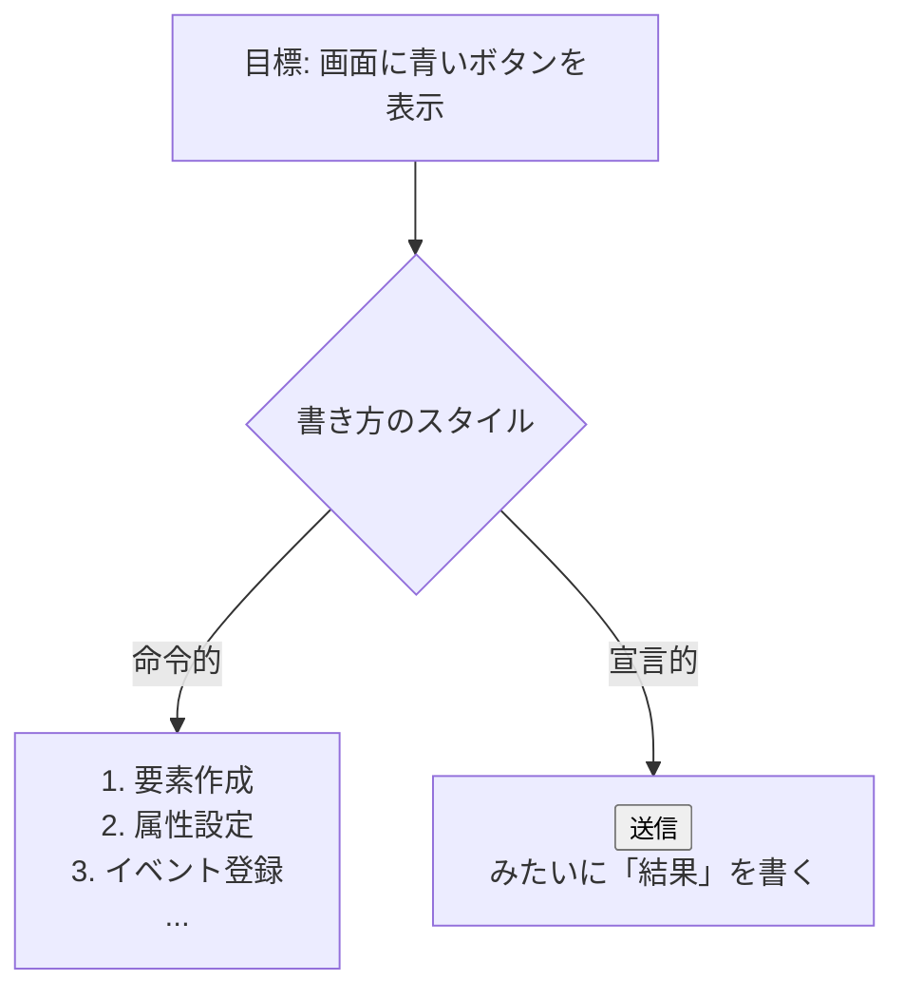
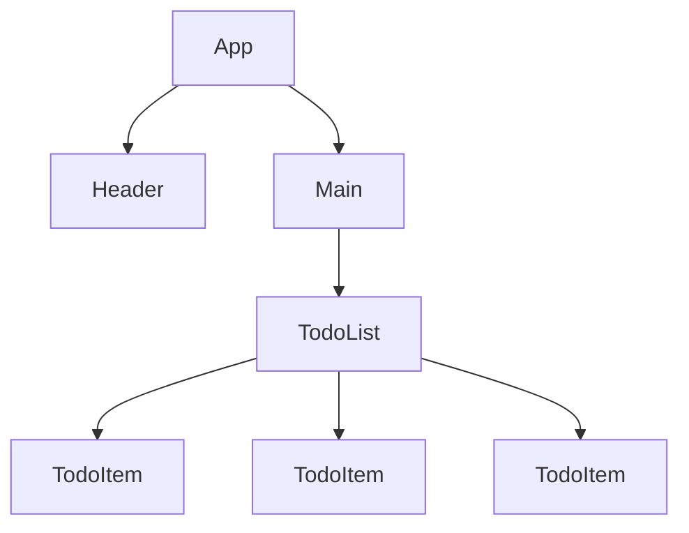
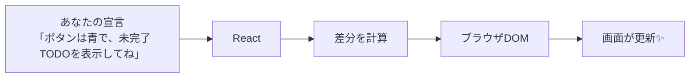
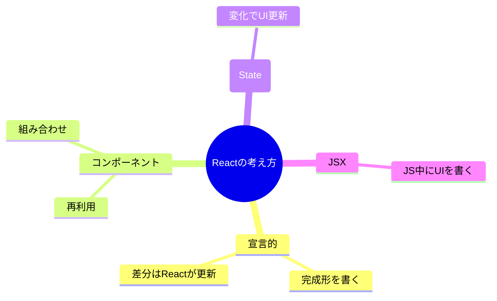

# 第1章：Reactってなに？

こんにちは！今日は **React** のいちばん大事な「考え方」を、やさしく＆サクッとつかみます。
キーワードは **宣言的（せんげんてき）**。つまり「やり方」じゃなくて **“結果（こうなっててほしい姿）”** を書くだけでOK、という発想です。🪄


---

## ゴール 🎯

* 「命令的」ではなく **「宣言的」** にUIを書くイメージをつかむ
* **コンポーネント** という「部品」発想を理解する
* Reactが **画面の差分だけ** を賢く更新してくれる仕組みをイメージで捉える

---

## まずは直感でOK：宣言的 vs 命令的 🤔➡️😊

**命令的（従来の発想）** は、ブラウザに対して
「ここにボタン作って、クラスつけて、クリックのイベントつけて…」と **手順をぜんぶ指示** します。

**宣言的（Reactの発想）** は、
「**青いボタンがここにある状態にしてね**」と **仕上がりの姿だけ** を書きます。やり方はReactが面倒見てくれます。



---

## ちょい見せ：命令的と宣言的のイメージ 🧪

（イメージ用の擬似コードです。雰囲気だけつかもう！）

**命令的（やり方を並べる）**

```tsx
// これはイメージ：DOMを自分で作って操作する感じ
const btn = document.createElement('button');
btn.textContent = '送信';
btn.className = 'blue';
btn.addEventListener('click', () => console.log('clicked'));
container.appendChild(btn);
```

**宣言的（完成形を宣言する）**

```tsx
// Reactの世界観：完成形（=UIの状態）を宣言
function App() {
  return <Button color="blue" onClick={() => console.log('clicked')}>送信</Button>;
}
```

> ね？「やり方の手順」より「完成形」を書くほうが、読みやすいし変更に強いよね🌈

---

## コンポーネントってなに？🔩🍰

**コンポーネント = UIの部品**。
ボタン、カード、ヘッダー、TODOアイテム… **ぜんぶ“部品”として再利用** できます。




* **小さい部品** をつくる → **組み合わせる** → **アプリになる**
* 部品ごとに見た目や動きを閉じ込められるから、**迷子になりにくい**＆**保守しやすい** 🧭

---

## Reactのざっくり仕組み 🧠⚙️

あなたは **「こういう画面にして！」** と宣言します。
Reactは **いまの画面** と **理想の画面** の違い（差分）を見つけて、**必要なとこだけ** サッと更新してくれます。



ポイントは **「差分だけ」**。
全部作り直さずに、**変わったとこだけ** 直すから、サクサクで安全💨

---

## JSXってなに？🧩（さわりだけ）

Reactでは **JSX** という書き方で、**JavaScriptの中にHTMLっぽくUIを記述** します。
見た目はHTML、実体はJavaScript。だから **ロジックとUIを気持ちよく連携** できるよ。

```tsx
function Hello() {
  const name = 'みなみ';
  return <p>こんにちは、{name} さん！</p>;
}
```

> `{ }` の中に **変数や式** を入れられるのが気持ちいいポイント🥰

---

## “状態（State）” が変わると、画面も変わる 🌗

アプリには「今なにを表示すべきか？」という **状態（state）** がいます。
**状態が変わる → Reactが自動で画面を更新**。
「ボタン押された！カウント+1」のような **動的なUI** を、宣言だけで扱えます。

（stateの詳しい使い方は後の章でたっぷりやるよ💪）

---

## よくある誤解をサクッと解消❗️

* **Q. Reactってフレームワーク？**
  **A. ライブラリ寄り**。でも、実際の開発では周辺ツールと一緒に使って **“フレームワーク的”** に運用されることが多いよ。
* **Q. Reactって難しそう…**
  **A. 考え方はシンプル**。「完成形」を宣言 → Reactが差分更新。
  まずはこの **原則** に慣れたら、スッと入れるよ🌟

---

## 3分ミニワーク ⏱️📝

1. 口で言ってみよう：
   **「左上にロゴ、右上にログインボタン、中央に検索ボックス」**
   これが **宣言** の感覚だよ！
2. 宣言っぽい書き方に言い換えてみよう：

   * 「ボタンを作成→青色→クリック登録」ではなく
   * **「青いボタン（クリックで送信）を配置」** と考える✨
3. コンポーネントの分割を妄想しよう：
   `Header` / `SearchBox` / `LoginButton` … **部品に名前をつける** だけでOK🧩

---

## 用語まとめ（やさしく）📚

* **宣言的UI**：結果だけ書く、やり方はReactが面倒見てくれる
* **コンポーネント**：再利用できるUI部品
* **JSX**：JavaScriptの中にHTML風にUIを書く記法
* **State（状態）**：画面の今の姿を決めるデータ。変わるとUIも変わる
* **差分更新**：変わったところだけを賢く直す

---

## チェックテスト（○/✕ でOK）📝✨

1. 「宣言的」は **“完成形（状態）を言う”** ことである。
2. Reactは **画面全体を毎回作り直す**。
3. コンポーネントは **小さく作って組み合わせる** と保守しやすい。

**答え**：1=○ / 2=✕（差分だけ直す）/ 3=○ 🙌

---

## 次章予告 🚀

**第2章：なんでReactなの？** では、従来のやり方と比べて **どこが嬉しいのか** を、実例でサクサク見ていくよ。
今日覚えた **「宣言的」「コンポーネント」「差分更新」** を心にメモっておけばバッチリ💡

---

## おまけ：概念カンペ（保存版）📎



> これさえ握っておけば、Reactの海でも迷わないよ〜🏄‍♀️🌊💙
