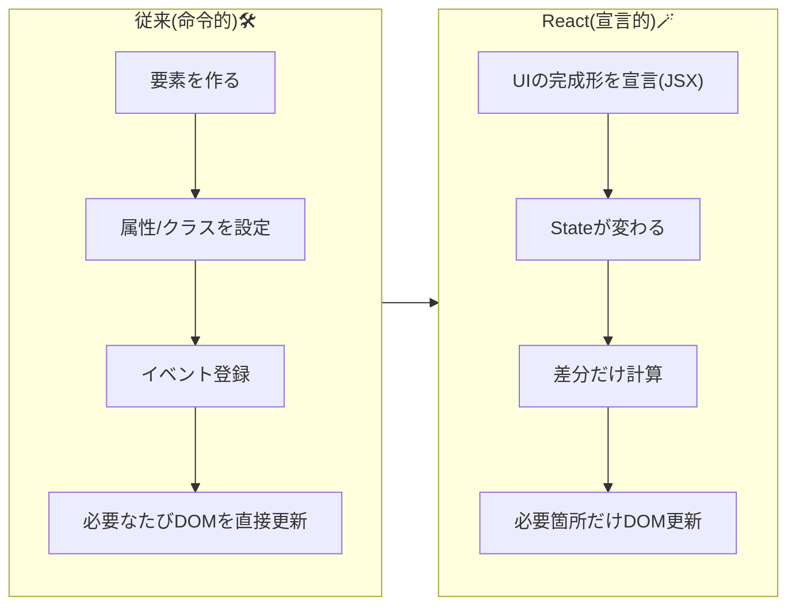
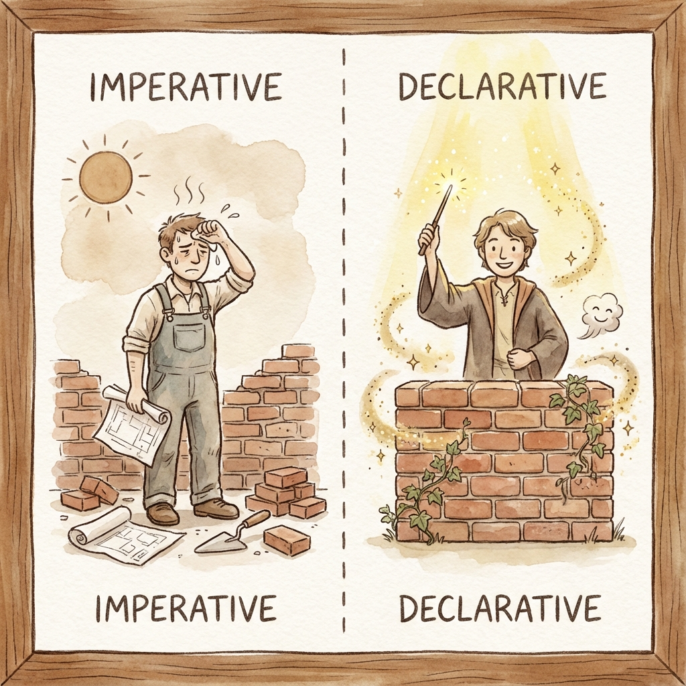
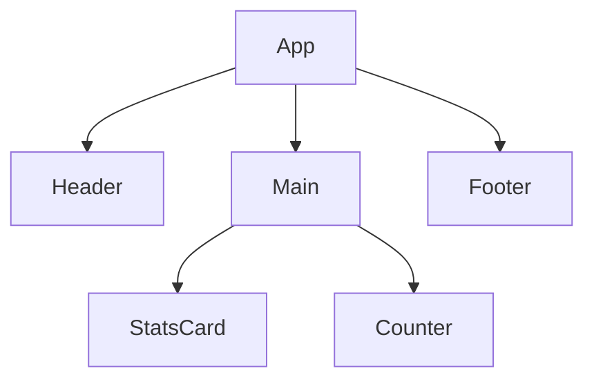
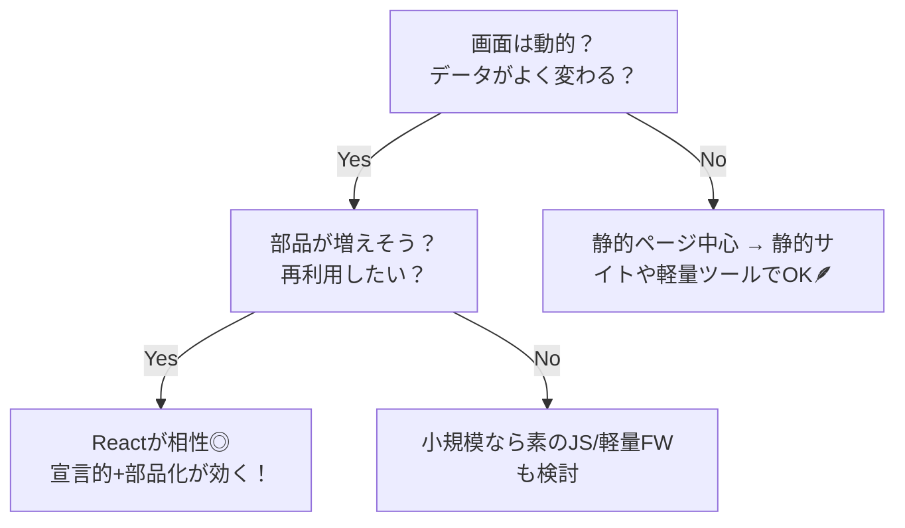
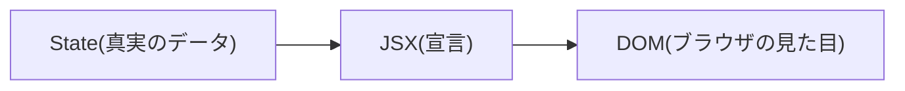
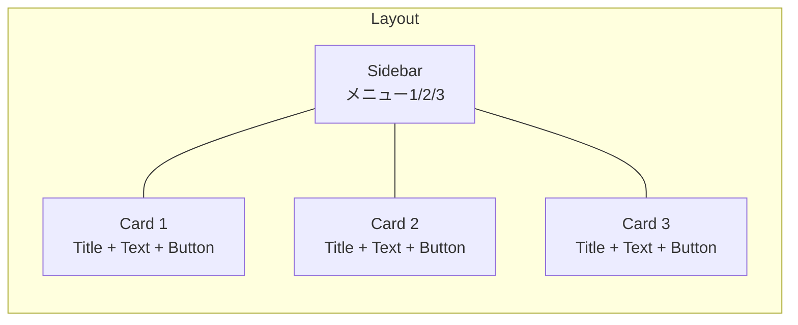

# 第2章：なんでReactなの？

「ボタンを押したら数字が増えるだけ」でも、素のJSやjQueryで作るとコードはあっちこっち…🥲
**React** は「こういう画面にして！」と**完成形を宣言**すれば、**差分だけ**をうまく更新してくれる相棒です。
ここでは、**従来（命令的）** と **React（宣言的）** の違いを、直感でつかみましょ〜！🌈

---

## この章のゴール 🎯

* 命令的UI（従来）と宣言的UI（React）の**発想の違い**がわかる
* Reactが**部品（コンポーネント）**で組み立てる利点を理解できる
* 小さな例で、**Reactのほうが保守しやすい理由**を感じられる

---

## ざっくり全体図 🗺️（従来 vs React）



👉 従来は**手順をぜんぶ指示**。Reactは**完成形を宣言**して、**差分更新**はおまかせ。



---

## 同じUIを「ちょいお題」で比較 🍰

> お題：**カウントを＋1するボタン**（クリックで数字が増えるだけ）

### 従来の考え方（命令的）🧩

* `div`を作る、`button`を作る、テキスト設定、イベントの追加、更新時は`textContent`を書き換え…
* 機能が増えると、**参照するDOM** や **イベント** が散らばりやすい💦

```tsx
// ふんいきコード（命令的）
const container = document.getElementById('app');
let count = 0;

const label = document.createElement('span');
label.textContent = String(count);

const button = document.createElement('button');
button.textContent = '＋1';
button.addEventListener('click', function () {
  count = count + 1;
  label.textContent = String(count); // ← 毎回手でDOM更新
});

container?.appendChild(label);
container?.appendChild(button);
```

### Reactの考え方（宣言的）🧁

* **「今の状態（count）からこう見える」** をJSXで宣言。
* クリックで**状態（State）**だけを更新 → **見た目は自動で同期**😍

```tsx
// ふんいきコード（宣言的 / React）
import { useState } from 'react';

function Counter() {
  const [count, setCount] = useState(0);

  function onClick() {
    setCount(count + 1); // ← 状態だけ変える（見た目はReactがお任せ更新）
  }

  return (
    <div>
      <span>{count}</span>
      <button onClick={onClick}>＋1</button>
    </div>
  );
}
```

**違いのポイント**

* 従来：**やり方**（手順）を書いて、**自分でDOMをいじる**
* React：**結果**（UIの状態）を書いて、**ReactがDOMを最小限で直す**

---

## コンポーネントだから“増えても怖くない”🧱🧱🧱

画面を **部品（コンポーネント）** に分けて、**組み合わせ**で作れるのがReactの強み。
1つのページに機能が増えても、**部品ごと**に責任範囲を区切れるよ👍



* `Header` はナビだけ、`Counter` はカウントだけ、と**役割が明確**✨
* **再利用**もしやすい（別ページでも同じ`Counter`がすぐ使える）♻️

---

## Reactがうれしい場面 💡



**特にReactが得意なのは…**

* UI状態が**コロコロ変わる**（フォーム、フィルタ、タブ、ダッシュボード）
* 小さな部品を**たくさん組み合わせ**る必要がある
* **長期運用**で**保守性**を重視したい（人が増えても混乱しにくい）

---

## もう一つの“効き目” 🧪：**状態とUIのズレ防止**

従来は「変数の値」と「画面表示」を**自分で同期**しないとバグりやすい…😵‍💫
Reactは**状態（State）が真実**。**JSXはその写し鏡**。
→ **ズレが起きにくい**から、バグが減るし、読みやすい💖




> 「状態→宣言→DOM」の**一方向**がキレイ🌊

---

## チーム開発で光る✨ “読みやすさ＆変更の強さ”

* **読みやすさ**：UIの完成形が**JSXにまとまる**から迷子になりにくい
* **変更の強さ**：部品単位で変更できるので、**影響範囲が小さい**
* **型（TS）**とも相性バツグン：PropsやStateに型を付けて**エディタが支援**してくれる（のちの章で超活用するよ！）🧑‍💻

---

## ミニ演習 ⏱️3分チャレンジ

> お題：**「左にメニュー、右にカード3枚（タイトル＋説明＋ボタン）」** を宣言的に分解してみよう！

1. 部品に名前をつける：`Sidebar` / `Card` / `CardList` / `AppLayout` ✅
2. `Card` の中身を想像：`title` / `description` / `onClick`（押したら詳細へ） ✅
3. 「完成形」を口で宣言：
   **「右側に `<CardList>` を3つ並べ、各カードは `title/description` を表示、ボタン押下でアラート」** 🎉

（コードは次の章以降でガッツリやります！）

---

## よくある誤解をパパッと解消 🧹

* **Q. 「全部Reactにすべき？」**
  **A. ぜんぶじゃなくてOK！** 小さな動的UIだけReactにしてもよき。
* **Q. 「高速表示＝React？」**
  **A. 速さは設計しだい。** Reactは**複雑UIをわかりやすく**作るのが得意。
* **Q. 「難しそう…」**
  **A. まずは**「完成形を宣言する」**だけでOK**。小さく始めよう🌱

---

## 画面イメージ（レイアウトの雰囲気）🖼️



> こういう**箱の組み合わせ**を、**部品**として並べるイメージだよ📦📦📦

---

## まとめ 📌

* 従来：**手順（命令的）**を並べてDOMを手で更新
* React：**完成形（宣言的）**を書いて**差分更新**はおまかせ
* **部品化**できるから、**読みやすく**て**変更に強い**。長く使うほど良さがわかる🥰

---

## ミニテスト（○/✕）📝

1. Reactは**完成形を宣言**し、差分だけ更新してくれる。
2. 小さなUIでも**全部**Reactにしないと動かない。
3. コンポーネントは**再利用**や**保守**に役立つ。

**答え**：1=○ / 2=✕ / 3=○ ✅

---

## 次章予告 🚀

**第3章：「部品（コンポーネント）」っていう最強の考え方**
実際に**小さな部品**を作りながら、**組み合わせ**の気持ちよさを体験しよう〜！💪✨
