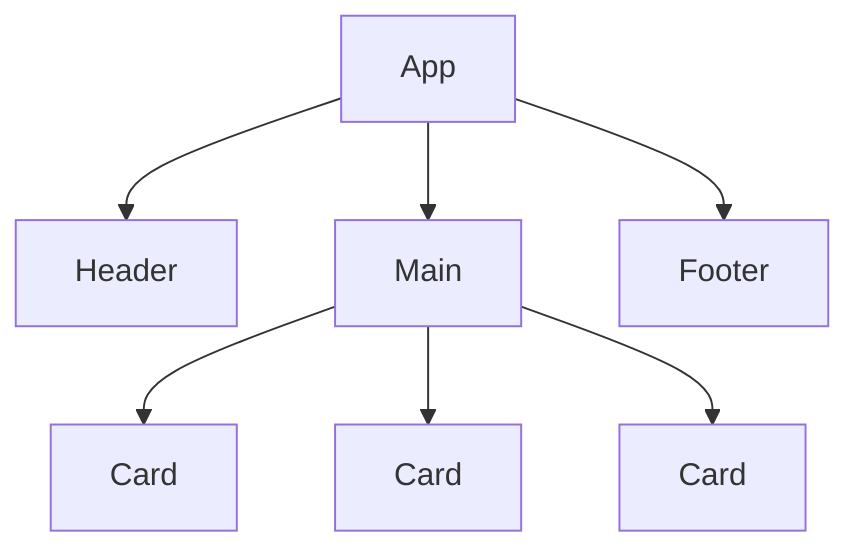
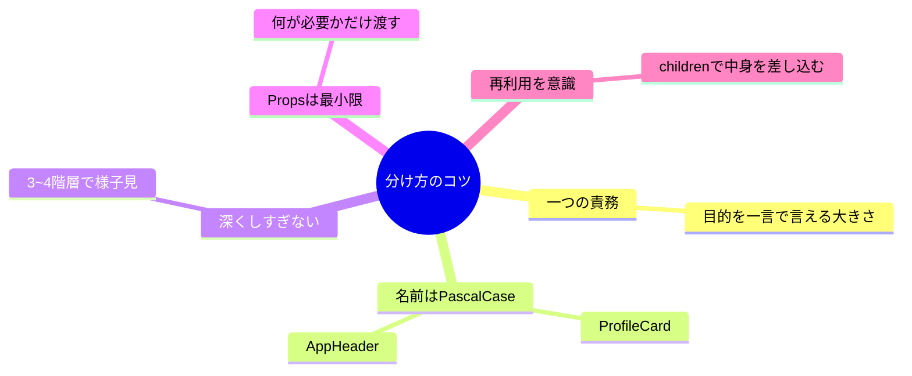
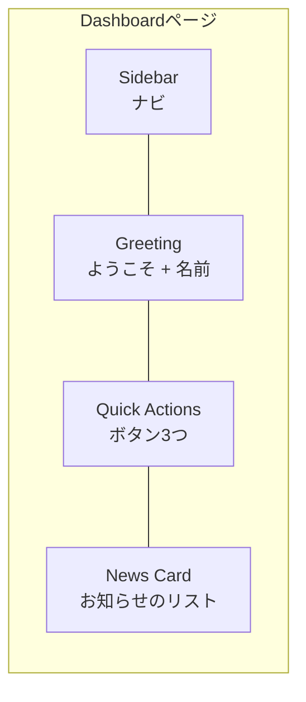

# 第3章：「部品（コンポーネント）」っていう最強の考え方

Reactのいちばんの武器は **コンポーネント（部品）**！
小さい部品を組み合わせて、レゴみたいにアプリを作れるよ🧩💖

---

## この章のゴール 🎯

* 「コンポーネント＝UIの部品」のイメージをはっきり掴む
* 関数コンポーネントの基本形（作る・使う・分ける）を体験する
* TypeScriptで**Props（部品が受け取るデータ）**に軽く型をつける

---

## まずは“部品で組み立てる”イメージ 🧠🧃



* **App** が最上位。その中に **Header / Main / Footer**
* **Main** の中に **Card** が並ぶ感じ！
* 小さく分けるほど、**読みやすい・直しやすい・再利用しやすい** ✨


---

## コンポーネントの基本形（関数で作るだけ）🧑‍🍳

> 「自己紹介カード」を小さく作って、Appに並べてみよう！


### 1) `ProfileCard.tsx` を新規作成 ✍️

```tsx
// src/components/ProfileCard.tsx
type ProfileCardProps = {
  name: string;
  department: string;
  emoji?: string; // ←オプショナル（なくてもOK）
};

export function ProfileCard({ name, department, emoji = "😊" }: ProfileCardProps) {
  return (
    <article
      style={{
        border: "1px solid #eee",
        borderRadius: 12,
        padding: 16,
        boxShadow: "0 2px 8px rgba(0,0,0,0.05)",
        background: "#fff",
      }}
    >
      <h3 style={{ margin: "0 0 8px", fontSize: 20 }}>
        {emoji} {name}
      </h3>
      <p style={{ margin: 0, color: "#555" }}>所属：{department}</p>
    </article>
  );
}
```

ポイント📝

* `type ProfileCardProps` で **Propsの形** を宣言
* 関数の引数で **分割代入** して、**デフォルト値**（`emoji = "😊"`）もOK
* **ひとつの責務**に集中（この部品は“自己紹介カード”だけ！）

---

### 2) `App.tsx` で使ってみる 🚀

```tsx
// src/App.tsx
import { ProfileCard } from "./components/ProfileCard";

export default function App() {
  return (
    <main style={{ padding: 24, display: "grid", gap: 16 }}>
      <h2>メンバー紹介 ✨</h2>
      <div style={{ display: "grid", gap: 16, gridTemplateColumns: "repeat(auto-fit, minmax(240px, 1fr))" }}>
        <ProfileCard name="ミナミ" department="デザイン" emoji="🎨" />
        <ProfileCard name="ソラ" department="エンジニア" emoji="🧑‍💻" />
        <ProfileCard name="ハル" department="マーケ" />
      </div>
    </main>
  );
}
```

> **作る：`export function ～`** → **使う：`<ProfileCard ... />`** これが基本の流れだよ🏃‍♀️💨

---

## “子要素”を受け取る（コンポジション）🧁

Cardの中に、**自由な中身（children）** を差し込めるようにすると、**再利用度が爆上がり**！


```tsx
// src/components/Card.tsx
type CardProps = {
  title: string;
  children: React.ReactNode; // ← なんでもOKな中身
};

export function Card({ title, children }: CardProps) {
  return (
    <section
      style={{
        border: "1px solid #eee",
        borderRadius: 12,
        padding: 16,
        background: "#fff",
      }}
    >
      <h3 style={{ marginTop: 0 }}>{title}</h3>
      <div>{children}</div>
    </section>
  );
}
```

使い方（中身を差し込むだけ👇）

```tsx
// src/App.tsx の一部
import { Card } from "./components/Card";

<Card title="お知らせ">
  <ul>
    <li>明日は学内ハッカソン🎉</li>
    <li>デザインLT会 18:00〜</li>
  </ul>
</Card>

<Card title="ショートカット">
  <button>新規作成</button>
</Card>
```

---

## “部品の分け方”のコツ 👩‍🔧💡



* **一つの責務**：その部品の役割が“短い説明”で言えるサイズに
* **PascalCase**：`ProfileCard` / `AppHeader` など
* **Propsは必要最小限**：渡しすぎは読みにくくなる
* **children** で中身を差し替え可能にすると使い回せる♻️


---

## “状態を持つ部品”と“見た目だけの部品” 🧠👀

* **Presentational（見た目）**：表示専用（`ProfileCard`, `Card`）
* **Stateful（状態あり）**：動き・インタラクションを持つ（`Counter`, `Modal` など）

例：`Counter` は状態あり、`Card` は見た目、**組み合わせる**とイイ感じ！

```tsx
// src/components/Counter.tsx
import { useState } from "react";

export function Counter() {
  const [count, setCount] = useState(0);
  return (
    <div>
      <p style={{ margin: 0 }}>Count: {count}</p>
      <button onClick={() => setCount((c) => c + 1)}>＋1</button>
    </div>
  );
}
```

```tsx
// こんな感じで合体！
<Card title="今日の元気メーター">
  <Counter />
</Card>
```

---

## “画面イメージ” を部品で考える練習 🖼️



> これをコンポーネントに落とすと…
> `Sidebar`, `Greeting`, `QuickActions`, `NewsCard` を **App** に並べるだけ！カンタン😍

---

## よくあるNG & その直し方 🙅‍♀️➡️🙆‍♀️

* **NG:** なんでもかんでも `App.tsx` に書いちゃう（**巨大コンポーネント**）
  **OK:** ファイルを分ける。**1ファイル=1責務** を目指す🗂️
* **NG:** Propsが多すぎる（`propA, propB, ..., propZ`）
  **OK:** 役割を分割する / `children` で中身を差し込む
* **NG:** 無理に親から孫へデータを渡す（**バケツリレー**）
  **OK:** まずは分割を見直す。必要になったら **Context** を使う（71章〜）

---

## 3分ミニワーク ⏱️✨

> **お題：** `Card` を使って **「タスクカード」** を作ってみよう！

* `TaskCard`（見た目の部品）を作る

  * Props：`title: string`, `due?: string`, `done?: boolean`
* `Card` の中で `TaskCard` を表示（`children` を活用してもOK）
* `App.tsx` に3枚並べる（今日・明日・今週みたいに）

**ヒント：** `done` が `true` のときはタイトルに ✅ をつけると可愛いよ〜🥰

---

## まとめ 📌

* コンポーネントは **UIの部品**。小さく作って**組み合わせ**！
* **Propsでデータを受け取り**、必要なら**状態（State）**を持つ部品に分ける
* **children** で中身を差し替え → **再利用性アップ** ♻️

---

## ミニテスト（○/✕）📝

1. コンポーネント名は `profileCard` のような**小文字**が望ましい。
2. `children` を使うと、カードの中身を差し替えできる。
3. 一つのコンポーネントに複数の責務を詰め込むと、保守性が上がる。

**答え：** 1=✕（PascalCase！）/ 2=○ / 3=✕ ✅

---

## 次章予告 🚀

**第4章：準備運動：Node.js と VS Code を入れる**
開発環境をサクッと整えて、**Vite + React + TypeScript** の快適ランウェイへ🛫💙
