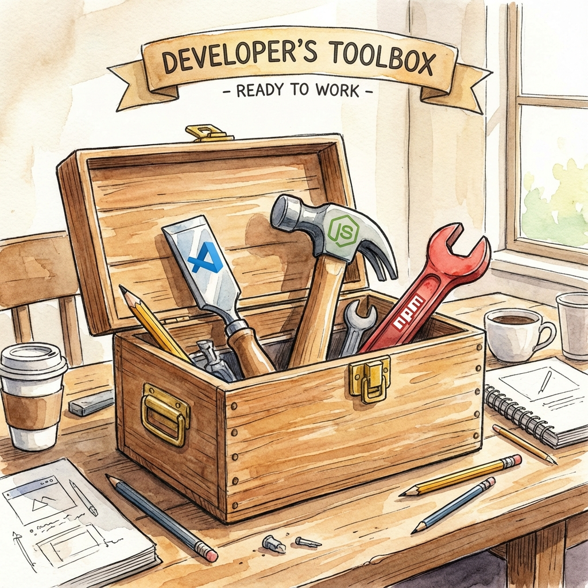
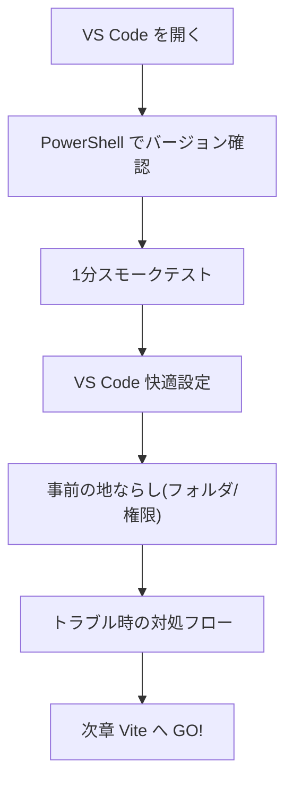
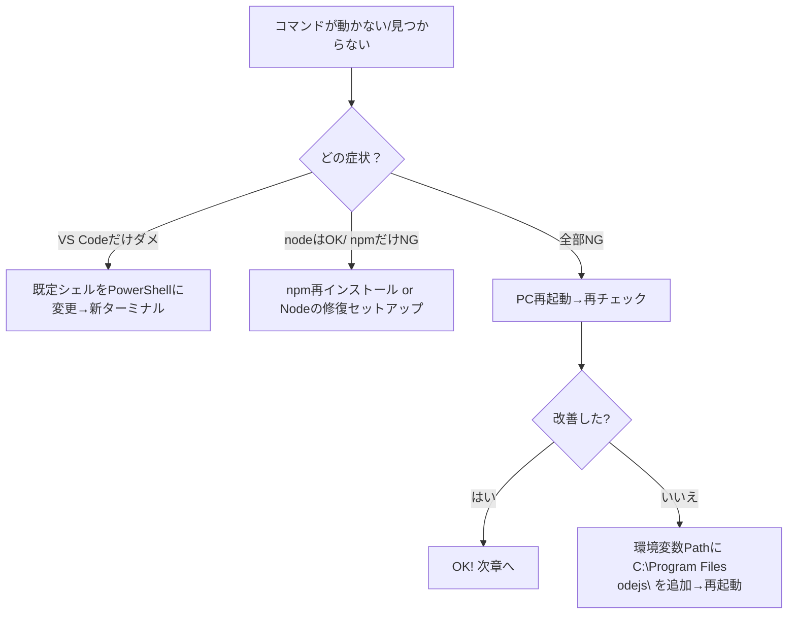
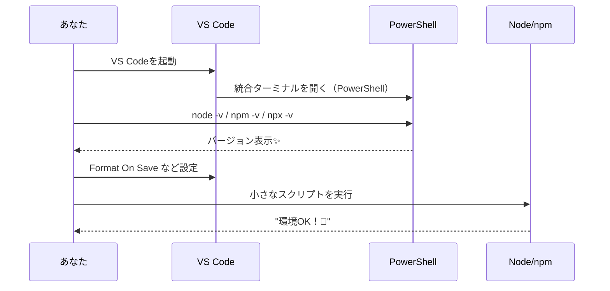

# 第4章：準備運動：Node.js と VS Code を入れる

Node.js と VS Code はもう入ってる前提だよね？ナイス〜！🙌
この章では **「動く環境かサクッと確認 → VS Code を気持ちよく整える → つまずきやすい所を先に回避」** の3本立てでいくよ。次章の Vite に気持ちよくバトンを渡そう〜🏃‍♀️💨

---

## この章のゴール 🎯

* PowerShell（VS Code 統合ターミナル）で `node/npm/npx` が動く
* VS Code の“保存で整形”など、**快適設定**がサクッと完了
* ありがちトラブルを**事前に回避**できる



---

## ざっくり全体図 🗺️



---

## 1) VS Code のターミナルを PowerShell に🪄

1. VS Code 上部メニュー **[表示] → [ターミナル]** を開く
2. ターミナル右上のドロップダウンから **PowerShell** を選択（既定化しておくと楽！）

> 迷ったら：**[ターミナル] → [既定のプロファイル] → PowerShell** を選択してね🫶

---

## 2) Node / npm / npx のバージョン確認 ✅

PowerShell（VS Code内）で下を順に実行して、**数字**が返ってくればOKだよ👇

```bash
node -v
npm -v
npx -v
```

例）`v20.x.x / 10.x.x / 10.x.x` みたいに出れば準備完了🎉

---

## 3) 1分スモークテスト（“ほんとに動く？”）⏱️

### A. Node が最小限の JS を走らせられるか

```bash
node -e "console.log('環境OK！🚀')"
```

### B. npm がパッケージコマンドを叩けるか（npx）

```bash
npx --yes cowsay "準備万端！"   # 実行後、かわいいアスキーアートが出ればOK🐮
```

> どれかでエラーが出たら、下の「トラブル時の対処フロー」を見てね🧯

---

## 4) VS Code を“気持ちよく”整える🧼✨

### A. 保存で自動整形（Prettier）

1. 右下の歯車 → **設定** を開く
2. 検索欄に **Format On Save** → ✅
3. 拡張機能で **Prettier** を入れておく

> これで JSX/TSX が**保存するだけでピカピカ**に整うよ💅


### B. おすすめ拡張（最小セット）

* **ESLint**：お作法を赤線で教えてくれる👮‍♀️
* **Prettier**：見た目を自動で整える🧹
* **Error Lens**：エラーや警告を行内で分かりやすく💡
* （好み）**Material Icon Theme**：ファイルアイコンがかわいくなる🎨

### C. 早見：設定を書きで入れたい派は `settings.json` に

> （**Ctrl + Shift + P** → 「設定（JSON）を開く」でもOK）

```json
{
  "editor.formatOnSave": true,
  "editor.tabSize": 2,
  "files.eol": "\n",
  "editor.codeActionsOnSave": {
    "source.fixAll.eslint": "explicit"
  }
}
```

---

## 5) 事前の“地ならし”🧱（つまずきポイント回避）

### A. 作業フォルダを決めておく（例：`C:\dev`）

**半角英数字＆スペースなし**が無難だよ。OneDrive直下だと権限で詰まることがあるので、
`C:\Users\<あなた>\dev` か `C:\dev` あたりが安心🏡

```bash
mkdir C:\dev
cd C:\dev
```

### B. PowerShell の実行ポリシー（まれに必要）

npm スクリプトがうまく走らない時があれば、**現在ユーザーだけ**緩めると解決することがあるよ。

```powershell
Get-ExecutionPolicy
# RemoteSigned 以外なら、下のコマンドを検討（管理者なしでOK）
Set-ExecutionPolicy -Scope CurrentUser -ExecutionPolicy RemoteSigned
```

> 迷ったら **今はスキップ** でOK。詰まったときだけ戻ってこよう🧭

### C. Git の確認（後で便利）

```bash
git --version
```

> 出なければ、後でインストールでも大丈夫（必須ではないけど便利だよ✨）

---

## 6) トラブル時の対処フロー 🧰



---

## 7) 30秒ミニワーク 🧪

1. `C:\dev` へ移動
2. これを打ってみて👇

```bash
node -e "console.log('Ready for Vite! ✨')"
```

表示されたら **準備100点満点**！ハイタッチ〜！🙌💖

---

## 画面イメージ（作業の流れ）🖼️



---

## まとめ 📌

* **PowerShell で `node/npm/npx` が動く**かチェック
* **Format On Save + Prettier/ESLint** で快適化
* **作業フォルダ**を決めて、**実行ポリシー**は必要なら調整

---

## 次章予告 🚀

**第5章：Viteでプロジェクトを爆速で始める**
`npm create vite@latest` で **React × TypeScript** の土台を一瞬で作るよ。いよいよ本番！🔥
