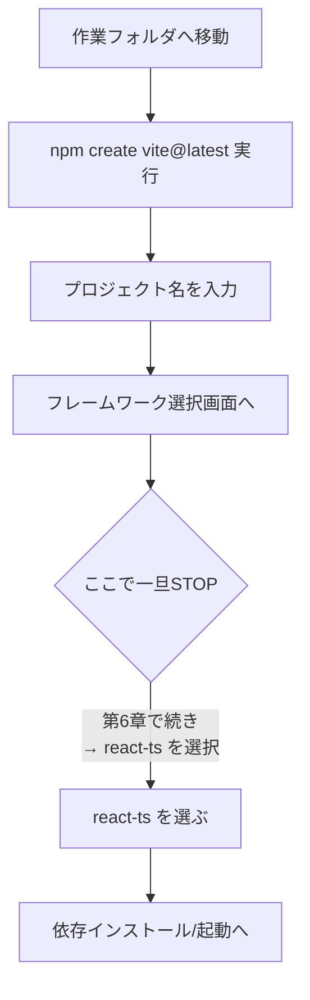
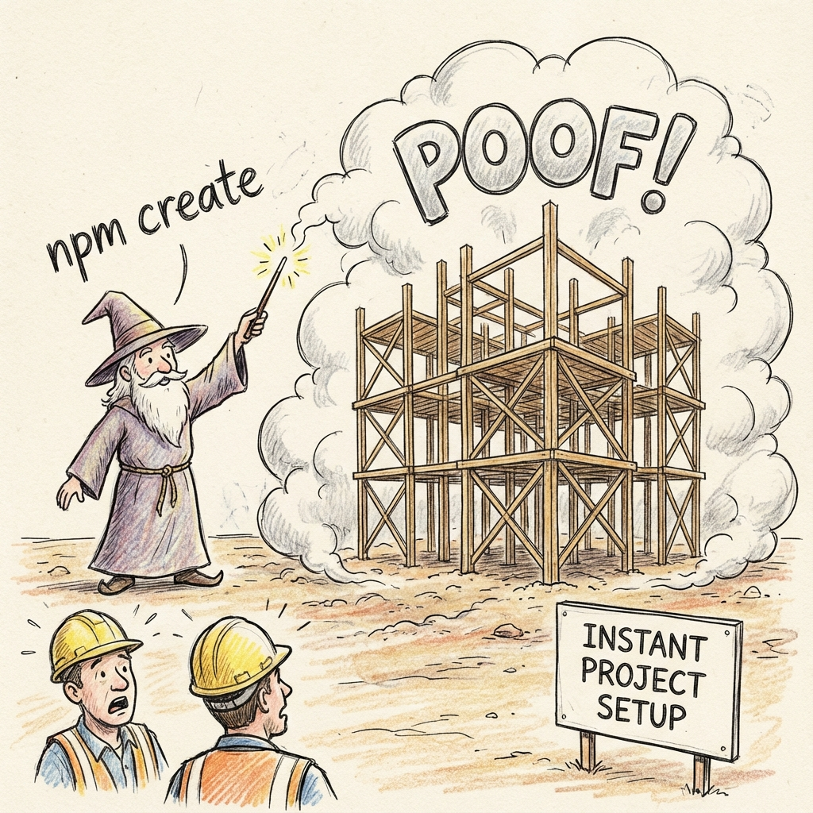
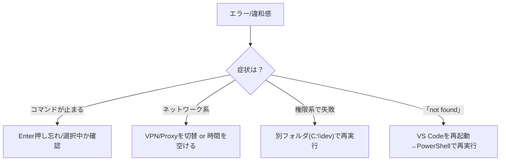

# 第5章：Viteでプロジェクトを爆速で始める

さあついに “箱づくり”！この章では **Vite** を使って、Reactアプリの土台をサクッと作成する流れを身につけよう✨
まだテンプレートは選ばないよ（それは **第6章** でじっくり！）😉


---

## ゴール 🎯

* VS Code のターミナル（PowerShell）から **`npm create vite@latest`** を実行できる
* 質問の意味が分かる＆安全に前へ進める
* よくあるつまずきポイントを自力で回避できる

---

## まずは全体像をつかもう 🗺️



---

## ステップ1：作業フォルダへ移動する 📁

作りかけのものと混ざらないよう、開発用フォルダ（例：`C:\dev`）を決めておくとラクだよ💡

```bash
# VS Code の統合ターミナル（PowerShell）で
cd C:\dev
```

> まだ無ければ `mkdir C:\dev` → `cd C:\dev` でOK！

---

## ステップ2：Vite の作成コマンドを実行 🎬

```bash
npm create vite@latest
```

* `npm create` は “一時的にパッケージを実行” する仕組み（`npx` と似た動き）💡
* `vite@latest` を指定することで、**最新の Vite スキャフォルダ**を使ってプロジェクトを生成するよ。



---

## ステップ3：対話プロンプトを理解する 🗣️❓

実行するとこんな質問が順に出るよ（出方はバージョンで少し変わることがあるけど、内容はほぼ同じ）👇

```bash
✔ Project name: …  my-react-app
✔ Select a framework: › - Use arrow-keys
    Vanilla
    Vue
    React
    Preact
    Svelte
    Solid
    Others
```

* **Project name**：フォルダ名にもなる。例：`my-react-app` 🏷️
* **Select a framework**：ここで **React** を選ぶのが王道だけど、**選択は第6章で解説**するので今回は **ここで一旦ストップ** ✋
  （Enter を押す手前で止めておこうね！）

> ちなみに、**プロジェクト名まで入れたけどやっぱりやり直したい**場合は、生成されたフォルダを消してもう一度コマンドを実行すればOK🧽

---

## ちょっと深掘り：`npm create` ってなに？🔍

* `npm create <pkg>` は内部的に **`npx create-<pkg>`** みたいなノリで “雛形作成ツール” を起動するおまじない。
* 一度きりの実行なので、グローバルに何かを固定インストールする必要はナシ。**最新版がサクッと使える**のが嬉しいポイント😊

---

## うっかり進めすぎたときのリカバリ 🧯

テンプレートまで選んじゃっても大丈夫！落ち着いて以下のどれかで戻れるよ。

```bash
# 1) 生成されたフォルダごと削除して最初から
rd /s /q .\my-react-app

# 2) そのまま残して別名で作り直す
npm create vite@latest
# Project name: my-react-app-2
```

> Windows の `rd /s /q` は**完全削除**なので、フォルダ名はよく確認してから実行してね⚠️

---

## つまずきポイントと対処法 🧰



* **止まった…？** → だいたい “選択待ち” か “入力待ち”。**矢印キー**で選択、**Enter**で決定できるよ。
* **会社PCでProxy** → いったん自宅回線やテザリングで試すと通ることあり🌐
* **OneDrive配下**で権限エラー → `C:\dev` などローカル直下に退避してやり直すと解決することが多いよ。

---

## ターミナルの“スクショ風”イメージ 🖼️

> 実際の画面は人によってちょっと違うけど、雰囲気はこんな感じだよ〜！

```bash
PS C:\dev> npm create vite@latest
Need to install the following packages:
  create-vite@latest
Ok to proceed? (y) y

✔ Project name: … my-react-app
✔ Select a framework: › React
  (ここで一旦ストップ！次章でテンプレート詳細を選ぶよ✨)
```

---

## 30秒ミニワーク ⏱️

1. `C:\dev` に移動して
2. **`npm create vite@latest`** を打って
3. **Project name** に `my-react-app` と入力 → **フレームワーク選択画面**が出たら **そのまま終了**（✖ を閉じる or `Ctrl + C`）

> これで次章のテンプレ解説に **ベストポジ** で入れるよ〜🙌

---

## まとめ 📌

* **`npm create vite@latest`** は “最新テンプレの箱作り” コマンド
* まずは **プロジェクト名** まで。テンプレ選択は **第6章**で！
* エラーは **待ち状態/ネットワーク/権限** のどれかが多い → 上の対処を順番に💪

---

## 次章予告 🎀

**第6章：テンプレートはもちろん `react-ts` を選ぶ！**
いよいよ **React × TypeScript** のテンプレ選択＆初期起動まで一気にやるよ〜！お楽しみに 🥳💕
