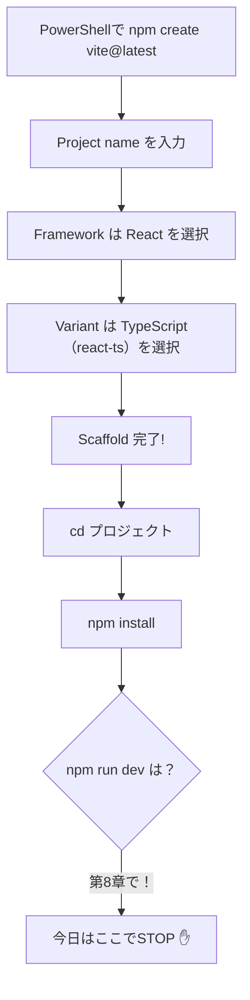
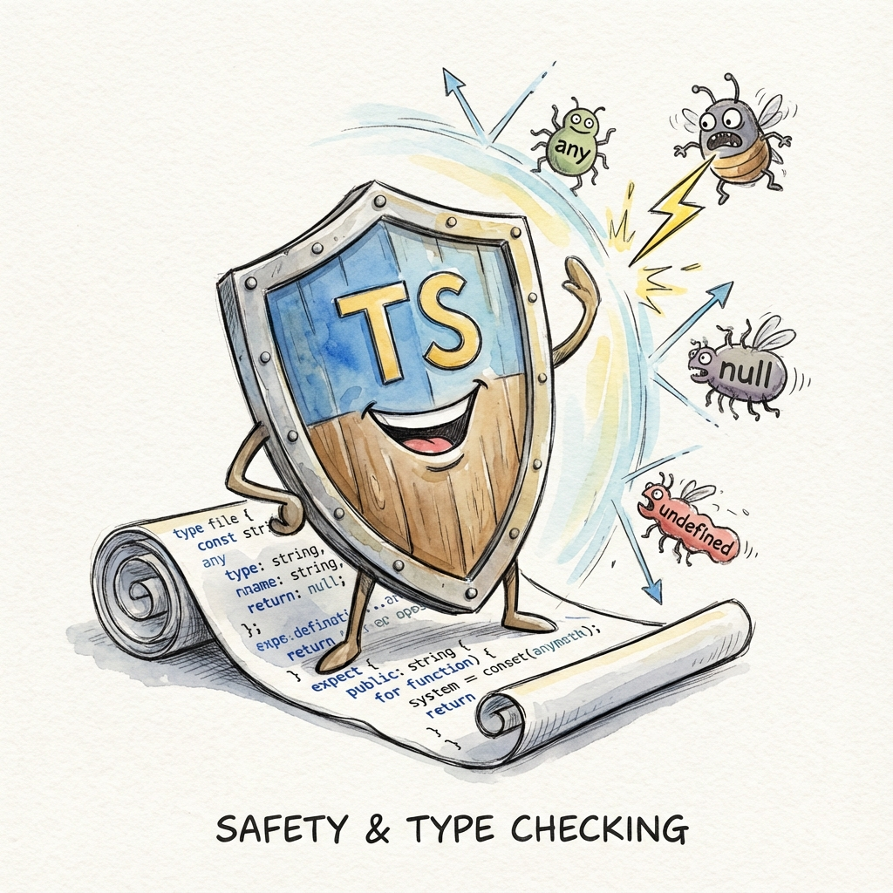
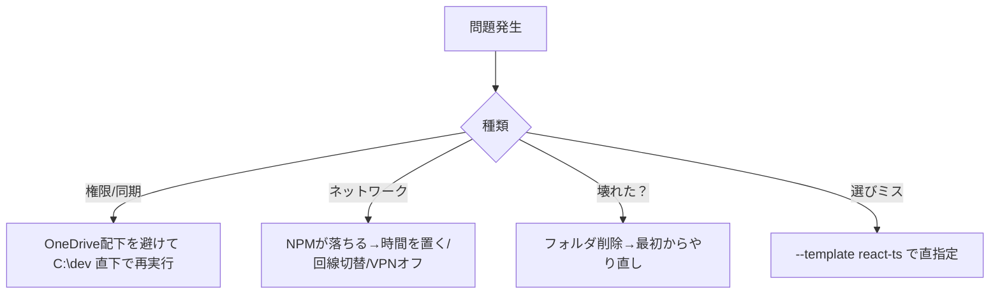

# 第6章：テンプレートはもちろん`react-ts`を選ぶ！

「箱（Vite）」はもう準備OKだよね？今日はその箱の中身、**React + TypeScript テンプレート（`react-ts`）** を選んで、プロジェクトの骨組みを完成させよう〜！💪💙

---

## ゴール 🎯

* 対話プロンプトで **React** → **TypeScript（react-ts）** を選べる
* プロジェクトが作成されて **`npm install`** まで完了
* 次章（第7章）で中身を覗ける状態になる

---

## 全体のながれ 🗺️



---

## やってみよう！ステップごとに💃

### 1) 前章の続きから（もしくは最初から）スタート

PowerShell で作業フォルダへ移動（例：`C:\dev`）しておこう📁

```bash
cd C:\dev
npm create vite@latest
```

> すでに「フレームワーク選択」の画面が出てる人は、そのまま **矢印キー** と **Enter** で続行してOK🙆‍♀️

---

### 2) Project name を入れる（フォルダ名にもなるよ）

```bash
✔ Project name: … my-react-app
```

* 例は `my-react-app`。他の名前でもOKだよ🧸

---

### 3) フレームワークは **React** を選ぶ

```bash
✔ Select a framework: › - Use arrow-keys
  Vanilla
  Vue
▶ React
  Preact
  Svelte
  Solid
  Others
```


---

### 4) Variant は **TypeScript**（= `react-ts`）を選ぶ

```bash
✔ Select a variant: › - Use arrow-keys
  JavaScript
▶ TypeScript      ← これが「react-ts」だよ！
  TypeScript + SWC (高速ビルド)
```

* **TypeScript** を選ぶと、テンプレート名でいう **`react-ts`** に相当するよ🧠
* もし **TypeScript + SWC** を選んでも大丈夫（速いビルドツール）。この講座ではどちらでも動くけど、まずは素直に **TypeScript** にしておくのが安心だよ💖



---

### 5) Scaffold（雛形生成）メッセージを確認

```bash
Scaffolding project in C:\dev\my-react-app...
Done. Now run:

  cd my-react-app
  npm install
  npm run dev
```

> まだ **`npm run dev` は第8章** でやるので、今日は **`npm install`** まで！🛑

---

### 6) 依存のインストール（`npm install`）

```bash
cd my-react-app
npm install
```

* これで必要パッケージが `node_modules` に入るよ🧰
* 終わったら **プロジェクト作成は成功**！次章で中身（`.tsx` や `tsconfig.json`）を見に行くよ👀

---

## もし対話が出ない/うまく選べない時の“直指定コマンド”🆘

対話プロンプトなしで一発作成したい時はテンプレートを**明示**しよう👇

```bash
# 例: my-react-app を react-ts で作成
npm create vite@latest my-react-app -- --template react-ts
cd my-react-app
npm install
```

> `--` の後ろで create-vite にそのままオプションを渡してるよ。便利〜🪄

---

## 画面のイメージ（スクショ風）🖼️

> 実際の見た目は少し違うかもだけど、雰囲気はこんな感じ〜！

```bash
PS C:\dev> npm create vite@latest
Need to install the following packages:
  create-vite@latest
Ok to proceed? (y) y

✔ Project name: … my-react-app
✔ Select a framework: › React
✔ Select a variant:  › TypeScript

Scaffolding project in C:\dev\my-react-app...
Done. Now run:

  cd my-react-app
  npm install
  npm run dev
```

---

## うまくいかない時のチェック表 🧰✅



* **OneDrive配下**だと権限/同期で詰まることがある→ローカル直下に退避🏠
* **やり直し**は `rd /s /q .\my-react-app`（※完全削除なので慎重に！）

---

## ミニワーク ⏱️（3分）

1. `npm create vite@latest` を実行
2. **React** → **TypeScript（react-ts）** を選ぶ
3. `cd my-react-app && npm install` まで完了させる
4. エラーが出たら上のチェック表で解消してみよう🧪

---

## 今日のまとめ 📌

* Vite の対話プロンプトで **React** → **TypeScript（react-ts）** を選択🌟
* `npm install` までできれば準備万端。
* 困ったら **`--template react-ts`** で直指定すればスムーズ！

---

## 次章予告 🎀

**第7章：Viteが作ったフォルダの中身をのぞく**
`.tsx` や `tsconfig.json` など、**TypeScript × React** の肝をやさしく案内するよ〜！お楽しみに🥳💫
