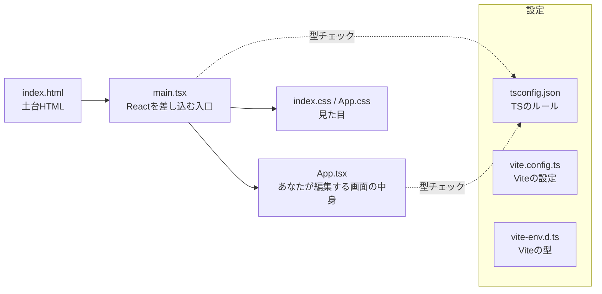
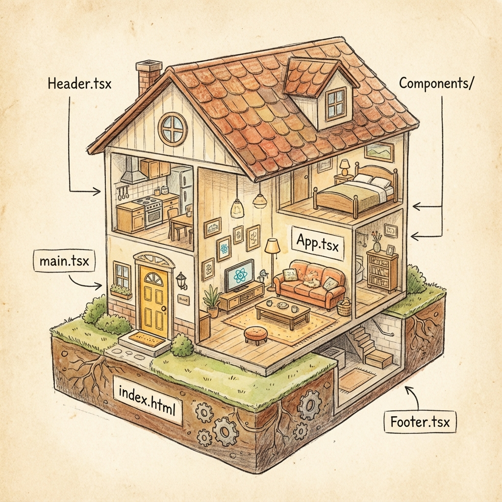
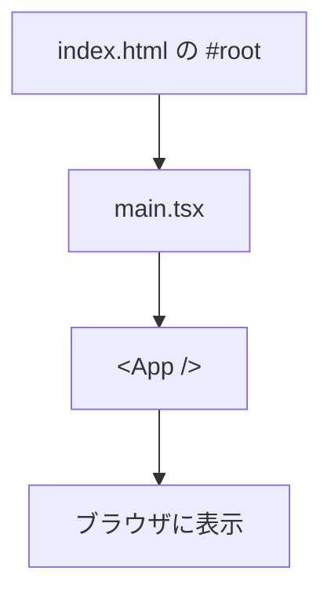

# 第7章：Viteが作ったフォルダの中身をのぞく

まずは「どのファイルが、どの役割？」をサクッと把握しよ〜！
ここがわかると、**「どこを直せば画面が変わるか」**が一気にスッキリします✨

---

## きょうのゴール🎯

* Vite（2025年環境）の**標準フォルダ構成**をつかむ
* **`main.tsx` と `App.tsx`** の関係を説明できる
* **`tsconfig.json`** の要点を読める（React v19/TS向け）

---

## 全体マップ（まずは鳥瞰図）🗺️



> ざっくり：**`index.html` の #root に `main.tsx` が React を差し込み、`App.tsx` が実際のUI**を描く、という流れだよ💡

---

## フォルダ構成（Vite + React v19 テンプレの例）🗂️

```
my-react-app/
├─ index.html
├─ package.json
├─ tsconfig.json
├─ tsconfig.app.json          ← ※テンプレ世代によって有/無
├─ tsconfig.node.json         ← ※テンプレ世代によって有/無
├─ vite.config.ts
└─ src/
   ├─ main.tsx                ← 入口（#rootにReactを差し込む）
   ├─ App.tsx                 ← 画面の中身（あなたの主戦場）
   ├─ index.css               ← 全体スタイル
   ├─ App.css                 ← 画面用スタイル（テンプレに同梱のこと多め）
   ├─ assets/
   │  └─ react.svg
   └─ vite-env.d.ts           ← Viteの型宣言
```

---

## `index.html` は「土台」🏠

`index.html` はとてもシンプル。**Reactはここに“乗るだけ”**。



```html
<body>
  <div id="root"></div>
  <script type="module" src="/src/main.tsx"></script>
</body>
```

* **`#root`** が「のりしろ」🍞
* 実際のUIは JS 側で作って差し込む → だから SPA（シングルページアプリ）って呼ばれるよ。

---

## `.tsx` の主役たち：`main.tsx` と `App.tsx` 🧩

### `src/main.tsx`（入口）

React v19 でも基本は同じ。**root作成→`<App />` を差し込む**。

```tsx
// src/main.tsx
import React from 'react'
import ReactDOM from 'react-dom/client'
import App from './App.tsx'
import './index.css'

ReactDOM.createRoot(document.getElementById('root')!).render(
  <React.StrictMode>
    <App />
  </React.StrictMode>,
)
```

* `!` は「ここは絶対に null じゃないよ」の合図（Non-Null Assertion）
* `React.StrictMode` は開発時のヒントや警告を強化してくれる🛡️

### `src/App.tsx`（中身）

ここを変えると**画面が変わる**！最初はこんな雰囲気。

```tsx
// src/App.tsx
function App() {
  return (
    <main>
      <h1>Hello React v19 + TS ✨</h1>
      <p>ここを書き換えると、ブラウザの表示が変わるよ！</p>
    </main>
  )
}
export default App
```

---

## もう一度、流れを図で🤝



---

## `tsconfig.json` をのぞく🔧（React v19 / 2025年向けの要点）

TypeScript の**ルールブック**。テンプレの例（抜粋・読みやすく整形）👇

```json
{
  "compilerOptions": {
    "target": "ES2020",
    "module": "ESNext",
    "jsx": "react-jsx",
    "strict": true,
    "moduleResolution": "bundler",
    "baseUrl": ".",
    "paths": { "@/*": ["src/*"] },
    "esModuleInterop": true,
    "skipLibCheck": true,
    "noEmit": true
  },
  "include": ["src"]
}
```

覚えどころ📝

* **`jsx: "react-jsx"`** … 新しいJSX変換。`import React` を毎回書かなくてOK。
* **`strict: true`** … 厳格チェックでバグを早期にガード💪
* **`moduleResolution: "bundler"`** … Viteなどのモダンバンドラ向け解決方式。
* **`baseUrl` / `paths`** … `@/components/Button` みたいに**気持ちよくインポート**できる🍃
* **`noEmit: true`** … TS は出力しない（ビルドは Vite が担当）。

> ※ テンプレによって **`tsconfig.app.json` / `tsconfig.node.json`** に分割されてることもあるよ。
> アプリ用とツール用に**最適化してるだけ**だから、深追いは不要😉

---

## Vite 固有のファイルたち🚀

### `vite.config.ts`

Viteの設定。Reactプラグインが入ってるはず。

```ts
// vite.config.ts（例）
import { defineConfig } from 'vite'
import react from '@vitejs/plugin-react'

export default defineConfig({
  plugins: [react()],
})
```

* あとで別名（`@`）をここで設定したり、環境変数の扱いを強化したりできるよ🌱

### `src/vite-env.d.ts`

Viteの型サポートを入れる宣言ファイル。

```ts
/// <reference types="vite/client" />
```

これで `import.meta.env`（`VITE_` から始まる環境変数）などの型が効く👌

---

## ちょい実務メモ（2025向け）📝

* **環境変数**は `.env` / `.env.local` に書いて `VITE_` をプレフィックス（例：`VITE_API_URL=`）。
* 画像やSVGは `src/assets` に置いて **ESMとしてimport** できる（`import logo from './assets/logo.svg'` など）。
* Windowsでもパスの区切りは **インポートでは `/` を使う** のが基本（ESMの流儀だよ）🪟➡️`/`

---

## ハンズオン（5〜10分）⛳

1. **`src/App.tsx`** を開いて、`<h1>` の文言を自分好みに変更🖊️
2. **`src/App.css`** に `h1 { font-size: 40px; }` を足して、サイズを変えてみる🎨
3. **`tsconfig.json`** の `paths` を確認 → 使えるように `import Header from '@/components/Header'` などを試す準備（後章で活用）🧭
4. **`src/main.tsx`** の `<React.StrictMode>` をいったん外して → 付け直す

   * 開発時に**警告が強化**されるモードだと実感しやすいよ🛡️

---

## よくあるつまづきQ&A🆘

**Q. `App.tsx` をいじっても画面が変わらない…**
A. まだ開発サーバーを起動してないかも！次の**第8章**で `npm run dev` をやるよ⚡

**Q. `tsconfig.app.json` が無い/あるって何？**
A. テンプレの世代差。**挙動は同じ**なので気にしなくてOK🙆‍♀️

**Q. `@/` エイリアスが効かない…**
A. `tsconfig.json` の `baseUrl`/`paths` と、エディタの再読込（VSCode）を確認。
プロジェクト直下にあるか、スペル違いが無いかチェック🔍

---

## まとめ📌

* **`index.html` → `main.tsx` → `App.tsx`** が中核の流れ
* `.tsx` は **TypeScript + JSX**。安全＆快適にUIを記述できる👍
* **`tsconfig.json`** は型とJSXのルールブック。`strict: true` の安心感は正義🛡️

---

## 次章予告🎬

**第8章：`npm run dev` でテスト用の画面を出す**
いよいよブラウザで動かすよ！ホットリロードの快感、味わおう〜🔥🖥️
