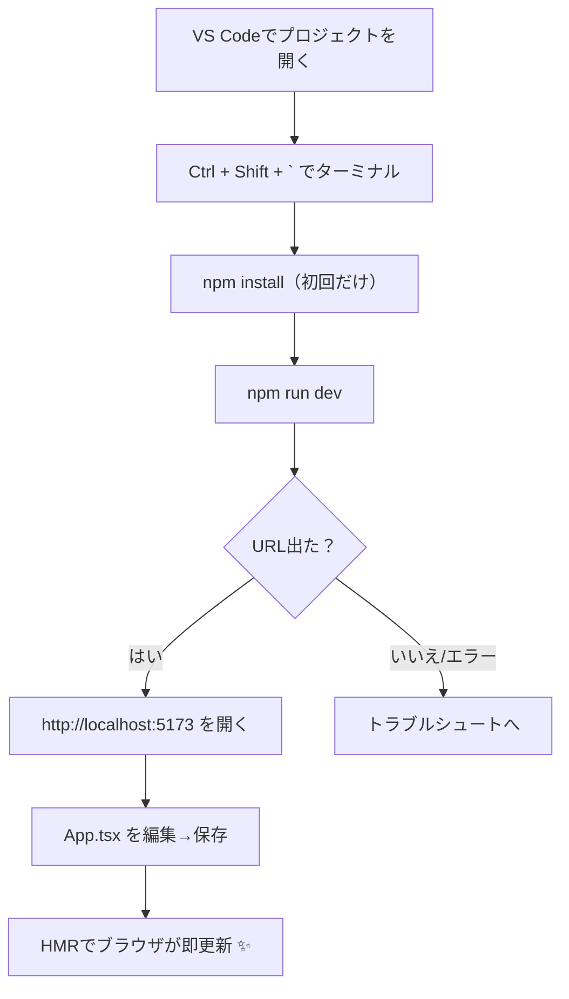

# 第8章：`npm run dev` でテスト用の画面を出す

いよいよ「動く React」を目で見るターン！
Vite の開発サーバーを起動して、ブラウザで初期画面をチェックしよう✨

---

## ゴール 🎯

* 開発サーバーを起動して **`http://localhost:5173`** を開ける
* 保存すると即反映される **HMR（ホットリロード）** を体験する
* よくあるエラーに自分で対処できるようになる

---

## 全体のながれ（図解）🧭



---

## 手順ステップ 👟

### 1) VS Codeで開く

* **File → Open Folder...** から、Viteで作ったフォルダを選択📂

### 2) ターミナルを出す

* **Ctrl + Shift + `**（バッククォート）で下にターミナルを表示💬
  （PowerShell でも Command Prompt でもOK！）

### 3) 依存インストール（初回だけ）

```bash
npm install
```

### 4) 開発サーバーを起動

```bash
npm run dev
```

### 5) ターミナルに出たURLを開く

* 例）**Local:  [http://localhost:5173/](http://localhost:5173/)**
* VS Code なら **Ctrl + クリック** で開けるよ🖱️

> 🔔 初回は Windows のファイアウォール確認が出ることあり。**プライベートネットワーク**は許可にしてOK。

---

## HMR（ホットリロード）を体験しよ🔥

1. `src/App.tsx` を開く
2. `<h1>` や `<p>` のテキストを好きに変更
3. **Ctrl + S で保存** → ブラウザが**瞬時に更新**！気持ちいい〜🥳


> HMR は差分だけを入れ替えるので、状態を保ったまま超高速で反映されるよ。

---

## 便利オプション 🪄

* **自動でブラウザ起動**

  ```bash
  npm run dev -- --open
  ```

  常に自動オープンしたいなら `package.json` を編集：

  ```json
  {
    "scripts": {
      "dev": "vite --open"
    }
  }
  ```

* **ポート変更（5173が使えない時）**

  ```bash
  npm run dev -- --port 5174
  ```

  → URL は `http://localhost:5174/` に変わる🔢

* **スマホや他PCから同じLANで確認**

  ```bash
  npm run dev -- --host
  ```

  ターミナルに `Network: http://192.168.x.x:5173/` のような行が出たら、同じWi-Fiの端末で開ける📱

* **サーバー停止**

  * ターミナルで **Ctrl + C** → （聞かれたら）`y`
  * 止まらない時はもう一度 **Ctrl + C**

* **Viteの起動中ショートカット**

  * `h`：ヘルプ　`o`：ブラウザを開く

---

## よくあるトラブルと対処 🧯

| 症状                                   | チェックポイント                                                                |
| ------------------------------------ | ----------------------------------------------------------------------- |
| 真っ白で何も出ない                            | サーバーが起動中か？URLが `http://localhost:5173/` か？タブをリロード🔄                     |
| `EADDRINUSE: address already in use` | そのポートは使用中。`--port 5174` など別ポートで再起動                                      |
| 変更が反映されない                            | タブをアクティブに→ダメなら一度 **Ctrl + C** で停止→`npm run dev` 再起動。キャッシュ臭ならブラウザを強制リロード |
| `ERR_MODULE_NOT_FOUND`               | ファイル名の大小文字 / 拡張子 `.tsx` / 相対パス `../` の階層を再確認                            |
| LANから開けない                            | `--host` で起動＆Windowsファイアウォールの**プライベート**を許可。会社Wi-Fiはポリシーで弾かれることも         |

---

## ミニ練習（5分）⏱️

1. `src/App.tsx` のタイトルを **自分の推しタイトル**に変更👑
2. 小さなボタンを1個追加して、クリックで一言メッセージを表示（例：「今日もがんばる💪」）
3. `npm run dev -- --port 5174` でポートを変えて開き直す🔍

---

## 仕上げチェックリスト ✅

* [ ] `npm run dev` でサーバーが起動できた
* [ ] `http://localhost:5173` を開けた
* [ ] `App.tsx` を保存したら即反映（HMR）が確認できた
* [ ] 別ポートや `--open` / `--host` を試してみた

---

次章は **第9章：「Hello World!」最初の `.tsx` をいじってみる** へ！
自分の言葉を画面にしゃべらせちゃお〜🗣️💖
