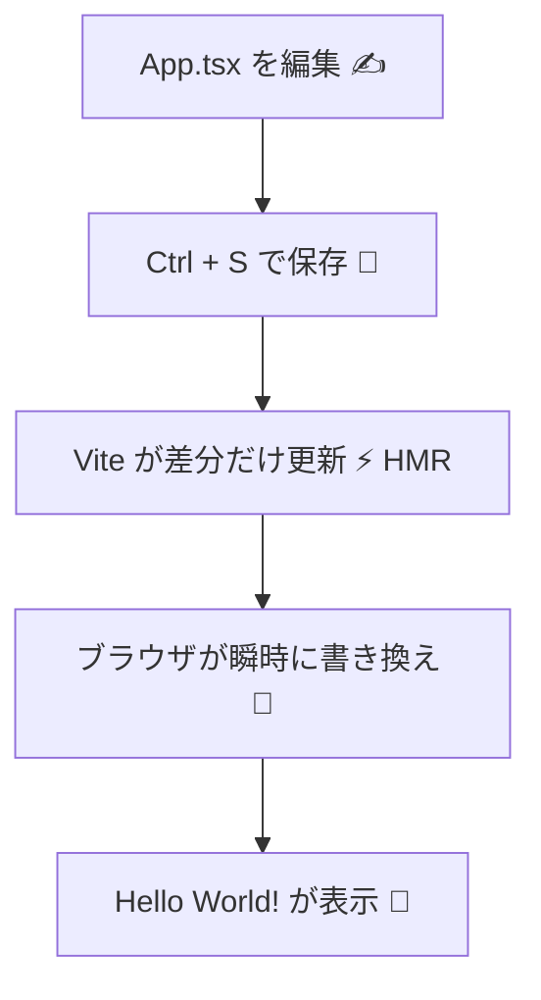

# 第9章：「Hello World!」最初の`.tsx`ファイルをいじってみる

Viteの初期画面は見えたよね？ここから **最小のReactアプリ** を自分色に染めていくよ〜💅

---

## ゴール 🎯

* `App.tsx` をシンプルに書き換えて **Hello World** を表示
* **TSXの基本**（JSX + TypeScript）を体感
* 保存→即反映（HMR）の気持ちよさを味わう😎

---

## いま何が起きてる？（図解）🧠



---

## まずは初期ファイルを確認 👀

ViteのReact+TSテンプレには、だいたいこんな主要ファイルがあるよ📁

* `index.html` … 入口。`<div id="root">` がある。
* `src/main.tsx` … Reactが「どこに表示するか」を決める。
* `src/App.tsx` … 画面の中身（最初はここをいじる！）

> この章では **`src/App.tsx`** を中心に触るよ。慣れたら `main.tsx` も覗いてみよう😉

---

## 最小の「Hello World」を描こう ✨

### 1) `src/App.tsx` をまるごと置き換え（コピペOK）

```tsx
// src/App.tsx
export default function App() {
  const myName = "React v19";
  const today = new Date().toLocaleDateString();

  return (
    <main style={{ fontFamily: "system-ui, sans-serif", padding: 24 }}>
      <h1>Hello World! 🌏</h1>
      <p>
        ようこそ、<strong>{myName}</strong> の世界へ！✨（今日は {today} だよ）
      </p>

      <hr />

      <p>ボタンを押すとあいさつするよ👇</p>
      <button
        onClick={() => alert("はじめまして！これからよろしくね 🥰")}
        style={{
          padding: "8px 12px",
          borderRadius: 8,
          border: "1px solid #ddd",
          cursor: "pointer",
        }}
      >
        あいさつする 👋
      </button>
    </main>
  );
}
```

> 💡 ポイント
>
> * **`.tsx`** は **JSX（HTMLっぽい記法）+ TypeScript**。
> * `{ ... }` の中は **JavaScriptの世界**（変数・式が書ける）
> * インラインスタイルは **オブジェクト** で渡すよ（`style={{ padding: 24 }}` みたいな感じ）
> * HTMLの `class` は **`className`** にするのがReactルールだよ🐱‍👤

保存（**Ctrl + S**）すると…ブラウザが **即** 更新！HMRサイコー😆

---

## もう一歩：小さな部品（コンポーネント）を作る 🧩

`Hello World` だけだと寂しいので、**ミニ部品**を切り出してみよっか。
TypeScriptの型も**ちょいだけ**使ってみる（難しくはしないよ🫶）

```tsx
// src/App.tsx
type GreetingProps = {
  name: string; // この部品は name を文字列でもらうよ、という約束（型）
};

function Greeting({ name }: GreetingProps) {
  return <h2>こんにちは、{name} さん！🎉</h2>;
}

export default function App() {
  return (
    <main style={{ fontFamily: "system-ui, sans-serif", padding: 24 }}>
      <h1>Hello World! 🌏</h1>
      <Greeting name="はるか" />
      <p>↑ こんな感じで「部品」を呼び出せる。かわいくない？💖</p>
    </main>
  );
}
```

> 📝 ここで覚えること
>
> * **部品（コンポーネント）** は **関数** で作るのが今っぽい。
> * 受け取る値（Props）は **型（`GreetingProps`）** で形を決めると安心安全🫡
> * `({ name })` みたいに **分割代入** で取り出すのが定番。

---

## `src/main.tsx` はチラ見でOK 👀

中はだいたいこんな感じ👇 「`#root` に `<App />` を挿す」仕事をしてるよ。

```tsx
// src/main.tsx（参考：既にテンプレに入ってる想定）
import React from "react";
import ReactDOM from "react-dom/client";
import App from "./App.tsx";
import "./index.css";

ReactDOM.createRoot(document.getElementById("root")!).render(
  <React.StrictMode>
    <App />
  </React.StrictMode>
);
```

> `document.getElementById("root")!` の **`!`** は
> 「絶対あるって知ってるから大丈夫！」ってTypeScriptに教えてる合図だよ（`index.html`にあるからね）。

---

## よくあるプチつまずき 🫠➡️🛟

| 症状                 | 直し方                                             |
| ------------------ | ----------------------------------------------- |
| `class` って書いたら怒られた | Reactでは **`className`** を使うよ                    |
| 「兄弟要素が複数です」エラー     | 返す要素は **1つの親** で包む（`<main>…</main>` や `<>…</>`） |
| 画面が変わらない           | 保存した？（**Ctrl + S**）→ それでもダメならブラウザをリロード🔄        |
| 文字化け               | ファイルはUTF-8、全角/半角の引用符に注意（`"` と `”` は別物）          |

---

## 3分ミニ練習 ⏱️

1. `Greeting` に `emoji` という**オプション**を足して、指定したら後ろに絵文字を付けよう 🥳
2. `App` から `<Greeting name="はるか" emoji="🌸" />` と呼び出してみる
3. インラインスタイルで `<h1>` のサイズを気持ち大きめに（例：`fontSize: 32`）にしてみる

**ヒント：** オプショナルな型は `emoji?: string` だよ💡

---

## 仕上げチェックリスト ✅

* [ ] ブラウザに **Hello World!** が表示できた
* [ ] `{}` の中で **JSの値** を表示できた
* [ ] 小さな部品（`Greeting`）を**型つき**で作って呼び出せた
* [ ] `className` / 親で包むルール、つまずかずに書けた

---

次章は **第10章：便利なブラウザ拡張**。
開発の“相棒”を導入して、デバッグ力をモリモリ上げていこうね🕵️‍♀️🧩🚀
