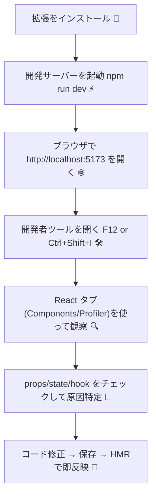

# 第10章：React開発に便利な道具（ブラウザ拡張）を入れる

**今日は “開発の相棒” をブラウザに召喚する日！**
これがあるかないかで、デバッグのしやすさがマジで変わるよ。まずは **React Developer Tools** を入れて、ついでに便利拡張もサクッと追加しよ〜 🐣💻

---

## ゴール 🎯

* **React Developer Tools** をインストールして使えるようにする
* **Components** / **Profiler** タブの超基本を覚える
* ついでに入れておくと幸せになる **お役立ち拡張** を知る
* 困ったときの **トラブルシュート** を押さえる

---

## まずは全体像（どう使うの？）🧭

---

## ① React Developer Tools を入れよう 🧩

**対応ブラウザ**：Chrome / Microsoft Edge（Windows標準だとEdgeが楽）

1. ブラウザを開く（Chrome か Edge）
2. ウェブストアで **“React Developer Tools”** を検索
3. **追加 / インストール** をクリック → 有効化 🟢
4. もしViteを起動中なら、ブラウザを1回リロードしてね 🔄

> ✅ アイコンは緑の原子みたいなやつ。
> ✅ ローカル開発ページ（例：`http://localhost:5173`）で効くよ。

---

## ② 開発者ツールから React タブを出してみよう 🪄

1. `npm run dev` でアプリを起動（Viteの開発サーバー）
2. ブラウザで `http://localhost:5173` を開く
3. **F12** もしくは **Ctrl + Shift + I** で開発者ツールを開く
4. 上部タブに **“⚛ React”**（あるいは **“Components / Profiler”**）が出てくるよ！

> もし見当たらなければ、右端の `>>` を押して隠れてないか見てみてね 👀

---

## ③ Components タブの使い方（いちばん使う！）🔍

**何が見える？**

* 画面に表示中の **コンポーネントツリー**
* 選択したコンポーネントの **props / state / hooks**
* ツリー上でホバーすると、該当要素がページ上でハイライト ✨

**やってみよう（Hello Worldを題材に）**

1. 左側のツリーから `App` または `Greeting` をクリック
2. 右側に **Props**（例：`name: "はるか"`）や **Hooks**（`useState` など）が表示
3. 値の右に ✏️（編集） があれば、**開発中だけ編集可能** → 画面の反応を確認！

   > 例：`name` を `"みお"` に変えて、表示がすぐ変わるのを見よう 👀

**超プチテク**

* 画面の要素を右クリック → **Inspect in Components** で、対応するコンポーネントに一発ジャンプ 🚀
* “Owner stack” を見ると、どの親から来たかが分かって迷子になりにくい 🧵

---

## ④ Profiler タブの使い方（動きが重い？を見抜く）⏱️

**何ができる？**

* どのコンポーネントが **再レンダリング** されたかを記録
* レンダリング時間の比較ができる → ボトルネック探しに便利

**手順**

1. Profiler を開く → **Start profiling** ▶️
2. ページで操作してみる（クリック、入力など）
3. **Stop** ⏹ を押す → “どれが何回描画されたか” が色付きで分かる
4. 不要に再描画されてる子コンポーネントがいないかチェック

   > 将来の章でやる `React.memo` / `useCallback` / `useMemo` と相性◎

---

## ⑤ ついでに入れておくと超便利な拡張 ✨

* **axe DevTools Lite（アクセシビリティ）** ♿
  クリック一発でA11yの問題を検出。「色コントラスト」「ラベル不足」などを早期発見。
* **JSON Formatter / JSON Viewer** 📄
  APIレスポンスのJSONが読みやすく色分け＆折りたたみ表示に。
* **ColorPick Eyedropper** 🎨
  画面上の色をスポイトで拾う。スタイル調整がサクサク。
* **Redux DevTools** 🧠（必要に応じて）
  このロードマップではReduxを深掘りしないけど、採用するなら必須級。Action履歴やStateのタイムトラベルができるよ。

> 入れすぎるとブラウザが重くなることもあるので、**まずは React DevTools + axe + JSON** あたりからでOK！

---

## ⑥ よくあるトラブル 🛠️🆘

| 症状           | 対処                                                               |
| ------------ | ---------------------------------------------------------------- |
| Reactタブが出ない  | 拡張が**有効**か確認 → ページを**リロード** → ローカルの `http://localhost:` で開いてるか確認 |
| まだ出ない        | Viteを**再起動** → ブラウザを**再起動** → シークレットウィンドウで試す（拡張が無効になってないか）       |
| 値を編集できない     | その値は **props直指定** かも。**親のstate** を編集して反映されるか確認                   |
| Profilerが真っ白 | 記録を**Start**してから操作→**Stop**して結果を見る。起動順序に注意                       |

---

## ⑦ 3分ミッション ⏱️💪

1. `npm run dev` を起動して `http://localhost:5173` を開く
2. 開発者ツール → **Components** で `Greeting`（第9章で作ったやつ）を選ぶ
3. `name` を別の文字列に変更して画面の変化を確認 ✨
4. **Profiler** を開いて、ボタンを何回かクリック → 記録を止めて再描画の様子を見る
5. 気づいたことをメモ（「どの操作でどの部品が再描画されたか」）

---

## チェックリスト ✅

* [ ] **React Developer Tools** をインストールできた
* [ ] **Components** で props / state / hooks を確認できた
* [ ] ✏️から値を編集して**即時反映**（HMR）を体感できた
* [ ] **Profiler** で再レンダリングの様子を可視化できた
* [ ] 便利拡張（axe / JSON Viewer など）を1つは入れた

---

次は **Module 2** に突入！
**第11章：JSXってなに？** へ進んで、いよいよ “Reactの書き方” をがっつり掴もうね 📝🌈🚀
