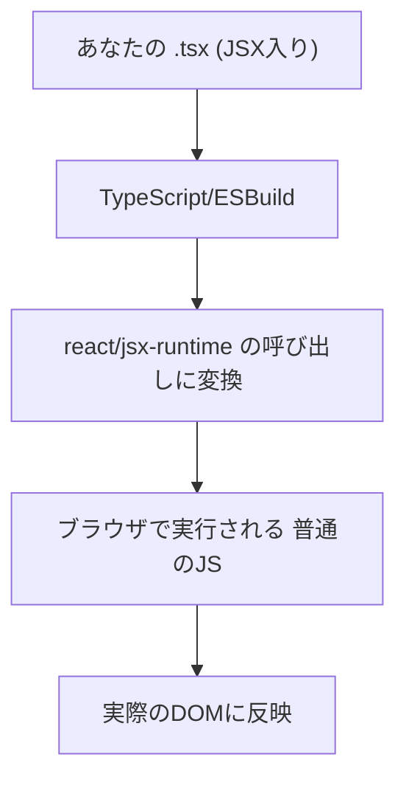
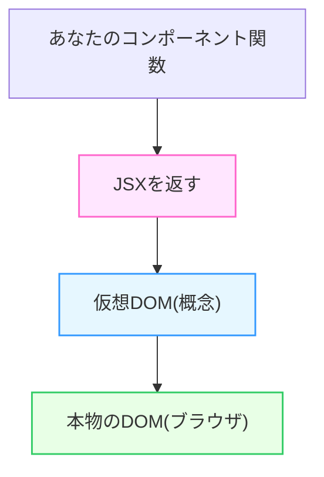

# 第11章：JSXってなに？

> 一言でいうと：**JSXは「JavaScriptの中に、HTML“みたいな見た目”でUIを書くための特別な文法」**だよ。
> ブラウザはそのまま読めないけど、Vite/TypeScriptが**普通のJavaScript**に変換してくれるから安心💪

---

## きょうのゴール 🎯

* JSXの正体をつかむ（HTMLそのものじゃない！）
* JSXが**どうやって**ブラウザで動く形になるのかイメージできる
* 最小のコンポーネントを自分で書ける

---

## なぜJSXがあるの？💡

UIをコードで作るとき、**「見た目（タグ）」と「ロジック（JS）」**が別れすぎるとつらい…😵‍💫
→ JSXなら**同じファイル**に**自然な形**で一緒に書ける。
**読みやすい・直せる・型も効く**＝開発がサクサク進むよ🍰

---

## JSXはどこへ行くの？（変換の流れ）🛠️➡️🧠➡️🧭➡️🖥️



* **ポイント**

  * いまのVite + React v19前提の設定では、`import React from 'react'` を**明示的に書かなくてOK**（自動JSXランタイムが効くよ）🙆‍♀️
  * JSX自体は**文法シュガー**。中身は最終的に`jsx('h1', {children: 'Hello'})`みたいな**関数呼び出し**に変わるのだ📞

---

## ミニ実験①：最小のJSX ✨

`src/App.tsx` を開いて、中身をこんな感じにしてみよう（Viteの初期コードを置き換えでOK）

```tsx
function App() {
  return (
    <div>
      <h1>こんにちは JSX 🎀</h1>
      <p>HTMLっぽいけど、実はJSの特別な文法だよ！</p>
    </div>
  );
}
export default App;
```

👉 ターミナルで `npm run dev`。ブラウザで表示できれば成功🎉

> *なぜ `<div>...</div>` で包んでるの？*
> JSXは**ひとつの“かたまり”**を返すイメージ。複数並べるとエラーになるから、まずはひとつに包もう（くわしくは第12章で！）🫶

---

## ミニ実験②：JSXの“中身”は最終的に関数呼び出し 📞

JSXは最終的にこんなふうに解釈されるイメージ（**書く必要はない**けど理解すると強い💪）

```ts
// イメージ図：<h1>こんにちは</h1> は最終的にこんな感じに
import { jsx as _jsx } from 'react/jsx-runtime';

const el = _jsx("h1", { children: "こんにちは" });
// ↑ JSXは「特別な関数を呼ぶコード」に変わるだけ！
```

---

## JSXでよくある“最初のつまずき”🐣（先に予防！）

* **隣り合う要素をそのまま返す** → `Adjacent JSX elements must be wrapped...` エラー
  対策：**ひとつの親タグ**（または `<>...</>` フラグメント）で包む
* **属性名がちょっと違う** → `class` じゃなくて **`className`**、イベントは **`onClick`**（キャメルケース）
  ※このあたりは**第12章/第13章**でガッツリやるよ🧑‍🏫
* **JSXは式**：`if` 文を**タグの外**に書く or 条件式で分岐（これは後章で練習！）

---

## 目でつかむ！JSXの位置づけマップ🗺️



---

## ハンズオン：自己紹介を1枚描こう 🖼️👩‍🎓

次の内容を**テキスト固定**でOK（まだデータ受け渡しは後の章）。`ProfileCard.tsx` を作って試そう！

```tsx
// src/ProfileCard.tsx
function ProfileCard() {
  return (
    <article>
      <h2>My Profile 🌸</h2>
      <ul>
        <li>名前：Hanako</li>
        <li>専攻：Information Design</li>
        <li>好き：抹茶ラテ🍵 と 写真📷</li>
      </ul>
    </article>
  );
}
export default ProfileCard;
```

`App.tsx` から呼び出すよ👇

```tsx
import ProfileCard from "./ProfileCard";

function App() {
  return (
    <div>
      <h1>こんにちは JSX 🎀</h1>
      <ProfileCard />
    </div>
  );
}
export default App;
```

> 表示できたら「**JSXでUIを“書けた”**」ってこと！ナイス〜👏

---

## ことばミニ辞典 📚

* **JSX**：UIをHTMLっぽい見た目で書ける**JavaScriptの拡張文法**。ブラウザは素で読めない。
* **自動JSXランタイム**：いまのReactはJSXを書くだけで、裏で`react/jsx-runtime`を呼んでくれる仕組み。`import React ...` は不要な設定が主流🙌
* **仮想DOM**：変更をスマートにDOMへ反映するための概念的な中間表現。実装詳細を全部覚える必要はないけど、**“差分だけ更新する仕組み”**と覚えよう🧠

---

## 3分チェック ✅（小テスト）

1. JSXはブラウザがそのまま理解できる？
2. JSXは最終的に何になる？
3. `<h1/>` と `<p/>` を横に2つそのまま返したらどうなる？
4. いまのReactで`import React from 'react'`は必須？
5. `class` と `className`、Reactでは基本どっち？

**答え**

1. ❌（変換が必要）
2. ✅ `react/jsx-runtime` への**関数呼び出し**（普通のJS）
3. ❌ 親で包もう（エラーになる）
4. ❌ 多くの設定で**不要**（自動JSXランタイム）
5. ✅ **`className`**（次章で詳しく！）

---

## トラブルシュート 🧯

* **「Unexpected token `<`」**：ビルドが壊れてる/拡張子違い/設定不備などでJSXが変換されてない可能性。
  → ファイル拡張子が **`.tsx`** か確認、`npm run dev` を再起動🌀
* **「Adjacent JSX elements...」**：**親で包む**。`<div>...</div>` か `<>...</>` を使おう。
* **真っ白画面**：コンソール（F12）でエラーをチェック。VSCodeの赤波線（型エラー）がヒント🕵️‍♀️

---

## 次の章への橋わたし 🌉

* 第12章では**「JSXの細かなルール」**（先頭大文字、`className` など）をしっかり確認するよ。
* いまは「**JSX＝JSの中でUIを書くための記法**」がつかめていれば100点🌟

おつかれさま！今日のあなた、めっちゃ成長してるよ〜！🧁💻✨
