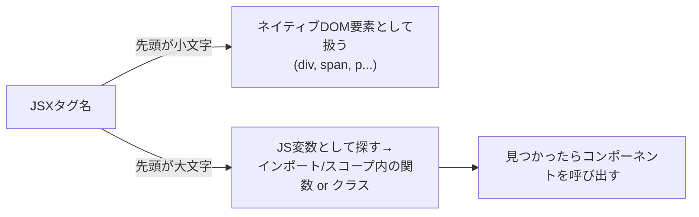
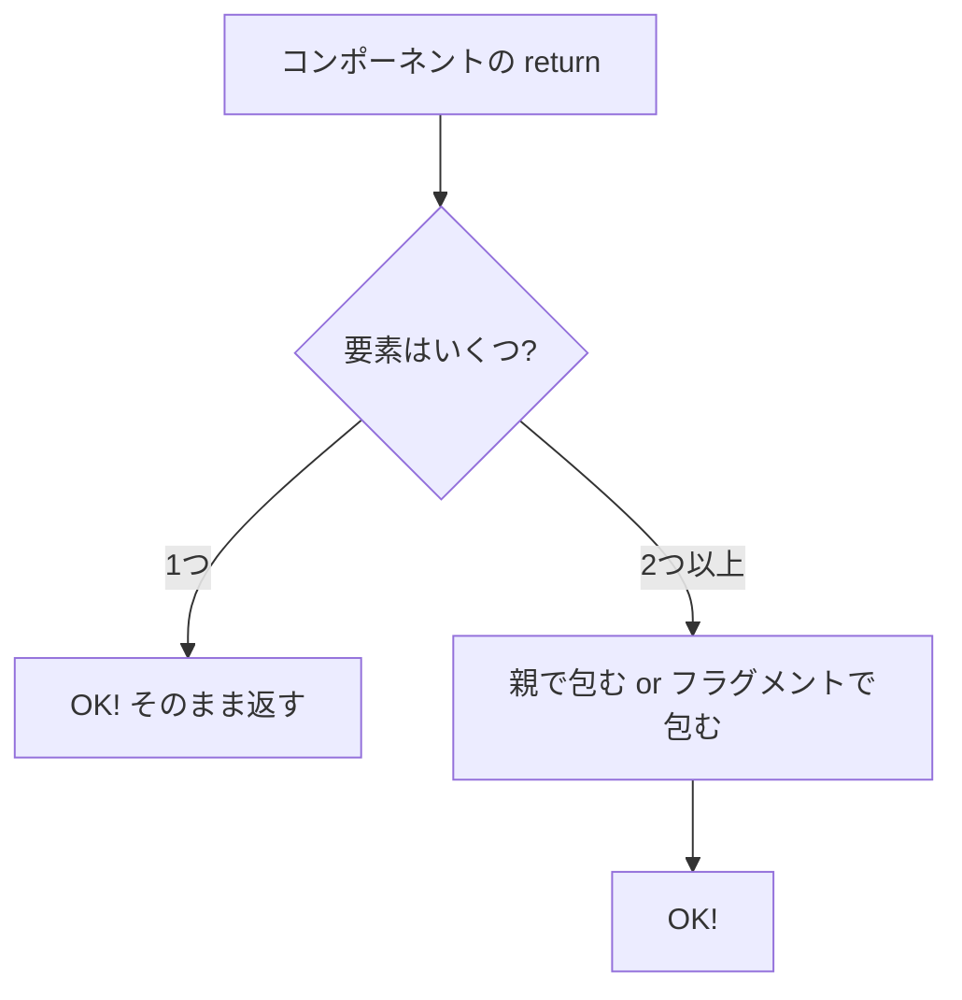

# 第12章：JSXのルール (1)

**— コンポーネント名は[大文字]で！& 返すJSXは“ひとつだけ”に包もう —**
（かわいく・わかりやすく・実践多めでいくよ〜🧁💻🌸）

---

## きょうのゴール 🎯

* **Rule A：コンポーネント名は必ず先頭大文字（`PascalCase`）**
* **Rule B：`return` するJSXは“ひとつの親”で包む（または `<>...</>` フラグメント）**

これだけで、**エラー8割回避**できるよ！٩(ˊᗜˋ*)و✨

---

## なぜ大文字？🧠💡

Reactは**タグ名の先頭で意味を分ける**よ。



* `div`・`span` など**小文字** ⇒ ブラウザの**素のタグ**として扱う
* `ProfileCard` など**大文字** ⇒ **あなたが作るコンポーネント**として扱う（＝**変数を探す**）

> だから、**小文字で `button()` みたいに書くとダメ**。小文字は“HTMLタグの世界”、**大文字は“あなたの部品の世界”**だよ✨

---

## Rule A：コンポーネント名は先頭大文字 🧱🔤

### ✅ いい例

```tsx
function HelloBadge() {
  return <p>こんにちは🌟</p>;
}
export default HelloBadge;
```

### ❌ だめ例（先頭小文字）

```tsx
function helloBadge() {
  return <p>こんにちは🌟</p>;
}
// JSXで <helloBadge /> と書くと、
// Reactは「未知の小文字タグ」と思い込む → うまく動かない/警告⚠️
```

### 📝 実践ミニ課題

1. `src/components/WelcomeBox.tsx` を作って、**先頭大文字**で書こう
2. `App.tsx` に `import WelcomeBox from "./components/WelcomeBox";`
3. `<WelcomeBox />` を表示してみよう 🎉

---

## Rule B：返すJSXは“ひとつの親”で包む 🧺🧸

JSXは**式**だから、**`return` では1つの“かたまり”**にしよう。
**兄弟要素をそのまま2つ並べるとエラー**になるよ。

### ❌ エラーになる例

```tsx
function App() {
  // エラー: Adjacent JSX elements must be wrapped in an enclosing tag
  return (
    <h1>タイトル</h1>
    <p>説明文</p>
  );
}
```

### ✅ いい例：親タグで包む

```tsx
function App() {
  return (
    <div>
      <h1>タイトル</h1>
      <p>説明文</p>
    </div>
  );
}
```

### ✅ いい例：フラグメント（おすすめ！）

見た目に余計な `div` を増やしたくないときは**フラグメント**を使おう。

```tsx
function App() {
  return (
    <>
      <h1>タイトル</h1>
      <p>説明文</p>
    </>
  );
}
```

> フラグメントは **`<>...</>`**（短縮形）か、**`<React.Fragment>...</React.Fragment>`**（正式名）
> 短縮形は**属性が付けられない**けど、軽く包むだけなら超便利🎀

---

## “ひとつに包む”を図で！🧭



---

## まとめミニチートシート 📝✨

* **大文字**：`<MyButton />` → **自作コンポーネント**（変数を探す）
* **小文字**：`<button />` → **HTMLタグ**
* **返すのは1つ**：`<div>...</div>` or `<>...</>` で包む
* **迷ったらフラグメント**：`<>...</>` でサクッと包めばOK🎯

---

## ハンズオン：ルール体得ドリル👩‍🎓🧪

### ① 大文字ルール

`src/components/cuteTitle.tsx` を**わざと**小文字で作ってエラーを体験→**大文字に直す**

```tsx
// ❌ わざと小文字 (エラー体験)
function cuteTitle() {
  return <h2>かわいいタイトル🎀</h2>;
}
export default cuteTitle;

// ✅ 修正: 先頭大文字に！
function CuteTitle() {
  return <h2>かわいいタイトル🎀</h2>;
}
export default CuteTitle;
```

### ② 包むルール

`App.tsx` で**あえて**兄弟要素を2つ返してエラー→**包んで直す**

```tsx
// ❌ わざとエラー
function App() {
  return (
    <h1>JSXの練習</h1>
    <p>兄弟要素が2つあるからエラーだよ…😵‍💫</p>
  );
}

// ✅ 修正: フラグメントで包む
function App() {
  return (
    <>
      <h1>JSXの練習</h1>
      <p>ちゃんと包んだからOK🌟</p>
    </>
  );
}
export default App;
```

---

## さらに一歩：配列で返すテク（上級オプション）🧩

実は**配列**を返してもOK。ただし**必ず `key` をつける**こと（第44章で深掘り）。

```tsx
function App() {
  const items = ["抹茶", "ラテ", "ほうじ茶"];
  return items.map((name) => <li key={name}>{name}</li>);
  // これもOKだけど、最初は <>...</> で包む方が直感的だよ🌿
}
```

---

## よくあるつまずき＆対処 🧯

* **「Adjacent JSX elements must be wrapped…」**
  → **親タグ or フラグメントで包む**（`<>...</>`）
* **小文字コンポーネントが動かない**
  → **先頭大文字**に直す（`GoodCard` など）。**インポートも忘れずに！**
* **どっちで包むか迷う…**
  → 余計なDOMを増やしたくないなら **フラグメント**、意味のあるまとまりなら**タグ**（`section`, `main` など）🌈

---

## 3分チェック ✅（小テスト）

1. `return` で `<h1/>` と `<p/>` を並べたら？
2. コンポーネント名の先頭は**大文字/小文字**どっち？
3. 余計なDOMを増やさずに包みたいときは？
4. `<button/>` と `<MyButton/>` の違いは？

**こたえ**

1. ❌ エラー。**親で包む**（`<div>` or `<>...</>`）
2. ✅ **大文字**（PascalCase）
3. ✅ **フラグメント `<>...</>`**
4. ✅ 前者は**HTMLタグ**、後者は**あなたのコンポーネント**（変数を参照）

---

## 次の章の予告 🎬

**第13章**は、**「HTMLとのちがい」**にズームイン！
`class` じゃなくて **`className`**、`for` じゃなくて **`htmlFor`**、イベント名は **`onClick`** などなど…
**“似てるけど違う”ポイント**を一気に整理するよ〜🍀

今日もがんばったね！えらい！！🫶🌷✨
