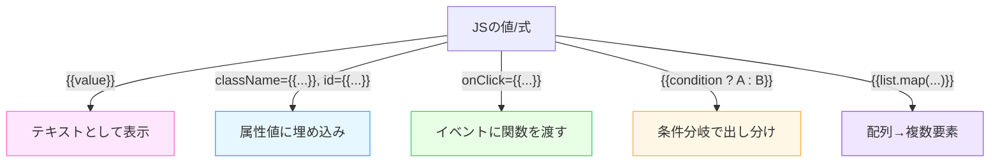

# 第14章：JSXの中にJavaScriptの変数を表示する

**— `{}` に入れれば “JSの世界” をそのまま画面へ！ —**
（変数・関数の結果・条件分岐・配列展開…ぜんぶ `{}` でつなぐよ🌸）

---

## きょうのゴール 🎯

* JSXの **埋め込みカッコ `{}`** の正体と使いどころを理解する
* 画面の**文字・属性・条件・リスト**を **JSの値**で動かせるようになる
* つまずきやすい**型＆レンダリングのルール**を先回りで回避する

---

## JSXで `{}` が使える場所マップ 🗺️



> `{}` の中は **“式 (expression)”** だけ！ `if` 文みたいな **文(statement)** はNGだよ（代わりに `? :` や `&&` を使う）📝

---

## まずは基本のキ：テキストに変数を出す ✨

```tsx
// src/App.tsx
function App() {
  const name = "Hanako";
  const unread = 3;

  return (
    <div>
      <h1>ようこそ、{name} さん🌷</h1>
      <p>未読メッセージ：{unread} 件</p>
    </div>
  );
}
export default App;
```

* 数値・文字列はそのままOK
* オブジェクトは**直接は表示できない**（`[object Object]` になったりエラー）。必要なら**文字列に変換**してね👇

```tsx
<p>JSON: {JSON.stringify({ a: 1, b: 2 })}</p>
```

---

## 文字列と式をキレイに混ぜるコツ 🎀

```tsx
const name = "Hanako";
const score = 92;
<p>{`👩‍🎓 ${name} さんのスコアは ${score} 点`}</p>
```

* ふつうの `"..."` と `{}` を交互に書くより、**テンプレートリテラル**がスッキリ💡

---

## 属性にも `{}`：動的 class や数値プロップ 🧩

```tsx
const isActive = true;
const size = 24;

<button className={isActive ? "btn active" : "btn"} disabled={!isActive}>
  保存
</button>


```

* 真偽属性（`disabled` など）は **存在＝true**。動的にしたいなら `{isDisabled}` の形で👌
* `className="a " + variable` より **三項演算子** or **配列join**が見やすいよ

---

## `{}` の中は “式” だけ：条件分岐パターン3️⃣

### 1) 三項演算子 `? :`（王道）

```tsx
<p>{score >= 90 ? "🥇すごい！" : "がんばった！"}</p>
```

### 2) かんたん表示 `&&`

```tsx
{unread > 0 && <span className="badge">未読 {unread}</span>}
```

### 3) “何も出さない” は `null`

```tsx
{isLoading ? <p>読み込み中…</p> : null}
```

> **`false` / `null` / `undefined` はレンダリングされない**（空っぽ）という性質を覚えよう🫧

---

## 配列を `{}` で並べる（超よく使う！）🧵

```tsx
const items = ["抹茶ラテ", "いちごみるく", "チャイ"];

<ul>
  {items.map((name) => (
    <li key={name}>{name}</li>
  ))}
</ul>
```

* **配列 → 連続した要素**として描画される
* `key` は**一意な値**を！（詳細は第44章で）🔑

---

## 関数の結果をそのまま入れる 🧪

```tsx
function yen(amount: number) {
  return new Intl.NumberFormat("ja-JP", { style: "currency", currency: "JPY" }).format(amount);
}

const price = 580;
<p>お会計：{yen(price)} 💰</p>
```

* 日付や金額の**整形関数**を作って `{}` にポン！が読みやすくて再利用もしやすいよ✨

---

## “なにが表示できる？できない？” 早見表 🧭

| 値の型                                     | 表示結果                             |
| --------------------------------------- | -------------------------------- |
| `string` / `number`                     | そのまま表示                           |
| `ReactElement`（`<div/>` 等）              | 要素として表示                          |
| `Array<上のどれか>`                          | 連続して表示（`key` に注意）                |
| `true` / `false` / `null` / `undefined` | **表示されない**（空）                    |
| オブジェクト（プレーン）                            | **そのまま不可**（`JSON.stringify` してね） |

> 文字列は**自動でHTMLエスケープ**されるから基本安全🛡️（`<b>…</b>` はそのまま文字）。生HTMLを入れたい時は *危険* な特別API（`dangerouslySetInnerHTML`）になるので普段は使わない方が◎

---

## ハンズオン①：プロフィール行を動的に 🎀

```tsx
// src/ProfileRow.tsx
type Props = { label: string; value: string | number };
export default function ProfileRow({ label, value }: Props) {
  return (
    <p>
      <strong>{label}：</strong>
      {value}
    </p>
  );
}

// src/App.tsx
import ProfileRow from "./ProfileRow";

export default function App() {
  const user = { name: "Hanako", age: 20, like: "抹茶🍵" };
  return (
    <section>
      <h1>My Profile ✨</h1>
      <ProfileRow label="名前" value={user.name} />
      <ProfileRow label="年齢" value={user.age} />
      <ProfileRow label="好き" value={user.like} />
    </section>
  );
}
```

---

## ハンズオン②：条件 & 配列まぜ技 🌈

```tsx
// src/Inbox.tsx
type Message = { id: string; title: string; read: boolean };

const messages: Message[] = [
  { id: "1", title: "ようこそ！", read: true },
  { id: "2", title: "割引クーポン配布中🎁", read: false },
];

export default function Inbox() {
  const unread = messages.filter(m => !m.read).length;

  return (
    <section>
      <h2>
        受信箱 {unread > 0 && <span className="badge">未読 {unread}</span>}
      </h2>

      <ul>
        {messages.map(m => (
          <li key={m.id}>
            {m.title} {m.read ? "✅" : "📩"}
          </li>
        ))}
      </ul>
    </section>
  );
}
```

---

## つまずきレスキュー 🧯

* **「Objects are not valid as a React child」**
  → オブジェクトを直接出してるかも。**`JSON.stringify(obj)`** で確認 or 欲しいフィールドだけ出す
* **`if (...) { <p/> }` がエラー**
  → JSXの中は**式だけ**。**`? :` or `&&`** に置換
* **`key` がない警告**
  → `map` の子には**安定した `key`** をつけよう（配列indexは最終手段）

---

## ミニテスト（3分）✅

1. `{}` の中に書けるのは **式/文** のどっち？
2. `0`・`""`・`false`・`null` は画面でどう表示？
3. 配列を `{}` に入れたらどうなる？
4. オブジェクトをそのまま `{obj}` で表示できる？
5. 条件表示の**定番2パターン**を挙げてみて？

**こたえ**

1. **式**（文はダメ）
2. `0` と `""` は表示、`false/null/undefined` は**表示されない**
3. **連続した要素**として表示（`key` 必須）
4. ❌ できない（`JSON.stringify` するかプロパティを出す）
5. **三項 `? :`** と **論理積 `&&`**

---

## まとめチートシート 🧾💨

* `{ ここ }` に入れられるのは **式**（値・関数呼び出し・三項・`&&`・配列）
* **テキスト／属性／イベント** → ぜんぶ `{}` で**動的化**できる
* **表示されない値**：`false`/`null`/`undefined`
* **配列OK**＆`key` を忘れずに
* オブジェクト直出しはNG（**整形して**）

---

## 次の章の予告 🎬

**第15章**は **インラインスタイル**！
`style={{}}` の二重カッコの意味や **camelCase** なプロパティ、型の扱いをしっかりモノにしよう💅✨
