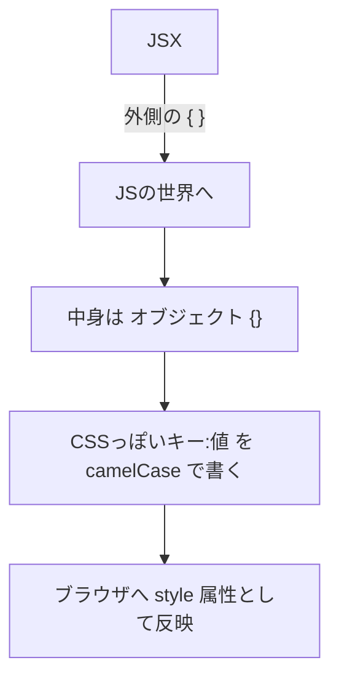
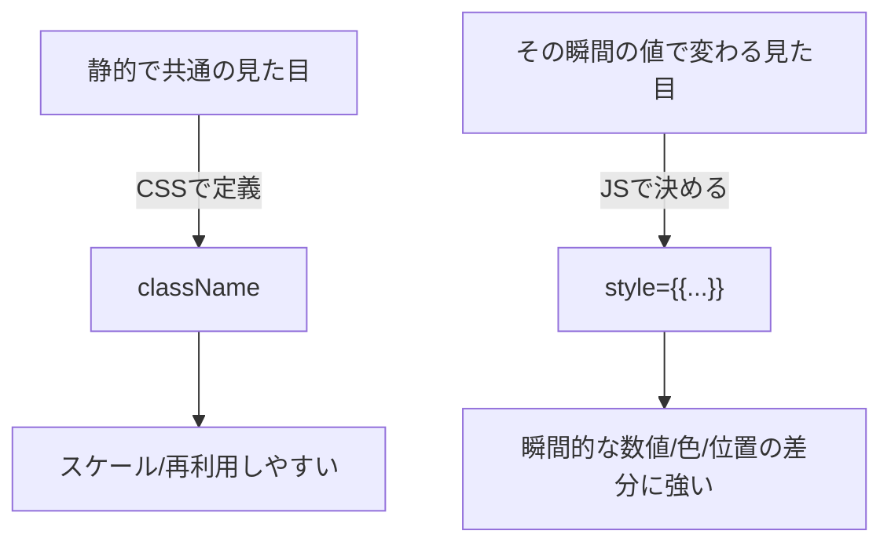

# 第15章：JSXでのインラインスタイル

**— `style={{}}` の“二重カッコ”をマスターして、動くデザインに！ —**
（camelCase・単位・型・条件付きスタイル・合体テクまでぜんぶ🌸）

---

## きょうのゴール 🎯

* `style={{}}` の**正体**（外カッコ＝JSX、内カッコ＝オブジェクト）を理解する
* **camelCase** のプロパティ名と**単位のルール**を覚える
* **TypeScriptで安全**に書けるようにする（`React.CSSProperties`）
* 動的に**色/サイズ/見た目**を切り替えるハンズオンを完成させる

---

## なにが「二重カッコ」なの？🧠



* **外側 `{ ... }`** …「JSの値を埋め込む」ための**JSXのカッコ**
* **内側 `{ ... }`** …「スタイルの辞書」を表す**JavaScriptオブジェクト**
  → つまり **`style={{ ... }}` = JSX埋め込み + JSオブジェクト** だよ🎀

---

## まずは最小コード ✨

```tsx
export default function App() {
  return (
    <h1 style={{ color: "#ff69b4", backgroundColor: "lavenderblush" }}>
      こんにちは、インラインスタイル💖
    </h1>
  );
}
```

* **プロパティ名は camelCase**：`background-color` → `backgroundColor`
* 値は **文字列** か **数値**。数値は多くのプロパティで **px 扱い**になるよ（後述）📏

---

## TypeScriptの型を添えて安心に 🛟

```tsx
import type { CSSProperties } from "react";

const titleStyle: CSSProperties = {
  color: "#663399",
  letterSpacing: 1,        // ← 1px として解釈される
  lineHeight: 1.6,         // ← これは「単位なし」プロパティ
  backgroundColor: "aliceblue",
};

export default function App() {
  return <h2 style={titleStyle}>TSで安全にスタイル✨</h2>;
}
```

* `React.CSSProperties`（`CSSProperties`）を使うと**補完と型チェック**が効いてミス激減🌟

---

## 文字列？数値？単位のルール早見表 📋

| 例          | 書き方（JSX）                                                        | 実際のCSS                   |
| ---------- | --------------------------------------------------------------- | ------------------------ |
| 幅100px     | `width: 100`                                                    | `width: 100px`           |
| 余白 8px     | `marginTop: 8`                                                  | `margin-top: 8px`        |
| 不透明度 0.8   | `opacity: 0.8`                                                  | `opacity: 0.8`           |
| 行の高さ1.6    | `lineHeight: 1.6`                                               | `line-height: 1.6`       |
| 角丸 12px    | `borderRadius: 12`                                              | `border-radius: 12px`    |
| 角丸 0.75rem | `borderRadius: "0.75rem"`                                       | `border-radius: 0.75rem` |
| グラデ        | `backgroundImage: "linear-gradient(90deg, #f0f 0%, #0ff 100%)"` | 文字列でOK                   |

> **ポイント**
>
> * 数値は多くのプロパティで **px 自動付与**。ただし **`lineHeight`・`opacity`・`zIndex`** などは**単位なし**が素直。
> * `rem` や `%`、`vw` など **px以外**を使いたい時は**文字列**で書こう📝

---

## よく使う camelCase 一覧（ミニ）🐪

* `backgroundColor` / `borderColor` / `borderRadius` / `boxShadow` / `fontSize`
* `fontWeight` / `letterSpacing` / `lineHeight` / `textAlign` / `textDecoration`
* `marginTop` / `marginInline` / `paddingBlock`（論理プロパティもそのまま！）
* `WebkitLineClamp`（ベンダープレフィックスは**頭を大文字**で）

---

## 条件でスタイルを切り替える 🌗

### 三項演算子で**分岐**

```tsx
type Props = { danger?: boolean };

export default function Badge({ danger = false }: Props) {
  return (
    <span
      style={{
        color: "white",
        padding: "4px 8px",
        borderRadius: 999,
        backgroundColor: danger ? "crimson" : "mediumseagreen",
      }}
    >
      {danger ? "危険" : "OK"}バッジ
    </span>
  );
}
```

### `undefined` をうまく使う（**ある時だけ上書き**）

```tsx
const base: React.CSSProperties = { padding: 8, borderRadius: 12 };
const emphasize = true;

const style: React.CSSProperties = {
  ...base,
  boxShadow: emphasize ? "0 4px 12px rgba(0,0,0,.15)" : undefined,
};
```

> `...isActive && obj` のように **`&&` でオブジェクトを合体**させるのは**NG**（`false`をスプレッドできないため）☠️
> 代わりに **三項** か **`undefined`** を活用しよう💡

---

## `className` と `style` の使い分け 🎯



* **基本はCSS（またはCSS Modules）**で見た目を作り、
* **その時々で変わる“数値・色”**などを `style={{}}` で差し込むのがコツ🪄
* **注意**：`style`（インライン）は**強い**ので、クラスで上書きしづらいことがあるよ⚠️

---

## Hover/Media/疑似要素は？🧐

* `:hover` や `@media`、`::before` などは **`style` では書けない**
* そういう **状態やレスポンシブ**は **CSS/Modules** でやるのが王道🐾
* どうしてもJSでやるなら、状態を持って `onMouseEnter`/`onMouseLeave` で色を変えるなど（学習の先でまた✨）

---

## 便利レシピ集 🍳

### 1) アイコンサイズをまとめて指定（`currentColor` で色合わせ）

```tsx
const iconStyle: React.CSSProperties = { width: 20, height: 20, color: "hotpink" };

export function IconHeart() {
  return (
    <svg viewBox="0 0 24 24" style={iconStyle}>
      <path fill="currentColor" d="M12 21s-8-5.33-8-10a5 5 0 0 1 9-3 5 5 0 0 1 9 3c0 4.67-8 10-8 10z" />
    </svg>
  );
}
```

### 2) カードの**ガラス風**スタイル（モダンUIっぽさ💎）

```tsx
const glass: React.CSSProperties = {
  background: "rgba(255,255,255,0.6)",
  backdropFilter: "blur(8px)",
  WebkitBackdropFilter: "blur(8px)",
  borderRadius: 16,
  border: "1px solid rgba(255,255,255,0.4)",
  boxShadow: "0 10px 30px rgba(0,0,0,.08)",
};

export function GlassCard({ children }: { children: React.ReactNode }) {
  return <div style={glass}>{children}</div>;
}
```

### 3) **CSSカスタムプロパティ**を受け取って反映（上級）

```tsx
// TypeScriptでCSS変数を渡す時は型を少し広げる
type VarStyle = React.CSSProperties & Record<string, string>;
const style: VarStyle = { ["--accent"]: "#ff69b4" };

export function AccentBox() {
  return (
    <div style={style} className="box">
      アクセント: var(--accent) をCSS側で参照するよ🌈
    </div>
  );
}
```

---

## ハンズオン①：サイズと色をライブ切り替え 🌈

```tsx
import { useState } from "react";

export default function Playground() {
  const [size, setSize] = useState(24);
  const [pink, setPink] = useState(true);

  const style: React.CSSProperties = {
    width: size,
    height: size,
    borderRadius: 8,
    backgroundColor: pink ? "#ff69b4" : "#4fd1c5",
    transition: "all .2s ease",
  };

  return (
    <section>
      <h3>Style Playground 🎮</h3>
      <div style={style} />
      <div style={{ marginTop: 12 }}>
        <button onClick={() => setSize((s) => Math.min(s + 8, 128))}>大きく⬆️</button>
        <button onClick={() => setSize((s) => Math.max(s - 8, 16))} style={{ marginLeft: 8 }}>
          小さく⬇️
        </button>
        <button onClick={() => setPink((p) => !p)} style={{ marginLeft: 8 }}>
          色チェンジ🎨
        </button>
      </div>
    </section>
  );
}
```

---

## ハンズオン②：Buttonの“状態別”スタイルを一箇所で管理 🧰

```tsx
type Variant = "primary" | "ghost" | "danger";

const base: React.CSSProperties = {
  padding: "10px 16px",
  borderRadius: 12,
  border: "1px solid transparent",
  fontWeight: 600,
  cursor: "pointer",
};

const styles: Record<Variant, React.CSSProperties> = {
  primary: { ...base, backgroundColor: "#6b46c1", color: "white" },
  ghost: { ...base, backgroundColor: "transparent", color: "#6b46c1", borderColor: "#6b46c1" },
  danger: { ...base, backgroundColor: "crimson", color: "white" },
};

export function Button({ variant = "primary", children }: { variant?: Variant; children: React.ReactNode }) {
  return <button style={styles[variant]}>{children}</button>;
}
```

> 状態ごとの**辞書**にしておくと、のちのち**拡張しやすい**＆**型で安全**🍀

---

## トラブルシュート 🧯

* **`Type 'string' is not assignable to type 'number'`**
  → 数値プロパティに `"12"` を渡してない？ **`12`** か **`"12px"`** にしよう
* **`...isActive && obj` で落ちる**
  → `false` をオブジェクト展開できない！ **`...(isActive ? obj : {})`** に置換
* **`background-color` がエラー**
  → **`backgroundColor`** にする（camelCase！）
* **hoverしたいのにできない**
  → `style` では無理。**CSS/Modules**で `:hover` を書こう

---

## 3分チェック ✅（ミニテスト）

1. `style={{}}` の**外カッコ**と**内カッコ**はそれぞれ何？
2. `padding: 8` を渡したら実際のCSSは？
3. `lineHeight` の 1.6 は文字列？数値？
4. プロパティ名はハイフン？camelCase？
5. 条件でスタイルを合体するとき、`...isActive && s` の代わりにどう書く？

**こたえ**

1. 外＝**JSXの式**、内＝**JSオブジェクト**
2. `padding: 8px`
3. **数値（単位なし）**
4. **camelCase**（例：`backgroundColor`）
5. `...(isActive ? s : {})` もしくは `prop: isActive ? "値" : undefined`

---

## まとめチートシート 🧾💨

* `style={{ ... }}`＝**JSX式**の中に**オブジェクト**
* **camelCase**・**値は数値(px)/文字列**を使い分け
* TSは `React.CSSProperties` で**超安心**
* **動的な差分**にインライン、**土台はCSS**で🐱‍🏍
* 疑似クラス・メディアは **CSSで書く**

---

## 次の章の予告 🎬

**第16章**は「部品（コンポーネント）の作り方」！
小さく分けて、**読みやすい・直せる**構造にしていくよ〜🧩💖
