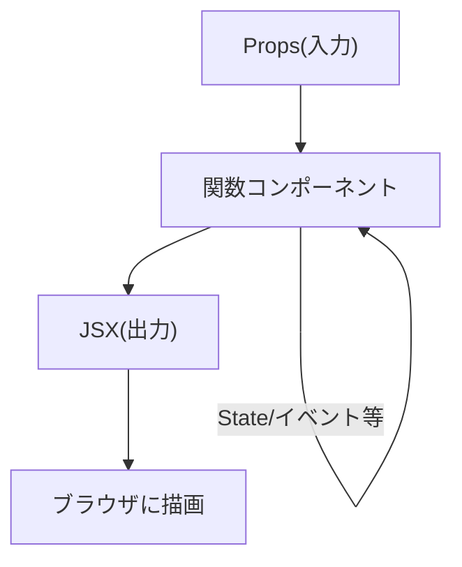
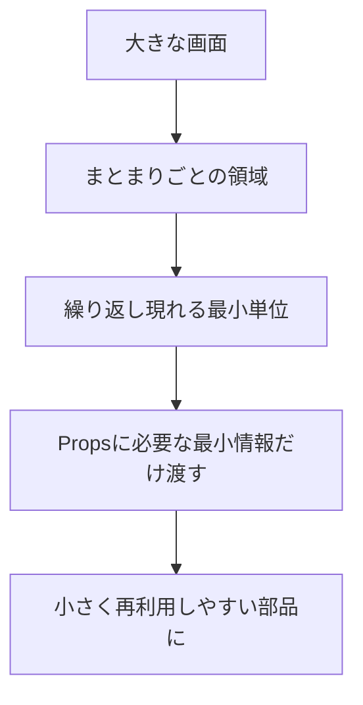

# 第16章：部品（コンポーネント）の作り方

**— 関数でサクッと作るのがイマドキ！ —**
（小さく作って組み合わせる…がReactの勝ちパターンだよ🌸）

---

## きょうのゴール 🎯

* **関数コンポーネント**の基本形を覚える
* **命名・返り値・型**のミニルールを身につける
* **小さい部品を作って組み合わせる**体験をする（ハンズオン付き）

---

## コンポーネントって、ただの「関数」だよ🫶



* **入力**：`props`（外から渡してもらうデータ）
* **処理**：関数の中でロジック（のちほどStateやイベントも！）
* **出力**：**JSXを1つのかたまり**で返す（フラグメント `<>...</>` OK）

---

## 最小のコンポーネント ✨

```tsx
// src/components/Hello.tsx
export default function Hello() {
  return <p>やっほー🙌 Reactはじめよう！</p>;
}
```

* **先頭大文字**で命名（PascalCase）
* `return` は **1つの親要素**（or `<>...</>`）で包む
* v19/Viteなら **`import React from "react"` は不要**（自動変換のおかげ）

使い方（呼び出し側）👇

```tsx
// src/App.tsx
import Hello from "./components/Hello";

export default function App() {
  return (
    <>
      <h1>My App ✨</h1>
      <Hello />
    </>
  );
}
```

---

## Propsあり版（型つきで安全に）🛡️

```tsx
// src/components/HelloName.tsx
type Props = {
  name: string;
  emoji?: string; // オプショナル（あってもなくてもOK）
};

export default function HelloName({ name, emoji = "🌷" }: Props) {
  return <p>こんにちは、{name} さん {emoji}</p>;
}
```

* `type Props` を作って **受け取る形を明確化**
* **分割代入**で `props` を取り出す（読みやすい！）
* `emoji?` の **? はオプショナル**（第30章で深掘り）

呼び出し側👇

```tsx
import HelloName from "./components/HelloName";

export default function App() {
  return (
    <>
      <HelloName name="Hanako" emoji="💖" />
      <HelloName name="Taro" />
    </>
  );
}
```

---

## ファイルの置き場所・名前のコツ 📁

* `src/components/` フォルダを作って、**1部品 = 1ファイル**が基本
* **ファイル名 = コンポーネント名**（例：`HelloName.tsx`）
* **default export** か **named export**、どっちでもOK（チームで統一）

### named export 例

```tsx
// src/components/Text.tsx
export function Title({ children }: { children: React.ReactNode }) {
  return <h2 style={{ marginBlock: 8 }}>{children}</h2>;
}

export function Muted({ children }: { children: React.ReactNode }) {
  return <p style={{ color: "#666" }}>{children}</p>;
}
```

使い方👇

```tsx
import { Title, Muted } from "./components/Text";

export default function App() {
  return (
    <section>
      <Title>自己紹介</Title>
      <Muted>よろしくね〜🫶</Muted>
    </section>
  );
}
```

---

## コンポーネント作成チェックリスト ✅

* 先頭大文字（`PascalCase`）にした？
* `return` は **1つの親**で包んだ？（`<>...</>` でもOK）
* `"class"` じゃなくて **`className`** 使った？（第13章のルール）
* Propsに **型をつけた**？（`type Props = {...}`）
* **副作用や重い処理は入れてない**？（第56章〜で扱うよ）

---

## ハンズオン①：小さな部品を3つ作って組み立てよう 🧪

**Goal**：プロフィールカードを部品化
**部品**：`Avatar` / `UserName` / `UserTag` / `ProfileCard`

```tsx
// src/components/Avatar.tsx
type Props = { src: string; size?: number; alt?: string };
export default function Avatar({ src, size = 64, alt = "avatar" }: Props) {
  return (
    
  );
}
```

```tsx
// src/components/UserName.tsx
export default function UserName({ children }: { children: React.ReactNode }) {
  return <strong style={{ fontSize: 18 }}>{children}</strong>;
}
```

```tsx
// src/components/UserTag.tsx
export default function UserTag({ children }: { children: React.ReactNode }) {
  return <span style={{ color: "#666" }}>@{children}</span>;
}
```

```tsx
// src/components/ProfileCard.tsx
import Avatar from "./Avatar";
import UserName from "./UserName";
import UserTag from "./UserTag";

type Props = {
  name: string;
  tag: string;
  icon: string;
  bio?: string;
};

export default function ProfileCard({ name, tag, icon, bio }: Props) {
  return (
    <article
      style={{
        display: "flex",
        gap: 12,
        alignItems: "center",
        padding: 12,
        borderRadius: 12,
        border: "1px solid #eee",
        boxShadow: "0 4px 16px rgba(0,0,0,.06)",
      }}
    >
      <Avatar src={icon} size={56} alt={`${name} のアイコン`} />
      <div>
        <UserName>{name}</UserName>
        <div>
          <UserTag>{tag}</UserTag>
        </div>
        {bio && <p style={{ marginTop: 6 }}>{bio}</p>}
      </div>
    </article>
  );
}
```

使ってみよう👇

```tsx
// src/App.tsx
import ProfileCard from "./components/ProfileCard";

export default function App() {
  return (
    <main style={{ padding: 16 }}>
      <h1>My People 🌟</h1>
      <ProfileCard
        name="Hanako"
        tag="hana_dev"
        icon="https://placehold.co/96x96"
        bio="抹茶ラテが好き。TypeScriptが相棒。"
      />
      <ProfileCard
        name="Mina"
        tag="mina_ui"
        icon="https://placehold.co/96x96"
      />
    </main>
  );
}
```

---

## コンポーネント分解の考え方 🧠🔪



* **繰り返し現れる塊**を見つけたら**部品化**
* Propsは **最小限**（迷ったら後から増やせばOK）
* **見た目（表示）** と **ロジック（状態・通信）** は**なるべく分離**（のちの章で強化）

---

## ありがちバグ＆対処 🧯

* **Adjacent JSX elements… エラー**
  → 兄弟要素を**親で包む**（`<>...</>` が速い）
* **コンポーネント名を小文字にした**
  → **先頭大文字**に直す（小文字はネイティブタグ扱い）
* **`class` を使ってしまう**
  → **`className`** に直す（第13章参照）
* **Propsの取り出しで `props.name` が長い**
  → **分割代入**で `({ name, tag })` に
* **同一ファイルが長くなって読みにくい**
  → **1部品1ファイル**に切り出す（次章でimport/exportへ）

---

## ミニテスト（3分）📝

1. コンポーネント名は先頭**大文字/小文字**どっち？
2. `return` するJSXは**何で**包む必要がある？
3. Propsに型を付ける簡単な方法は？
4. 繰り返し使うUIを見つけたらどうする？
5. `class` と書いてしまった…正解は？

**こたえ**

1. **大文字（PascalCase）**
2. **1つの親要素**（`<>...</>` でもOK）
3. `type Props = {...}` を作って引数で `({ ... }: Props)`
4. **部品化して再利用**（小さく分ける）
5. **`className`**

---

## まとめチートシート 🧾💨

* コンポーネント = **関数**（入力：Props → 出力：JSX）
* **PascalCase**・**単一親**・**型付きProps** が基本3点セット
* 小さく作って**組み合わせ**るのがReactの真髄
* 見た目とロジックは**分離**の方向で（発展章で強化）

---

## 次の章の予告 🎬

**第17章**は「部品を別ファイルに分ける」！
`export / import` の正しい使い方、**default vs named** の使い分けをサクッとマスターしようね〜📦✨
