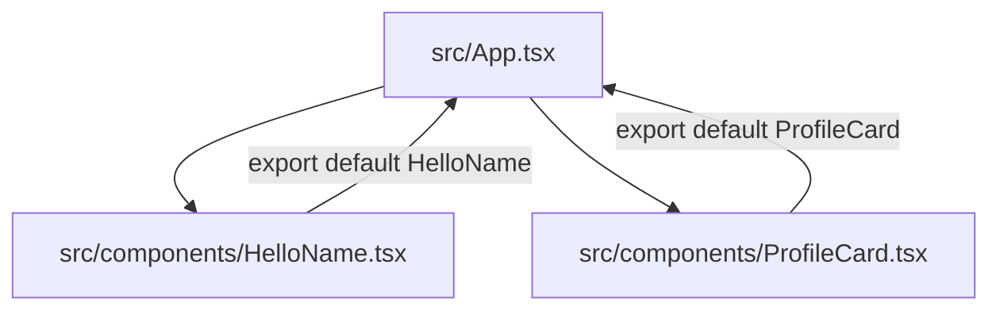
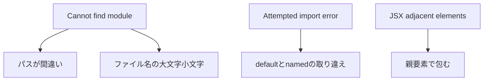

# 第17章：部品を別のファイルに分ける

**— `export` / `import` を使って、キレイに整理しよっ！—**

---

## きょうのゴール 🎯

* コンポーネントを**別ファイル**に分ける手順が分かる
* **default export** と **named export** の違いが分かる
* ありがちエラーを**秒速で解決**できる

---

## まずは全体イメージをつかもう 🧭



> ポイント：
>
> * **App.tsx** が **components フォルダ**の部品を**import**して使う流れだよ🌸

---

## ステップ1：フォルダを作ってファイル分割 ✂️

1. `src/` の中に **`components/`** フォルダを作る
2. `HelloName` を別ファイルに移動してみよう

```tsx
// src/components/HelloName.tsx
type Props = {
  name: string;
  emoji?: string;
};

export default function HelloName({ name, emoji = "🌷" }: Props) {
  return <p>こんにちは、{name} さん {emoji}</p>;
}
```

`App.tsx` から呼び出す👇

```tsx
// src/App.tsx
import HelloName from "./components/HelloName";

export default function App() {
  return (
    <main style={{ padding: 16 }}>
      <h1>ファイル分割の第一歩✨</h1>
      <HelloName name="Hanako" emoji="💖" />
      <HelloName name="Taro" />
    </main>
  );
}
```

> うまくいけばブラウザに**2つの挨拶**が出るはず！🙌
> Vite + React v19 なら `import React from "react"` は不要でOKだよ。

---

## ステップ2：default export と named export の使い分け 🧠

### どっちを使う？

* **default export**：ファイルに「主役」が**1つ**のとき。`import X from "…"`
* **named export**：**複数**のユーティリティや小部品をまとめたいとき。`import { X, Y } from "…"`

### default の例（さっきのやつ）

```tsx
// src/components/ProfileCard.tsx
type Props = { name: string; tag: string; icon: string; bio?: string };

export default function ProfileCard({ name, tag, icon, bio }: Props) {
  return (
    <article style={{ border: "1px solid #eee", padding: 12, borderRadius: 12 }}>
      
      <div>
        <strong>{name}</strong> <span style={{ color: "#666" }}>@{tag}</span>
        {bio && <p style={{ marginTop: 6 }}>{bio}</p>}
      </div>
    </article>
  );
}
```

使い方👇

```tsx
import ProfileCard from "./components/ProfileCard";
```

### named の例（小部品をセットで）

```tsx
// src/components/Text.tsx
export function Title({ children }: { children: React.ReactNode }) {
  return <h2 style={{ marginBlock: 8 }}>{children}</h2>;
}

export function Muted({ children }: { children: React.ReactNode }) {
  return <p style={{ color: "#666" }}>{children}</p>;
}
```

使い方👇

```tsx
import { Title, Muted } from "./components/Text";
```

### default と named を同じファイルから同時に取ることもあるよ

```tsx
// src/components/Button.tsx
export default function Button({ children, ...rest }: React.ButtonHTMLAttributes<HTMLButtonElement>) {
  return <button {...rest} style={{ padding: "8px 12px", borderRadius: 8 }}>{children}</button>;
}

export function Danger({ children, ...rest }: React.ButtonHTMLAttributes<HTMLButtonElement>) {
  return <button {...rest} style={{ padding: "8px 12px", borderRadius: 8, background: "#ff4d4f", color: "#fff" }}>{children}</button>;
}
```

使い方👇

```tsx
import Button, { Danger } from "./components/Button";
```

> おまけ：**名前を変えて** import したいときは `as` が使えるよ👇
> `import { Danger as DangerButton } from "./components/Button";`

---

## ステップ3：パスの書き方のミニルール 🛣️

* **相対パス**でOK：`"./components/HelloName"`
* **拡張子は省略**でOK：`.tsx` は書かない
* **スラッシュは前向き**：Windows でも `/` を使う（`.\` じゃないよ）
* `..` が増えたら（`../../`地獄）、**第149章**の**絶対パスインポート**で解決するよ✨

---

## ありがちエラーと秒速リカバリ 🧯



* **Cannot find module**
  → import の**パス**を確認、**大文字小文字**も要チェック
* **Attempted import error**（default なのに `{}` で取ってる 等）
  → 書き方を**合わせる**：

  * default は `import X from "…"`,
  * named は `import { X } from "…"`
* **JSX adjacent elements**
  → 兄弟要素を **`<> ... </>`** で包む

---

## ハンズオン：部品を分割して組み立てる 🧪🧩

1. `src/components/` に 3つ作る

   * `Avatar.tsx`（default）
   * `UserName.tsx`（default）
   * `UserTag.tsx`（named）
2. `ProfileCard.tsx`（default）で組み立て
3. `App.tsx` に表示

サンプル実装👇

```tsx
// src/components/Avatar.tsx
type Props = { src: string; size?: number; alt?: string };
export default function Avatar({ src, size = 56, alt = "avatar" }: Props) {
  return ;
}
```

```tsx
// src/components/UserName.tsx
export default function UserName({ children }: { children: React.ReactNode }) {
  return <strong style={{ fontSize: 18 }}>{children}</strong>;
}
```

```tsx
// src/components/UserTag.tsx
export function UserTag({ children }: { children: React.ReactNode }) {
  return <span style={{ color: "#666" }}>@{children}</span>;
}
```

```tsx
// src/components/ProfileCard.tsx
import Avatar from "./Avatar";
import UserName from "./UserName";
import { UserTag } from "./UserTag";

type Props = { name: string; tag: string; icon: string; bio?: string };

export default function ProfileCard({ name, tag, icon, bio }: Props) {
  return (
    <article style={{ display: "flex", gap: 12, alignItems: "center", padding: 12, borderRadius: 12, border: "1px solid #eee" }}>
      <Avatar src={icon} />
      <div>
        <UserName>{name}</UserName> <UserTag>{tag}</UserTag>
        {bio && <p style={{ marginTop: 6 }}>{bio}</p>}
      </div>
    </article>
  );
}
```

```tsx
// src/App.tsx
import ProfileCard from "./components/ProfileCard";

export default function App() {
  return (
    <main style={{ padding: 16 }}>
      <h1>People ✨</h1>
      <ProfileCard name="Hanako" tag="hana_dev" icon="https://placehold.co/96x96" bio="抹茶ラテとTSが好き" />
      <ProfileCard name="Mina" tag="mina_ui" icon="https://placehold.co/96x96" />
    </main>
  );
}
```

---

## さらに一歩：軽い再エクスポート（予告編）📤

※ 本格版は **第150章** でやるよ！

```tsx
// src/components/index.ts
export { default as Avatar } from "./Avatar";
export { default as UserName } from "./UserName";
export { UserTag } from "./UserTag";
export { default as ProfileCard } from "./ProfileCard";
```

使い方👇

```tsx
// src/App.tsx
import { ProfileCard } from "./components";

export default function App() {
  return <ProfileCard name="Riko" tag="riko_ui" icon="https://placehold.co/96x96" />;
}
```

---

## チェックリスト ✅

* `src/components/` に**分割**できた？
* **default / named** を**正しく import** した？
* 兄弟JSXは **`<>...</>`** で**包んだ**？
* パスは **"./components/..."** でOK？（拡張子いらないよ）

---

## ミニテスト（3問）📝

1. default export を import する正しい書き方は？
2. named export を import する正しい書き方は？
3. `Attempted import error` が出たらまずどこを疑う？

**こたえ**

1. `import X from "./path/X"`
2. `import { X } from "./path/X"`
3. **default と named の取り違え** と **import パス**

---

## まとめ 💡

* コンポーネントは**1ファイル1主役**でスッキリ
* **default** は主役、**named** はサブ達
* エラーは**パス**と**default/named**の確認でほぼ解決✨

次は **第18章**！
`type` と `interface` の選び方をサクッと掴んで、**型安全**をさらに強化しようね〜🛡️💙
