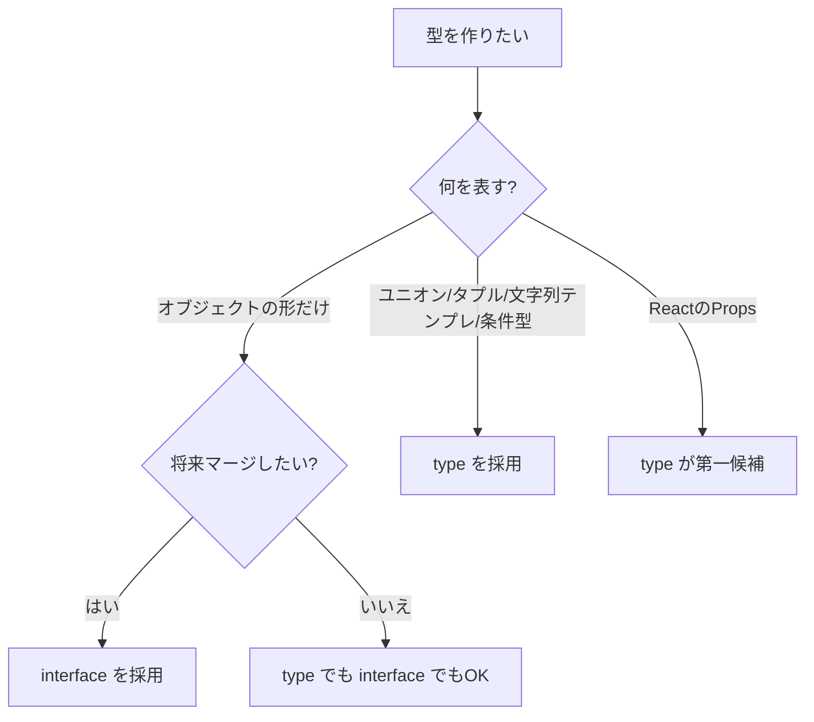
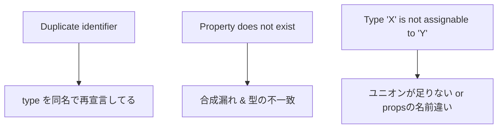

# 第18章：TSの`interface`と`type`、どっち使う？

**— まずは `type` でOK！でも違いも知っておこ〜🌸 —**

---

## きょうのゴール 🎯

* `interface` と `type` の**違い**がサクッと分かる
* Reactの**Props定義**で「まず何を使えばいいか」判断できる
* ありがちなエラー/つまずきを**秒速回避**できる

---

## 結論さきどり 🍮（TL;DR）

* 迷ったら **`type` でPropsを定義**してOK（ユニオンやタプル、テンプレ文字列型が使えて万能🙆‍♀️）
* **`interface` は宣言マージ**（あとから拡張）が必要な時や、**公開APIの拡張ポイント**にしたい時に✨

---

## サクッとおさらい：どっちも「型の名前」を付ける🍀

* **`interface`**：主に**オブジェクトの形**を表す。**宣言マージ**できる（同名をあとから拡張可）
* **`type`**：**なんでも**に別名を付けられる（プリミティブ・ユニオン・タプル・関数型・テンプレ文字列型・条件型など）

---

## まずは「選び方」を図で👀



---

## ReactのPropsはこう書くのがラクだよ ✨

### ✅ 推し：`type` でProps

```tsx
// Button.tsx
type ButtonProps = {
  label: string;
  variant?: "primary" | "ghost";
  onClick?: () => void;
  disabled?: boolean;
};

export default function Button({ label, variant = "primary", ...rest }: ButtonProps) {
  return (
    <button
      data-variant={variant}
      {...rest}
      style={{ padding: "8px 12px", borderRadius: 8 }}
    >
      {label}
    </button>
  );
}
```

### 🧪 使ってみる

```tsx
// App.tsx
import Button from "./Button";

export default function App() {
  return (
    <main style={{ padding: 16 }}>
      <Button label="送信" onClick={() => alert("送ったよ📨")} />
      <Button label="キャンセル" variant="ghost" disabled />
    </main>
  );
}
```

> `variant` を `"primary" | "ghost"` みたいに**ユニオン型**にしやすいのが `type` の強み💪

---

## `interface` で「あとから拡張」もアリ 🧩

### 宣言マージの例（`interface` だけできる魔法🪄）

```ts
// theme.d.ts（型定義の置き場）
interface AppTheme {
  primary: string;
  spacing: number;
}

// 別ファイルで拡張（同名で追記OK）
interface AppTheme {
  rounded: number;
}
```

`type` は**同名再定義できない**ので、こういう「**外部に拡張ポイントを開ける**」設計には `interface` が便利💡

---

## 同じことをする2つの書き方（どっちでもOKな場面）😌

### 継承/合成

```ts
// interface の extends
interface Base {
  id: string;
}
interface User extends Base {
  name: string;
}

// type の交差型（&）
type BaseT = { id: string };
type UserT = BaseT & { name: string };
```

> ReactのPropsでは**交差型（`&`）**で合成する書き方がスッキリしがち✨

---

## `type` でしかできない代表ワザ 🪄

```ts
// 文字列テンプレ型
type ButtonVariant = `tone-${"primary" | "secondary"}`; // "tone-primary" | "tone-secondary"

// タプル
type Point = [number, number];

// ユニオンの組み合わせ
type LoadingState = "idle" | "loading" | "success" | "error";

// 条件型（高度）
type IdOf<T> = T extends { id: infer U } ? U : never;
```

---

## `interface` のおいしい使い所 🍯

* **宣言マージ**や**モジュール拡張**（ライブラリの型を足す）
* **グローバル**の型を書き足すとき（例：`Window` の拡張）

```ts
// global.d.ts
declare global {
  interface Window {
    __APP_VERSION__: string;
  }
}
export {};
```

---

## ありがちエラー＆対処法 🔥



* **Duplicate identifier**（重複識別子）
  → `type` は**同名で増やせない**。名前を変える or `interface` に切り替え
* **Property does not exist**
  → 合成（`&` / `extends`）の**片方にしかない**プロパティを使ってない？
* **型が合わない**
  → ユニオンに値を**足す**か、Props名/型を**正しく**そろえる

---

## ハンズオン：置き換えてみよう🧪✨

### 1) `interface` → `type`

```ts
// before
interface CardProps {
  title: string;
  tone?: "info" | "warn";
}

// after
type CardProps = {
  title: string;
  tone?: "info" | "warn";
};
```

### 2) 合成して再利用（ボタンの基礎 + バリアント）

```ts
type BaseButton = {
  disabled?: boolean;
  onClick?: () => void;
};

type VariantButton = {
  variant?: "primary" | "ghost";
};

type ButtonProps = BaseButton & VariantButton;
```

---

## ミニチートシート 📝

| やりたいこと                        | おすすめ                                     |
| ----------------------------- | ---------------------------------------- |
| ReactのProps・ユニオン・タプル・テンプレ文字列型 | **`type`**                               |
| 公開APIで他ファイルから拡張させたい           | **`interface`**                          |
| 既存ライブラリの型を拡張（宣言マージ）           | **`interface`**                          |
| 複数の型を合成してPropsにしたい            | **`type` の `&`**（or `interface extends`） |

---

## ミニテスト（3問）🎓

1. ボタンの `variant` を `"solid" | "outline"` にしたい。`type` と `interface` どっちがカンタン？
2. ライブラリの `Theme` 型に `rounded` を後から足したい。どうする？
3. `type` を同じ名前で2回書いたら…どうなる？

**こたえ**

1. **`type`**（ユニオンを作りやすい）
2. **`interface` の宣言マージ**（同名で追記）
3. **重複エラー**。同名再定義は不可（`interface` ならマージ可能）

---

## まとめ 🌟

* 迷ったら**`type`**でProps！ユニオン/タプル/テンプレ文字列型が強い💪
* **宣言マージ**や**拡張ポイント**が必要なら**`interface`**
* 実務は“`type`メイン + `interface`ピンポイント”が快適だよ🧘‍♀️

次は **第19章**！Propsの**最初の型定義**を実戦で作って、VS Code に**型で守ってもらう感覚**をつかもうね〜🛡️💙
