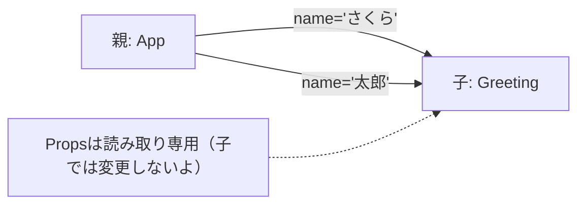

# 第21章：「Props」ってなに？

> **ゴール**：親コンポーネントから子コンポーネントへ“型付きデータ（Props）”を渡して、画面に表示できるようになるよ！
> **キーワード**：Props（プロップス）＝ *Properties*。**ただの「引数」**だと思えばOK🙆‍♀️

---

## 🧠 まずはイメージ図

Props は「上から下へ」流れるよ。子から親へは直接は流れない（イベント関数を渡すのは後の章で！）



---

## 🧩 Props = 関数の引数（しかも1個のオブジェクト）

Reactの関数コンポーネントは、**最初の引数に「propsオブジェクト」**が来るだけ。TypeScript ではこの「形（型）」を定義してあげると、VS Code が**補完✨**や**間違いチェック🛡️**をしてくれるよ。

---

## 👟 ハンズオン：とにかく動かしてみよ！

> ここでは `src` 配下にファイルを2つ作るよ（Vite で作ったプロジェクトを想定）。

### 1) 子コンポーネントを作る：`src/components/Greeting.tsx`

```tsx
// src/components/Greeting.tsx
type GreetingProps = {
  name: string;     // 親から受け取るデータの「型」はここで決める！
};

export function Greeting({ name }: GreetingProps) {
  return <p>👋 こんにちは、{name} さん！</p>;
}
```

> ポイント
>
> * `type GreetingProps = { ... }` で **Props の型**を定義
> * 受け取り側は **分割代入**で `({ name }: GreetingProps)` と書くのがスッキリ💇‍♀️

---

### 2) 親コンポーネントで使う：`src/App.tsx`

```tsx
// src/App.tsx
import { Greeting } from "./components/Greeting";

export default function App() {
  return (
    <main>
      <h1>Propsデビュー🎉</h1>
      <Greeting name="さくら" />
      <Greeting name="太郎" />
    </main>
  );
}
```

> `Greeting` に `name="さくら"` のように **属性＝値** で渡すだけ。
> JSX 的には `<タグ 属性="値" />`、中身はただの **関数引数**👉 `{ name: "さくら" }` だよ。

---

## 🎯 Propsの3つの大事ポイント

1. **読み取り専用（immutable）**
   子の中で `name = "変更"` のように**書き換えない**でね（というか書き換えられない）。

2. **型でガード**
   型が違えば即エラー。実はこれが**安心**の源💖

3. **親が決めて、子は表示に集中**
   「データの持ち主＝親」「見せ方＝子」という役割分担でコードがキレイに✨

---

## 🩹 よくあるエラー＆対処

### ❌ 属性を渡し忘れた

```tsx
// <Greeting /> ← name を忘れてる
```

**エラー例**：`Property 'name' is missing...`
**対策**：`<Greeting name="誰か" />` を渡そう。

---

### ❌ 型が違う

```tsx
<Greeting name={123} />
```

**エラー例**：`Type 'number' is not assignable to type 'string'`
**対策**：`name="123"` のように **string** に直す。

---

### ❌ 子で書き換えようとした

```tsx
export function Greeting({ name }: { name: string }) {
  // name = "変えたい…"; // ← NG！読み取り専用
  return <p>{name}</p>;
}
```

**対策**：変えたい値は **State（useState）** にしよう（次モジュールで解説！）。

---

## 🍱 もう一品：Propsオブジェクトで受ける書き方（比較）

> 分割代入しない版。慣れるまではこっちもわかりやすいかも？

```tsx
type GreetingProps = { name: string };

export function Greeting(props: GreetingProps) {
  return <p>🌸 こんにちは、{props.name} さん！</p>;
}
```

> どちらでもOKだけど、**分割代入**は取扱が軽くて読みやすいからオススメだよ💡

---

## 📦 ちょっと応用：配列やオブジェクトも渡せるよ

```tsx
type User = { id: number; name: string };
type UserListProps = { users: User[] };

export function UserList({ users }: UserListProps) {
  return (
    <ul>
      {users.map(u => <li key={u.id}>🧑 {u.name}</li>)}
    </ul>
  );
}

// 親側
// <UserList users={[{ id: 1, name: "さくら" }, { id: 2, name: "太郎" }]} />
```

> **型があると map の中も補完が効く**から、JS中級のあなたならスイスイ進めるはず🚀

---

## 📝 ミニ課題（5〜10分）👩‍🎓

1. `src/components/Profile.tsx` を作ってね。

   * Props 型：`{ name: string; age: number }`
   * 表示：`🎀 {name}（{age}歳）です！`
2. `App.tsx` で `<Profile name="みお" age={20} />` を表示。
3. わざと `age="20"` にしてエラーを観察→直す（型の大切さを体感しよ！）

---

## 🧪 チェックテスト（○×）

1. Props は子から親へ自由に更新を伝える仕組みである。
2. Props は関数コンポーネントの「引数」であり、TypeScript の型を付けられる。
3. 子コンポーネント内で Props を直接書き換えてOK。
4. 配列やオブジェクトも Props で渡せる。

**答え**：1× / 2○ / 3× / 4○

---

## 🎬 まとめ

* Props は **親 → 子** へ渡す**ただの引数（オブジェクト）**。
* **読み取り専用**だから、**表示ロジック**に集中できる💪
* **型を付けると超安心**＆補完が気持ちいい🌈

> 次の章では、**「どうやって渡す・どう受け取る」**を、さらに手を動かしながら深堀りするよ。楽しみにしててね〜！🥳✨
