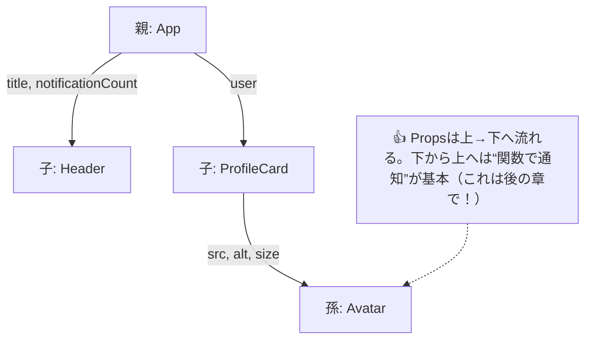

# 第22章：Propsを渡す・受け取る

> **ゴール**：親コンポーネントから子コンポーネントへ、**型付きのProps**をきちんと渡して表示できるようになること。
> **合言葉**：Props＝**関数の引数**。型があるから VS Code がずっと味方 🧑‍🏫✨

---

## 🔭 まずは全体像（どこからどこへ渡すの？）



---

## 🧪 ハンズオン：3つの子を作って渡してみよう

> プロジェクトは Vite（react-ts）想定。`src/components` を使うよ。

### 1) `Avatar.tsx`（画像アイコンの部品）

```tsx
// src/components/Avatar.tsx
type AvatarProps = {
  src: string;
  alt: string;
  size: "sm" | "md" | "lg";
};

export function Avatar({ src, alt, size }: AvatarProps) {
  const px = size === "sm" ? 32 : size === "md" ? 48 : 72;
  return (
    
  );
}
```

👉 **ポイント**：`size` をリテラル型（"sm" | "md" | "lg"）にすると、**入力ミスを未然に防げる**し、VS Code で選択肢が出るよ🎯

---

### 2) `ProfileCard.tsx`（ユーザーの名刺っぽい部品）

```tsx
// src/components/ProfileCard.tsx
import { Avatar } from "./Avatar";

export type User = {
  id: number;
  name: string;
  iconUrl: string;
  bio: string;
};

type ProfileCardProps = {
  user: User;
};

export function ProfileCard({ user }: ProfileCardProps) {
  return (
    <section
      style={{
        display: "flex",
        gap: "12px",
        alignItems: "center",
        padding: "12px",
        border: "1px solid #eee",
        borderRadius: "12px",
      }}
    >
      <Avatar src={user.iconUrl} alt={`${user.name}のアイコン`} size="md" />
      <div>
        <h2 style={{ margin: 0 }}>👩 {user.name}</h2>
        <p style={{ margin: "6px 0 0" }}>📝 {user.bio}</p>
      </div>
    </section>
  );
}
```

👉 **ポイント**：`ProfileCard` は **`user` という1つのProps**だけを受け取り、その中身を孫の `Avatar` に**必要な形**で渡しているよ。**親→子→孫**と、Propsはバトンのように受け渡し🏃‍♀️🏃‍♀️🏃‍♀️

---

### 3) `Header.tsx`（ページ上部の部品）

```tsx
// src/components/Header.tsx
type HeaderProps = {
  title: string;
  notificationCount: number;
};

export function Header({ title, notificationCount }: HeaderProps) {
  return (
    <header
      style={{
        display: "flex",
        justifyContent: "space-between",
        alignItems: "center",
        padding: "12px",
        borderBottom: "1px solid #eee",
      }}
    >
      <h1 style={{ margin: 0 }}>🌸 {title}</h1>
      <span aria-label="通知数">🔔 {notificationCount}</span>
    </header>
  );
}
```

👉 **ポイント**：`notificationCount` を **number** にしておくと、文字列を渡してしまった時に**即エラーで守ってくれる**🛡️

---

### 4) 親でまとめて渡す：`App.tsx`

```tsx
// src/App.tsx
import { Header } from "./components/Header";
import { ProfileCard, type User } from "./components/ProfileCard";

export default function App() {
  const user: User = {
    id: 1,
    name: "みお",
    iconUrl:
      "https://images.unsplash.com/photo-1544005313-94ddf0286df2?w=256&q=80&auto=format&fit=crop",
    bio: "カフェと読書が好き📚☕",
  };

  return (
    <main style={{ maxWidth: 560, margin: "24px auto", padding: "0 12px" }}>
      <Header title="Propsの実験室" notificationCount={3} />
      <div style={{ height: 12 }} />
      <ProfileCard user={user} />
    </main>
  );
}
```

💡 **VS Codeの気持ちよさ**
`<Header ...>` を書いてると、`notificationCount` の型が **number だよ〜**って補完と型ヒントが出るはず！「型が教えてくれる」ってこういうこと😍

---

## 🆘 ありがちエラーと即解決

### ① 型が違う（string を number に渡しちゃった）

```tsx
// ❌ ダメ
<Header title="NG例" notificationCount={"3"} />
//             ここが string になってて怒られる
```

➡️ **直す**：

```tsx
<Header title="OK例" notificationCount={3} />
```

---

### ② 必須Propsを渡し忘れた

```tsx
// ❌ ダメ（title を渡してない）
<Header notificationCount={1} />
```

➡️ **直す**：
`<Header title="ホーム" notificationCount={1} />`

---

### ③ 子の中でPropsを書き換えようとした

```tsx
// ❌ ダメ
export function Header({ title, notificationCount }: HeaderProps) {
  // title = "変えたい…"; // ← Propsは読み取り専用だよ
  return <h1>{title}</h1>;
}
```

➡️ **考え方**：表示を変えたいときは **State** の出番（次モジュールで学ぶよ！）🧠

---

## 🧩 ちょい上級の型テク（でも簡単！）

### リテラル型で入力ミスをブロック✋

`"sm" | "md" | "lg"` のように**選択肢を限定**できる。
VS Code が「この3つから選んでね〜」とガイドしてくれて安心💖

### 型を**再利用**して一貫性アップ

`export type User = { ... }` を他の部品へどんどん使い回そう。
「どこでも同じ `User`」は**強い**💪

---

## 📝 ミニ課題（10分）🎯

1. `src/components/StatBadge.tsx` を作成。

   * Props：`label: string; value: number;`
   * 表示：`🏷️ {label}: {value}`（少しCSSで丸くしてもOK）
2. `App.tsx` に追加して表示：

   * 例）`<StatBadge label="フォロワー" value={1280} />`
3. わざと `value="1280"` にしてエラーを観察→**numberに直す**。

---

## ✅ 小テスト（○×）

1. Props は **親→子** に一方向で渡すのが基本である。
2. Props は関数コンポーネントの**引数**で、TypeScriptの**型**を付けられる。
3. 子コンポーネント内で Props を**直接編集**してもよい。
4. 同じ型（例：`User`）を**複数の子**に再利用できる。

**答え**：1○ / 2○ / 3× / 4○

---

## 🎬 まとめ

* Props は「**親が決めたデータ**を**子へ手渡す**」ただの**引数**。
* TypeScript で型を付けると、**補完が効く**＆**バグが即バレ**して最高✨
* リテラル型や共通型の再利用で、**入力ミス激減**＆**設計がキレイ**に🌈

> 次回は、もっと実践的に「`React.FC` を使わずに **Props に型を“直接”当てる**」書き方に進もうね〜！🚀💖
