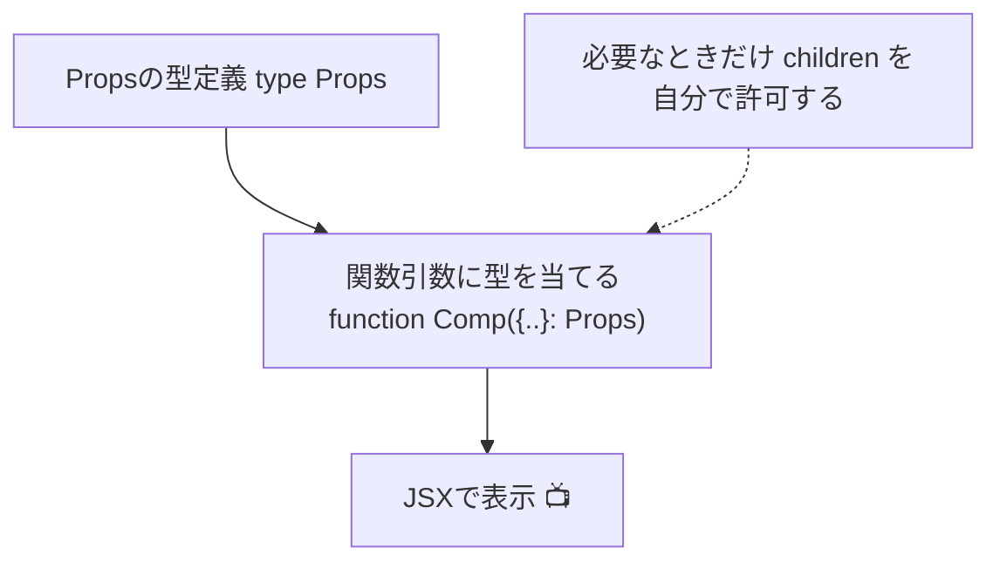

# 第23章：`React.FC`はもう古い？

> **ゴール**：`React.FC`を使わずに、**関数の引数**にそのまま型を当てる書き方に乗り換える。
> **メリット**：いらない `children` を勝手に許さない・ジェネリクスが書きやすい・読みやすい ✨

---

## 🗺️ まずは地図：型の流れをイメージしよう



---

## 🥊 `React.FC` と “いまどき”の直接注釈、なにが違うの？

### 旧来（`React.FC` を使う）

```tsx
type CardProps = { title: string };

const Card: React.FC<CardProps> = ({ title }) => {
  return <h2>{title}</h2>;
};
```

* `children?: ReactNode` が**暗黙で付く**（= 子要素を受け取れちゃう）。受け取るつもりがないのに OK になることがある😢
* ジェネリクス（`<T>`）を使うと **型推論がやや面倒**になりやすい。

### いまどき（**引数に直接型を当てる**）

```tsx
type CardProps = { title: string };

function Card({ title }: CardProps) {
  return <h2>{title}</h2>;
}
```

* **必要なPropsだけ**を明示。`children` が欲しければ **自分で書く**（後述）。
* ジェネリクスやユニオン、リテラル型などが**素直に書ける**。
* 見た目もシンプルで読みやすい👀

---

## 🧪 ハンズオン：3パターンで“直接注釈”を体に入れる！

> `src/components` にファイルを作っていくよ。

### ① 子要素を**受け取らない**部品

```tsx
// src/components/Header.tsx
type HeaderProps = { title: string; count: number };

export function Header({ title, count }: HeaderProps) {
  return (
    <header style={{ display: "flex", gap: 8, alignItems: "center" }}>
      <h1 style={{ margin: 0 }}>🌸 {title}</h1>
      <span>🔔 {count}</span>
    </header>
  );
}
```

> ✅ `children` を勝手に許可しないから、`<Header>NG</Header>` を書くと型エラーで守ってくれる🛡️

---

### ② 子要素（`children`）を**受け取る**部品

```tsx
// src/components/Section.tsx
type SectionProps = {
  label: string;
  children?: React.ReactNode; // 自分で明示する！
};

export function Section({ label, children }: SectionProps) {
  return (
    <section style={{ border: "1px solid #eee", borderRadius: 12, padding: 12 }}>
      <h2 style={{ marginTop: 0 }}>📎 {label}</h2>
      {children}
    </section>
  );
}
```

> ✅ **欲しいときだけ** `children` を定義。設計がハッキリして読みやすい🌟

---

### ③ **ジェネリクス**を使うリスト部品（超使える！）

```tsx
// src/components/List.tsx
type ListProps<T> = {
  items: T[];
  renderItem: (item: T) => React.ReactNode;
  keySelector: (item: T) => string | number;
};

export function List<T>({ items, renderItem, keySelector }: ListProps<T>) {
  return (
    <ul>
      {items.map((it) => (
        <li key={keySelector(it)}>{renderItem(it)}</li>
      ))}
    </ul>
  );
}
```

> ✅ `React.FC` より **ジェネリクスがスムーズ**。`T` が気持ちよく推論されるから、VS Code の補完も最高😍

---

## 🧩 親から使ってみる（総合演習）

```tsx
// src/App.tsx
import { Header } from "./components/Header";
import { Section } from "./components/Section";
import { List } from "./components/List";

type Book = { id: number; title: string; author: string };

export default function App() {
  const books: Book[] = [
    { id: 1, title: "React入門", author: "Hana" },
    { id: 2, title: "TypeScript図鑑", author: "Mio" },
  ];

  return (
    <main style={{ maxWidth: 560, margin: "24px auto", padding: "0 12px" }}>
      <Header title="FC卒業ツアー" count={3} />
      <div style={{ height: 12 }} />

      <Section label="おすすめ本📚">
        <List
          items={books}
          keySelector={(b) => b.id}
          renderItem={(b) => (
            <div>
              <strong>{b.title}</strong> — {b.author}
            </div>
          )}
        />
      </Section>
    </main>
  );
}
```

---

## 🧠 “直接注釈”の設計ポイント 5つ

1. **子要素は自分で許可する**
   `children?: React.ReactNode` を**必要なときだけ**定義。

2. **ユニオン/リテラル型で入力ミスを防ぐ**
   例：`size: "sm" | "md" | "lg"` は神🕊️

3. **共通型をエクスポートして再利用**
   `export type Book = {...}` を他の部品でも共有して統一感UP。

4. **ジェネリクスは“データの型”を1か所で握る**
   `List<T>` みたいに、親が `T` を決めると補完が賢い🧞‍♀️

5. **戻り値の型注釈は基本いらない**
   `JSX.Element` は推論されるので OK（読みやすさ重視）。

---

## 🆚 早見表：`React.FC` と 直接注釈

| 観点         | `React.FC`    | 直接注釈（推奨）           |
| ---------- | ------------- | ------------------ |
| `children` | **暗黙で許可**されがち | **必要な時だけ**自分で書く    |
| ジェネリクス     | やや書きづらい       | **素直で書きやすい**       |
| 可読性        | 型が2か所に分散しがち   | **関数引数に集約**して読みやすい |
| 学習コスト      | 最初は楽に見える      | 仕組みがシンプルで本質的       |

---

## 🔧 移行レシピ（置き換えテンプレ）

**Before**

```tsx
type Props = { name: string };
const Hello: React.FC<Props> = ({ name }) => <p>Hi {name}</p>;
export default Hello;
```

**After**

```tsx
type Props = { name: string };
export default function Hello({ name }: Props) {
  return <p>Hi {name}</p>;
}
```

> 補足：**どうしても** `children` を受けたい部品だけ👇

```tsx
type Props = { name: string; children?: React.ReactNode };
export default function Hello({ name, children }: Props) {
  return (
    <div>
      <p>Hi {name}</p>
      {children}
    </div>
  );
}
```

---

## 🚨 ありがちミスと対処

* **子要素いらないのに入れちゃった**

  ```
  <Header title="..." count={1}>NG</Header> // ❌
  ```

  → `children` を許可していないから **型エラー**。設計ミスにすぐ気づける！🎉

* **`children` の型を細かくしたい**
  `React.ReactElement`（特定の部品だけ許可）や `ReactNode`（幅広く許可）を使い分けよう。

---

## 📝 ミニ課題（10〜15分）🎯

1. 既存の `UserCard: React.FC<UserCardProps>` を、**直接注釈**の `function UserCard({ ... }: UserCardProps)` に書き換えよう。
2. `Badge` コンポーネントを作成：

   * Props：`color: "red" | "green" | "blue"; children?: React.ReactNode`
   * 表示：丸背景＋中に `{children}`。色は `color` で切り替え。
3. ジェネリック `Grid<T>` を作成：

   * Props：`items: T[]; renderItem: (item: T) => React.ReactNode`
   * 2列グリッドで並べて表示（軽くインラインCSSでOK）。

---

## ✅ 小テスト（○×）

1. `React.FC` を使うと、`children` を明示しなくても受け取れてしまう。
2. `children` を受け取りたくないなら、直接注釈で `children` を書かない設計にできる。
3. ジェネリクスの部品は `React.FC` の方が書きやすい。
4. 直接注釈でも `children?: React.ReactNode` を書けば、子要素を受け取れる。

**答え**：1○ / 2○ / 3× / 4○

---

## 🎬 まとめ

* `React.FC` は便利そうに見えるけど、**いらない `children` まで許可**してしまうなどの副作用がある。
* **Propsに直接型を当てる**だけで、読みやすく・壊れにくいコードに💪
* `children`・ジェネリクス・リテラル型など、**必要なものだけ明示**してクリアな設計にしよう🌈

> 次回（第24章）は、実際に `children` の型をきれいに表現するコツをやっていくよ！お楽しみに〜🥳💕
