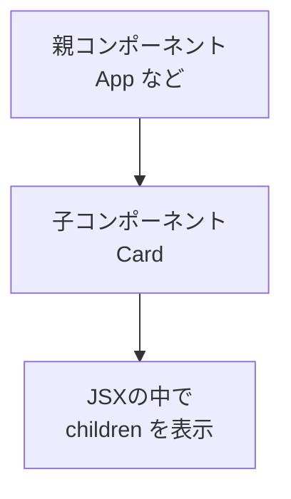

# 第27章：Propsの型定義（`children` 編）

この章では、
**「子要素を受け取るコンポーネントの型」＝ `children` の型** をちゃんと TypeScript で書けるようになるのがゴールです ✨

* 「カードコンポーネントの中に好きな内容を入れたい」
* 「レイアウト用コンポーネントで、中身は呼び出す側に任せたい」

みたいなときに `children` が大活躍します 👶💻

---

### 1️⃣ `children` ってそもそもなに？ 👶➡️🎁

まずはイメージからいきましょう。

例えば、こんなコンポーネントを使うとします：

```tsx
<Card title="今日の予定">
  <p>授業 ➜ バイト ➜ YouTubeタイム</p>
</Card>
```

このとき、`Card` コンポーネントから見ると、

* `title` → `"今日の予定"`（普通の Props）
* `children` →
  `<p>授業 ➜ バイト ➜ YouTubeタイム</p>`（タグの「中身」全部）

が渡ってきます 📦

つまり、

> **タグで囲まれた中身がまるっと `children` という特別な Props に入る**

という仕組みです 🧺✨

---

### 2️⃣ 図で見る `children` の流れ 🧠📊

`children` がどう流れているか、ざっくり図で見てみましょう 🧸



* 親コンポーネントが `<Card> ... </Card>` と書く
* `...` の部分が `children` に入る
* `Card` の中で `{children}` と書くと、そのまま表示される

という流れです 🌊

---

### 3️⃣ 型なし `children` コンポーネントを書いてみる ✍️

まずは **型を忘れたバージョン** を見てみます。

```tsx
// src/components/Card.tsx
type CardProps = {
  title: string;
  // ← まだ children は書いてない
};

export function Card({ title, children }: CardProps) {
  return (
    <section>
      <h2>{title}</h2>
      <div>{children}</div>
    </section>
  );
}
```

このコード、TypeScript 的にはエラーになります ⚠️

* `CardProps` の中に `children` が定義されていないのに
* 関数の引数 `{ title, children }` に `children` が登場しているから

VS Code だと「`children` プロパティは存在しません」と怒られます 😇

なので、**`children` もちゃんと Props の型に書いてあげる必要がある**、というのがこの章のテーマです ✅

---

### 4️⃣ `children` の型は何を書く？ → `ReactNode` 🧩

`children` に入ってくるものは、けっこう自由です 🎨

* 文字列：`"こんにちは"`
* 数字：`123`
* JSX：`<p>テキスト</p>`
* 複数の要素：`<><p>1つめ</p><p>2つめ</p></>`
* `null` や `undefined`（「何も表示しない」もアリ）

これを全部まとめて表現してくれる便利な型が、
**`ReactNode`** という型です。([Medium][1])

React + TypeScript の世界では、

> **「`children` の型は `ReactNode` にする」**

がほぼ定番の書き方になっています ✨([LogRocket Blog][2])

---

### 5️⃣ 実践：`children: ReactNode` を付けてみよう 💪

`ReactNode` を使って、さっきの `Card` を修正してみましょう ✨

```tsx
// src/components/Card.tsx
import type { ReactNode } from "react";

type CardProps = {
  title: string;
  children: ReactNode; // ← ここがこの章の主役！
};

export function Card({ title, children }: CardProps) {
  return (
    <section className="card">
      <h2 className="card-title">{title}</h2>
      <div className="card-body">{children}</div>
    </section>
  );
}
```

ここでのポイント ✨

* `import type { ReactNode } from "react";`

  * `ReactNode` は **型だけ** なので、`type` を付けて読み込むとスッキリ（JSには出ていかない）
* `children: ReactNode;`

  * 「このコンポーネントは `children` を受け取りますよ〜」と TypeScript に宣言している

こうしておくと、VS Code で `Card` を使うときに：

```tsx
<Card title="メモ">
  文字だけでもOKだし、
  <p>タグを使ってもOKだし、</p>
  <>
    <p>複数要素もOKです✨</p>
    <button>ボタンもOK</button>
  </>
</Card>
```

みたいに、かなり自由に中身を入れられるのに、**型的にもちゃんと安全**です 🛡️

---

### 6️⃣ ちょっと応用：`PropsWithChildren` というユーティリティ型 💡

実は、毎回

```ts
type CardProps = {
  title: string;
  children: ReactNode;
};
```

と書かなくてもいいように、React には **`PropsWithChildren`** というユーティリティ型も用意されています。([Qiita][3])

書き方はこんな感じ👇

```tsx
import type { PropsWithChildren } from "react";

type CardProps = PropsWithChildren<{
  title: string;
}>;

export function Card({ title, children }: CardProps) {
  return (
    <section className="card">
      <h2 className="card-title">{title}</h2>
      <div className="card-body">{children}</div>
    </section>
  );
}
```

`PropsWithChildren<{ title: string }>` の意味は、

> `{ title: string }` に加えて
> `children?: ReactNode` を自動で足してくれる

というイメージです 🧠✨

この講座では、まずは

* **シンプルに `children: ReactNode;` と書くやり方**をメインで使う
* `PropsWithChildren` は「便利グッズ」として頭の片隅に置いておく

くらいでOKです 🙆‍♀️
（あとでプロジェクトが大きくなったときに、改めて使うと「あ〜これか！」ってなるやつです）

---

### 7️⃣ ミニ演習 🧪：`Layout` コンポーネントを作ってみよう

**お題：**

> 画面全体のレイアウトを決める `Layout` コンポーネントを作って、
> 中身は `children` で入れられるようにしよう ✨

こんな感じの完成イメージを目指します 👇

#### ① `Layout` コンポーネントを作る

```tsx
// src/components/Layout.tsx
import type { ReactNode } from "react";

type LayoutProps = {
  headerTitle: string;
  children: ReactNode;
};

export function Layout({ headerTitle, children }: LayoutProps) {
  return (
    <div className="layout-root">
      <header className="layout-header">
        <h1>{headerTitle}</h1>
      </header>

      <main className="layout-main">{children}</main>

      <footer className="layout-footer">
        <small>© 2025 My React App</small>
      </footer>
    </div>
  );
}
```

#### ② `App.tsx` から使ってみる

```tsx
// src/App.tsx
import { Layout } from "./components/Layout";

export function App() {
  return (
    <Layout headerTitle="My First Layout ✨">
      <p>ここが main の中身になります。</p>
      <p>授業のメモとか、TODOリストとか、なんでも置けるよ📝</p>
    </Layout>
  );
}
```

ここでチェックしてほしいポイント ✅

* `LayoutProps` に `children: ReactNode;` が書けているか
* `Layout` の JSX の中で `{children}` をちゃんと表示しているか
* `App` 側から `<Layout> ... </Layout>` で中身を渡せているか

---

### 8️⃣ まとめ 🍵✨

この章のポイントをサクッとおさらい 💡

* `children` は
  ➜ **タグで囲まれた「中身」全部が入ってくる特別な Props** 👶
* `children` の型には
  ➜ **なんでも描画できる型 `ReactNode` を使うのが基本** 🧩([LogRocket Blog][2])
* よくある書き方はこの2つ

  * 素直に書く：
    `type Props = { children: ReactNode; ... }`
  * 便利型を使う：
    `type Props = PropsWithChildren<{ ... }>`
* `children` を使うと：

  * 「ラップ用のコンポーネント」
  * 「レイアウト用コンポーネント」
  * 「カード・モーダル・ダイアログ」
    など、**中身を入れ替えられる “枠” を作るのが超得意になる** 🖼️

次の章では、**関数を Props に渡すときの型** をやっていきます 💻✨
`children` がわかっていると、だんだん「型付き React コンポーネント職人」っぽくなってきますよ〜 🙌💕

[1]: https://medium.com/%40raindefiance/reactnode-vs-propswithchildren-d3f51ae35324?utm_source=chatgpt.com "ReactNode vs PropsWithChildren"
[2]: https://blog.logrocket.com/react-children-prop-typescript/?utm_source=chatgpt.com "Using the React children prop with TypeScript"
[3]: https://qiita.com/anneau/items/5e0c349c953ef4064881?utm_source=chatgpt.com "【React】頑張って全部の型を書かないで #TypeScript"
