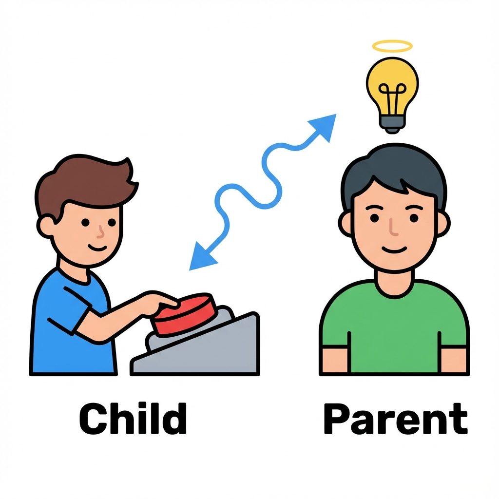
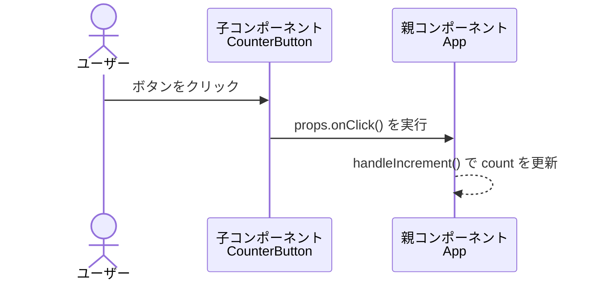

# 第28章：Propsの型定義（関数 編）

親に「押されたよ〜！」って教えるコールバック関数の型 📣

この章では、**「関数をPropsとして渡す」** という React では超よく出てくるパターンを、TypeScriptの型付きでしっかり押さえていきます ✨
テーマはずばり：

> 「ボタンを押したら、子コンポーネントから親コンポーネントにお知らせする」📨

---

### 28-1 🧠 なんで「関数」をPropsで渡すの？

Reactでは、

* 見た目 👉 子コンポーネント（`Button` など）
* 状態・処理 👉 親コンポーネント（`App` など）

に分けて書くことが多いです。

でも、ボタンを押したときに
「親の状態を変えたい！」ってこと、よくありますよね？🤔

そこで登場するのが

> **「親が用意した関数を、子にPropsとして渡す」**

というパターンです。

* 親：`handleClick` という関数を用意して、子に渡す
* 子：`props.onClick()` を呼ぶだけ（中身は知らない）

という役割分担になります ✨

---

### 28-2 ✍️ 関数の型の基本記法

TypeScriptで「関数の型」はこう書きます。

* 引数なしで、何も返さない関数

```ts
() => void
```

* 数字を1つ受け取って、何も返さない関数

```ts
(id: number) => void
```

この形をそのままPropsの型に埋め込んでいきます 💡

---

### 28-3 🧪 基本パターン：押したらカウントアップするボタン

まずは **「引数なしで親に伝える」** 超シンプル版から行きましょう 💪

#### ✅ 子コンポーネント：`CounterButton.tsx`

```ts
type CounterButtonProps = {
  // 親からもらう「押されたときに呼ばれる関数」
  onClick: () => void;
};

export function CounterButton({ onClick }: CounterButtonProps) {
  return (
    <button onClick={onClick}>
      カウントアップ 👍
    </button>
  );
}
```

ポイント ✨

* `type CounterButtonProps = { onClick: () => void; }`

  * `onClick` は「引数なし・返り値なし」の関数だよ〜という意味
* JSX側ではそのまま `onClick={onClick}` と渡してOK
  （イベント型の話は第35章以降でやります📝）

#### ✅ 親コンポーネント：`App.tsx`

```ts
import { useState } from "react";
import { CounterButton } from "./CounterButton";

export function App() {
  const [count, setCount] = useState(0);

  // 子から呼び出してもらう関数
  const handleIncrement = () => {
    setCount((prev) => prev + 1);
  };

  return (
    <div>
      <p>現在のカウント：{count}</p>
      <CounterButton onClick={handleIncrement} />
    </div>
  );
}
```

ここでの流れはこんな感じです 👇

1. `App` が `handleIncrement` を定義
2. `CounterButton` に `onClick` として渡す
3. ユーザーがボタンを押す
4. `CounterButton` 内の `onClick`（＝`handleIncrement`）が呼ばれる
5. `count` が増える 🎉

---

### 28-4 📊 Mermaidで「データの流れ」をイメージしよう



関数Propsの流れを図にすると、こんなイメージです 🧩



* 子は「ボタンが押されたよ！」とだけ伝える 📢
* 「どうカウントするか？」などのロジックは、親が全部担当 🧮

この「**見た目は子、ロジックは親**」という分担は、Reactでとっても大事な考え方です ✨

---

### 28-5 🎯 引数付きの関数を渡すパターン

次は少しレベルアップして、
**「どのアイテムが押されたか」** みたいな情報も渡してみます。

例：TODOリストの「削除」ボタン 🗑️

#### ✅ 子コンポーネント：`TodoItem.tsx`

```ts
type TodoItemProps = {
  id: number;
  text: string;
  // 「どのIDを削除してほしいか」を親に教える
  onDelete: (id: number) => void;
};

export function TodoItem({ id, text, onDelete }: TodoItemProps) {
  const handleClick = () => {
    onDelete(id);
  };

  return (
    <li>
      {text}
      <button onClick={handleClick}>削除</button>
    </li>
  );
}
```

ポイント ✨

* `onDelete: (id: number) => void;`

  * 「数字（ID）を1つ受け取って何も返さない関数」の型
* 子コンポーネントは `onDelete(id)` を呼ぶだけ
  → 親が「そのIDのTODOを消す」処理を持つ

#### ✅ 親コンポーネント：`TodoList.tsx`

```ts
import { useState } from "react";
import { TodoItem } from "./TodoItem";

type Todo = {
  id: number;
  text: string;
};

export function TodoList() {
  const [todos, setTodos] = useState<Todo[]>([
    { id: 1, text: "レポートを書く" },
    { id: 2, text: "Reactの勉強をする" },
  ]);

  const handleDelete = (id: number) => {
    setTodos((prev) => prev.filter((todo) => todo.id !== id));
  };

  return (
    <ul>
      {todos.map((todo) => (
        <TodoItem
          key={todo.id}
          id={todo.id}
          text={todo.text}
          onDelete={handleDelete}
        />
      ))}
    </ul>
  );
}
```

* `handleDelete` の型は、引数`id: number` を取る関数
  → `onDelete` の型 `(id: number) => void` とピッタリ一致 ✅
* VS Code で `handleDelete` の上にマウスを乗せると
  `const handleDelete: (id: number) => void` と表示されるはずです 🧸

---

### 28-6 🍣 関数型でよくあるつまずきポイント

#### ❓ Q1: `() => void` と `() => any` って何が違うの？

* `() => void`

  * 「何も返さないよ」という意味（よく使う）
* `() => any`

  * 「何を返してもいい」という意味（あまり使わない）

**イベントハンドラや「通知だけ」が目的のコールバックは、基本 `() => void` でOK** です ✨

---

#### ❓ Q2: `onClick?: () => void;` みたいに「?」をつけるのは？

これは第30章で詳しくやりますが、少しだけ 👀

* `onClick: () => void;`
  → 絶対に渡してもらわないとダメ！
* `onClick?: () => void;`
  → 「あってもなくてもOK」という意味（オプショナル）

この章では **まずは必須版 (`onClick: () => void`)** をしっかりマスターしましょう 💪

---

#### ❓ Q3: `React.MouseEvent` とかは使わないの？

* イベントオブジェクトの型（`React.MouseEvent` など）は
  **Module 4（第36章〜）でしっかりやる** 予定です 📚
* この章では「**親に渡す関数の形（＝コールバックの型）**」に集中しましょう ✅

---

### 28-7 💡 まとめ：関数Propsの型、これだけ覚えよう！

よく使うパターンを3つに整理しておきます ✨

1. **なにも受け取らないコールバック**

   ```ts
   type ButtonProps = {
     onClick: () => void;
   };
   ```

2. **IDを受け取るコールバック**

   ```ts
   type TodoItemProps = {
     onDelete: (id: number) => void;
   };
   ```

3. **文字列を受け取るコールバック**

   ```ts
   type SearchProps = {
     onSearch: (keyword: string) => void;
   };
   ```

「**(引数の型) => 返り値の型**」という形さえ読めるようになれば、
関数Propsの型はもう怖くありません 🥰

---

### 28-8 🏃‍♀️ ミニ練習問題（やってみよ〜！）

時間があるときに、次の2つを作ってみてください ✏️

1. **「いいねボタン」コンポーネント**

   * Props:

     * `count: number`
     * `onClick: () => void`
   * 親で `count` を管理して、ボタンを押すと「いいね」が増える ❤️

2. **「お気に入り登録」リスト**

   * 親が `items: { id: number; name: string }[]` を持つ
   * 子に `onToggleFavorite: (id: number) => void` を渡す
   * クリックされたアイテムの `id` を親が受け取り、
     「お気に入り」に入っているかどうかをトグルする ⭐

---

次の章（第29章）では、この考え方をそのまま使って
**実際に `Button.tsx` を1つの部品として作っていきます** 🎀

関数Propsの型をしっかりイメージしながら、
「親がロジック、子が見た目」という分担に慣れていきましょう〜 🌸
