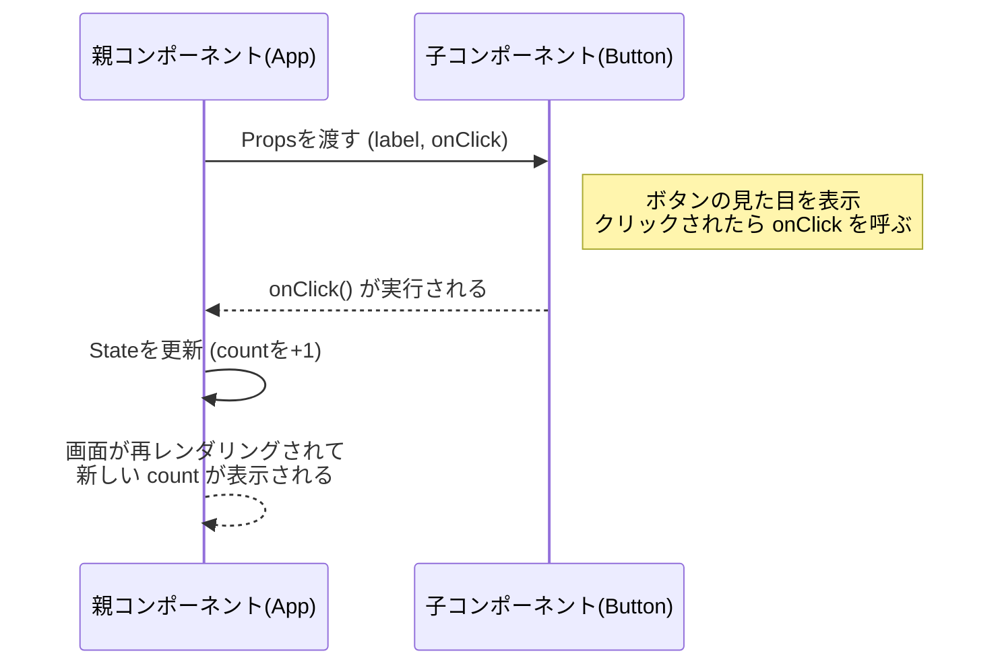

# 第29章：練習：ボタン部品 (`Button.tsx`) を作る

（`onClick` 関数を Props で受け取る）

---

この章では、**「自分だけのボタン部品」を作って、それを親コンポーネントから自由に呼び出せるようにする練習**をします 🧡

やりたいことはすごくシンプルです：

* `Button.tsx` という**部品ファイル**を作る
* ボタンの「表示する文字」と「クリックされたときの動き」を **親コンポーネントから渡す**
* つまり、**クリック時の処理を表す関数を Props で受け取る** ✨

---

## 1️⃣ まずは「役割」のイメージをつかもう


今回の役割分担はこんな感じです 👇

* **親コンポーネント（例：`App.tsx`）**

  * カウントの数字を持ってる
  * 「カウントを増やす」関数を持ってる
  * それを Button に渡す

* **子コンポーネント（`Button.tsx`）**

  * 見た目（ボタンの形）を担当
  * クリックされたら、**親からもらった関数を呼び出すだけ** 🚀

Mermaid 図で見るとこんなイメージです 💭



イメージ湧いてきたかな？😊
では、実際にコードを書いてみましょう ✍️

---

## 2️⃣ フォルダとファイルを用意しよう

プロジェクトはすでに Vite + React + TS で作ってある前提で進めます（`npm create vite@latest` → `react-ts` を選んだやつ）✨

1. `src` フォルダの中に **`components` フォルダ**を作る

   * すでにある場合はそのままでOK
2. その中に **`Button.tsx`** ファイルを作る

パスのイメージ：

* `src/App.tsx`
* `src/components/Button.tsx`  ← ここにボタン部品を書くよ

---

## 3️⃣ Button の Props の「型」を決める 🧠

まずは「この部品は何を受け取るの？」を考えます。

今回の Button に持たせたいものは：

* `label`: ボタンに表示する文字（例：「+1する」）
* `onClick`: クリックされたときに実行される関数

なので、TS の型はこんな感じになりそうです 💡

* `label` → 文字なので `string`
* `onClick` → 引数なしで、戻り値も特に使わないので `() => void`

`Button.tsx` にこう書いてみてください 👇

```tsx
type ButtonProps = {
  label: string;
  onClick: () => void;
};
```

これで、「このボタンは `label` と `onClick` という Props を受け取る部品ですよ〜」という約束ができました ✅

---

## 4️⃣ Button コンポーネント本体を書いてみる 🎨

次に、実際のコンポーネントを作ります。

`Button.tsx` をこんな感じにしてみましょう 👇

```tsx
// src/components/Button.tsx

type ButtonProps = {
  label: string;
  onClick: () => void;
};

export function Button({ label, onClick }: ButtonProps) {
  return (
    <button type="button" onClick={onClick}>
      {label}
    </button>
  );
}
```

ポイント解説 ✨

* `export function Button ...`
  → 他のファイル（`App.tsx` など）から `import` して使えるように `export` しているよ

* `({ label, onClick }: ButtonProps)`
  → `props` そのものじゃなくて、**分割代入で `label` と `onClick` を直接取り出している**
  （第26章でやったやつの復習だね！）

* `<button type="button" onClick={onClick}>`
  → ネイティブの `<button>` の `onClick` に、**親からもらった関数をそのまま渡している**
  → だから Button 自身は「何が起きるか」を知らなくてOK。
  「押されたら `onClick` 呼んどくね〜」っていう立場 🫶

---

## 5️⃣ 親から使ってみよう：カウンターと合わせる 🔢

次は、作った `Button` を **実際に使う側（親コンポーネント）**から呼び出してみます。

`src/App.tsx` を、例えばこんな感じに書き換えてみてください 👇

```tsx
// src/App.tsx
import { useState } from "react";
import { Button } from "./components/Button";

export default function App() {
  const [count, setCount] = useState(0);

  function handleIncrement() {
    // 前の値をもとに +1 する書き方（バグりにくい書き方）
    setCount((prev) => prev + 1);
  }

  return (
    <div style={{ padding: "24px", fontFamily: "system-ui" }}>
      <h1>❤️ ボタン部品の練習 ❤️</h1>
      <p style={{ fontSize: "20px" }}>いまのカウント：{count}</p>

      <Button label="+1する" onClick={handleIncrement} />

      <p style={{ marginTop: "16px", fontSize: "14px" }}>
        ボタンは「見た目」と「クリックされたよ！」の通知だけ担当して、
        実際にカウントを増やすのは App 側の仕事だよ ✨
      </p>
    </div>
  );
}
```

そのあと、ターミナルで 👇

* `npm run dev`

を実行して、ブラウザでページを開いてみてください。
`+1する` ボタンを押して **カウントが増えたら成功です🎉**

---

## 6️⃣ よくあるつまずきポイント 😵‍💫 FAQ

### ❌ `onClick={handleIncrement()}` と書いちゃう問題

ついこう書きたくなるかもしれません 👇

```tsx
<Button label="+1する" onClick={handleIncrement()} />
```

これは **ダメ** なパターンです 🙅‍♀️

* `handleIncrement()` と **カッコを付ける**と、

  * 「今すぐこの場で関数を実行する」という意味
  * ボタンがクリックされる前に実行されちゃう

React が欲しいのは、「**あとでクリックされたときに呼べるように、関数そのものを渡してね**」という形です。

✅ 正しい書き方

```tsx
<Button label="+1する" onClick={handleIncrement} />
```

* **関数そのもの**を渡している（カッコを付けない）

---

### ❓ じゃあ `onClick={() => handleIncrement()}` はどうなの？

これも OK です 👇

```tsx
<Button label="+1する" onClick={() => handleIncrement()} />
```

* 「無名関数（アロー関数）」を作って、その中で `handleIncrement()` を呼んでいる
* ちょっと遠回りだけど、**やりたいことはほぼ同じ**

今回はシンプルなので、**そのまま `onClick={handleIncrement}` と書く方がスッキリ**していてオススメです 🌟

---

## 7️⃣ ミニ練習問題 💪（やってみよう）

### 🔸 練習1：リセットボタンを追加しよう

今の `App.tsx` に、**カウントを 0 に戻すボタン**をもう1つ追加してみてください。

やること：

1. `App.tsx` に `handleReset` 関数を作る

   * 中身は `setCount(0);`
2. `Button` をもう1つ増やして、`label="リセット"`、`onClick={handleReset}` にする

ヒント 😏

```tsx
function handleReset() {
  setCount(0);
}
```

---

### 🔸 練習2：ボタンに「強調」スタイルを付けてみる

`Button.tsx` の `<button>` に、ちょっとだけ見た目を可愛くするためにインラインスタイルを追加してみてください 🎀

例：

```tsx
export function Button({ label, onClick }: ButtonProps) {
  return (
    <button
      type="button"
      onClick={onClick}
      style={{
        padding: "8px 16px",
        borderRadius: "999px",
        border: "none",
        backgroundColor: "#ff72b6",
        color: "white",
        fontWeight: "bold",
        cursor: "pointer",
      }}
    >
      {label}
    </button>
  );
}
```

「インラインスタイルってこう書くんだったね！」という復習にもなります 😊
（`style={{ ... }}` が「中にオブジェクトを書く」だったのを思い出してみてね）

---

### 🔸 練習3：`disabled` を追加してみる（ちょっと発展）

余裕があれば、Props にもう1つ値を足してみましょう ✨

* `disabled?: boolean` というオプショナルな Props を追加
* `Button` の `<button>` に `disabled={disabled}` を渡す

ヒント：

```tsx
type ButtonProps = {
  label: string;
  onClick: () => void;
  disabled?: boolean;
};

export function Button({ label, onClick, disabled }: ButtonProps) {
  return (
    <button type="button" onClick={onClick} disabled={disabled}>
      {label}
    </button>
  );
}
```

`App.tsx` からは、例えばこんなふうに呼べます 👇

```tsx
<Button label="+1する" onClick={handleIncrement} disabled={count >= 10} />
```

→ こうすると、`count` が 10 以上になったらボタンが押せなくなります 💫
（第30章でやる「オプショナルな型」にもちょっとだけ先に触れました！）

---

## 8️⃣ 今日のまとめ 🌈

この章で学んだこと ✅

* **部品（コンポーネント）は「見た目」と「きっかけ」だけ担当してもらう**

  * 何をするか（ロジック）は親が決める
* クリックされたときの処理は、

  * 親で関数を定義して
  * 子に **`onClick` として Props で渡す**
* TypeScript では、

  * `onClick` みたいな「関数Props」にもちゃんと型を付ける
  * `() => void` という形がよく出てくる ✨

この「ボタン部品」の考え方は、今後いろんな UI を作るときの**超・基本パターン**になります 🌟
次の章からも、Props と型を味方にしながら、React にもっともっと慣れていきましょう〜 💕
