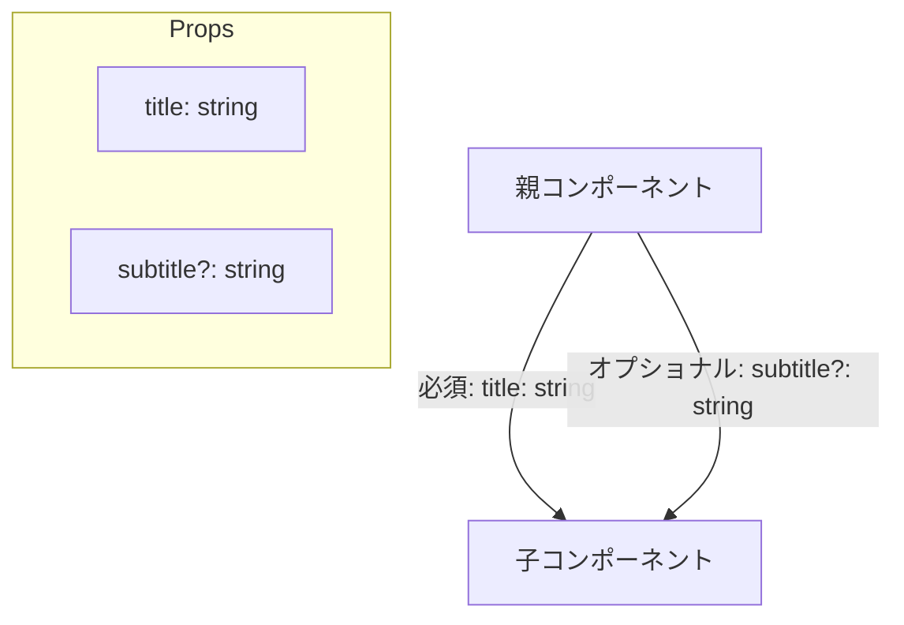

# 第30章：Propsに「？」をつける
―― *「あってもいいし、なくてもいい」データを表現しよう* ✨

---

## 1️⃣ この章のゴール 🎯

この章がおわるころには、こんなことができるようになります👇

* 「このPropsは *あってもいいし、なくてもいい*」を型で表現できる 💡
* `name?: string` が何を意味しているか説明できる ✍️
* オプショナルなPropsを受け取るコンポーネントを自分で書ける 🧩
* `undefined` が来ても安全に表示できる書き方がわかる ✅

---

## 2️⃣ おさらい：ふつうの（必須の）Props 🧠

まずは今までのPropsをちょっと思い出しましょ。

たとえば、こんな自己紹介コンポーネントがあるとします👇

```tsx
type ProfileProps = {
  name: string; // ← 絶対に必要なProps（必須）
};

function Profile({ name }: ProfileProps) {
  return <p>{name} さん、こんにちは！</p>;
}

export function App() {
  return (
    <div>
      {/* ✅ OK：必須の name を渡している */}
      <Profile name="さくら" />

      {/* ❌ エラー：name を渡してない */}
      {/* <Profile /> */}
    </div>
  );
}
```

* `name: string` は「`name` というプロパティが **必ずある** し、値は `string`」という意味です。
* なので、`<Profile />` のように `name` を渡さないと TypeScript が怒ります😡

「いやいや、`name` がなくても動いてほしいときもあるんだけど？」
→ そういうときに登場するのが **`?` をつけたオプショナルProps** です🌟

---

## 3️⃣ `name?: string` ってどういう意味？🤔

オプショナルPropsの例はこちら👇

```tsx
type ProfileProps = {
  name?: string; // ← "?" がついている
};

function Profile({ name }: ProfileProps) {
  return <p>{name} さん、こんにちは！</p>;
}
```

`name?: string` はざっくりいうと…

> 「`name` が **あるかもしれないし、ないかもしれない**。
> もしあるなら `string` だよ」

という意味です。

TypeScript的には、ほぼこういうイメージです👇

```ts
// イメージ（実際のコンパイル結果とは少し違うけど、考え方として）
type ProfileProps = {
  // "name がある場合は string、そもそもプロパティがないかもしれない"
  name: string | undefined;
};
```

つまり：

* 親コンポーネントから見て：

  * `name` を渡してもいいし、渡さなくてもいい
* 子コンポーネントから見て：

  * `name` は `string` のときもあるし、`undefined` のときもある

---

## 4️⃣ Mermaidでイメージ図を見てみよう 🧠✨

オプショナルPropsのイメージを図にしてみます👇



* `title`：ぜったい渡さなきゃダメ（必須）
* `subtitle?`：あってもOK／なくてもOK（オプショナル）

こんな感じで、**「優先順位の高いものは必須」「あったらうれしいものはオプショナル」** みたいに分けることができます🌈

---

## 5️⃣ 実例：サブタイトルは「なくてもOK」なカード 💳

よくあるパターンとして、「タイトルは必須だけど、サブタイトルはあってもなくてもいい」というカードを作ってみましょう。

### ✅ 型定義（Props）

```tsx
type InfoCardProps = {
  title: string;      // 必須
  subtitle?: string;  // オプショナル（あってもなくてもOK）
};
```

### ✅ コンポーネント本体

`subtitle` がない（＝`undefined`）ときは、そもそもサブタイトル部分を表示しないようにしてみます。

```tsx
function InfoCard({ title, subtitle }: InfoCardProps) {
  return (
    <div style={{ border: "1px solid #ccc", padding: "12px", borderRadius: "8px" }}>
      <h2>{title}</h2>

      {/* subtitle があるときだけ表示する */}
      {subtitle && <p style={{ color: "#666" }}>{subtitle}</p>}
    </div>
  );
}
```

### ✅ 親コンポーネントから呼び出し

```tsx
export function App() {
  return (
    <div style={{ padding: "16px", display: "flex", gap: "16px" }}>
      {/* ✅ subtitle あり */}
      <InfoCard
        title="JavaScript勉強会"
        subtitle="毎週火曜日・みんなでゆるくコードを書く会 ✏️"
      />

      {/* ✅ subtitle なし（渡さなくてOK） */}
      <InfoCard title="React入門ノート" />
    </div>
  );
}
```

ポイント ✨

* `subtitle?: string` にしたことで、`<InfoCard title="..." />` のように
  **`subtitle` を渡さなくてもエラーになりません**。
* コンポーネントの中では `subtitle` は `string | undefined` として扱われるので、
  `subtitle && ...` のように「あるときだけ表示」する書き方がよく使われます👌

---

## 6️⃣ どうやって安全に表示する？`??` と デフォルト値 🎀

オプショナルPropsは `undefined` の可能性があるので、
**そのまま使うとちょっと危ない** ときがあります。

### パターン①：`??`（null合体演算子）でデフォルト文字列を出す

```tsx
type GreetingProps = {
  name?: string;
};

function Greeting({ name }: GreetingProps) {
  // name が undefined のときは "ゲスト" を使う
  const displayName = name ?? "ゲスト";

  return <p>{displayName} さん、ようこそ〜 👋</p>;
}
```

* `??` は「左が `null` か `undefined` のときだけ右側を使う」という演算子です。
* `name` が `"さくら"` → `"さくら"`
* `name` が `undefined` → `"ゲスト"`

### パターン②：分割代入のところでデフォルト値をつける

もっと短く書くならこちらもおすすめです👇

```tsx
type GreetingProps = {
  name?: string;
};

function Greeting({ name = "ゲスト" }: GreetingProps) {
  // ここに来た時点で name は「string」確定
  return <p>{name} さん、ようこそ〜 🥰</p>;
}
```

* `name = "ゲスト"` と書いたことで、

  * `name` が渡されなかった → `"ゲスト"` が入る
  * `name="ひな"` が渡された → `"ひな"` が入る
* コンポーネントの中では `name` の型はもはや `string` だけになっていて扱いやすいです✨

---

## 7️⃣ よくある「？」との違いを整理しよう 🧩

TypeScriptやJavaScriptでは、いろんなところに `?` が登場します。

ざっくり整理すると👇

| 記法         | 例                   | 意味                                |
| ---------- | ------------------- | --------------------------------- |
| プロパティの `?` | `name?: string`     | あってもいいし、なくてもいい（オプショナル）            |
| 引数の `?`    | `fn(name?: string)` | その引数を省略してもOK                      |
| オプショナルチェーン | `user?.name`        | `user` が `null`/`undefined` なら止める |
| 三項演算子の `?` | `cond ? A : B`      | if文みたいな分岐                         |

この章で扱っているのは **「プロパティの `?`」＝オプショナルProps** です 🎓

---

## 8️⃣ ミニ練習：ニックネームはあってもなくてもOKな挨拶 💌

### 🧪 お題

`UserGreeting` というコンポーネントを作ってみましょう。

* Props:

  * `fullName`（フルネーム）：**必須**（`string`）
  * `nickname`（ニックネーム）：**オプショナル**（`string`）
* 表示ルール：

  * `nickname` があるとき → `"{nickname}（{fullName}）さん、こんにちは〜 💕"`
  * `nickname` がないとき → `"{fullName} さん、こんにちは〜 ☺️"`

VSCodeで `UserGreeting.tsx` を作るイメージで書いてみてください ✏️

---

### ✅ サンプル解答（見たいときだけ見てね）

```tsx
type UserGreetingProps = {
  fullName: string;      // 必須
  nickname?: string;     // オプショナル
};

export function UserGreeting({ fullName, nickname }: UserGreetingProps) {
  // 「表示用の名前」を決める
  const display =
    nickname !== undefined
      ? `${nickname}（${fullName}）`
      : fullName;

  return <p>{display} さん、こんにちは〜 🌸</p>;
}

// どこかのファイルから呼び出す例
export function App() {
  return (
    <div style={{ padding: "16px", display: "flex", flexDirection: "column", gap: "8px" }}>
      {/* ニックネームあり */}
      <UserGreeting fullName="山田 花子" nickname="はな" />

      {/* ニックネームなし */}
      <UserGreeting fullName="佐藤 愛" />
    </div>
  );
}
```

ポイント 💡

* `nickname?: string` とすることで、

  * `nickname` を渡してもいいし、渡さなくてもOKにできた 🎉
* 中で `nickname !== undefined ? ... : ...` のように分岐することで、

  * どちらのパターンも安全に処理できる ✅

---

## 9️⃣ まとめ：この章でおぼえてほしいこと 🐣

* `name?: string` は「**あってもいいし、なくてもいい** `name`」という意味 ✨
* オプショナルなPropsは、*あったら便利だけど必須ではない情報* に使うとGOOD 👍
* 中身を使うときは：

  * `subtitle && ...` で「あるときだけ表示」したり
  * `name ?? "ゲスト"` や `{ name = "ゲスト" }` のように
    デフォルト値をつけると安全＆ラクになります 💪
* いろんな `?` があるけど、この章の主役は **プロパティの `?`（オプショナルProps）** 💕

---

次の章では、実際のプロジェクトの中で「オプショナルProps」をどう組み合わせると便利か、
さらに手を動かしながら慣れていきましょうね〜 🎉💻🌈
