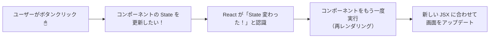

# 第31章：「状態 (State)」ってなに？

「State（ステート）」は、React を始めるうえでめちゃくちゃ大事なキーワードです 🎓
この章では、**まだ `useState` は書かずに**、「考え方」だけしっかりつかんでいきます💪

---

### ✨ この章のゴール

この章が終わるころには、こんなことがふんわり分かっていればOKです👇

* 「State」って、ざっくり何者なのかイメージできる 🧠
* 「Props」と「State」の役割の違いを、なんとなく説明できる 🎤
* 「ここは State にしたほうがよさそうだな〜」と想像できる 🔍

---

## 1️⃣ まずはイメージ：コンポーネントの「今の気分メモ帳」📝

React アプリは、たくさんの「コンポーネント」という部品でできています。
**State は、そのコンポーネントが持っている「今の状態メモ」**みたいなものです。

たとえば：

* いいねボタン 👍

  * 何回押されたか → `いいね数 = 5` とか
* フォーム ✍️

  * 今入力されている文字 → `入力中のテキスト = "hello"`
* モーダルウィンドウ 🪟

  * 開いている？閉じている？ → `isOpen = true / false`

こういう「**時間とともに変化する値**」を、React では **State** として扱います。
React の公式ドキュメントでも、**State は「コンポーネント専用の記憶（メモリー）」だよ**と説明されています。([React][1])

---

## 2️⃣ React における「State」の正体 💡

もう少しだけまじめに整理してみます。

React では、State はこんな性質をもっています👇

1. **コンポーネントごとの「専用メモ」**

   * 同じコンポーネントを2回表示したら、**それぞれ別々の State** を持ちます。([React][1])

2. **画面とセットで考えるデータ**

   * State が変わると、React は「じゃあ画面も描き直すね〜」と UI を更新してくれます。
   * 「値が変わる → React が再レンダリング → 画面が変わる」という流れです。([React][2])

3. **ふつうの変数とは違う**

   * 関数の中で `let count = 0;` って書くのとはちがって、
   * 「**再レンダリングの間も覚えておいてくれる特別な変数**」が State です。

4. **宣言するときに React に「預ける」**

   * 実際には `useState` というフックを使って
     「この値は State として React に預けるね〜」と宣言します。
   * `useState` 自体の書き方は **次の第32章から** じっくりやります ✅

---

## 3️⃣ Props と State のちがいをざっくり🍰

似た言葉として **Props**（プロップス）も出てきましたよね。
ここでいったん、Props と State のイメージを並べてみましょう。

| 役割        | イメージ          | 誰が決める？        | コンポーネントから変えられる？   |
| --------- | ------------- | ------------- | ----------------- |
| **Props** | 親から渡される「設定」🎁 | 親コンポーネント      | 子からは基本いじらない（読むだけ） |
| **State** | 自分の「今の状態メモ」📒 | 自分（そのコンポーネント） | 自分で更新できる          |

もうちょっとだけ例で見ると…

* ボタンの「色」や「ラベル文字」
  → 親から「赤いボタン」「OK ボタン」などとして、**Props** で渡すことが多い 🎁

* ボタンが今「押されているかどうか」「カウント」
  → ボタン自身が覚えておく **State** にしがち 💓

---

## 4️⃣ 図で見る：State が変わるときの流れ 📈

「ユーザーがクリック → State が変わる → 画面が変わる」の流れを
Mermaid で図解してみます 🌊



この章ではまだ `useState` の書き方はやりませんが、
**React は「State が変わったら、そのコンポーネントをもう一度実行し直す」**
というイメージだけ覚えておけばバッチリです ✨

---

## 5️⃣ ふつうの JavaScript 変数と何が違うの？🤔

ここがとても大事なポイントです。

### ✅ ふつうの JS 変数の場合

HTML とプレーンな JavaScript で「いいねボタン」を作るとします。

```html
<button id="like-button">いいね 0</button>
<script>
  let count = 0; // ふつうの変数

  const button = document.getElementById("like-button");
  if (!button) {
    throw new Error("ボタンが見つかりません");
  }

  button.addEventListener("click", () => {
    count++; // 値は増えるけど…
    button.textContent = `いいね ${count}`; // 自分で DOM を書き換える必要がある
  });
</script>
```

* `count` が変わっても、**自動では画面は変わりません**。
* 自分で `button.textContent = ...` などして DOM を更新する必要があります。

### ✅ React（State）を使うとどうなるイメージ？

※詳しい書き方は次章からですが、「雰囲気だけ」見てみましょう 👀

```tsx
const [count, setCount] = useState(0); // これは State！

return (
  <button onClick={() => setCount(count + 1)}>
    いいね {count}
  </button>
);
```

* `setCount` で State を変えると、
  **React が自動で「もう一度コンポーネントを実行 → 画面を更新」してくれます。**([React][2])
* 私たちは「**今の状態を JSX で表現する**」ことだけ考えればOK、というスタイルになります 💃

---

## 6️⃣ どんなものを State にすべき？チェックリスト ✅

React では、なんでもかんでも State にすると逆にややこしくなります。
「これは State にしたほうがいいかな？」と迷ったとき用に、
簡単なチェックリストを用意しておきます 🌟

**次の質問に「はい」が多いものほど State っぽい👇**

1. **ユーザーの操作で変わる？**

   * 例：クリック回数、入力中テキスト、ON/OFF 切り替え…

2. **時間の経過や非同期処理で変わる？**

   * 例：タイマーの残り時間、ロード中フラグ、取得したデータ…

3. **その値が変わると、画面の見た目も変わる？**

   * 例：表示するリストの中身、エラーメッセージの有無…

4. **他の場所から計算で出せない「生の情報」？**

   * 例：API から取ってきた配列そのもの
   * 逆に「ただの計算結果」なら、State にせず「その場で計算」しても OK なことが多いです。

---

## 7️⃣ ミニクイズ：これは State？Props？それともどっちでもない？🧩

ちょっとだけ考えてみましょう〜（答えはすぐ下に書きます）

1. **プロフカードの「ユーザー名」**

   * 親コンポーネントから渡される
   * カードは表示するだけ

2. **「♡ いいね数」**

   * ボタンを押すたびに増える
   * 画面にも数字がそのまま出る

3. **サイトの共通ヘッダーのロゴ画像 URL**

   * ほぼ変わらない固定の画像

---

### 📝 こたえ & コメント

1. **ユーザー名 → Props っぽい 🎁**

   * 親が「このユーザー名を表示してね」と渡すイメージ。
   * カード自身はそれを「表示するだけ」なので State じゃなくてOK。

2. **いいね数 → State っぽい 📒**

   * ユーザー操作（クリック）で変わる値。
   * 変わるたびに画面も変わるので、「コンポーネントの状態」として持つのが自然。

3. **ロゴ画像 URL → どっちでもない or Props / 定数 🖼**

   * ほとんど変わらないので、State にする必要は薄いです。
   * 上の階層で「設定」として定義して Props で渡したり、
     あるいはモジュールの外に `const LOGO_URL = "..."` と書いても OK。

---

## 8️⃣ まとめ 🌈

この章でおさえておきたいポイントを、もう一度ギュッとまとめます👇

* **State は「コンポーネント専用の記憶（メモ帳）」**

  * ユーザー操作や時間の経過で変わる「今の状態」を覚えておくもの。([React][1])
* **State が変わると React が画面を描き直してくれる**

  * 私たちは「今こういう状態なら、画面はこう」というルールだけを書けばOK。
* **Props は「外からの設定」、State は「自分の中の状態」**

  * 「見た目の設定」っぽいもの → Props
  * 「動いたり変化したりする値」 → State にすることが多い。

---

## 9️⃣ 次の章への予告 🎬

次の **第32章** からは、いよいよ実際にコードを書きながら

* `useState` フックとは何か
* どう書けば State を宣言できるのか
* TypeScript 的にどんな型がつくのか

を、ゆっくり実験していきます 🧪✨

この章では「State = コンポーネントの今の気分メモ帳💌」
というイメージだけ、しっかり持っておいてもらえればバッチリです！

[1]: https://react.dev/learn/state-a-components-memory?utm_source=chatgpt.com "State: A Component's Memory"
[2]: https://react.dev/learn/state-as-a-snapshot?utm_source=chatgpt.com "State as a Snapshot"
