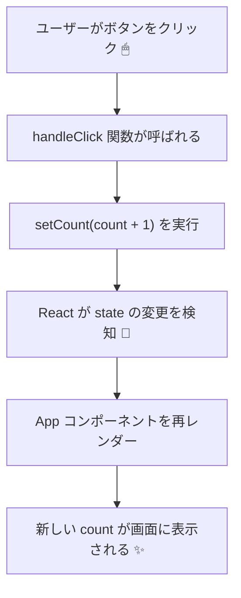

# 第32章：【フック】`useState` の基本。

この章では、**Reactのいちばん大事なフック「`useState`」** をマスターします✨
ここを乗り越えると、

* ボタンを押したら数字が増える
* 入力した文字がその場で表示される
* ON / OFF の切り替えスイッチを作る

みたいな「動くUI」がサクサク作れるようになります🧸💫

---

## 1️⃣ フックってなに？`useState`ってなに？🤔

まず言葉の整理からいきましょ。

* **フック（Hook）**
  → React に「これ使ってね〜」と用意されてる、**特別な関数**のこと。
  → `useState`, `useEffect`, `useRef` など、だいたい `use` から始まるよ🪝

* **`useState`**
  → コンポーネントの中に「**変わる値（状態 / State）**」を持たせるためのフック。
  → 普通の `let` 変数と違って、**値が変わると自動で画面を描き直してくれる**のがポイント🌈

イメージとしては、

> 「Reactさん、このコンポーネントで、
> 変わる値をひとつ管理したいのでお願いします〜🙏」

ってお願いするための関数、みたいな感じです😊

---

## 2️⃣ 一番シンプルな `useState` の使い方 🧪

さっそく、**ボタンを押すと数字が増えるカウンター**を作ってみましょう🎉

### 🔧 手順：`App.tsx` を書きかえる

VS Code で `src/App.tsx` を開いて、いったん中身を全部消してから、次のように書きかえてみてください👇

```tsx
import { useState } from "react";

function App() {
  const [count, setCount] = useState(0);

  function handleClick() {
    setCount(count + 1);
  }

  return (
    <div style={{ padding: "24px", fontFamily: "sans-serif" }}>
      <h1>カウンター ✨</h1>
      <p>今のカウント：{count}</p>
      <button onClick={handleClick}>+1 する</button>
    </div>
  );
}

export default App;
```

ブラウザで `npm run dev` の画面を開いて、ボタンをポチポチしてみてください👇
→ 数字が「0, 1, 2, 3, …」と増えていけば成功です🙌

---

## 3️⃣ お約束の一行を分解して理解する🔍

さっきのコードの中の、この一行が主役です👇

```tsx
const [count, setCount] = useState(0);
```

これをパーツごとに見ていきます💡

### 🧩 `useState(0)` の意味

* `useState(0)` の `0` は、「**最初の値**」（初期値）です。

  * 今回は「カウンターなので最初は 0」って感じ。
  * ここに `"hello"` と書けば、最初の状態は `"hello"` になります。

### 🧩 `[count, setCount]` の意味（配列の分割代入）

`useState` は、**「2つ入った配列」みたいなもの**を返してきます。

* 1つ目 → **今の値**（Stateそのもの）
* 2つ目 → **その値を更新するための関数**

それを **配列の分割代入** で受け取ってるのがコレです👇

* `count`
  → 「今のカウントの値」を入れておく変数（読み取り用）📊
* `setCount`
  → 「カウントの値を変えたいときに呼ぶ関数」🛎

なので、

```tsx
setCount(count + 1);
```

と書くと、

> 「今の `count` に 1 足した値を、次の状態として React にお願いする」

という意味になります🎀

---

## 4️⃣ ふつうの変数と、Stateの違い ✋

JavaScript だけの世界なら、こんなコードでもカウンターっぽいことができますよね：

```ts
let count = 0;
count = count + 1;
```

でも React コンポーネントの中で、

```tsx
let count = 0;

function handleClick() {
  count = count + 1;
}
```

みたいに書いても、**画面は更新されません**❌
なぜかというと…React は

> 「`useState` で管理している値が変わったとき」

しか、画面を描きなおしに行かないからです💻✨

`useState` を使うと：

* 値を変えたい → `setCount(...)` を呼ぶ
* React が「お、変わったな？」と気づく
* そのコンポーネントを **もう一度関数として呼び直す**
* 新しい `count` の値で JSX が作り直される
* 画面の表示が変わる 🎉

---

## 5️⃣ 動き方を図でイメージしてみよう 🧠✨

`useState` を使ったときの流れを、Mermaid で図解してみます🪄



頭の中では、

> 「`setCount` を呼ぶと、React がもう一回コンポーネントを実行してくれるんだな〜」

くらいのイメージで OK です👌

---

## 6️⃣ `useState` を使うときのルール ⚠️

`useState` はちょっとお行儀にうるさい子なので、**ルール**もセットで覚えましょう🐈‍⬛

### ✅ ルール1：コンポーネントの「トップレベル」で呼ぶ

**ダメな例**（if の中で使ってる）：

```tsx
function App() {
  if (Math.random() > 0.5) {
    const [count, setCount] = useState(0); // ❌ NG
  }

  return <div>...</div>;
}
```

**OKな例**（コンポーネントの一番上で呼ぶ）：

```tsx
function App() {
  const [count, setCount] = useState(0); // ✅ ここ！

  // ここから下に if やイベントハンドラを書くのは OK
  // ...

  return <div>...</div>;
}
```

> 「コンポーネントの中のいちばん上のほうで、素直に呼ぶ」
> って覚えておけば今は大丈夫です🌸

### ✅ ルール2：普通の関数ではなく、「コンポーネント or カスタムフック」の中で使う

```ts
// ファイルの一番外側（グローバル）ではダメ
const [count, setCount] = useState(0); // ❌ これは NG
```

`useState` は、

* React コンポーネントの中
* もしくは、あとで出てくるカスタムフックの中

でだけ使える特別な関数です🌟

---

## 7️⃣ ミニ練習：自分の「いいね❤️」カウンターを作ろう

今のカウンターを、ちょっとアレンジしてみましょう🎨

### 🎯 お題

* 「`いいね！❤️` ボタン」と
* 「押された回数」を表示するコンポーネントを作る

たとえば、こんな感じに動いたらOKです👇

* 最初は `0 いいね`
* ボタンを押すたびに `1 いいね`, `2 いいね`, …

### 🧪 ヒントコード

`App.tsx` をこんなふうに書きかえてみてください（全部マネしてから、自分好みに文言を変えてみるのもおすすめ💖）

```tsx
import { useState } from "react";

function App() {
  const [likes, setLikes] = useState(0);

  function handleLike() {
    setLikes(likes + 1);
  }

  return (
    <div style={{ padding: "24px", fontFamily: "sans-serif" }}>
      <h1>いいねカウンター ❤️</h1>
      <p>{likes} いいね</p>
      <button onClick={handleLike}>いいね！</button>
    </div>
  );
}

export default App;
```

### ✏️ アレンジしてみよう

余裕があれば、こんなアレンジもやってみてください✨

* テキストを
  → `今日の私へのごほうび 💎：{likes} ポイント` に変えてみる
* ボタンのラベルを
  → `ポイントを増やす` に変えてみる
* `style` を少し変えて、文字を大きくしてみる（`fontSize: "20px"` など）

---

## 8️⃣ この章のおさらい 🐾

* `useState` は、**変わる値（State）をコンポーネントに持たせるフック🪝**
* `const [value, setValue] = useState(初期値);`
  という形で、「今の値」と「更新用の関数」をセットでもらう
* `setValue(...)` を呼ぶと、React がコンポーネントをもう一度実行して、
  **新しい値で画面を更新してくれる**
* ルール：

  * コンポーネントのトップレベルで呼ぶ
  * コンポーネント or カスタムフックの中だけで使う

次の章では、TypeScript ならではの **「型推論と `useState`」** を見ていきます📐✨
「型が勝手についてくれるってどういうこと？」を、いっしょに体験していきましょう〜🙌
