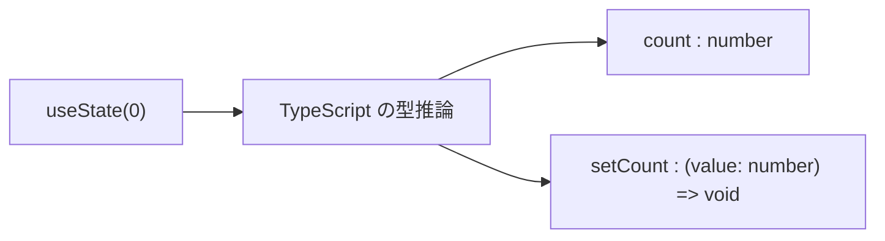

# 第33章：`useState` と「型推論」

この章では、**TypeScript が `useState` の型を「いい感じに決めてくれる仕組み」＝型推論**にフォーカスします ✨

---

## 1️⃣ この章のゴール 🎯

この章が終わるころには…

* `useState(0)` と書くだけで、**なぜ `count` が `number` 型になるのか**説明できる
* `useState('')` や `useState(false)` など、**シンプルな初期値は型推論に任せてOKなパターン**がわかる
* 「このパターンは型推論に任せていい」「ここはちゃんと型を書くべき」の**直感が少し育つ**

---

## 2️⃣ さくっと復習：`useState` って何だっけ？ 💡

`useState` は、**「値」と「その値を変える関数」をセットでくれるフック**でしたね。([React][1])

例えばカウンターなら：

```tsx
import { useState } from 'react';

function Counter() {
  const [count, setCount] = useState(0);

  const handleClick = () => {
    setCount(count + 1);
  };

  return (
    <button onClick={handleClick}>
      いまのカウント: {count}
    </button>
  );
}

export default Counter;
```

ここで大事なのはこの1行 👇

```ts
const [count, setCount] = useState(0);
```

実はこれ、TypeScript 的にはだいたいこう解釈されています（ざっくりイメージ）：

* `count` の型 → `number`
* `setCount` の型 → `(next: number) => void`

…え、そんなことどこにも書いてないのに！？というところで登場するのが **型推論** です 🧚‍♀️

---

## 3️⃣ 型推論ってなに？🧠✨

まずはシンプルな TypeScript の例から：

```ts
let age = 20;
let message = 'こんにちは';
let isStudent = true;
```

このとき、TypeScript は自動で：

* `age` → `number`
* `message` → `string`
* `isStudent` → `boolean`

と**勝手に型を決めてくれます。これが「型推論」**です。([typescriptlang.org][2])

だから、わざわざ

```ts
let age: number = 20;
```

と書かなくても OK な場面が多いんでしたね 👍

---

## 4️⃣ `useState` × 型推論：初期値から全部決まる 💫

`useState` も同じノリで、**渡した「最初の値」をヒントに型を推論**します。([Medium][3])

### 4-1. 数値の例：`useState(0)`

```tsx
const [count, setCount] = useState(0);
```

* 初期値が `0`（number）なので
  → `count` は `number` 型
  → `setCount` は「number を受け取る関数」になります

VS Code で `count` にマウスを乗せると、たぶんこんな感じの型が見えるはずです（イメージ）：

```ts
const count: number;
const setCount: React.Dispatch<React.SetStateAction<number>>;
```

TypeScript 的には、`useState` は **ジェネリック関数** で、実際には

```ts
useState<number>(0);
```

という感じに解釈されていると思っておくとイメージしやすいです 🧩([DEV Community][4])

---

### 4-2. 文字列・真偽値の場合 🎀

同じように、文字列や真偽値も OK です。

#### 文字列 (`string`)

```tsx
const [name, setName] = useState(''); // ← 空文字だけど型は string
```

* 初期値が `''`（string）なので
  → `name` は `string`
  → `setName` は `(value: string) => void` という感じの型になります

#### 真偽値 (`boolean`)

```tsx
const [isOpen, setIsOpen] = useState(false);
```

* 初期値が `false`（boolean）なので
  → `isOpen` は `boolean`
  → `setIsOpen` は `(value: boolean) => void`

こんな **プリミティブな値（number / string / boolean）** のときは、
**型をわざわざ書かずに、型推論に全部お任せでOK** というのが、TypeScript コミュニティでもよく出てくるおすすめパターンです。([Reddit][5])

---

### 4-3. 型推論の流れを図で見てみる 📊

Mermaid でイメージ図を書いてみます 🎨


c
**「最初の 1 回だけ手がかり（初期値）を渡すと、あとは TypeScript が全部広げてくれる」**
というイメージで OK です 🌟

---

## 5️⃣ 型推論に任せていいケース / 危ないケース ⚠️

### ✅ 型推論に任せていいケース

* 初期値がシンプルな **number / string / boolean** のとき

  * `useState(0)`
  * `useState('')`
  * `useState(false)`
* 初期値がちゃんと中身のあるオブジェクトのとき

```tsx
const [user, setUser] = useState({
  name: 'Alice',
  age: 20,
});
```

この場合、TypeScript は

```ts
{ name: string; age: number }
```

というオブジェクト型を自動で推論してくれます 🎉

---

### ⚠️ 注意が必要なケース（チラ見せだけ）

詳しくは **次の第34章** でやりますが、「型推論に丸投げすると危険」なパターンもあります。([Total TypeScript][6])

* `useState()` ← 初期値を渡さない

  * TypeScript は「`undefined` なんだね」と解釈してしまう
* `useState([])` ← 中身がない配列

  * 型が `never[]` になってしまって、あとから要素を追加しにくい

こういう **「中身が空っぽ」な初期値** のときは、
**ちゃんと明示的に型を書く方が安全**です（それが次の章のテーマです ✨）。

この章では、まず：

> **「シンプルな初期値があるときは、型推論させると楽で安全」**

という感覚だけつかんでおけば OK です 💪

---

## 6️⃣ 手を動かそう①：カウンターで型推論を感じる 🧮

`App.tsx` をこんな感じにしてみてください 👇

```tsx
import { useState } from 'react';

function App() {
  const [count, setCount] = useState(0);

  const handleIncrement = () => {
    // VS Code で prev にカーソルを合わせてみてね！
    setCount((prev) => prev + 1);
  };

  return (
    <div style={{ padding: '16px' }}>
      <h1>カウンター 🎯</h1>
      <p>いまのカウント: {count}</p>
      <button onClick={handleIncrement}>+1 する</button>
    </div>
  );
}

export default App;
```

ポイント 💡

* `useState(0)` → `count` は `number`
* アップデート関数 `setCount((prev) => prev + 1)` の `prev` も
  **自動で `number` と推論されます**（初期値から推論された state の型を元に）。([codeparrot.ai][7])

VS Code で `prev` にマウスを乗せてみると、`number` と出てるはずです 👀

---

## 7️⃣ 手を動かそう②：ニックネーム入力 ✏️😺

次は文字列で型推論してみましょう。

```tsx
import { useState } from 'react';

function NicknameForm() {
  const [nickname, setNickname] = useState('');

  const handleChange = (event: React.ChangeEvent<HTMLInputElement>) => {
    setNickname(event.target.value);
  };

  return (
    <div style={{ padding: '16px' }}>
      <h2>ニックネームフォーム 💌</h2>
      <input
        type="text"
        value={nickname}
        onChange={handleChange}
        placeholder="ニックネームを入力してね"
      />
      <p>こんにちは、{nickname || '？？？'} さん 👋</p>
    </div>
  );
}

export default NicknameForm;
```

ここでも、型は勝手に決まっています：

* `nickname` → `string`
* `setNickname` → `(value: string) => void`
* `setNickname` の引数に `123` とか渡そうとすると、ちゃんとエラーになってくれます（TypeScript えらい 🥹）。([JavaScript Ramblings][8])

---

## 8️⃣ ちょっとだけ深掘り：`setState` のコールバックも推論される 📈

さっきのカウンターのように、`setState` に **関数** を渡すパターンがありました：

```tsx
setCount((prev) => prev + 1);
```

このとき TypeScript は、

* `prev` の型 = `count` と同じ型

として扱ってくれます。
`count` が `number` なら、`prev` も `number` と推論されます。([codeparrot.ai][7])

なので、もし `prev.toUpperCase()` みたいなことを書いたら、

* 「`number` にそんなメソッドないよ！」

とちゃんと怒ってくれます 😂

**「state の型が決まると、そこから連鎖的に他の部分の型も決まっていく」**
これが型推論の気持ちいいところです ✨

---

## 9️⃣ まとめ：この章で覚えておきたいこと 📝🌈

* `useState` は、渡した **初期値から state の型を推論**してくれる

  * `useState(0)` → `number`
  * `useState('')` → `string`
  * `useState(false)` → `boolean`
* **プリミティブな初期値があるときは、型を書かずに型推論に任せてOK**
* `setState((prev) => ...)` の `prev` も、state の型から自動で決まる
* 逆に、**初期値が `null` / `undefined` / 空配列 / 空オブジェクト** などのときは
  → 型推論だけだと危険なことがあるので、
  → **次の第34章で「明示的な型指定」を学ぶ** ✨

---

次の章では、

> 「`useState<string | null>(null)` みたいに、ちゃんと自分で型を指定したいとき」

の書き方をじっくりやっていきます 💻📚
ここまでで、まずは「型推論に任せてラクするとこ」と「任せちゃダメそうな匂い」が少しわかれば大成功です〜 🙌💞

[1]: https://react.dev/reference/react/useState?utm_source=chatgpt.com "useState"
[2]: https://www.typescriptlang.org/docs/handbook/react.html?wt.mc_id=javascript-0000-jopapa&utm_source=chatgpt.com "Documentation - React"
[3]: https://medium.com/%40kidaneberihuntse/understanding-usestate-in-typescript-with-react-758a1cbde647?utm_source=chatgpt.com "Understanding useState in TypeScript with React"
[4]: https://dev.to/dwjohnston/react-usestate-argument-of-type-string-is-not-assignable-to-parameter-of-type-setstateaction-undefined-27po?utm_source=chatgpt.com "Type inference from React.useState"
[5]: https://www.reddit.com/r/reactjs/comments/tb0chy/should_be_define_the_type_of_state_if_we_are/?utm_source=chatgpt.com "Should be define the type of state if we are initialising it?"
[6]: https://www.totaltypescript.com/tips/avoid-unexpected-behaviour-of-react-s-usestate?utm_source=chatgpt.com "Avoid unexpected behavior of React's useState"
[7]: https://codeparrot.ai/blogs/understanding-usestate-in-typescript-react?utm_source=chatgpt.com "Understanding useState in TypeScript React"
[8]: https://jsramblings.com/how-to-use-usestate-hook-in-react-with-typescript/?utm_source=chatgpt.com "How to use useState hook in React with Typescript"
